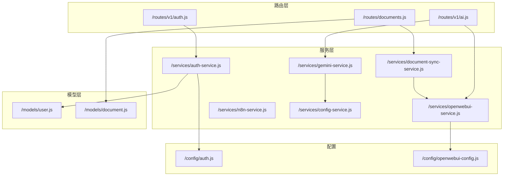
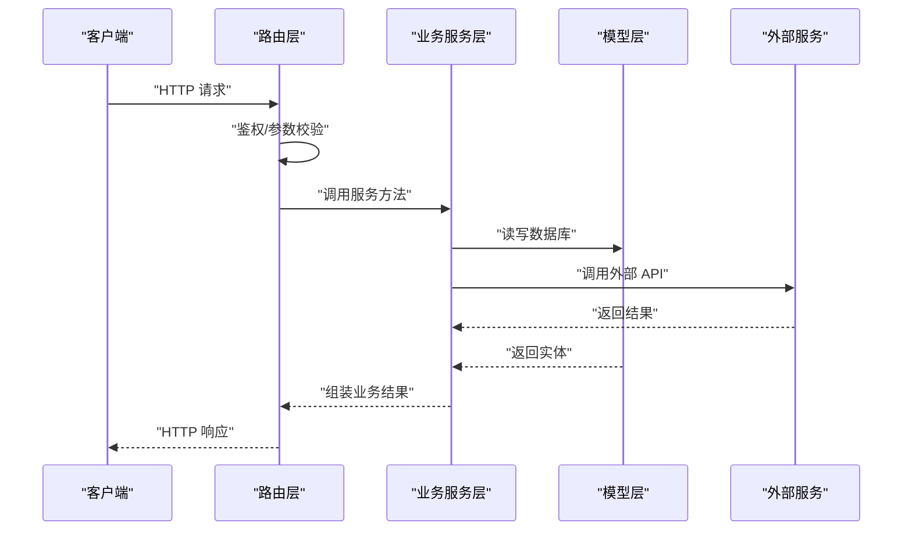
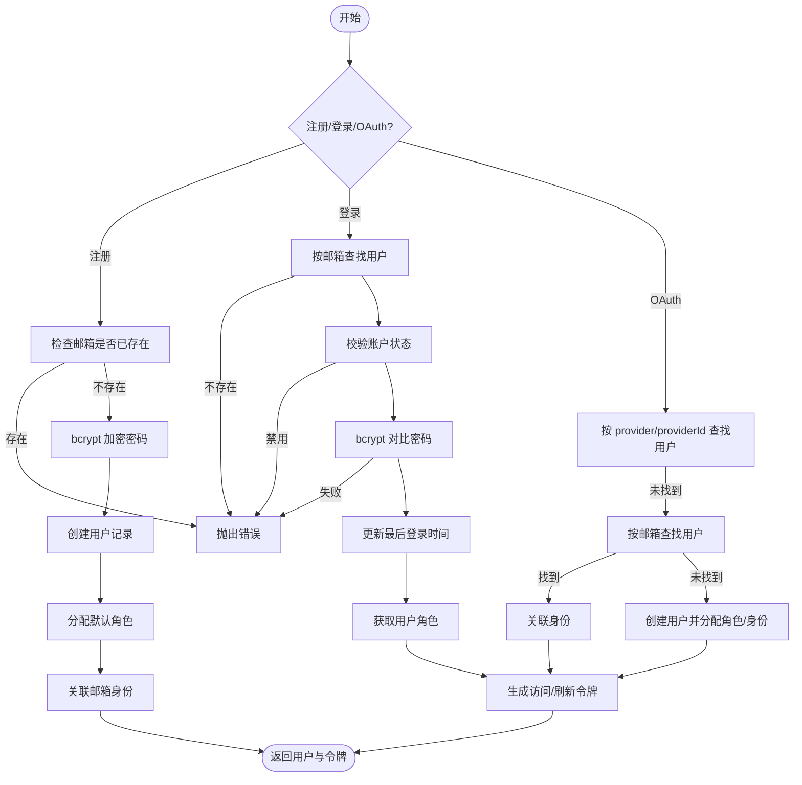
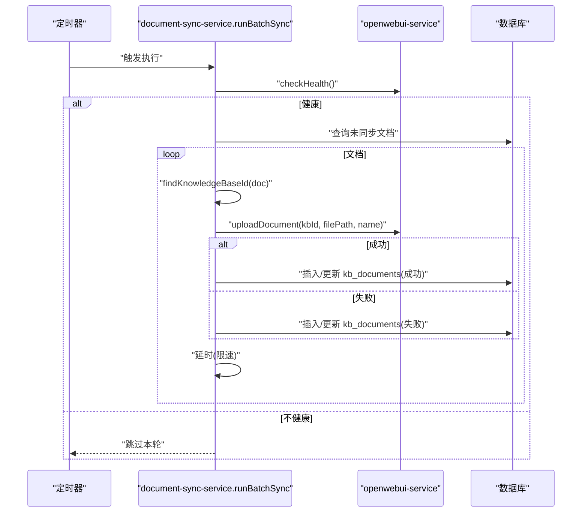
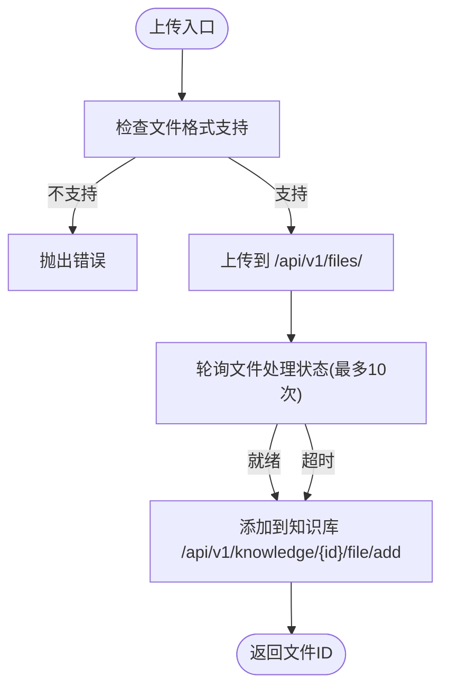
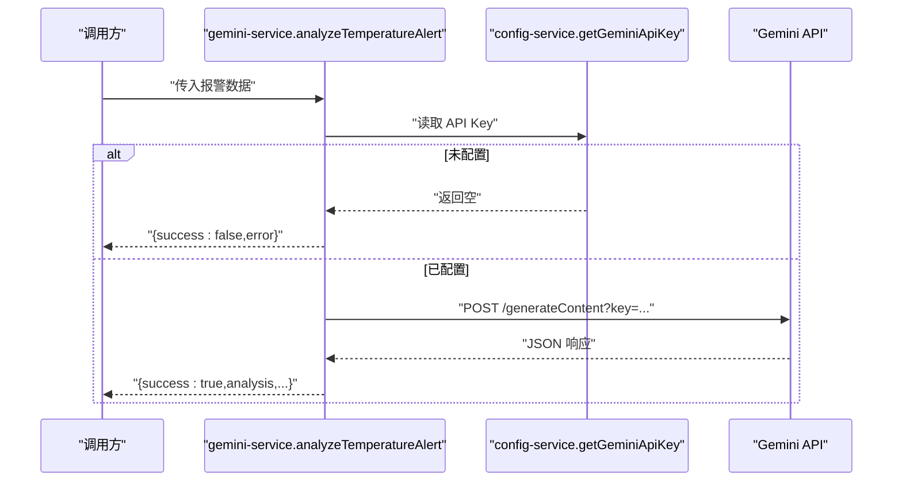
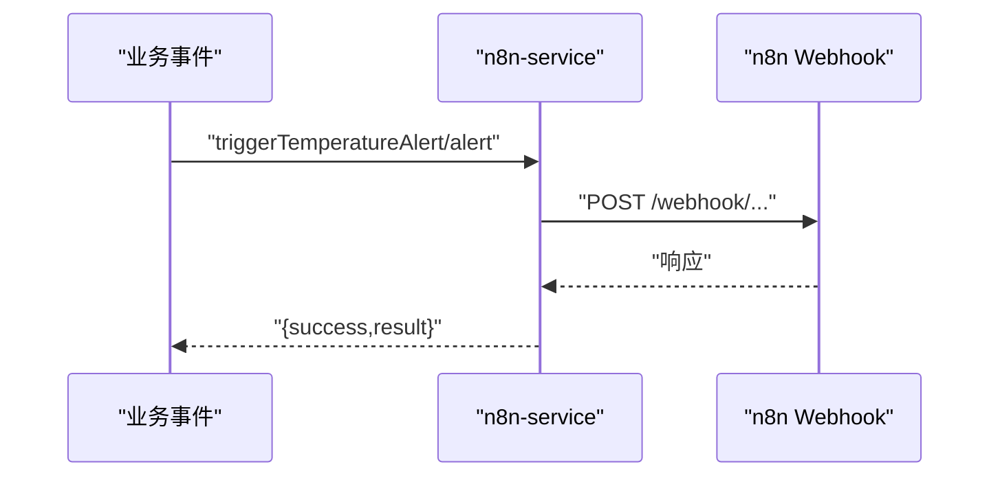
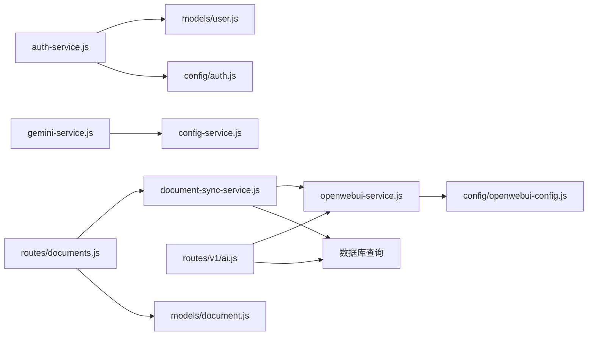

# 业务服务层

<cite>
**本文引用的文件**
- [auth-service.js](file://server/services/auth-service.js)
- [auth.js](file://server/config/auth.js)
- [user.js](file://server/models/user.js)
- [auth.js](file://server/routes/v1/auth.js)
- [document-sync-service.js](file://server/services/document-sync-service.js)
- [openwebui-service.js](file://server/services/openwebui-service.js)
- [openwebui-config.js](file://server/config/openwebui-config.js)
- [gemini-service.js](file://server/services/gemini-service.js)
- [config-service.js](file://server/services/config-service.js)
- [n8n-service.js](file://server/services/n8n-service.js)
- [ai.js](file://server/routes/v1/ai.js)
- [documents.js](file://server/routes/documents.js)
- [document.js](file://server/models/document.js)
</cite>

## 目录
1. [引言](#引言)
2. [项目结构](#项目结构)
3. [核心组件](#核心组件)
4. [架构总览](#架构总览)
5. [详细组件分析](#详细组件分析)
6. [依赖关系分析](#依赖关系分析)
7. [性能考量](#性能考量)
8. [故障排查指南](#故障排查指南)
9. [结论](#结论)
10. [附录](#附录)

## 引言
本文件聚焦于业务服务层的深度技术文档，围绕以下目标展开：
- 解释服务层如何封装核心业务逻辑，并与路由层解耦；
- 以 auth-service.js 为例，解析用户认证、会话管理、密码加密（bcrypt）的实现细节；
- 剖析 document-sync-service.js 如何实现文档与 Open WebUI 知识库的异步同步机制；
- 解释 gemini-service.js 与 AI 模型的交互流程；
- 讨论服务间依赖管理、事务处理策略以及异步任务调度模式；
- 提供服务调用关系图与性能优化建议。

## 项目结构
服务层位于 server/services，按职责拆分为认证、文档同步、Open WebUI、Gemini、n8n、配置等服务；路由层位于 server/routes，负责请求接入与鉴权；模型层位于 server/models，负责数据访问；配置位于 server/config。

图表来源
- [auth.js](file://server/routes/v1/auth.js#L1-L363)
- [ai.js](file://server/routes/v1/ai.js#L1-L416)
- [documents.js](file://server/routes/documents.js#L1-L451)
- [auth-service.js](file://server/services/auth-service.js#L1-L328)
- [document-sync-service.js](file://server/services/document-sync-service.js#L1-L250)
- [openwebui-service.js](file://server/services/openwebui-service.js#L1-L359)
- [gemini-service.js](file://server/services/gemini-service.js#L1-L111)
- [n8n-service.js](file://server/services/n8n-service.js#L1-L150)
- [config-service.js](file://server/services/config-service.js#L1-L111)
- [user.js](file://server/models/user.js#L1-L252)
- [document.js](file://server/models/document.js#L1-L167)
- [auth.js](file://server/config/auth.js#L1-L142)
- [openwebui-config.js](file://server/config/openwebui-config.js#L1-L56)

章节来源
- [auth.js](file://server/routes/v1/auth.js#L1-L363)
- [ai.js](file://server/routes/v1/ai.js#L1-L416)
- [documents.js](file://server/routes/documents.js#L1-L451)

## 核心组件
- 认证服务（auth-service.js）：封装注册、登录、OAuth、令牌刷新、登出、改密等流程，使用 bcrypt 进行密码加密，使用 JWT 生成访问令牌，使用哈希后的刷新令牌持久化，配合权限系统返回用户权限集合。
- 文档同步服务（document-sync-service.js）：后台定时扫描未同步文档，基于资产/空间/激活模型文件定位知识库，调用 Open WebUI 上传并入库，记录同步状态，避免重复同步。
- Open WebUI 服务（openwebui-service.js）：封装知识库管理、文件上传、RAG 聊天、健康检查等能力，支持格式校验、文件处理轮询、错误处理与重试策略。
- Gemini 服务（gemini-service.js）：直接调用 Google Gemini API，构造温度异常分析提示词，拉取 API Key 并进行请求，解析响应文本。
- n8n 服务（n8n-service.js）：通过 Webhook 触发 n8n 工作流，支持温度报警与手动分析两类事件，具备健康检查。
- 配置服务（config-service.js）：从数据库读取敏感配置（如 API Key），带缓存与 TTL，避免频繁查询。

章节来源
- [auth-service.js](file://server/services/auth-service.js#L1-L328)
- [document-sync-service.js](file://server/services/document-sync-service.js#L1-L250)
- [openwebui-service.js](file://server/services/openwebui-service.js#L1-L359)
- [gemini-service.js](file://server/services/gemini-service.js#L1-L111)
- [n8n-service.js](file://server/services/n8n-service.js#L1-L150)
- [config-service.js](file://server/services/config-service.js#L1-L111)

## 架构总览
服务层通过“路由 -> 服务 -> 模型/外部服务”的分层实现业务编排，路由层仅负责参数校验、鉴权与响应包装，服务层负责领域逻辑与外部集成，模型层负责数据持久化，配置层提供运行时参数。

图表来源
- [auth.js](file://server/routes/v1/auth.js#L1-L363)
- [ai.js](file://server/routes/v1/ai.js#L1-L416)
- [documents.js](file://server/routes/documents.js#L1-L451)
- [auth-service.js](file://server/services/auth-service.js#L1-L328)
- [openwebui-service.js](file://server/services/openwebui-service.js#L1-L359)
- [user.js](file://server/models/user.js#L1-L252)
- [document.js](file://server/models/document.js#L1-L167)

## 详细组件分析

### 认证服务（auth-service.js）
- 注册流程：邮箱去重 -> 密码强度校验 -> bcrypt 加密 -> 创建用户 -> 分配默认角色 -> 关联邮箱身份 -> 返回用户与令牌信息。
- 登录流程：邮箱查找用户 -> 账户状态校验 -> bcrypt 对比密码 -> 更新最后登录时间 -> 获取角色与权限 -> 生成访问令牌与刷新令牌 -> 写入 Cookie。
- OAuth 流程：按 provider/providerId 查找用户，若无则按邮箱查找并关联，否则新建用户，随后生成令牌。
- 刷新令牌：计算哈希后查找刷新令牌记录，校验用户状态，生成新的访问令牌。
- 登出：按传入刷新令牌或清空用户所有刷新令牌。
- 修改密码：校验当前密码，验证新密码强度，bcrypt 加密后更新并清空所有刷新令牌。
- 权限系统：根据角色集合合并去重得到权限数组，用于前端展示与路由授权。

图表来源
- [auth-service.js](file://server/services/auth-service.js#L1-L328)
- [user.js](file://server/models/user.js#L1-L252)
- [auth.js](file://server/config/auth.js#L1-L142)

章节来源
- [auth-service.js](file://server/services/auth-service.js#L1-L328)
- [user.js](file://server/models/user.js#L1-L252)
- [auth.js](file://server/config/auth.js#L1-L142)

### 文档同步服务（document-sync-service.js）
- 未同步文档查询：按文件类型过滤，左连接知识库文档表，排除已成功/失败记录，按创建时间升序取前若干条。
- 知识库选择策略：优先按资产编码查找模型文件，再按空间编码，最后回退到激活模型文件；若仍无，则返回空。
- 单文档同步：检查文件格式支持 -> 上传到 Open WebUI -> 记录同步状态（成功/失败），失败时截断错误信息。
- 批量同步：健康检查 -> 查询未同步 -> 逐个同步 -> 限速（延迟） -> 统计结果 -> 返回统计。
- 后台调度：首次延迟启动 -> 定时执行 -> 防并发（全局标志）。

图表来源
- [document-sync-service.js](file://server/services/document-sync-service.js#L1-L250)
- [openwebui-service.js](file://server/services/openwebui-service.js#L1-L359)

章节来源
- [document-sync-service.js](file://server/services/document-sync-service.js#L1-L250)
- [openwebui-service.js](file://server/services/openwebui-service.js#L1-L359)

### Open WebUI 服务（openwebui-service.js）
- 健康检查：调用 /health 端点判断服务可用性。
- 知识库管理：创建、列出、查询、删除知识库。
- 文件上传与入库：两步走（上传文件 -> 添加到知识库），支持格式校验与文件处理轮询。
- RAG 聊天：支持按文件 ID 或知识库 ID 进行检索增强生成。
- 批量同步：遍历文档列表，逐个上传并汇总结果。

图表来源
- [openwebui-service.js](file://server/services/openwebui-service.js#L1-L359)
- [openwebui-config.js](file://server/config/openwebui-config.js#L1-L56)

章节来源
- [openwebui-service.js](file://server/services/openwebui-service.js#L1-L359)
- [openwebui-config.js](file://server/config/openwebui-config.js#L1-L56)

### Gemini 服务（gemini-service.js）
- 直连 Google Gemini API，构造温度异常分析提示词，携带 generationConfig。
- 从配置服务读取 API Key，若未配置则返回错误。
- 解析响应 candidates -> content.parts[0].text，返回分析文本与元数据。

图表来源
- [gemini-service.js](file://server/services/gemini-service.js#L1-L111)
- [config-service.js](file://server/services/config-service.js#L1-L111)

章节来源
- [gemini-service.js](file://server/services/gemini-service.js#L1-L111)
- [config-service.js](file://server/services/config-service.js#L1-L111)

### n8n 服务（n8n-service.js）
- 温度报警触发：计算严重等级，构造 payload，向 n8n Webhook 发起 POST 请求。
- 手动分析触发：构造分析请求 payload，向 n8n Webhook 发起 POST 请求。
- 健康检查：访问 /healthz。

图表来源
- [n8n-service.js](file://server/services/n8n-service.js#L1-L150)

章节来源
- [n8n-service.js](file://server/services/n8n-service.js#L1-L150)

### 路由与服务调用关系
- 认证路由（/routes/v1/auth.js）：注册/登录/刷新/登出/改密等均委托给 auth-service，并在登录时写入刷新令牌 Cookie。
- AI 路由（/routes/v1/ai.js）：知识库管理、手动同步、RAG 查询、上下文聚合、来源链接格式化等，内部调用 openwebui-service 与数据库。
- 文档路由（/routes/documents.js）：上传/列表/详情/EXIF/更新/删除/下载/预览/视图关联文档，上传后交由后台同步服务处理。

章节来源
- [auth.js](file://server/routes/v1/auth.js#L1-L363)
- [ai.js](file://server/routes/v1/ai.js#L1-L416)
- [documents.js](file://server/routes/documents.js#L1-L451)

## 依赖关系分析
- 服务间依赖
  - document-sync-service 依赖 openwebui-service 与数据库查询；
  - openwebui-service 依赖 openwebui-config 与外部 Open WebUI；
  - gemini-service 依赖 config-service 读取 API Key；
  - n8n-service 依赖外部 n8n；
  - auth-service 依赖 user 模型与权限配置。
- 事务与一致性
  - 文档同步采用“先上传后入库”的两阶段写入，使用 ON CONFLICT 更新状态，保证幂等；
  - 登录/刷新/登出涉及刷新令牌哈希存储与清理，确保会话安全；
  - 配置服务使用 Map 缓存与 TTL，避免频繁查询数据库。
- 异步任务调度
  - document-sync-service 使用 setTimeout/setInterval 启动后台任务，首次延迟与周期执行；
  - openwebui-service 上传后轮询文件处理状态，避免立即查询导致的空数据。

图表来源
- [auth-service.js](file://server/services/auth-service.js#L1-L328)
- [user.js](file://server/models/user.js#L1-L252)
- [auth.js](file://server/config/auth.js#L1-L142)
- [document-sync-service.js](file://server/services/document-sync-service.js#L1-L250)
- [openwebui-service.js](file://server/services/openwebui-service.js#L1-L359)
- [openwebui-config.js](file://server/config/openwebui-config.js#L1-L56)
- [gemini-service.js](file://server/services/gemini-service.js#L1-L111)
- [config-service.js](file://server/services/config-service.js#L1-L111)
- [ai.js](file://server/routes/v1/ai.js#L1-L416)
- [documents.js](file://server/routes/documents.js#L1-L451)
- [document.js](file://server/models/document.js#L1-L167)

章节来源
- [auth-service.js](file://server/services/auth-service.js#L1-L328)
- [document-sync-service.js](file://server/services/document-sync-service.js#L1-L250)
- [openwebui-service.js](file://server/services/openwebui-service.js#L1-L359)
- [gemini-service.js](file://server/services/gemini-service.js#L1-L111)
- [config-service.js](file://server/services/config-service.js#L1-L111)
- [ai.js](file://server/routes/v1/ai.js#L1-L416)
- [documents.js](file://server/routes/documents.js#L1-L451)
- [user.js](file://server/models/user.js#L1-L252)
- [document.js](file://server/models/document.js#L1-L167)
- [auth.js](file://server/config/auth.js#L1-L142)
- [openwebui-config.js](file://server/config/openwebui-config.js#L1-L56)

## 性能考量
- 令牌与会话
  - 使用 bcrypt 加盐加密，盐轮数固定，兼顾安全性与性能；刷新令牌采用哈希存储，减少明文泄露风险。
  - 登录成功后写入 HttpOnly Cookie，降低 XSS 风险。
- 文档同步
  - 限速延迟（每文档约 500ms）避免对外部服务造成压力；
  - 批量同步采用“查询 -> 逐个同步 -> 统计”，避免一次性大量并发请求；
  - 使用 ON CONFLICT 更新状态，减少重复同步开销。
- Open WebUI 上传
  - 文件处理轮询最多 10 次，每次 3 秒，平衡成功率与等待时间；
  - 支持格式白名单，提前过滤不必要请求。
- 配置读取
  - 配置服务缓存 5 分钟，减少数据库压力；错误时返回默认值，提升鲁棒性。
- 路由与模型
  - 路由层仅做参数校验与鉴权，业务逻辑下沉至服务层，便于单元测试与性能优化。

[本节为通用指导，无需特定文件来源]

## 故障排查指南
- 认证相关
  - 登录失败：检查邮箱是否存在、账户是否启用、密码是否匹配；查看权限集合是否包含预期项。
  - 刷新令牌无效：确认刷新令牌哈希是否匹配、是否过期、用户是否启用。
  - 修改密码：确认当前密码正确、新密码强度满足要求、修改后是否强制重新登录。
- 文档同步
  - 服务不可用：检查 Open WebUI 健康检查是否返回 true；确认上传目录与文件路径拼接正确。
  - 格式不支持：确认文件扩展名在支持列表中；查看日志中的跳过提示。
  - 同步失败：查看失败记录中的错误信息，确认网络与外部服务状态。
- Open WebUI
  - 上传失败：检查文件上传端点与鉴权头；查看轮询期间的文件状态；确认知识库 ID 正确。
  - RAG 查询：确认知识库 ID 或文件 ID 有效；检查模型与检索参数。
- Gemini
  - API Key 未配置：检查系统配置中是否设置；确认请求 URL 与 key 参数正确。
- n8n
  - Webhook 调用失败：检查 n8n 地址与路径；确认网络可达；查看响应状态与返回体。

章节来源
- [auth-service.js](file://server/services/auth-service.js#L1-L328)
- [document-sync-service.js](file://server/services/document-sync-service.js#L1-L250)
- [openwebui-service.js](file://server/services/openwebui-service.js#L1-L359)
- [gemini-service.js](file://server/services/gemini-service.js#L1-L111)
- [n8n-service.js](file://server/services/n8n-service.js#L1-L150)

## 结论
本服务层通过清晰的职责划分与稳定的外部集成，实现了认证、文档同步、AI 交互与工作流触发等核心业务能力。路由层与服务层解耦良好，便于扩展与维护；同时在性能与可靠性方面采取了多项策略，包括限速、轮询、缓存与幂等写入等。建议后续进一步完善 OAuth 登录、n8n 健康检查与错误重试策略，并对关键路径增加可观测性指标。

[本节为总结，无需特定文件来源]

## 附录
- 关键流程图与序列图已在前述章节中给出，读者可结合源码路径定位具体实现细节。
- 若需进一步了解数据库结构与迁移脚本，可参考 server/db 与 server/migrations 目录下的 SQL 文件。

[本节为补充说明，无需特定文件来源]