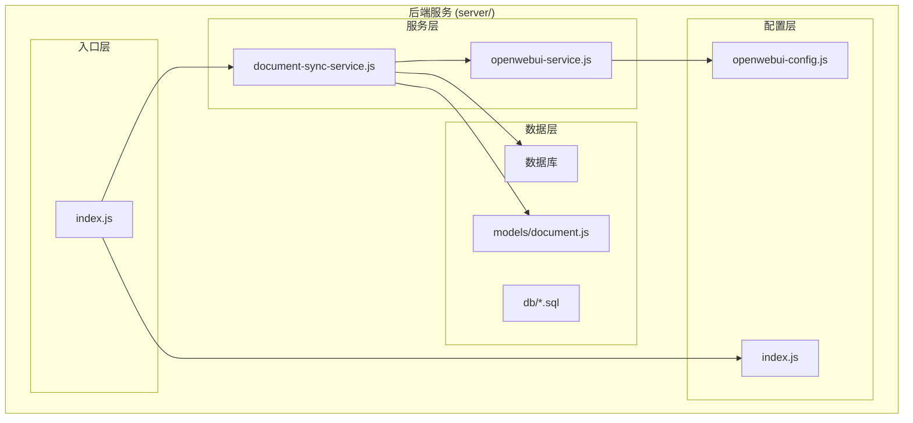
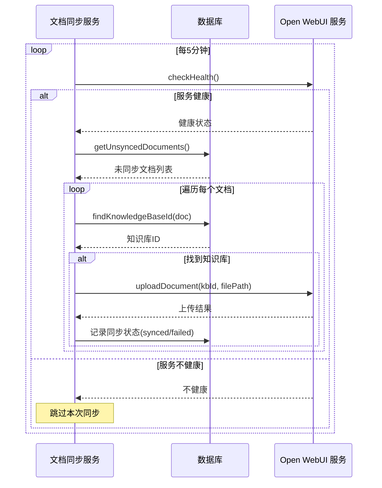
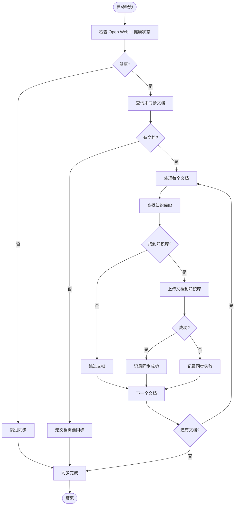
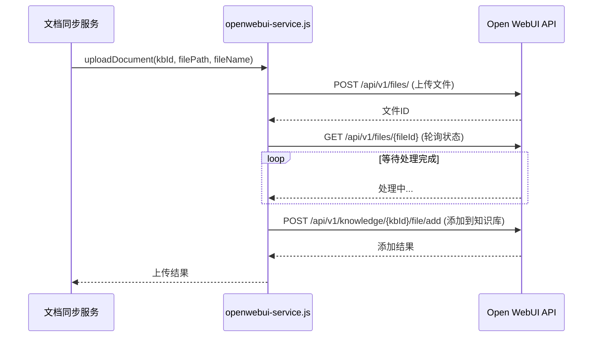
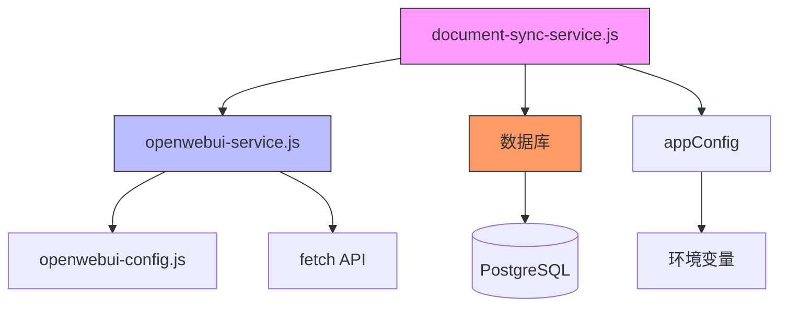

# 文档同步服务

<cite>
**本文档引用的文件**
- [document-sync-service.js](file://server/services/document-sync-service.js)
- [openwebui-service.js](file://server/services/openwebui-service.js)
- [openwebui-config.js](file://server/config/openwebui-config.js)
- [document.js](file://server/models/document.js)
- [create_documents_table.sql](file://server/db/create_documents_table.sql)
- [init-all.sql](file://server/db/init-all.sql)
- [documents.js](file://server/routes/documents.js)
- [index.js](file://server/index.js)
- [config/index.js](file://server/config/index.js)
</cite>

## 目录
1. [简介](#简介)
2. [项目结构](#项目结构)
3. [核心组件](#核心组件)
4. [架构概述](#架构概述)
5. [详细组件分析](#详细组件分析)
6. [依赖分析](#依赖分析)
7. [性能考虑](#性能考虑)
8. [故障排除指南](#故障排除指南)
9. [结论](#结论)

## 简介
文档同步服务是 TwinSight 系统中的关键后台服务，负责将系统内创建或更新的文档自动同步到 Open WebUI 知识库中。该服务通过定期轮询数据库中的文档变更，建立与 Open WebUI 的异步通信，实现文档内容的无缝集成。服务设计注重可靠性与容错性，包含健康检查、错误重试和状态追踪机制，确保在各种网络和系统条件下都能稳定运行。本文档深入解析该服务的实现原理、交互协议、元数据映射规则和任务管理策略，为开发者提供全面的技术参考。

## 项目结构
文档同步服务是 TwinSight 后端系统的一部分，位于 `server/services/` 目录下。其核心文件 `document-sync-service.js` 依赖于配置、数据库和 Open WebUI 服务模块。服务通过 `server/index.js` 在应用启动时被激活，并与数据库、API 路由等其他组件协同工作。

**图示来源**
- [document-sync-service.js](file://server/services/document-sync-service.js#L1-L250)
- [openwebui-service.js](file://server/services/openwebui-service.js#L1-L359)
- [index.js](file://server/index.js#L1-L199)

**本节来源**
- [document-sync-service.js](file://server/services/document-sync-service.js#L1-L250)
- [server/](file://server/)

## 核心组件
文档同步服务的核心功能由 `document-sync-service.js` 实现，它通过与 `openwebui-service.js` 交互来完成文档同步。服务采用批处理模式，定期检查数据库中未同步的文档，并将其上传到对应的 Open WebUI 知识库。整个流程包括文档发现、知识库匹配、文件上传、状态记录和错误处理。

**本节来源**
- [document-sync-service.js](file://server/services/document-sync-service.js#L1-L250)
- [openwebui-service.js](file://server/services/openwebui-service.js#L1-L359)

## 架构概述
文档同步服务采用轮询-执行的架构模式。服务启动后，会每隔五分钟（可配置）执行一次批量同步任务。任务首先检查 Open WebUI 服务的健康状态，然后查询数据库中尚未同步的文档，根据文档的关联信息（如资产编码、空间编码）找到对应的知识库，最后调用 Open WebUI API 将文档上传并记录同步结果。

**图示来源**
- [document-sync-service.js](file://server/services/document-sync-service.js#L157-L217)
- [openwebui-service.js](file://server/services/openwebui-service.js#L66-L74)

## 详细组件分析

### 文档同步服务分析
`document-sync-service.js` 是整个同步流程的控制中心。它通过 `runBatchSync` 函数协调各个步骤，确保同步任务的原子性和一致性。

#### 核心功能分析

**图示来源**
- [document-sync-service.js](file://server/services/document-sync-service.js#L157-L217)

**本节来源**
- [document-sync-service.js](file://server/services/document-sync-service.js#L1-L250)

### Open WebUI 服务交互协议
文档同步服务通过 `openwebui-service.js` 提供的 API 与 Open WebUI 进行交互。这种分层设计将业务逻辑与外部服务调用解耦，提高了代码的可维护性和可测试性。

#### 交互流程分析

**图示来源**
- [openwebui-service.js](file://server/services/openwebui-service.js#L146-L237)

**本节来源**
- [openwebui-service.js](file://server/services/openwebui-service.js#L1-L359)

## 依赖分析
文档同步服务依赖于多个内部和外部组件。内部依赖包括数据库模型、配置模块和 Open WebUI 服务客户端。外部依赖主要是 Open WebUI 服务本身，通过 REST API 进行通信。

**图示来源**
- [document-sync-service.js](file://server/services/document-sync-service.js#L7-L14)
- [openwebui-service.js](file://server/services/openwebui-service.js#L6-L15)

**本节来源**
- [document-sync-service.js](file://server/services/document-sync-service.js#L1-L250)
- [openwebui-service.js](file://server/services/openwebui-service.js#L1-L359)

## 性能考虑
文档同步服务在设计时考虑了性能和稳定性。服务采用批处理模式，每次最多处理 50 个文档，避免一次性加载过多数据。在文档上传之间设置了 500 毫秒的延迟，以防止对 Open WebUI 服务造成过大压力。对于大规模文档同步，可以通过调整批处理大小和同步间隔来优化性能。

**本节来源**
- [document-sync-service.js](file://server/services/document-sync-service.js#L30-L31)
- [document-sync-service.js](file://server/services/document-sync-service.js#L203-L204)

## 故障排除指南
当文档同步失败时，应首先检查服务日志。常见的错误包括 Open WebUI 服务不可用、API 密钥未配置、文件格式不支持等。服务会将失败状态记录在 `kb_documents` 表中，可以通过查询该表来诊断问题。此外，应确保 `OPENWEBUI_API_KEY` 和 `OPENWEBUI_URL` 环境变量已正确设置。

**本节来源**
- [document-sync-service.js](file://server/services/document-sync-service.js#L133-L147)
- [openwebui-service.js](file://server/services/openwebui-service.js#L27-L30)

## 结论
文档同步服务成功实现了 TwinSight 系统与 Open WebUI 知识库的无缝集成。通过清晰的架构设计和健壮的错误处理机制，服务能够可靠地处理文档同步任务。未来可以考虑引入消息队列来进一步解耦文档创建和同步流程，提高系统的可扩展性和响应速度。