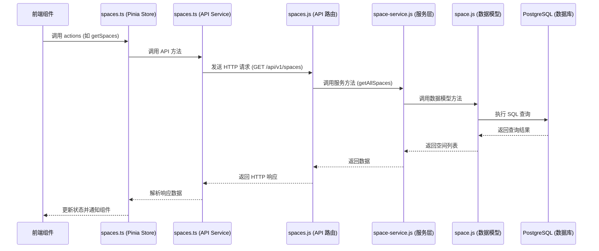
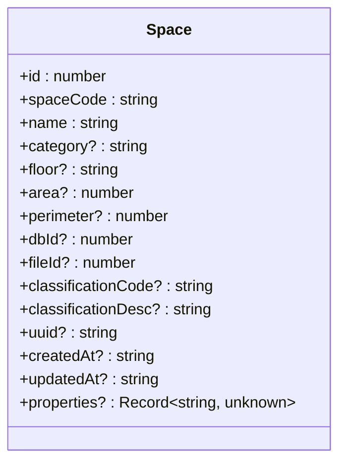
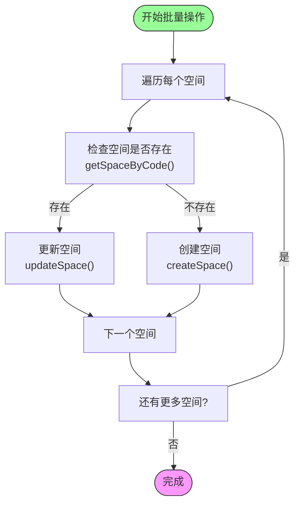
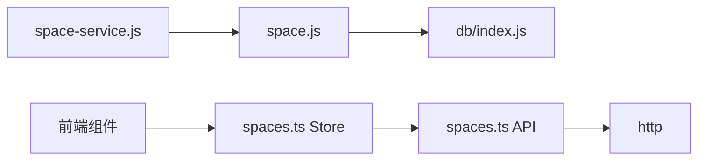

# 空间服务

<cite>
**本文档引用的文件**  
- [space-service.js](file://server/services/space-service.js)
- [space.js](file://server/models/space.js)
- [spaces.js](file://server/routes/v1/spaces.js)
- [spaces.ts](file://src/stores/spaces.ts)
- [spaces.ts](file://src/services/api/spaces.ts)
- [space.ts](file://src/types/space.ts)
- [add_missing_space_fields.sql](file://archive/add_missing_space_fields.sql)
- [fix_space_mapping.sql](file://archive/fix_space_mapping.sql)
</cite>

## 目录
1. [简介](#简介)
2. [项目结构](#项目结构)
3. [核心组件](#核心组件)
4. [架构概述](#架构概述)
5. [详细组件分析](#详细组件分析)
6. [依赖分析](#依赖分析)
7. [性能考虑](#性能考虑)
8. [故障排除指南](#故障排除指南)
9. [结论](#结论)

## 简介
空间服务是 TwinSight 数字孪生平台的核心模块，负责管理建筑空间的层级结构（如楼层、房间）及其与资产的绑定关系。该服务提供了一套完整的空间数据管理功能，包括空间的创建、更新、删除和查询，支持按文件、楼层、分类等多种维度进行数据检索。服务通过树形结构组织空间数据，实现了高效的遍历与查询优化，并维护了空间属性（如面积、用途）的完整生命周期。此外，空间服务还支持变更审计机制，确保数据变更的可追溯性，并与前端 viewer 组件紧密集成，实现空间选择与高亮交互。本文档将深入解析空间服务的实现细节，包括数据结构、API 接口、状态管理以及最佳实践。

## 项目结构
空间服务相关的代码分布在项目的多个目录中，形成了清晰的分层架构。后端服务逻辑主要位于 `server` 目录下，包括服务层、模型层和路由层。前端状态管理和 API 调用则位于 `src` 目录下。数据库结构和迁移脚本存放在 `archive` 目录中作为参考。

```mermaid
graph TB
subgraph "前端 (src)"
A[stores/spaces.ts] --> B[services/api/spaces.ts]
B --> C[types/space.ts]
end
subgraph "后端 (server)"
D[services/space-service.js] --> E[models/space.js]
E --> F[routes/v1/spaces.js]
end
G[archive] --> H[add_missing_space_fields.sql]
G --> I[fix_space_mapping.sql]
F < --> |HTTP API| B
E < --> |数据库查询| J[(PostgreSQL)]
```

**图示来源**
- [space-service.js](file://server/services/space-service.js)
- [space.js](file://server/models/space.js)
- [spaces.js](file://server/routes/v1/spaces.js)
- [spaces.ts](file://src/stores/spaces.ts)
- [spaces.ts](file://src/services/api/spaces.ts)

**本节来源**
- [server/services/space-service.js](file://server/services/space-service.js)
- [server/models/space.js](file://server/models/space.js)
- [server/routes/v1/spaces.js](file://server/routes/v1/spaces.js)
- [src/stores/spaces.ts](file://src/stores/spaces.ts)
- [src/services/api/spaces.ts](file://src/services/api/spaces.ts)

## 核心组件
空间服务的核心功能由后端的 `space-service.js` 和 `space.js` 文件实现。`space-service.js` 作为服务层，封装了所有与空间相关的业务逻辑，提供了如获取所有空间、根据编码或文件ID查询空间、创建、更新、删除以及批量操作等方法。`space.js` 作为数据访问层（DAO），直接与数据库交互，执行具体的 SQL 查询和事务操作。这两个文件共同构成了空间数据管理的后端核心，确保了数据操作的原子性和一致性。

**本节来源**
- [server/services/space-service.js](file://server/services/space-service.js#L1-L244)
- [server/models/space.js](file://server/models/space.js#L1-L224)

## 架构概述
空间服务采用典型的分层架构，从前端到后端分为表现层、服务层、数据访问层和持久层。前端通过 Pinia 状态管理库 `spaces.ts` 统一管理空间数据和用户选择状态。API 服务 `spaces.ts` 负责与后端进行 HTTP 通信。后端路由 `spaces.js` 处理 RESTful API 请求，进行身份验证和参数校验后，将请求委托给服务层 `space-service.js`。服务层协调业务逻辑，调用模型层 `space.js` 进行数据持久化操作。整个架构清晰分离了关注点，提高了代码的可维护性和可测试性。



**图示来源**
- [src/stores/spaces.ts](file://src/stores/spaces.ts)
- [src/services/api/spaces.ts](file://src/services/api/spaces.ts)
- [server/routes/v1/spaces.js](file://server/routes/v1/spaces.js)
- [server/services/space-service.js](file://server/services/space-service.js)
- [server/models/space.js](file://server/models/space.js)

## 详细组件分析

### 空间数据模型分析
空间数据模型定义了空间实体的核心属性，包括唯一标识 `spaceCode`、名称 `name`、所属楼层 `floor`、面积 `area`、周长 `perimeter`、数据库ID `dbId`、文件ID `fileId` 以及分类信息 `classificationCode` 和 `classificationDesc`。该模型通过 `fileId` 字段与特定的建筑模型文件关联，实现了多项目、多文件的空间数据隔离。`uuid` 字段用于生成全局唯一标识，确保数据的完整性。

#### 空间数据模型类图


**图示来源**
- [src/types/space.ts](file://src/types/space.ts#L5-L21)
- [server/models/space.js](file://server/models/space.js)

**本节来源**
- [src/types/space.ts](file://src/types/space.ts#L5-L21)
- [server/models/space.js](file://server/models/space.js#L11-L31)

### 空间服务层分析
空间服务层 `space-service.js` 提供了丰富的业务方法。`getAllSpaces` 和 `getSpacesByFileId` 方法支持按不同条件查询空间列表。`createSpace` 和 `updateSpace` 方法实现了空间的增改操作，其中 `updateSpace` 使用 `COALESCE` 函数实现了部分更新，即只更新传入的字段。`batchUpsertSpaces` 方法是核心的批量操作，它遍历空间数组，对每个空间先检查是否存在，存在则更新，不存在则创建，实现了“插入或更新”的语义。此外，服务还提供了 `getFloors`、`getSpaceStats` 等统计方法，用于获取楼层列表和空间统计信息。

#### 空间批量操作流程图


**图示来源**
- [server/services/space-service.js](file://server/services/space-service.js#L114-L138)

**本节来源**
- [server/services/space-service.js](file://server/services/space-service.js#L114-L138)

### 前端状态管理分析
前端使用 Pinia 的 `useSpacesStore` 来集中管理空间状态。该 store 定义了 `list`（空间列表）、`selectedIds`（选中空间ID列表）等状态。通过 `getters` 提供了便捷的数据访问方法，如 `getByCode` 可以根据编码快速查找空间，`floors` 可以获取所有唯一的楼层列表。`actions` 定义了状态变更方法，如 `selectSpace`、`deselectSpace` 和 `toggleSpace` 用于管理用户的选择状态，`setSpaces` 用于从 API 加载数据并更新状态。这种集中式状态管理确保了应用各组件间数据的一致性。

**本节来源**
- [src/stores/spaces.ts](file://src/stores/spaces.ts#L1-L167)

## 依赖分析
空间服务的依赖关系清晰明了。后端服务层 `space-service.js` 依赖于数据访问层 `space.js` 来执行数据库操作。`space.js` 模型层依赖于 `db/index.js` 提供的数据库连接池。前端 API 服务 `spaces.ts` 依赖于通用的 `http` 服务进行网络请求。`spaces.ts` 状态管理模块依赖于 `api/spaces.ts` 来获取数据。整个依赖链从上到下，单向流动，避免了循环依赖，保证了系统的稳定性。



**图示来源**
- [server/services/space-service.js](file://server/services/space-service.js#L5)
- [server/models/space.js](file://server/models/space.js#L4)
- [src/services/api/spaces.ts](file://src/services/api/spaces.ts#L4)

**本节来源**
- [server/services/space-service.js](file://server/services/space-service.js#L5)
- [server/models/space.js](file://server/models/space.js#L4)
- [src/services/api/spaces.ts](file://src/services/api/spaces.ts#L4)

## 性能考虑
在处理复杂空间拓扑时，查询性能是关键。当前实现中，`getSpacesByFileId` 等方法直接通过 `fileId` 进行查询，这是一个高效的等值查询。对于需要构建树形结构的场景，虽然当前代码未直接体现，但可以通过数据库的递归CTE（Common Table Expression）查询来高效地遍历父子关系。另一种优化方案是路径枚举模型（Path Enumeration），即在空间表中增加一个 `path` 字段（如 `/building1/floor1/room101`），通过字符串匹配可以快速查询某个节点下的所有子节点，极大地提升了查询效率。此外，为 `fileId`、`floor`、`classification_code` 等常用查询字段建立数据库索引也是提升性能的重要手段。

## 故障排除指南
当遇到空间数据相关的问题时，可以按照以下步骤进行排查：
1.  **检查 API 响应**：首先确认前端调用的 API 是否返回了预期的数据或错误信息。
2.  **验证数据库内容**：使用 SQL 查询直接检查 `spaces` 表中的数据是否正确，特别是 `fileId` 和 `spaceCode` 字段。
3.  **审查映射配置**：空间数据的导入依赖于 `mapping_configs` 表中的配置。如果某些字段（如面积、楼层）缺失，需要检查 `add_missing_space_fields.sql` 或 `fix_space_mapping.sql` 中的逻辑，确保 `area`、`perimeter`、`floor` 等关键字段的映射已正确配置。
4.  **检查服务日志**：查看后端服务的控制台日志，`batchUpsertSpacesWithFile` 方法在成功或失败时会输出日志，有助于定位批量操作中的问题。
5.  **确认权限**：确保执行操作的用户具有相应的权限（如 `SPACE_READ`, `SPACE_CREATE`），这由路由层的 `authorize` 中间件控制。

**本节来源**
- [server/models/space.js](file://server/models/space.js#L136-L137)
- [archive/add_missing_space_fields.sql](file://archive/add_missing_space_fields.sql)
- [archive/fix_space_mapping.sql](file://archive/fix_space_mapping.sql)
- [server/routes/v1/spaces.js](file://server/routes/v1/spaces.js#L23)

## 结论
空间服务是 TwinSight 平台中一个功能完备、设计良好的核心模块。它通过清晰的分层架构和模块化设计，有效地管理了复杂的建筑空间数据。服务不仅提供了基础的 CRUD 操作，还通过批量处理、统计分析等功能满足了实际业务需求。前后端通过 RESTful API 和状态管理紧密结合，为用户提供流畅的空间交互体验。未来可以通过引入更高级的树形结构查询优化（如递归CTE或路径枚举）来进一步提升在大规模空间数据下的查询性能。同时，确保空间映射配置的完整性和正确性是保证数据质量的关键。