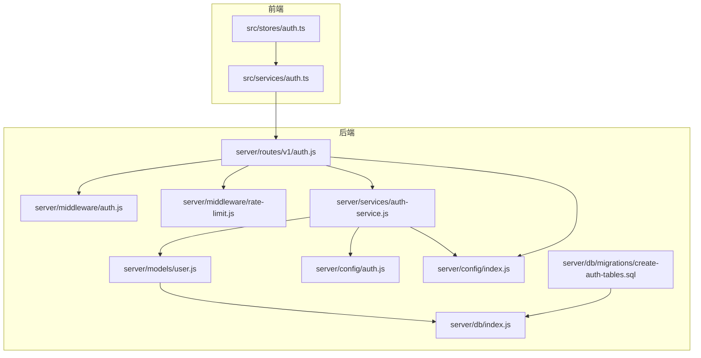
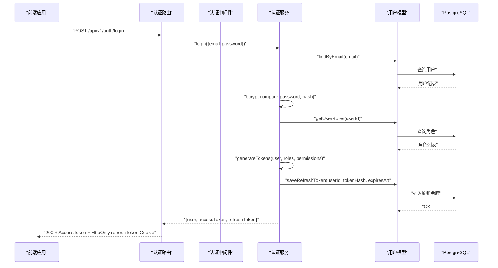
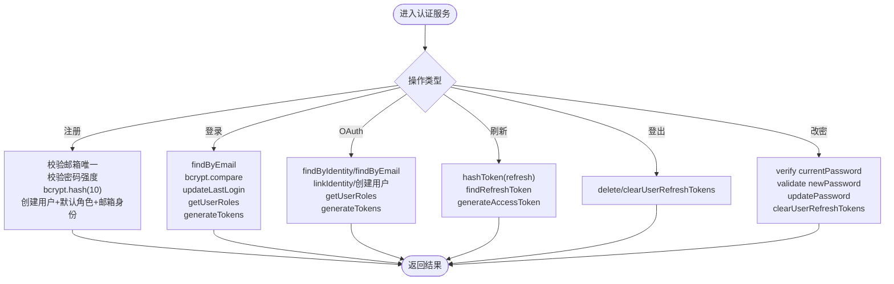
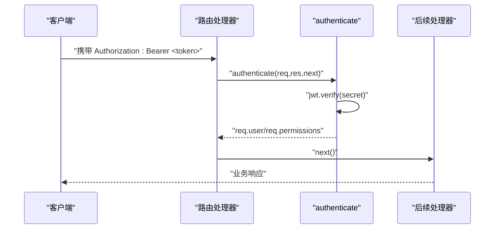
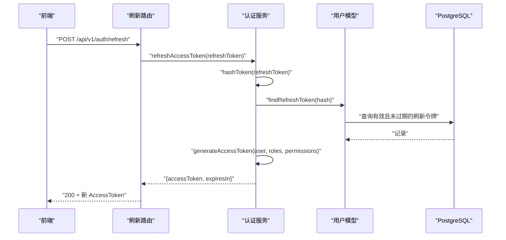
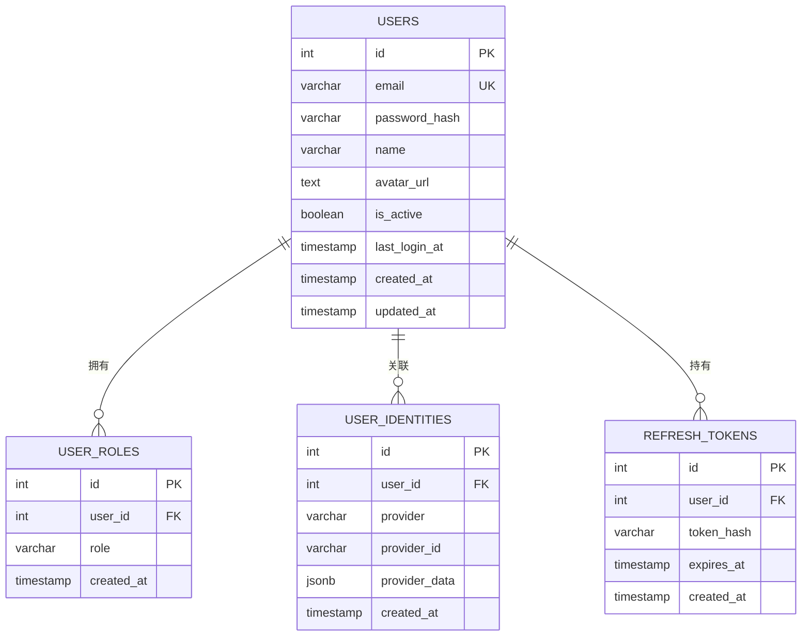
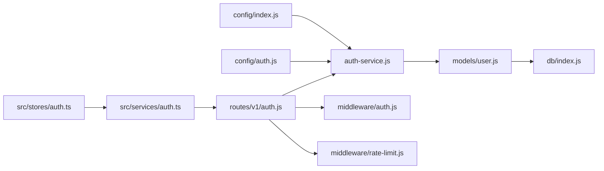

# 认证服务

<cite>
**本文引用的文件**
- [auth-service.js](file://server/services/auth-service.js)
- [auth.js](file://server/middleware/auth.js)
- [auth.js](file://server/routes/v1/auth.js)
- [user.js](file://server/models/user.js)
- [auth.js](file://server/config/auth.js)
- [index.js](file://server/config/index.js)
- [rate-limit.js](file://server/middleware/rate-limit.js)
- [index.js](file://server/db/index.js)
- [create-auth-tables.sql](file://server/db/migrations/create-auth-tables.sql)
- [auth.ts](file://src/services/auth.ts)
- [auth.ts](file://src/stores/auth.ts)
</cite>

## 目录
1. [简介](#简介)
2. [项目结构](#项目结构)
3. [核心组件](#核心组件)
4. [架构总览](#架构总览)
5. [组件详解](#组件详解)
6. [依赖关系分析](#依赖关系分析)
7. [性能考量](#性能考量)
8. [故障排查指南](#故障排查指南)
9. [结论](#结论)
10. [附录](#附录)

## 简介
本文件面向后端开发者与运维人员，系统性解析认证服务的实现机制，包括：
- 用户登录与注册流程
- JWT 令牌生成与验证
- 密码加密（bcrypt）与盐值策略
- 会话状态维护与刷新令牌（refresh token）处理
- 路由保护中间件集成
- 常见安全风险与防护建议
- 性能优化与限流集成

## 项目结构
认证相关代码主要分布在以下模块：
- 服务层：server/services/auth-service.js
- 路由层：server/routes/v1/auth.js
- 中间件：server/middleware/auth.js、server/middleware/rate-limit.js
- 模型层：server/models/user.js
- 配置：server/config/auth.js、server/config/index.js
- 数据库迁移：server/db/migrations/create-auth-tables.sql
- 前端调用：src/services/auth.ts、src/stores/auth.ts

图表来源
- [auth.js](file://server/routes/v1/auth.js#L1-L363)
- [auth.js](file://server/middleware/auth.js#L1-L120)
- [rate-limit.js](file://server/middleware/rate-limit.js#L1-L94)
- [auth-service.js](file://server/services/auth-service.js#L1-L328)
- [user.js](file://server/models/user.js#L1-L252)
- [index.js](file://server/db/index.js#L1-L93)
- [index.js](file://server/config/index.js#L1-L93)
- [auth.js](file://server/config/auth.js#L1-L142)
- [create-auth-tables.sql](file://server/db/migrations/create-auth-tables.sql#L1-L78)

章节来源
- [auth.js](file://server/routes/v1/auth.js#L1-L363)
- [auth.js](file://server/middleware/auth.js#L1-L120)
- [auth-service.js](file://server/services/auth-service.js#L1-L328)
- [user.js](file://server/models/user.js#L1-L252)
- [index.js](file://server/config/index.js#L1-L93)
- [auth.js](file://server/config/auth.js#L1-L142)
- [rate-limit.js](file://server/middleware/rate-limit.js#L1-L94)
- [index.js](file://server/db/index.js#L1-L93)
- [create-auth-tables.sql](file://server/db/migrations/create-auth-tables.sql#L1-L78)
- [auth.ts](file://src/services/auth.ts#L1-L191)
- [auth.ts](file://src/stores/auth.ts#L1-L115)

## 核心组件
- 认证服务（auth-service.js）
  - 提供注册、登录、OAuth 登录、刷新访问令牌、登出、修改密码等能力
  - 使用 bcrypt 对密码进行哈希，盐值轮数固定为 10
  - 生成 JWT 访问令牌与随机刷新令牌，刷新令牌以 SHA-256 哈希形式持久化
- 路由（routes/v1/auth.js）
  - 定义 /api/v1/auth/* 接口，负责参数校验、调用认证服务、设置 HttpOnly Cookie 存储刷新令牌
- 中间件（middleware/auth.js）
  - JWT 校验、可选认证、权限检查（基于角色-权限映射）
- 模型（models/user.js）
  - 用户 CRUD、角色与身份关联、刷新令牌的保存/查询/删除/清理
- 配置（config/auth.js、config/index.js）
  - 权限与角色常量、JWT 过期时间、上传路径、数据库连接等
- 限流（middleware/rate-limit.js）
  - 提供通用限流、严格限流、登录限流策略
- 数据库迁移（db/migrations/create-auth-tables.sql）
  - users、user_roles、user_identities、refresh_tokens 表结构与索引
- 前端调用（src/services/auth.ts、src/stores/auth.ts）
  - 提供登录、注册、刷新、登出、获取当前用户、上传头像、修改密码等接口封装与状态管理

章节来源
- [auth-service.js](file://server/services/auth-service.js#L1-L328)
- [auth.js](file://server/routes/v1/auth.js#L1-L363)
- [auth.js](file://server/middleware/auth.js#L1-L120)
- [user.js](file://server/models/user.js#L1-L252)
- [auth.js](file://server/config/auth.js#L1-L142)
- [index.js](file://server/config/index.js#L1-L93)
- [rate-limit.js](file://server/middleware/rate-limit.js#L1-L94)
- [create-auth-tables.sql](file://server/db/migrations/create-auth-tables.sql#L1-L78)
- [auth.ts](file://src/services/auth.ts#L1-L191)
- [auth.ts](file://src/stores/auth.ts#L1-L115)

## 架构总览
认证系统采用“路由 -> 中间件 -> 服务 -> 模型 -> 数据库”的分层设计，配合配置中心与限流中间件，形成完整的认证与授权闭环。

图表来源
- [auth.js](file://server/routes/v1/auth.js#L82-L119)
- [auth-service.js](file://server/services/auth-service.js#L56-L100)
- [user.js](file://server/models/user.js#L22-L39)
- [user.js](file://server/models/user.js#L57-L62)
- [user.js](file://server/models/user.js#L190-L195)

章节来源
- [auth.js](file://server/routes/v1/auth.js#L82-L119)
- [auth-service.js](file://server/services/auth-service.js#L56-L100)
- [user.js](file://server/models/user.js#L22-L39)
- [user.js](file://server/models/user.js#L57-L62)
- [user.js](file://server/models/user.js#L190-L195)

## 组件详解

### 认证服务（auth-service.js）
- 注册流程
  - 校验邮箱唯一性
  - 密码强度校验（长度、字母、数字）
  - 使用 bcrypt.hash(password, 10) 生成密码哈希
  - 创建用户并分配默认角色，同时建立邮箱身份关联
- 登录流程
  - 通过邮箱查找用户并校验账户状态
  - 使用 bcrypt.compare 验证密码
  - 更新最后登录时间
  - 读取用户角色并汇总权限
  - 生成访问令牌与刷新令牌，保存刷新令牌哈希至数据库
- OAuth 登录/注册
  - 优先按 provider+providerId 关联用户；若无则按邮箱匹配；仍无则新建用户
  - 分配默认角色并建立身份关联
  - 校验账户状态，生成令牌
- 刷新访问令牌
  - 对传入刷新令牌计算 SHA-256 哈希，查询数据库
  - 校验用户状态与令牌有效性，生成新的访问令牌
- 登出
  - 支持按刷新令牌删除或清空用户所有刷新令牌
- 修改密码
  - 校验当前密码（若存在密码哈希）
  - 新密码强度校验
  - 更新密码哈希并清空用户所有刷新令牌

图表来源
- [auth-service.js](file://server/services/auth-service.js#L19-L51)
- [auth-service.js](file://server/services/auth-service.js#L56-L100)
- [auth-service.js](file://server/services/auth-service.js#L105-L161)
- [auth-service.js](file://server/services/auth-service.js#L166-L193)
- [auth-service.js](file://server/services/auth-service.js#L198-L206)
- [auth-service.js](file://server/services/auth-service.js#L211-L237)

章节来源
- [auth-service.js](file://server/services/auth-service.js#L19-L51)
- [auth-service.js](file://server/services/auth-service.js#L56-L100)
- [auth-service.js](file://server/services/auth-service.js#L105-L161)
- [auth-service.js](file://server/services/auth-service.js#L166-L193)
- [auth-service.js](file://server/services/auth-service.js#L198-L206)
- [auth-service.js](file://server/services/auth-service.js#L211-L237)

### 路由保护与中间件（middleware/auth.js）
- authenticate
  - 开发模式下可选择跳过认证（临时）
  - 从 Authorization 头提取 Bearer Token 并校验
  - 解码后的用户信息与权限注入到请求对象
- authorize(permission)
  - 基于请求对象中的权限集合进行授权判断
  - 支持通配符权限（*）
- optionalAuth
  - 可选认证：有 token 则验证，否则放行

图表来源
- [auth.js](file://server/middleware/auth.js#L12-L54)
- [auth.js](file://server/middleware/auth.js#L60-L86)
- [auth.js](file://server/middleware/auth.js#L92-L113)

章节来源
- [auth.js](file://server/middleware/auth.js#L12-L54)
- [auth.js](file://server/middleware/auth.js#L60-L86)
- [auth.js](file://server/middleware/auth.js#L92-L113)

### 刷新令牌与会话维护
- 刷新令牌生成与存储
  - 生成随机 64 字节十六进制字符串作为刷新令牌
  - 使用 SHA-256 计算哈希后持久化，设置过期时间（默认 7 天）
- 刷新流程
  - 从 Cookie 或请求体读取刷新令牌
  - 校验哈希与有效期，重新签发访问令牌
- 登出流程
  - 删除对应刷新令牌或清空用户所有刷新令牌
  - 前端清除 HttpOnly Cookie

图表来源
- [auth.js](file://server/routes/v1/auth.js#L121-L150)
- [auth-service.js](file://server/services/auth-service.js#L166-L193)
- [user.js](file://server/models/user.js#L190-L208)

章节来源
- [auth.js](file://server/routes/v1/auth.js#L121-L150)
- [auth-service.js](file://server/services/auth-service.js#L166-L193)
- [user.js](file://server/models/user.js#L190-L208)

### 密码加密与盐值管理
- bcrypt 使用
  - 注册与修改密码均使用 bcrypt.hash(password, 10)
  - 登录时使用 bcrypt.compare 验证
- 安全建议
  - 生产环境务必使用强随机密钥与安全的环境变量管理
  - 定期轮换 JWT 密钥与数据库凭据
  - 限制密码历史与复杂度策略（可在业务层扩展）

章节来源
- [auth-service.js](file://server/services/auth-service.js#L29-L31)
- [auth-service.js](file://server/services/auth-service.js#L221-L233)

### 权限模型与角色映射
- 角色与权限
  - 定义 ADMIN、MANAGER、EDITOR、VIEWER、GUEST 等角色
  - 每个角色映射到一组细粒度权限（资产、空间、模型、文档、InfluxDB 等）
- 权限聚合
  - 从用户角色集合汇总去重得到最终权限集
- 授权中间件
  - authorize(permission) 基于权限集合进行授权判断

章节来源
- [auth.js](file://server/config/auth.js#L55-L117)
- [auth.js](file://server/config/auth.js#L122-L133)
- [auth-service.js](file://server/services/auth-service.js#L261-L268)
- [auth.js](file://server/middleware/auth.js#L60-L86)

### 数据模型与数据库设计
- 表结构
  - users：用户基本信息与激活状态
  - user_roles：用户与角色的多对多关联
  - user_identities：第三方身份关联（provider/provider_id）
  - refresh_tokens：刷新令牌哈希与过期时间
- 索引与约束
  - 对 email、provider/provider_id、token_hash 等字段建立索引
  - 唯一约束保证数据一致性
- 初始化脚本
  - 包含默认管理员账户与角色初始化

图表来源
- [create-auth-tables.sql](file://server/db/migrations/create-auth-tables.sql#L1-L78)

章节来源
- [create-auth-tables.sql](file://server/db/migrations/create-auth-tables.sql#L1-L78)

### 前端调用示例与控制器集成
- 前端调用封装
  - 登录、注册、刷新、登出、获取当前用户、上传头像、修改密码等
  - 使用 withCredentials 传递 Cookie（含刷新令牌）
- 控制器集成
  - 路由层调用认证服务方法，处理参数校验与错误返回
  - 登录成功后设置 HttpOnly refreshToken Cookie，返回 accessToken 与用户信息
  - 刷新与登出路由使用 authenticate 中间件保护

章节来源
- [auth.ts](file://src/services/auth.ts#L41-L92)
- [auth.ts](file://src/services/auth.ts#L97-L106)
- [auth.ts](file://src/services/auth.ts#L108-L122)
- [auth.ts](file://src/services/auth.ts#L147-L166)
- [auth.ts](file://src/services/auth.ts#L171-L190)
- [auth.js](file://server/routes/v1/auth.js#L51-L76)
- [auth.js](file://server/routes/v1/auth.js#L82-L119)
- [auth.js](file://server/routes/v1/auth.js#L121-L150)
- [auth.js](file://server/routes/v1/auth.js#L156-L175)
- [auth.js](file://server/routes/v1/auth.js#L179-L210)
- [auth.js](file://server/routes/v1/auth.js#L243-L274)
- [auth.js](file://server/routes/v1/auth.js#L276-L310)

## 依赖关系分析
- 服务层依赖
  - bcrypt：密码哈希与比对
  - jsonwebtoken：JWT 签发与验证
  - crypto：刷新令牌哈希
  - config：JWT 秘钥、过期时间、上传路径等
  - models/user：用户与令牌持久化
- 路由层依赖
  - 服务层：注册、登录、刷新、登出、修改密码
  - 中间件：authenticate、authorize、optionalAuth
  - 配置：JWT 过期时间、Cookie 安全属性
- 中间件依赖
  - jsonwebtoken：JWT 验证
  - config：JWT 秘钥
  - 权限工具：角色-权限映射
- 模型层依赖
  - db/index：PostgreSQL 连接池与查询
- 配置层
  - 环境变量：JWT_SECRET、JWT_EXPIRES_IN、JWT_REFRESH_EXPIRES_IN、DATABASE_URL 等

图表来源
- [index.js](file://server/config/index.js#L51-L56)
- [auth.js](file://server/config/auth.js#L122-L133)
- [auth-service.js](file://server/services/auth-service.js#L1-L328)
- [user.js](file://server/models/user.js#L1-L252)
- [index.js](file://server/db/index.js#L1-L93)
- [auth.js](file://server/routes/v1/auth.js#L1-L363)
- [auth.js](file://server/middleware/auth.js#L1-L120)
- [rate-limit.js](file://server/middleware/rate-limit.js#L1-L94)
- [auth.ts](file://src/services/auth.ts#L1-L191)
- [auth.ts](file://src/stores/auth.ts#L1-L115)

章节来源
- [index.js](file://server/config/index.js#L51-L56)
- [auth.js](file://server/config/auth.js#L122-L133)
- [auth-service.js](file://server/services/auth-service.js#L1-L328)
- [user.js](file://server/models/user.js#L1-L252)
- [index.js](file://server/db/index.js#L1-L93)
- [auth.js](file://server/routes/v1/auth.js#L1-L363)
- [auth.js](file://server/middleware/auth.js#L1-L120)
- [rate-limit.js](file://server/middleware/rate-limit.js#L1-L94)
- [auth.ts](file://src/services/auth.ts#L1-L191)
- [auth.ts](file://src/stores/auth.ts#L1-L115)

## 性能考量
- 令牌生成与哈希
  - bcrypt 轮数固定为 10，平衡安全性与性能；可根据硬件能力调整
- 数据库访问
  - 刷新令牌查询使用 token_hash 索引；建议定期清理过期刷新令牌
- 缓存策略
  - 可在应用层缓存热点用户的角色与权限，减少数据库查询
  - 对频繁访问的用户信息可引入 Redis 缓存（需额外实现）
- 请求限流
  - 提供通用限流、严格限流与登录限流中间件
  - 在登录路由上叠加 loginRateLimit，降低暴力破解风险
- Cookie 安全
  - 刷新令牌使用 HttpOnly Cookie，secure（生产环境），sameSite=lax
  - 建议在生产环境开启 secure=true，防止明文传输

章节来源
- [auth-service.js](file://server/services/auth-service.js#L13-L14)
- [auth.js](file://server/routes/v1/auth.js#L96-L101)
- [rate-limit.js](file://server/middleware/rate-limit.js#L74-L87)
- [user.js](file://server/models/user.js#L227-L230)

## 故障排查指南
- 常见错误与定位
  - 未提供认证令牌：中间件返回 401
  - 无效或过期令牌：jwt.verify 抛出异常，返回 401
  - 邮箱或密码错误：登录流程抛出错误
  - 账户被禁用：登录与刷新前检查 is_active
  - 刷新令牌无效：findRefreshToken 未命中或已过期
- 日志与调试
  - 认证服务中包含调试输出（角色与权限），可用于快速定位问题
- 建议排查步骤
  - 确认 JWT_SECRET 是否正确配置
  - 检查刷新令牌 Cookie 是否随请求发送
  - 核对数据库 refresh_tokens 表是否存在有效记录
  - 验证 bcrypt 轮数与哈希是否一致

章节来源
- [auth.js](file://server/middleware/auth.js#L24-L54)
- [auth.js](file://server/middleware/auth.js#L43-L53)
- [auth-service.js](file://server/services/auth-service.js#L56-L72)
- [auth-service.js](file://server/services/auth-service.js#L166-L174)
- [user.js](file://server/models/user.js#L200-L208)

## 结论
本认证服务以清晰的分层设计实现了完整的用户生命周期管理：从注册、登录、OAuth 到令牌刷新与登出，并通过中间件与权限模型实现细粒度的路由保护。配合 bcrypt 密码哈希、HttpOnly 刷新令牌与限流策略，整体具备良好的安全性与可维护性。建议在生产环境中强化密钥管理、启用 HTTPS、部署缓存与监控，并持续评估性能瓶颈。

## 附录

### API 定义概览
- POST /api/v1/auth/register
  - 请求体：{ email, password, name }
  - 成功：201，返回用户基础信息
- POST /api/v1/auth/login
  - 请求体：{ email, password }
  - 成功：200，返回 { user, accessToken, expiresIn }，设置 HttpOnly refreshToken Cookie
- POST /api/v1/auth/refresh
  - 请求体：{ refreshToken } 或 Cookie 中的 refreshToken
  - 成功：200，返回 { accessToken, expiresIn }
- POST /api/v1/auth/logout
  - 需要认证，支持传入 refreshToken 或使用 Cookie
  - 成功：200，清除 Cookie
- GET /api/v1/auth/me
  - 需要认证，返回当前用户信息（包含角色与权限）
- PUT /api/v1/auth/me
  - 需要认证，更新姓名
- POST /api/v1/auth/change-password
  - 需要认证，修改密码，清除所有刷新令牌
- POST /api/v1/auth/avatar
  - 需要认证，上传头像，返回相对 URL

章节来源
- [auth.js](file://server/routes/v1/auth.js#L51-L76)
- [auth.js](file://server/routes/v1/auth.js#L82-L119)
- [auth.js](file://server/routes/v1/auth.js#L121-L150)
- [auth.js](file://server/routes/v1/auth.js#L156-L175)
- [auth.js](file://server/routes/v1/auth.js#L179-L210)
- [auth.js](file://server/routes/v1/auth.js#L243-L274)
- [auth.js](file://server/routes/v1/auth.js#L276-L310)