# 资产服务

<cite>
**本文档引用的文件**   
- [asset-service.js](file://server/services/asset-service.js)
- [asset-spec.js](file://server/models/asset-spec.js)
- [asset.js](file://server/models/asset.js)
- [assets.js](file://server/routes/v1/assets.js)
- [space.js](file://server/models/space.js)
- [document.js](file://server/models/document.js)
- [init-all.sql](file://server/db/init-all.sql)
- [schema.sql](file://server/db/schema.sql)
- [asset.ts](file://src/types/asset.ts)
</cite>

## 目录
1. [简介](#简介)
2. [项目结构](#项目结构)
3. [核心组件](#核心组件)
4. [架构概述](#架构概述)
5. [详细组件分析](#详细组件分析)
6. [依赖分析](#依赖分析)
7. [性能考虑](#性能考虑)
8. [故障排除指南](#故障排除指南)
9. [结论](#结论)

## 简介
资产服务是 TwinSight 系统的核心模块之一，负责管理建筑信息模型（BIM）中的资产数据。该服务提供了对资产的全生命周期管理，包括增删改查、分类管理、规格属性维护等核心功能。资产服务通过与空间（space）和文档（document）的关联，实现了资产在三维空间中的定位和相关文档的挂接。资产编码（MC编码）作为资产的唯一标识符，确保了数据的准确性和一致性。通过资产模板化配置，实现了资产规格的标准化管理。

## 项目结构

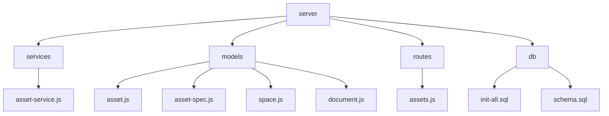

**图表来源**
- [asset-service.js](file://server/services/asset-service.js#L1-L216)
- [asset.js](file://server/models/asset.js#L1-L257)
- [asset-spec.js](file://server/models/asset-spec.js#L1-L170)
- [assets.js](file://server/routes/v1/assets.js#L1-L254)
- [init-all.sql](file://server/db/init-all.sql#L69-L91)

**章节来源**
- [asset-service.js](file://server/services/asset-service.js#L1-L216)
- [asset.js](file://server/models/asset.js#L1-L257)
- [asset-spec.js](file://server/models/asset-spec.js#L1-L170)

## 核心组件

资产服务的核心组件包括资产服务层（asset-service.js）、资产模型（asset.js）、资产规格模型（asset-spec.js）和资产路由（assets.js）。这些组件共同实现了资产的增删改查、分类管理、规格属性维护等核心业务逻辑。资产服务层封装了业务逻辑，资产模型负责数据访问，资产规格模型管理资产模板，资产路由处理API请求。

**章节来源**
- [asset-service.js](file://server/services/asset-service.js#L1-L216)
- [asset.js](file://server/models/asset.js#L1-L257)
- [asset-spec.js](file://server/models/asset-spec.js#L1-L170)
- [assets.js](file://server/routes/v1/assets.js#L1-L254)

## 架构概述

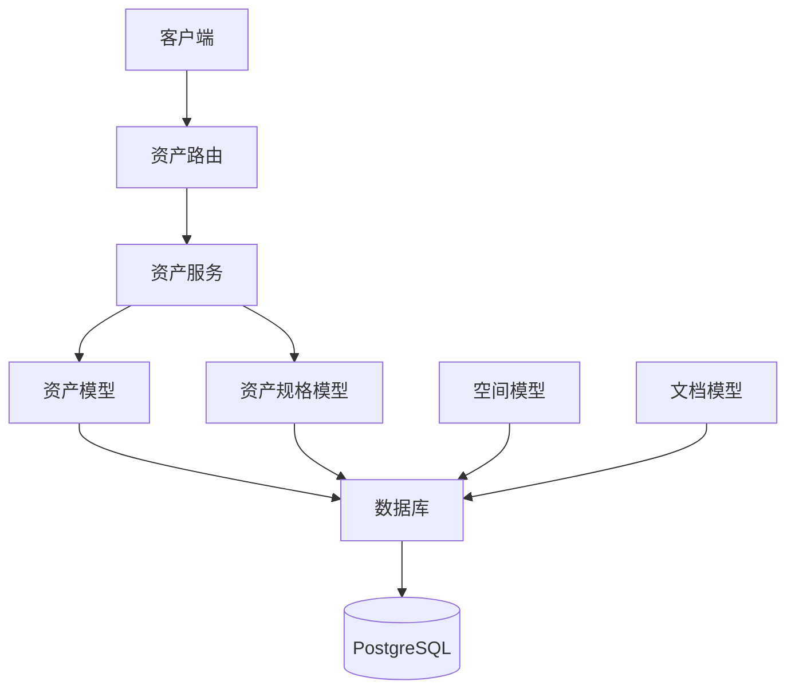

**图表来源**
- [asset-service.js](file://server/services/asset-service.js#L1-L216)
- [asset.js](file://server/models/asset.js#L1-L257)
- [asset-spec.js](file://server/models/asset-spec.js#L1-L170)
- [assets.js](file://server/routes/v1/assets.js#L1-L254)
- [space.js](file://server/models/space.js#L1-L224)
- [document.js](file://server/models/document.js#L1-L167)

## 详细组件分析

### 资产服务分析

资产服务层（asset-service.js）是资产模块的核心，封装了所有与资产相关的业务逻辑。该服务提供了获取所有资产、根据编码获取资产、创建资产、更新资产、删除资产、批量插入/更新资产等方法。通过调用底层模型的方法，实现了对资产数据的增删改查操作。

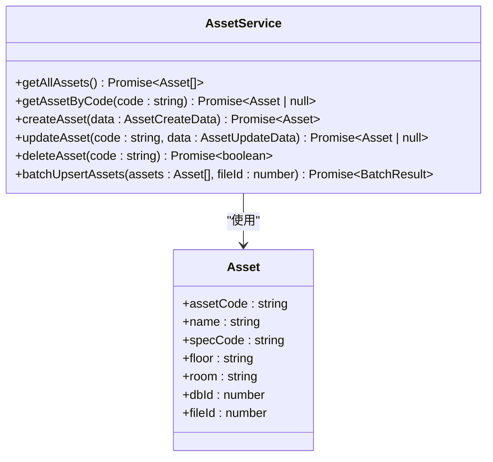

**图表来源**
- [asset-service.js](file://server/services/asset-service.js#L1-L216)
- [asset.ts](file://src/types/asset.ts#L5-L20)

**章节来源**
- [asset-service.js](file://server/services/asset-service.js#L1-L216)

### 资产规格模型分析

资产规格模型（asset-spec.js）负责管理资产的模板化配置。通过规格编码（specCode）作为唯一标识，实现了资产规格的标准化管理。该模型支持插入或更新资产规格、批量插入资产规格、获取所有资产规格、根据规格编码获取规格等操作。

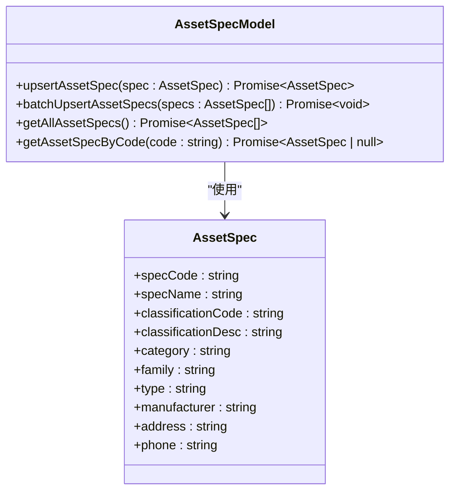

**图表来源**
- [asset-spec.js](file://server/models/asset-spec.js#L1-L170)
- [asset.ts](file://src/types/asset.ts#L22-L37)

**章节来源**
- [asset-spec.js](file://server/models/asset-spec.js#L1-L170)

### 资产与空间、文档关联关系

资产服务通过外键关联实现了资产与空间、文档的关联关系处理。在数据库层面，资产表（assets）通过file_id字段与模型文件表（model_files）关联，空间表（spaces）和文档表（documents）也通过file_id字段与模型文件表关联。这种设计确保了同一模型文件下的资产、空间和文档可以被统一管理。

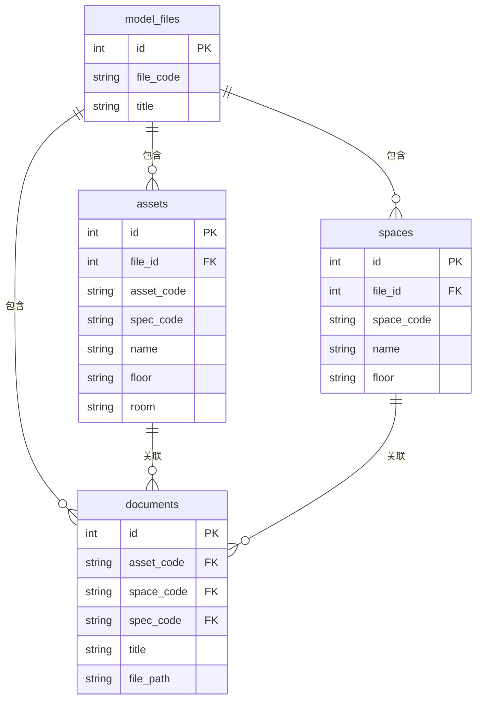

**图表来源**
- [init-all.sql](file://server/db/init-all.sql#L69-L91)
- [schema.sql](file://server/db/schema.sql#L40-L54)
- [document.js](file://server/models/document.js#L1-L167)

**章节来源**
- [init-all.sql](file://server/db/init-all.sql#L69-L91)
- [schema.sql](file://server/db/schema.sql#L40-L54)
- [document.js](file://server/models/document.js#L1-L167)

### MC编码生成规则与唯一性约束

资产编码（MC编码）是资产的唯一标识符，在系统中具有全局唯一性。在数据库层面，通过在assets表上创建(file_id, asset_code)的唯一约束来保障编码的唯一性。这种设计允许不同模型文件中存在相同编码的资产，但在同一模型文件内，资产编码必须唯一。

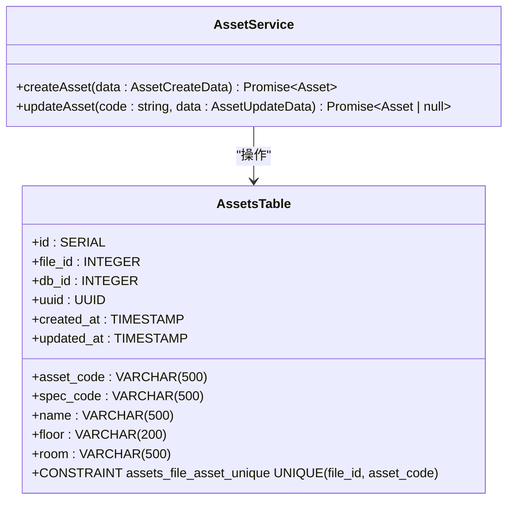

**图表来源**
- [init-all.sql](file://server/db/init-all.sql#L70-L83)
- [schema.sql](file://server/db/schema.sql#L40-L54)
- [asset-service.js](file://server/services/asset-service.js#L74-L96)

**章节来源**
- [init-all.sql](file://server/db/init-all.sql#L70-L83)
- [schema.sql](file://server/db/schema.sql#L40-L54)

### 资产模板化配置实现

资产模板化配置通过资产规格表（asset_specs）实现。每个资产规格定义了一类资产的通用属性，如制造商、地址、电话等。资产通过spec_code字段引用相应的资产规格，从而继承其属性。这种设计实现了资产属性的标准化管理，减少了数据冗余。

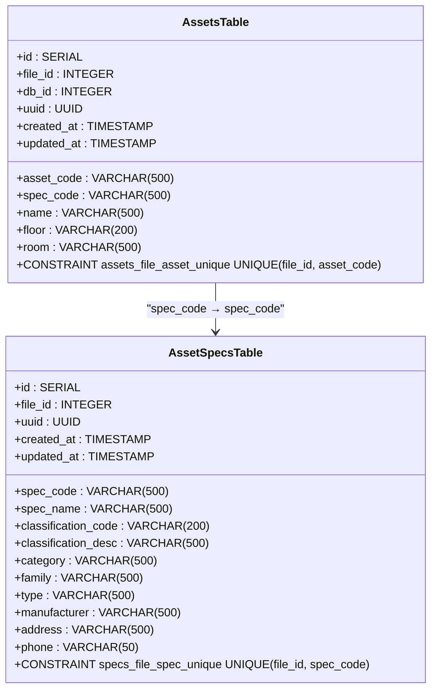

**图表来源**
- [init-all.sql](file://server/db/init-all.sql#L41-L58)
- [schema.sql](file://server/db/schema.sql#L20-L37)
- [asset-spec.js](file://server/models/asset-spec.js#L1-L170)

**章节来源**
- [init-all.sql](file://server/db/init-all.sql#L41-L58)
- [schema.sql](file://server/db/schema.sql#L20-L37)
- [asset-spec.js](file://server/models/asset-spec.js#L1-L170)

### 典型使用场景示例

#### 批量导入资产数据

批量导入资产数据是资产服务的常见使用场景。通过调用batchUpsertAssetsWithFile方法，可以一次性导入大量资产数据。该方法会逐个处理每条资产记录，如果资产编码已存在则更新，否则创建新资产。

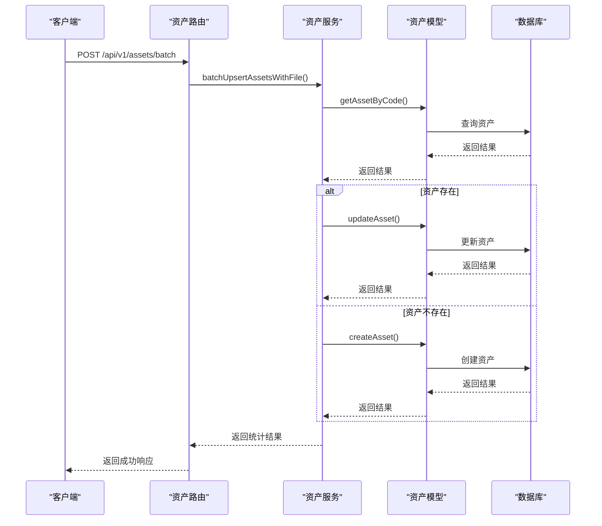

**图表来源**
- [assets.js](file://server/routes/v1/assets.js#L173-L193)
- [asset-service.js](file://server/services/asset-service.js#L131-L156)
- [asset.js](file://server/models/asset.js#L163-L204)

**章节来源**
- [assets.js](file://server/routes/v1/assets.js#L173-L193)
- [asset-service.js](file://server/services/asset-service.js#L131-L156)

#### 更新资产状态

更新资产状态是另一个常见使用场景。通过调用updateAsset方法，可以更新资产的名称、规格编码、楼层、房间等属性。该方法使用COALESCE函数确保只更新提供的字段，未提供的字段保持不变。

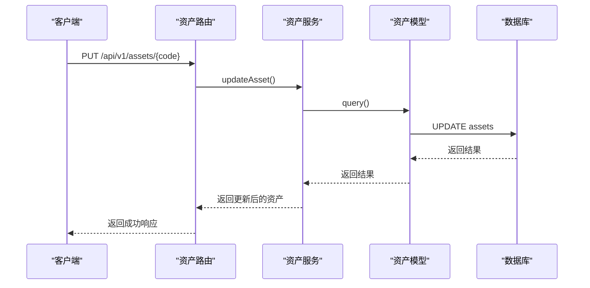

**图表来源**
- [assets.js](file://server/routes/v1/assets.js#L119-L139)
- [asset-service.js](file://server/services/asset-service.js#L101-L118)
- [asset.js](file://server/models/asset.js#L211-L242)

**章节来源**
- [assets.js](file://server/routes/v1/assets.js#L119-L139)
- [asset-service.js](file://server/services/asset-service.js#L101-L118)

### 高并发写入场景下的数据一致性保障

在高并发写入场景下，资产服务通过数据库事务和唯一约束来保障数据一致性。对于批量操作，使用显式事务（BEGIN/COMMIT/ROLLBACK）确保所有操作的原子性。如果任何一条记录处理失败，整个事务将回滚，保持数据的一致性状态。

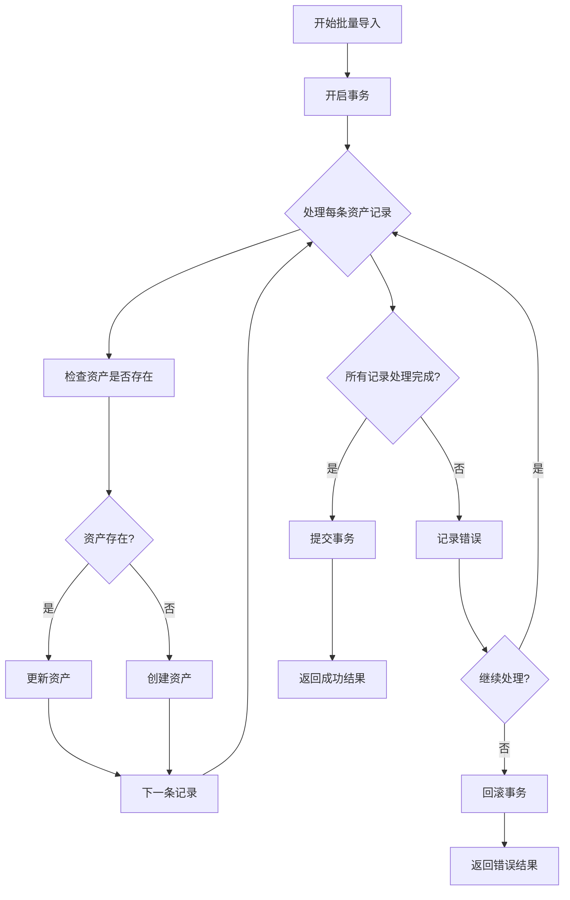

**图表来源**
- [asset-spec.js](file://server/models/asset-spec.js#L39-L75)
- [asset.js](file://server/models/asset.js#L164-L203)
- [init-all.sql](file://server/db/init-all.sql#L304-L332)

**章节来源**
- [asset-spec.js](file://server/models/asset-spec.js#L39-L75)
- [asset.js](file://server/models/asset.js#L164-L203)

### 索引优化建议

为了提高查询性能，资产服务在关键字段上创建了适当的索引。建议的索引包括：asset_code、spec_code、floor、room等常用查询条件字段。这些索引显著提高了数据检索效率，特别是在处理大量资产数据时。

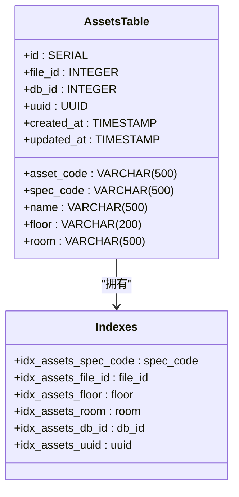

**图表来源**
- [init-all.sql](file://server/db/init-all.sql#L85-L90)
- [schema.sql](file://server/db/schema.sql#L91-L95)

**章节来源**
- [init-all.sql](file://server/db/init-all.sql#L85-L90)
- [schema.sql](file://server/db/schema.sql#L91-L95)

## 依赖分析

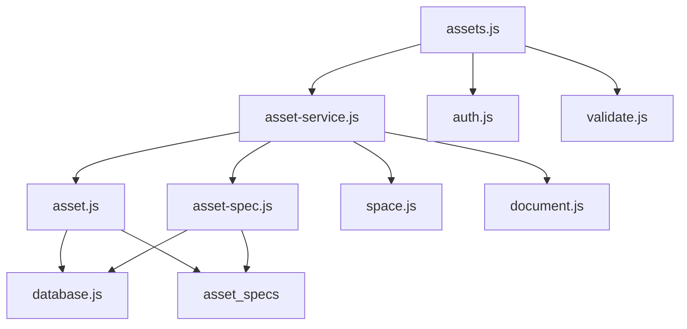

**图表来源**
- [asset-service.js](file://server/services/asset-service.js#L5)
- [asset.js](file://server/models/asset.js#L4)
- [asset-spec.js](file://server/models/asset-spec.js#L4)
- [assets.js](file://server/routes/v1/assets.js#L9-L11)

**章节来源**
- [asset-service.js](file://server/services/asset-service.js#L5)
- [asset.js](file://server/models/asset.js#L4)
- [asset-spec.js](file://server/models/asset-spec.js#L4)
- [assets.js](file://server/routes/v1/assets.js#L9-L11)

## 性能考虑
资产服务在设计时充分考虑了性能因素。通过在关键字段上创建索引，提高了查询效率。对于批量操作，使用事务确保数据一致性的同时，也减少了数据库连接的开销。建议在生产环境中定期分析查询性能，根据实际使用情况调整索引策略。

## 故障排除指南
在使用资产服务时，可能会遇到一些常见问题。例如，批量导入时部分资产导入失败，这通常是由于数据格式不正确或违反唯一约束导致的。可以通过检查返回的错误信息来定位问题。另外，如果查询性能不佳，可以检查相关字段是否已建立索引。

**章节来源**
- [asset-service.js](file://server/services/asset-service.js#L149-L152)
- [assets.js](file://server/routes/v1/assets.js#L191-L192)

## 结论
资产服务通过清晰的分层架构和合理的数据库设计，实现了对资产数据的高效管理。服务提供了完整的增删改查功能，支持资产与空间、文档的关联管理。通过MC编码的唯一性约束和资产模板化配置，确保了数据的一致性和标准化。在高并发场景下，通过事务机制保障了数据一致性。合理的索引策略为系统性能提供了有力支持。