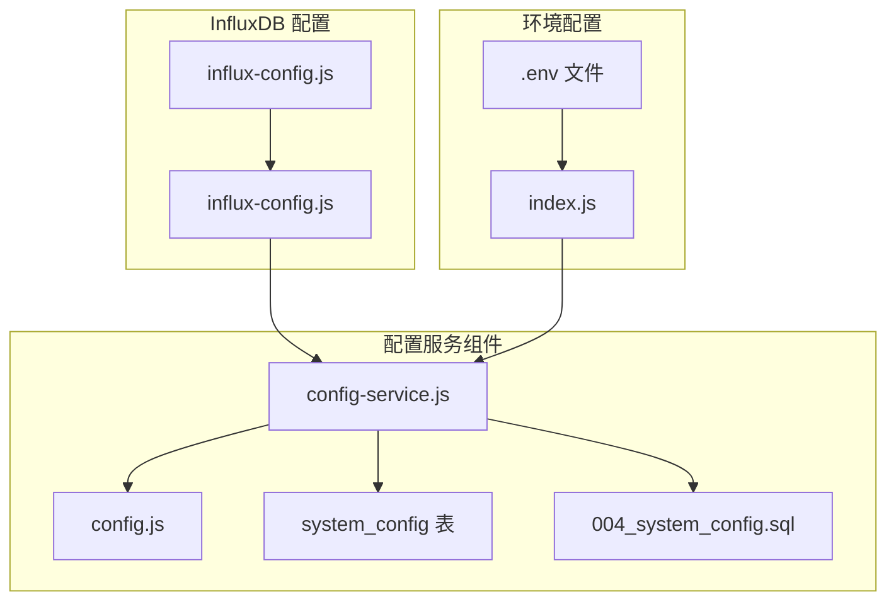
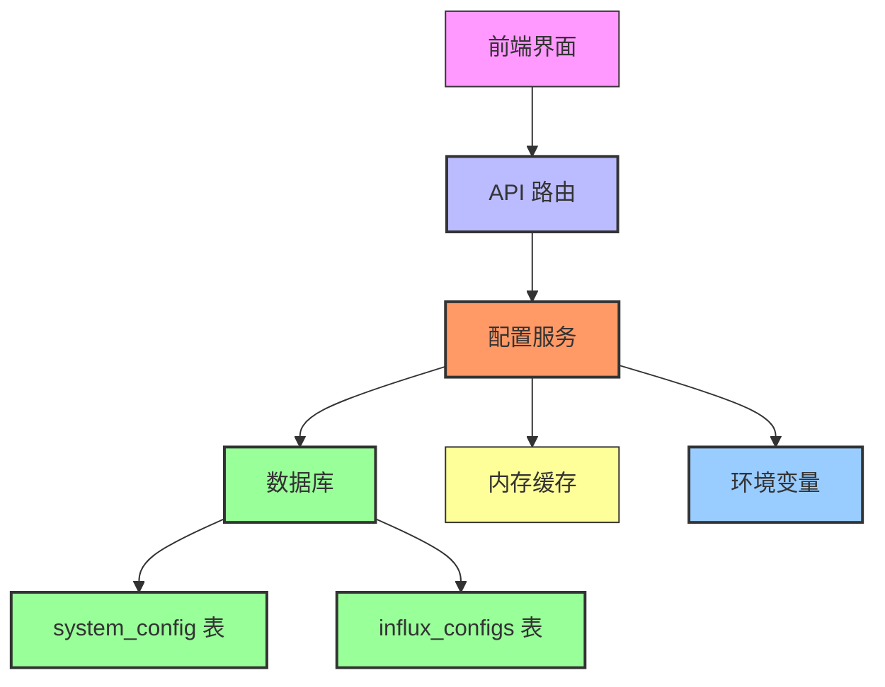
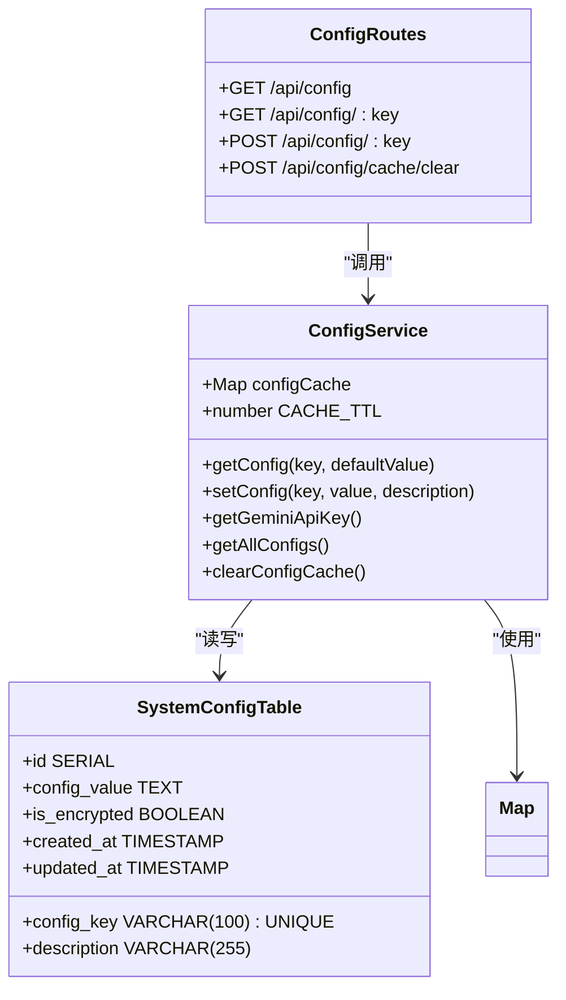
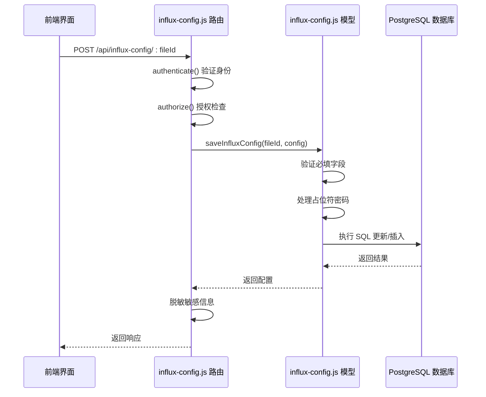
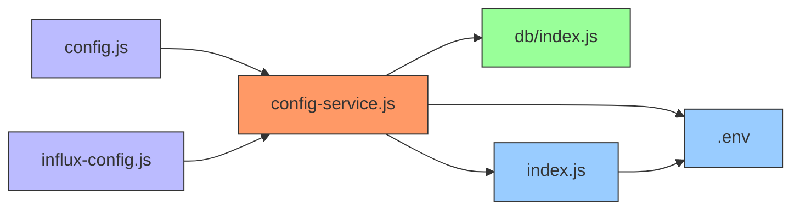

# 配置服务

<cite>
**本文档引用的文件**
- [config-service.js](file://server/services/config-service.js)
- [004_system_config.sql](file://server/migrations/004_system_config.sql)
- [influx-config.js](file://server/models/influx-config.js)
- [config.js](file://server/routes/config.js)
- [influx-config.js](file://server/routes/influx-config.js)
- [database.js](file://server/db/index.js)
- [.env](file://server/.env)
- [index.js](file://server/config/index.js)
- [openwebui-config.js](file://server/config/openwebui-config.js)
</cite>

## 目录
1. [简介](#简介)
2. [项目结构](#项目结构)
3. [核心组件](#核心组件)
4. [架构概述](#架构概述)
5. [详细组件分析](#详细组件分析)
6. [依赖分析](#依赖分析)
7. [性能考虑](#性能考虑)
8. [故障排除指南](#故障排除指南)
9. [结论](#结论)

## 简介
配置服务是 TwinSight 系统的核心组件，负责统一管理系统的动态配置项。该服务通过 `config-service.js` 实现，提供对系统配置的集中式管理，包括 InfluxDB 连接信息、AI 服务开关等关键参数。配置服务采用数据库持久化存储与运行时缓存相结合的策略，确保配置数据的安全性和访问效率。服务支持配置变更的热更新能力，并通过 API 路由为前端界面提供配置管理接口。系统通过 `system_config` 表存储敏感配置信息，并利用迁移脚本实现数据库结构的演进。配置服务还支持多环境隔离和敏感信息加密存储，确保不同部署环境的安全性和独立性。

## 项目结构
配置服务相关文件分布在服务器端的多个目录中，形成了清晰的分层架构。核心配置逻辑位于 `server/services/` 目录下的 `config-service.js` 文件中，而数据库迁移脚本则存放在 `server/migrations/` 目录中。InfluxDB 配置相关的数据访问和路由分别位于 `server/models/` 和 `server/routes/` 目录下。环境配置文件分布在项目根目录和 `docker/` 目录中，支持不同部署环境的配置隔离。

**Diagram sources**
- [config-service.js](file://server/services/config-service.js#L1-L111)
- [004_system_config.sql](file://server/migrations/004_system_config.sql#L1-L21)
- [config.js](file://server/routes/config.js#L1-L89)

**Section sources**
- [config-service.js](file://server/services/config-service.js#L1-L111)
- [004_system_config.sql](file://server/migrations/004_system_config.sql#L1-L21)
- [influx-config.js](file://server/models/influx-config.js#L1-L184)

## 核心组件
配置服务的核心功能由 `config-service.js` 文件实现，该文件提供了配置的获取、设置、缓存管理等关键方法。服务通过 `getConfig` 和 `setConfig` 函数实现配置的读取和写入操作，同时维护一个内存缓存以提高访问性能。`getAllConfigs` 函数用于获取所有配置项，对加密配置值进行脱敏处理。服务还提供了 `clearConfigCache` 方法用于手动清除缓存。`getGeminiApiKey` 是一个专用方法，用于获取 Gemini API 密钥。这些核心组件共同构成了配置服务的基础功能，支持系统的动态配置管理需求。

**Section sources**
- [config-service.js](file://server/services/config-service.js#L1-L111)

## 架构概述
配置服务采用分层架构设计，将数据访问、业务逻辑和接口路由分离。服务通过 `config-service.js` 实现核心业务逻辑，使用 `system_config` 数据库存储配置数据，并通过 `config.js` 路由文件暴露 RESTful API 接口。缓存机制采用内存 Map 实现，设置 5 分钟的 TTL（Time To Live）以平衡性能和数据新鲜度。当配置更新时，服务会自动清除相应键的缓存，确保后续读取获取最新值。对于 InfluxDB 配置，系统采用独立的 `influx_configs` 表进行存储，通过 `influx-config.js` 模型文件提供数据访问接口。整个架构支持配置的热更新和动态加载，无需重启服务即可应用新的配置值。

**Diagram sources**
- [config-service.js](file://server/services/config-service.js#L1-L111)
- [config.js](file://server/routes/config.js#L1-L89)
- [influx-config.js](file://server/models/influx-config.js#L1-L184)
- [database.js](file://server/db/index.js#L1-L93)

## 详细组件分析

### 配置服务分析
配置服务的核心是 `config-service.js` 文件，它实现了系统配置的统一管理。服务使用 `Map` 对象作为内存缓存，设置 5 分钟的缓存有效期，有效减少数据库查询压力。`getConfig` 方法首先检查缓存，如果缓存命中则直接返回值，否则查询数据库并更新缓存。`setConfig` 方法使用 PostgreSQL 的 `INSERT ... ON CONFLICT DO UPDATE` 语法实现 upsert 操作，确保配置的原子性更新，并在更新后清除对应缓存。服务还实现了敏感信息保护机制，在返回配置时对包含 "KEY"、"SECRET" 或 "PASSWORD" 的配置值进行脱敏处理。

#### 配置服务类图

**Diagram sources**
- [config-service.js](file://server/services/config-service.js#L1-L111)
- [004_system_config.sql](file://server/migrations/004_system_config.sql#L1-L21)
- [config.js](file://server/routes/config.js#L1-L89)

### InfluxDB 配置分析
InfluxDB 配置管理由独立的模型和路由组件实现。`influx-config.js` 模型文件提供了对 `influx_configs` 表的 CRUD 操作，每个模型文件可以拥有独立的 InfluxDB 连接配置。系统支持多种认证方式，包括 Token 认证和基本认证。`testInfluxConnection` 方法实现了连接测试功能，能够智能处理 URL 格式并支持超时控制。路由层通过 `influx-config.js` 路由文件暴露 API 接口，实现了权限控制和敏感信息保护。

#### InfluxDB 配置序列图

**Diagram sources**
- [influx-config.js](file://server/models/influx-config.js#L1-L184)
- [influx-config.js](file://server/routes/influx-config.js#L1-L168)

## 依赖分析
配置服务与其他系统组件存在明确的依赖关系。服务直接依赖于数据库连接池，通过 `db/index.js` 提供的 `pool` 对象执行 SQL 查询。`config-service.js` 被 `config.js` 路由文件直接引用，提供 API 接口的业务逻辑。InfluxDB 配置模型也依赖配置服务获取全局配置。环境变量通过 `dotenv` 模块加载，为系统提供基础配置。整个依赖结构清晰，各组件职责分明，降低了耦合度。

**Diagram sources**
- [config-service.js](file://server/services/config-service.js#L1-L111)
- [database.js](file://server/db/index.js#L1-L93)
- [config.js](file://server/routes/config.js#L1-L89)
- [index.js](file://server/config/index.js#L1-L93)
- [.env](file://server/.env#L1-L24)

**Section sources**
- [config-service.js](file://server/services/config-service.js#L1-L111)
- [database.js](file://server/db/index.js#L1-L93)
- [config.js](file://server/routes/config.js#L1-L89)

## 性能考虑
配置服务在设计时充分考虑了性能因素。通过内存缓存机制，将频繁访问的配置项存储在 `Map` 对象中，设置 5 分钟的 TTL，显著减少了数据库查询次数。缓存使用简单的键值对存储，查找时间复杂度为 O(1)。数据库查询使用参数化 SQL 语句，避免 SQL 注入风险，并利用 `config_key` 字段的索引提高查询效率。`setConfig` 方法使用 upsert 语句，减少了先查询后更新的两阶段操作开销。对于大规模配置读取，`getAllConfigs` 方法使用单次查询获取所有数据，减少了网络往返次数。这些优化措施确保了配置服务在高并发场景下的响应性能。

## 故障排除指南
配置服务可能遇到的常见问题包括数据库连接失败、配置更新不生效、缓存不一致等。对于数据库连接问题，应检查 `DATABASE_URL` 或相关环境变量配置是否正确。当配置更新后未生效时，可能是缓存未正确清除，可调用 `/api/config/cache/clear` 接口手动清除缓存。敏感信息显示为 "******" 属于正常安全机制，实际值仍存储在数据库中。InfluxDB 连接测试失败时，应检查网络连通性、认证信息和防火墙设置。系统日志会记录配置操作的关键信息，可通过查看日志定位问题。对于迁移问题，应确保 `004_system_config.sql` 脚本已正确执行，创建了必要的表和索引。

**Section sources**
- [config-service.js](file://server/services/config-service.js#L1-L111)
- [004_system_config.sql](file://server/migrations/004_system_config.sql#L1-L21)
- [config.js](file://server/routes/config.js#L1-L89)

## 结论
配置服务为 TwinSight 系统提供了稳定可靠的配置管理能力。通过数据库持久化存储和内存缓存相结合的策略，实现了配置数据的安全存储和高效访问。服务支持动态配置更新和热加载，无需重启服务即可应用新配置。基于 `system_config` 表的存储机制和迁移脚本确保了数据库结构的可演进性。多环境配置隔离和敏感信息加密存储实践增强了系统的安全性。整体设计遵循了高内聚、低耦合的原则，各组件职责清晰，便于维护和扩展。配置服务的成功实现为系统的灵活性和可管理性提供了坚实基础。