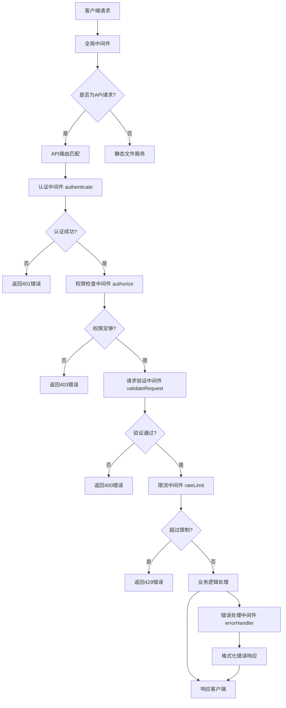
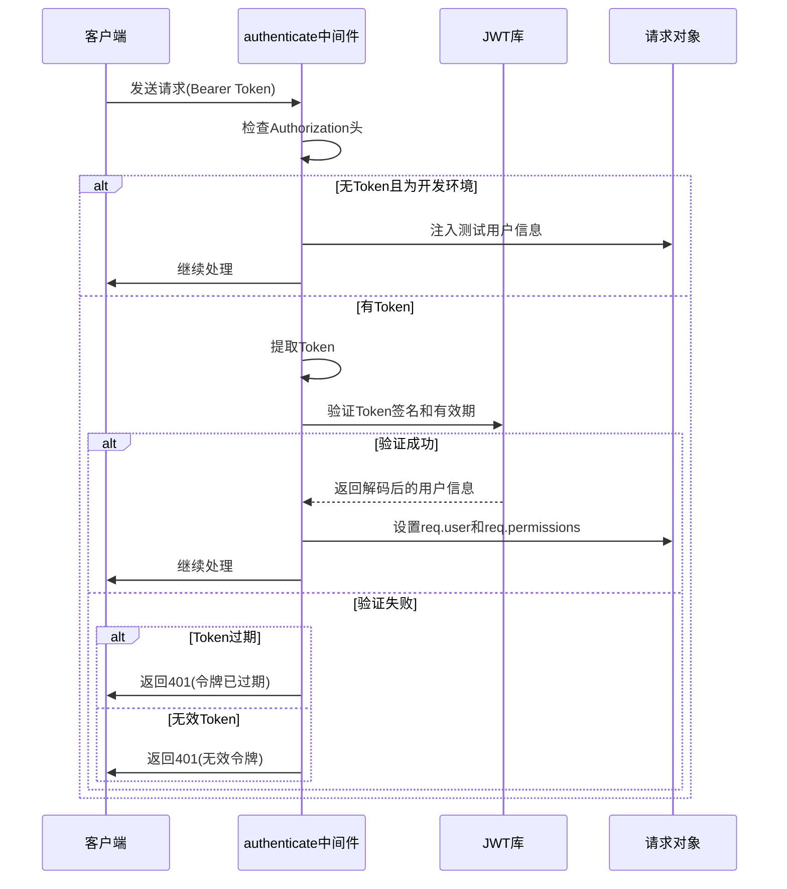
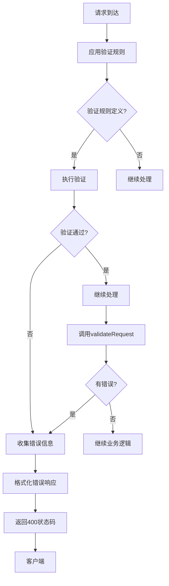
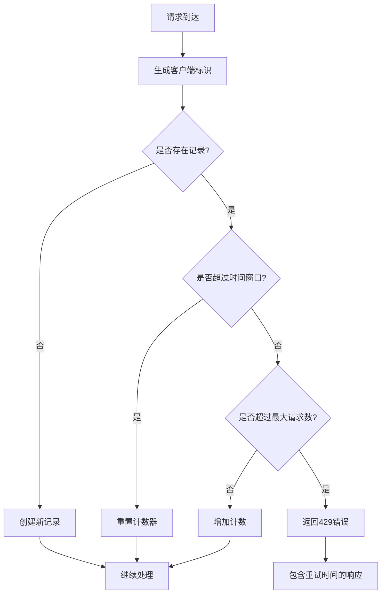
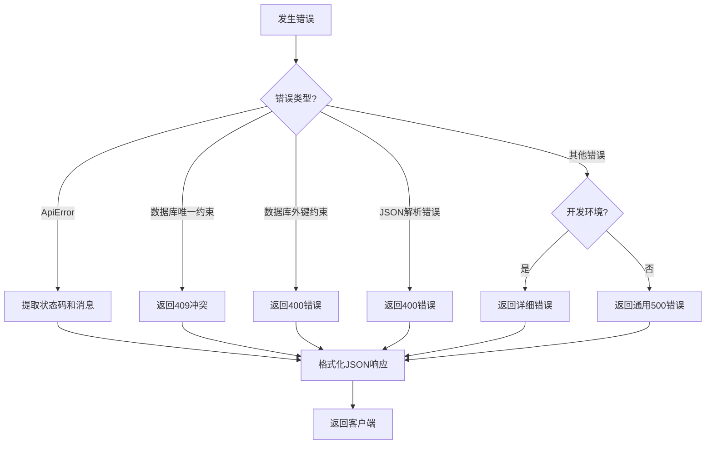
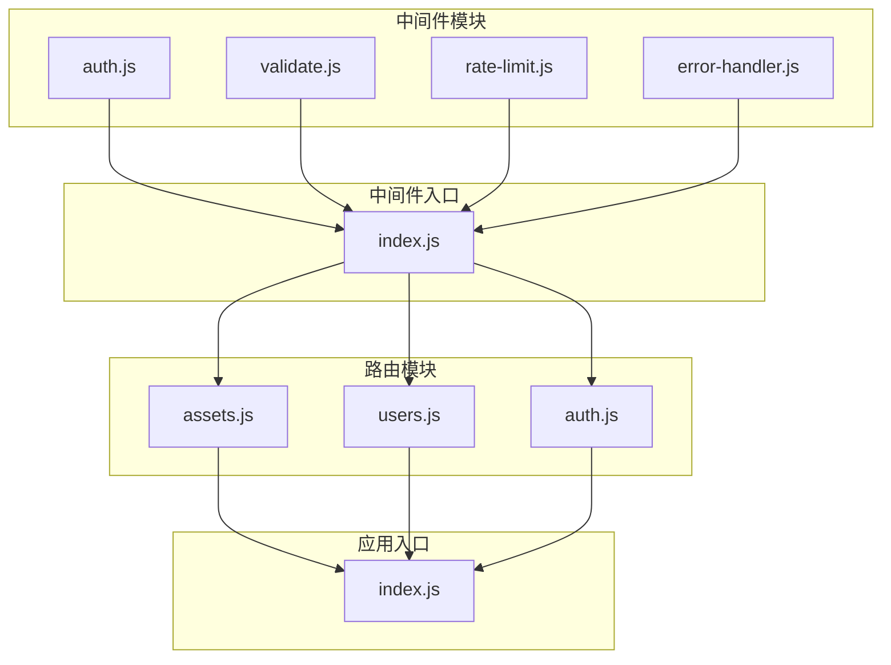

# 中间件机制

<cite>
**本文档引用的文件**  
- [auth.js](file://server/middleware/auth.js)
- [validate.js](file://server/middleware/validate.js)
- [rate-limit.js](file://server/middleware/rate-limit.js)
- [error-handler.js](file://server/middleware/error-handler.js)
- [index.js](file://server/middleware/index.js)
- [auth.js](file://server/config/auth.js)
- [index.js](file://server/config/index.js)
- [assets.js](file://server/routes/v1/assets.js)
- [users.js](file://server/routes/v1/users.js)
- [auth.js](file://server/routes/v1/auth.js)
- [index.js](file://server/index.js)
</cite>

## 目录
1. [简介](#简介)
2. [中间件执行流程](#中间件执行流程)
3. [认证中间件 (auth.js)](#认证中间件-authjs)
4. [请求验证中间件 (validate.js)](#请求验证中间件-validatejs)
5. [限流中间件 (rate-limit.js)](#限流中间件-rate-limitjs)
6. [错误处理中间件 (error-handler.js)](#错误处理中间件-error-handlerjs)
7. [中间件集成与注册](#中间件集成与注册)
8. [自定义中间件开发](#自定义中间件开发)
9. [总结](#总结)

## 简介

中间件是Twinsight后端服务的核心组成部分，它们在请求处理管道中扮演着关键角色。每个HTTP请求在到达最终的路由处理器之前，都会经过一系列中间件的处理。这些中间件负责执行各种横切关注点，如身份验证、权限检查、输入验证、速率限制和错误处理等。

中间件体系的设计遵循分层原则，确保了代码的可维护性和可扩展性。通过将不同的功能分离到独立的中间件模块中，系统能够灵活地组合和重用这些功能，同时保持核心业务逻辑的简洁性。

**本节来源**  
- [index.js](file://server/index.js#L44-L169)

## 中间件执行流程

**图示来源**  
- [auth.js](file://server/middleware/auth.js#L12-L53)
- [validate.js](file://server/middleware/validate.js#L11-L26)
- [rate-limit.js](file://server/middleware/rate-limit.js#L33-L67)
- [error-handler.js](file://server/middleware/error-handler.js#L55-L108)

## 认证中间件 (auth.js)

认证中间件实现了基于JWT（JSON Web Token）的认证机制，负责验证用户身份并注入用户信息到请求上下文中。该中间件包含三个核心功能：完全认证、权限检查和可选认证。

在开发模式下，系统支持免认证访问，为开发人员提供便利。对于生产环境，所有请求都必须携带有效的Bearer Token。中间件会解析Token并验证其有效性，包括检查签名和过期时间。验证成功后，用户信息会被注入到`req.user`对象中，同时用户的权限列表也会被设置到`req.permissions`中，供后续的权限检查使用。

权限检查中间件支持细粒度的权限控制，通过预定义的权限常量（如`asset:read`、`space:create`等）来管理不同资源的访问权限。系统还支持通配符权限`*`，拥有该权限的用户可以访问所有资源。

**图示来源**  
- [auth.js](file://server/middleware/auth.js#L12-L119)
- [config/auth.js](file://server/config/auth.js#L8-L141)

**本节来源**  
- [auth.js](file://server/middleware/auth.js#L12-L119)
- [config/auth.js](file://server/config/auth.js#L8-L141)

## 请求验证中间件 (validate.js)

请求验证中间件基于`express-validator`库实现，负责对传入的请求参数进行模式匹配和数据验证。该中间件提供了一套标准化的验证流程，确保所有API端点接收的数据都符合预期格式。

中间件的核心是`validateRequest`函数，它会在请求处理管道中检查验证结果。如果验证失败，中间件会立即返回一个结构化的400错误响应，其中包含详细的错误信息，包括出错的字段、错误消息和实际值。这种统一的错误格式有助于客户端开发者快速定位和修复问题。

为了提高代码复用性，中间件还定义了一系列通用验证规则，如分页参数、ID参数和编码参数的验证。这些规则可以在不同的路由中重复使用，确保验证逻辑的一致性。例如，分页参数验证确保页码和每页数量都是有效的整数，并且在合理范围内。

**图示来源**  
- [validate.js](file://server/middleware/validate.js#L11-L71)
- [assets.js](file://server/routes/v1/assets.js#L36-L38)

**本节来源**  
- [validate.js](file://server/middleware/validate.js#L11-L71)

## 限流中间件 (rate-limit.js)

限流中间件实现了基于内存的简单限流算法，用于防止API被滥用或遭受DDoS攻击。该中间件采用固定窗口计数器算法，为每个客户端维护一个请求计数器。

系统使用`Map`数据结构来存储客户端的请求记录，键为客户端标识（优先使用用户ID，否则使用IP地址），值为包含开始时间和请求计数的对象。每当收到新请求时，中间件会检查该客户端在指定时间窗口内的请求次数。如果超过预设阈值，则返回429状态码，提示客户端请求过于频繁。

中间件提供了灵活的配置选项，允许为不同的API端点设置不同的限流策略。系统预定义了三种常用的限流配置：普通限流（每分钟最多100次请求）、严格限流（每分钟最多10次请求）和登录限流（每15分钟最多5次尝试）。这些配置可以根据实际需求进行调整。

**图示来源**  
- [rate-limit.js](file://server/middleware/rate-limit.js#L33-L67)
- [rate-limit.js](file://server/middleware/rate-limit.js#L74-L87)

**本节来源**  
- [rate-limit.js](file://server/middleware/rate-limit.js#L1-L93)

## 错误处理中间件 (error-handler.js)

错误处理中间件提供了统一的异常捕获和响应格式化机制，确保所有错误都能以一致的方式返回给客户端。该中间件包含一个自定义的`ApiError`类，用于表示不同类型的API错误。

`ApiError`类封装了HTTP状态码、错误消息和可选的详细信息，提供了静态工厂方法来创建常见的错误类型，如400（Bad Request）、401（Unauthorized）、403（Forbidden）等。当业务逻辑中抛出`ApiError`异常时，错误处理中间件会捕获它并生成相应的JSON响应。

除了自定义API错误外，中间件还能处理各种系统级异常，如数据库约束错误（唯一约束冲突、外键约束失败）和JSON解析错误。对于开发环境，中间件会返回详细的错误堆栈信息，便于调试；而在生产环境中，为了安全起见，只会返回通用的错误消息。

**图示来源**  
- [error-handler.js](file://server/middleware/error-handler.js#L55-L108)
- [index.js](file://server/index.js#L166-L169)

**本节来源**  
- [error-handler.js](file://server/middleware/error-handler.js#L9-L114)

## 中间件集成与注册

中间件通过`server/middleware/index.js`文件统一导出，实现了模块化的组织结构。这个入口文件使用ES6的命名导出语法，将各个中间件模块的功能集中暴露，简化了在路由中的导入和使用。

在应用级别，中间件分为全局中间件和路由级中间件。全局中间件（如JSON解析、CORS支持）在`server/index.js`中通过`app.use()`注册，应用于所有请求。而特定功能的中间件则在各个路由模块中按需使用。

在路由级别，中间件按照特定顺序执行，形成一个处理管道。例如，在`assets.js`路由中，请求首先经过认证中间件，然后是权限检查，接着是参数验证，最后才到达业务逻辑处理器。这种顺序确保了安全性检查在数据处理之前完成。

**图示来源**  
- [index.js](file://server/middleware/index.js#L5-L8)
- [assets.js](file://server/routes/v1/assets.js#L34-L38)
- [index.js](file://server/index.js#L44-L47)

**本节来源**  
- [index.js](file://server/middleware/index.js#L1-L9)
- [assets.js](file://server/routes/v1/assets.js#L33-L39)
- [users.js](file://server/routes/v1/users.js#L12-L18)

## 自定义中间件开发

开发自定义中间件遵循统一的模式：创建一个返回函数的工厂函数，该函数接受请求、响应和`next`参数。这种设计使得中间件可以接受配置参数，同时保持与Express框架的兼容性。

在创建新的中间件时，应将其放置在`server/middleware/`目录下，并在`index.js`中导出。中间件应该专注于单一职责，避免功能过于复杂。对于可能抛出异常的操作，必须使用try-catch块进行错误处理，并通过`next()`函数将错误传递给错误处理中间件。

中间件的执行顺序至关重要。一般来说，应该按照"安全检查 -> 数据验证 -> 业务逻辑"的顺序排列。认证和权限检查应该放在最前面，确保未授权的请求不会消耗过多的系统资源。请求验证应该在业务逻辑之前，防止无效数据进入核心处理流程。

**本节来源**  
- [rate-limit.js](file://server/middleware/rate-limit.js#L33-L67)
- [auth.js](file://server/middleware/auth.js#L60-L85)
- [validate.js](file://server/middleware/validate.js#L11-L26)

## 总结

Twinsight的中间件体系设计合理，功能完整，为API服务提供了坚实的基础。通过将不同的横切关注点分离到独立的中间件模块中，系统实现了高内聚、低耦合的架构设计。

认证中间件提供了灵活的JWT验证机制，支持开发模式下的便捷访问和生产环境下的严格安全控制。请求验证中间件确保了数据的完整性和一致性，减少了因无效输入导致的错误。限流中间件保护系统免受滥用，提高了服务的稳定性。错误处理中间件则提供了统一的异常处理机制，改善了API的用户体验。

这些中间件共同构成了一个强大的请求处理管道，确保了系统的安全性、可靠性和可维护性。通过遵循现有的设计模式，开发人员可以轻松地创建新的中间件来满足不断变化的业务需求。