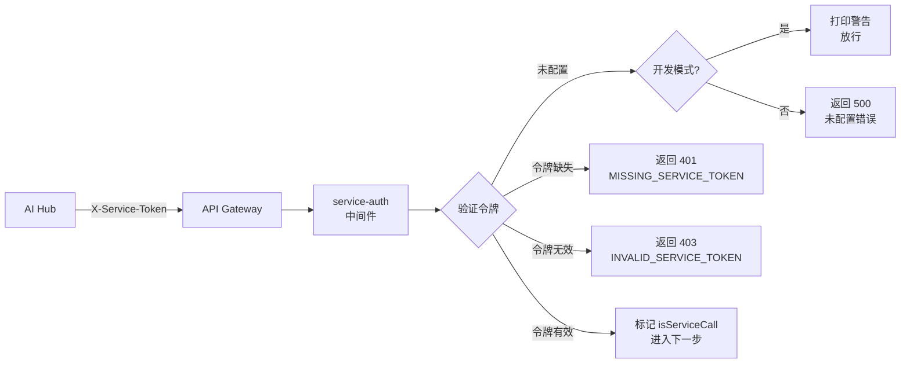

# 服务认证中间件

<cite>
**本文档引用文件**
- [server/middleware/service-auth.js](../../../../../../server/middleware/service-auth.js)
- [server/routes/atomic/v1/index.js](../../../../../../server/routes/atomic/v1/index.js)
- [server/config/index.js](../../../../../../server/config/index.js)
</cite>

## 目录
1. [概述](#概述)
2. [认证流程](#认证流程)
3. [环境配置](#环境配置)
4. [错误处理](#错误处理)
5. [开发模式行为](#开发模式行为)
6. [使用方式](#使用方式)
7. [安全建议](#安全建议)

## 概述

服务认证中间件（Service Auth Middleware）是 TwinSight 平台用于 M2M（Machine-to-Machine）服务间调用的认证组件。它主要用于校验 AI Hub 等外部服务调用 TwinSight Atomic API 时的身份合法性，确保只有授权的服务才能访问敏感接口。



**核心职责：**
- 验证 `X-Service-Token` 请求头的存在性和有效性
- 支持多令牌配置（逗号分隔）
- 区分开发环境和生产环境的行为
- 在请求对象上标记服务调用标识

**Section sources**
- [server/middleware/service-auth.js](../../../../../../server/middleware/service-auth.js)

## 认证流程

### 1. 令牌来源

服务令牌从以下环境变量读取（按优先级）：
1. `SERVICE_TOKENS` - 支持多个令牌（逗号分隔）
2. `SERVICE_TOKEN` - 单个令牌（向后兼容）

### 2. 验证步骤

```javascript
// 1. 提取令牌
const serviceToken = req.headers['x-service-token'];

// 2. 检查配置
if (ALLOWED_SERVICE_TOKENS.length === 0) {
    // 开发模式：警告并放行
    // 生产模式：返回 500 错误
}

// 3. 验证令牌存在
if (!serviceToken) {
    return 401 MISSING_SERVICE_TOKEN;
}

// 4. 验证令牌有效
if (!ALLOWED_SERVICE_TOKENS.includes(serviceToken)) {
    return 403 INVALID_SERVICE_TOKEN;
}

// 5. 标记服务调用
req.isServiceCall = true;
```

### 3. 请求头规范

```http
X-Service-Token: your_service_token_here
```

**Section sources**
- [server/middleware/service-auth.js](../../../../../../server/middleware/service-auth.js)

## 环境配置

### 环境变量

| 变量名 | 必填 | 说明 | 示例 |
|--------|------|------|------|
| `SERVICE_TOKENS` | 生产环境必填 | 允许的服务令牌列表（逗号分隔） | `token1,token2,token3` |
| `SERVICE_TOKEN` | 可选 | 单个服务令牌（向后兼容） | `single_token` |

### 配置示例

#### 开发环境 `.env.development`
```bash
# 开发环境可以不配置，会打印警告并放行
# SERVICE_TOKENS=dev_token_only
```

#### 生产环境 `.env.production`
```bash
# 生产环境必须配置
SERVICE_TOKENS=ai_hub_prod_token,n8n_prod_token,openwebui_prod_token
```

### 令牌生成建议

使用加密安全的随机字符串生成令牌：

```bash
# 生成 32 字节的安全令牌
openssl rand -hex 32

# 或使用 Node.js
crypto.randomBytes(32).toString('hex')
```

**Section sources**
- [server/config/index.js](../../../../../../server/config/index.js)

## 错误处理

服务认证中间件使用标准的 Atomic API 错误响应格式：

### 1. 服务认证未配置（500）

当生产环境未配置 `SERVICE_TOKENS` 时返回：

```json
{
  "success": false,
  "error": {
    "code": "SERVICE_AUTH_NOT_CONFIGURED",
    "message": "Service authentication is not configured on the server",
    "request_id": "req_abc123"
  }
}
```

### 2. 缺少服务令牌（401）

当请求未携带 `X-Service-Token` 头时返回：

```json
{
  "success": false,
  "error": {
    "code": "MISSING_SERVICE_TOKEN",
    "message": "X-Service-Token header is required for service-to-service calls",
    "request_id": "req_abc123"
  }
}
```

### 3. 无效的服务令牌（403）

当提供的令牌不在允许列表中时返回：

```json
{
  "success": false,
  "error": {
    "code": "INVALID_SERVICE_TOKEN",
    "message": "The provided service token is not authorized",
    "request_id": "req_abc123"
  }
}
```

### 错误码汇总

| HTTP 状态码 | 错误码 | 场景 |
|------------|--------|------|
| 500 | `SERVICE_AUTH_NOT_CONFIGURED` | 生产环境未配置 SERVICE_TOKENS |
| 401 | `MISSING_SERVICE_TOKEN` | 缺少 X-Service-Token 请求头 |
| 403 | `INVALID_SERVICE_TOKEN` | 提供的令牌不在白名单中 |

**Section sources**
- [server/middleware/service-auth.js](../../../../../../server/middleware/service-auth.js)

## 开发模式行为

在开发环境中，为了便于调试和测试，中间件具有以下特殊行为：

### 未配置令牌时的行为

```javascript
if (ALLOWED_SERVICE_TOKENS.length === 0) {
    if (config.server.env === 'development') {
        console.warn('⚠️  [service-auth] SERVICE_TOKEN 未配置，开发模式下放行。请在 .env 中设置 SERVICE_TOKEN。');
        return next();
    }
    // 生产环境下必须配置
    return res.status(500).json({...});
}
```

### 开发环境警告日志

当未配置令牌时，控制台会输出：
```
⚠️  [service-auth] SERVICE_TOKEN 未配置，开发模式下放行。请在 .env 中设置 SERVICE_TOKEN。
```

### 重要提醒

⚠️ **生产环境必须配置 `SERVICE_TOKENS`**，否则所有服务间调用都会失败。

## 使用方式

### 在路由中启用

```javascript
import { Router } from 'express';
import { serviceAuth } from '../middleware/service-auth.js';

const router = Router();

// 为所有路由启用服务认证
router.use(serviceAuth);

// 或仅为特定路由启用
router.post('/webhook', serviceAuth, async (req, res) => {
    // 处理 Webhook
});
```

### 在 Atomic API 中的集成

在 Atomic API 路由入口中，服务认证作为中间件链的一部分：

```javascript
// server/routes/atomic/v1/index.js
import { authenticate } from '../../../middleware/auth.js';
import { serviceAuth } from '../../../middleware/service-auth.js';
import { scopeGuard } from '../../../middleware/scope-guard.js';

const router = Router();

// 全局中间件链：用户认证 -> 服务间认证 -> 作用域校验
router.use(authenticate);    // 先验证用户身份
router.use(serviceAuth);     // 再验证服务身份
router.use(scopeGuard);      // 最后校验作用域
```

### 检查服务调用标识

在后续处理中，可以通过 `req.isServiceCall` 判断请求是否来自服务间调用：

```javascript
router.post('/action', async (req, res) => {
    if (req.isServiceCall) {
        // 来自 AI Hub 等服务调用
        console.log('Service call from:', req.headers['x-service-name']);
    } else {
        // 来自普通用户调用
        console.log('User call:', req.user.username);
    }
});
```

## 安全建议

### 1. 令牌管理

- **定期轮换**：建议每 90 天更换一次服务令牌
- **独立令牌**：为每个调用方（AI Hub、n8n 等）分配独立令牌
- **安全存储**：将令牌存储在环境变量或密钥管理系统中，不要硬编码

### 2. 传输安全

- **HTTPS 强制**：生产环境必须使用 HTTPS 传输
- **头字段加密**：虽然令牌在 Header 中传输，但 HTTPS 会加密整个请求

### 3. 访问控制

- **最小权限**：为不同服务分配不同的令牌，便于权限细分
- **审计日志**：记录所有服务调用的令牌使用情况

### 4. 监控告警

- **异常检测**：监控无效令牌的尝试次数，发现潜在攻击
- **令牌泄露响应**：一旦发现令牌泄露，立即轮换所有令牌

**Section sources**
- [server/middleware/service-auth.js](../../../../../../server/middleware/service-auth.js)
