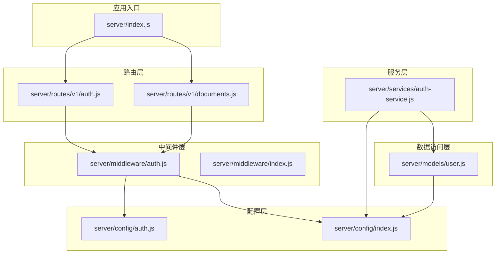
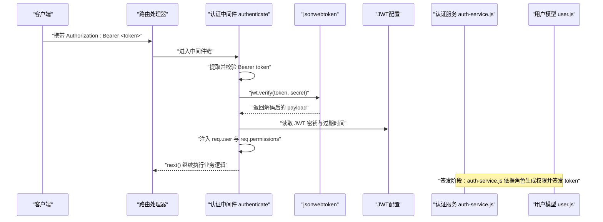
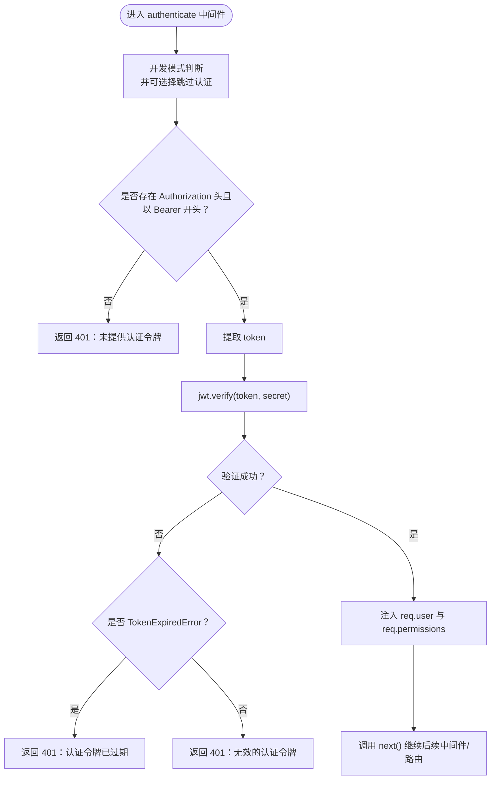
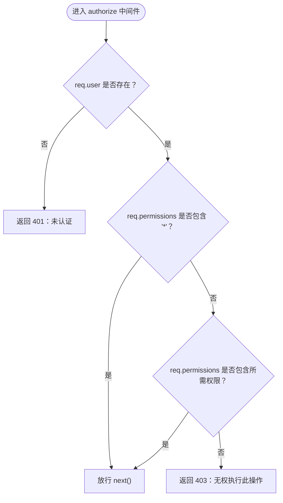
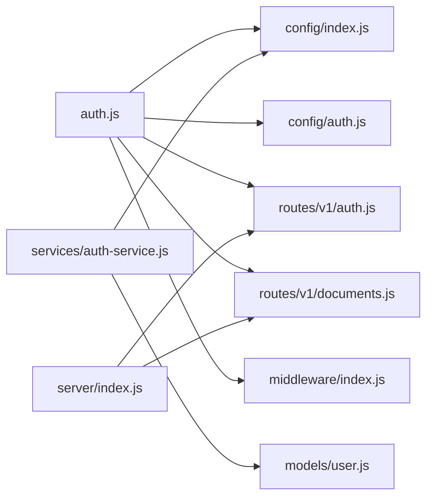

# 认证中间件

<cite>
**本文引用的文件**
- [server/middleware/auth.js](file://server/middleware/auth.js)
- [server/config/auth.js](file://server/config/auth.js)
- [server/config/index.js](file://server/config/index.js)
- [server/services/auth-service.js](file://server/services/auth-service.js)
- [server/models/user.js](file://server/models/user.js)
- [server/routes/v1/auth.js](file://server/routes/v1/auth.js)
- [server/routes/v1/documents.js](file://server/routes/v1/documents.js)
- [server/middleware/index.js](file://server/middleware/index.js)
- [server/index.js](file://server/index.js)
</cite>

## 目录
1. [简介](#简介)
2. [项目结构](#项目结构)
3. [核心组件](#核心组件)
4. [架构总览](#架构总览)
5. [组件详解](#组件详解)
6. [依赖关系分析](#依赖关系分析)
7. [性能考量](#性能考量)
8. [故障排查指南](#故障排查指南)
9. [结论](#结论)
10. [附录](#附录)

## 简介
本文件深入分析后端认证中间件与相关模块，围绕 JWT 认证机制展开，重点说明：
- 中间件如何从请求头提取 token 并调用 jwt.verify() 解码验证
- 如何将解析出的用户信息注入到 req.user，并将权限注入到 req.permissions
- token 失效、签名错误等异常处理流程
- 与 auth-service.js 的用户查询与权限生成逻辑协同工作
- 在受保护路由（如 /api/v1/documents）中的应用方式
- 与 RBAC 权限系统的集成可能性与扩展建议

## 项目结构
认证相关的核心文件分布如下：
- 中间件层：server/middleware/auth.js 提供 authenticate、authorize、optionalAuth 三个中间件
- 权限配置：server/config/auth.js 定义权限常量、角色与角色-权限映射
- JWT 配置：server/config/index.js 提供 JWT 密钥、过期时间等配置
- 认证服务：server/services/auth-service.js 负责登录、注册、令牌签发与刷新
- 用户模型：server/models/user.js 提供用户、角色、刷新令牌等数据库操作
- 路由层：server/routes/v1/auth.js 与 server/routes/v1/documents.js 展示了认证中间件的实际使用

图表来源
- [server/middleware/auth.js](file://server/middleware/auth.js#L1-L120)
- [server/config/auth.js](file://server/config/auth.js#L1-L142)
- [server/config/index.js](file://server/config/index.js#L51-L56)
- [server/services/auth-service.js](file://server/services/auth-service.js#L1-L328)
- [server/models/user.js](file://server/models/user.js#L1-L252)
- [server/routes/v1/auth.js](file://server/routes/v1/auth.js#L1-L363)
- [server/routes/v1/documents.js](file://server/routes/v1/documents.js#L1-L326)
- [server/middleware/index.js](file://server/middleware/index.js#L1-L9)
- [server/index.js](file://server/index.js#L106-L121)

章节来源
- [server/middleware/auth.js](file://server/middleware/auth.js#L1-L120)
- [server/config/auth.js](file://server/config/auth.js#L1-L142)
- [server/config/index.js](file://server/config/index.js#L51-L56)
- [server/services/auth-service.js](file://server/services/auth-service.js#L1-L328)
- [server/models/user.js](file://server/models/user.js#L1-L252)
- [server/routes/v1/auth.js](file://server/routes/v1/auth.js#L1-L363)
- [server/routes/v1/documents.js](file://server/routes/v1/documents.js#L1-L326)
- [server/middleware/index.js](file://server/middleware/index.js#L1-L9)
- [server/index.js](file://server/index.js#L106-L121)

## 核心组件
- 认证中间件 authenticate：从 Authorization 头提取 Bearer token，调用 jwt.verify() 验证并注入 req.user 与 req.permissions
- 权限中间件 authorize(permission)：基于 req.permissions 进行授权校验
- 可选认证中间件 optionalAuth：若提供 token 则验证，否则放行，便于匿名场景
- 权限配置模块：定义 PERMISSIONS、ROLES、ROLE_PERMISSIONS 与辅助函数
- 认证服务：负责登录、注册、令牌签发、刷新与登出
- 用户模型：提供用户、角色、刷新令牌等数据库操作

章节来源
- [server/middleware/auth.js](file://server/middleware/auth.js#L12-L54)
- [server/middleware/auth.js](file://server/middleware/auth.js#L56-L86)
- [server/middleware/auth.js](file://server/middleware/auth.js#L88-L113)
- [server/config/auth.js](file://server/config/auth.js#L1-L142)
- [server/services/auth-service.js](file://server/services/auth-service.js#L53-L100)
- [server/models/user.js](file://server/models/user.js#L186-L250)

## 架构总览
JWT 认证流程分为“签发”和“验证”两个阶段：
- 签发阶段：auth-service.js 在登录/注册时根据用户角色计算权限集合，调用 jwt.sign() 生成 access token，并持久化刷新令牌
- 验证阶段：auth.js 中间件从请求头读取 token，jwt.verify() 校验签名与有效期，将用户信息与权限注入 req 对象，供后续路由使用

图表来源
- [server/middleware/auth.js](file://server/middleware/auth.js#L12-L54)
- [server/config/index.js](file://server/config/index.js#L51-L56)
- [server/services/auth-service.js](file://server/services/auth-service.js#L270-L311)
- [server/models/user.js](file://server/models/user.js#L186-L250)

## 组件详解

### 认证中间件 authenticate
- 功能要点
  - 开发模式下可选择性跳过认证（便于本地调试）
  - 从 Authorization 头提取 Bearer token
  - 调用 jwt.verify() 验证签名与有效期
  - 将用户信息与权限注入 req.user 与 req.permissions
  - 捕获异常并返回相应错误码（401/403）

- 异常处理
  - TokenExpiredError：返回“认证令牌已过期”
  - 其他错误：返回“无效的认证令牌”
  - 缺少或格式不正确 Authorization 头：返回“未提供认证令牌”

- 与配置的关系
  - 使用 config.jwt.secret 作为密钥
  - 使用 config.jwt.expiresIn 控制过期时间（签发阶段）

章节来源
- [server/middleware/auth.js](file://server/middleware/auth.js#L12-L54)
- [server/config/index.js](file://server/config/index.js#L51-L56)

### 权限中间件 authorize(permission)
- 功能要点
  - 若 req.user 不存在，直接返回 401
  - 若 req.permissions 包含通配符“*”，直接放行
  - 否则检查是否包含具体权限，否则返回 403

- 与权限配置的协作
  - 权限常量与角色-权限映射由 server/config/auth.js 提供
  - auth-service.js 在签发 token 时将权限数组写入 payload

章节来源
- [server/middleware/auth.js](file://server/middleware/auth.js#L56-L86)
- [server/config/auth.js](file://server/config/auth.js#L1-L142)
- [server/services/auth-service.js](file://server/services/auth-service.js#L261-L268)

### 可选认证中间件 optionalAuth
- 功能要点
  - 若未提供 token，将 req.user 置空、req.permissions 置空并继续
  - 若提供 token，则尝试验证并注入用户信息与权限；失败时同样清空并继续

- 适用场景
  - 需要“可选登录”的页面或接口（例如首页预览）

章节来源
- [server/middleware/auth.js](file://server/middleware/auth.js#L88-L113)

### 权限配置模块 config/auth.js
- 权限常量 PERMISSIONS：涵盖资产、空间、模型、设施、用户、系统、文档、InfluxDB 等权限
- 角色常量 ROLES：admin、manager、editor、viewer、guest
- 角色-权限映射 ROLE_PERMISSIONS：定义各角色拥有的权限集合
- 工具函数：getRolePermissions(role)、hasPermission(role, permission)

章节来源
- [server/config/auth.js](file://server/config/auth.js#L1-L142)

### 认证服务 auth-service.js
- 登录流程
  - 校验用户是否存在且账户有效
  - 验证密码
  - 获取用户角色并计算权限集合
  - 生成 access token（包含 sub、email、name、roles、permissions）
  - 生成 refresh token 并持久化
- 注册流程
  - 校验邮箱唯一性与密码强度
  - 创建用户并分配默认角色
  - 生成 access token 与 refresh token
- 刷新与登出
  - refreshAccessToken：校验刷新令牌有效性，重新签发 access token
  - logout：删除刷新令牌或清理用户所有刷新令牌

章节来源
- [server/services/auth-service.js](file://server/services/auth-service.js#L53-L100)
- [server/services/auth-service.js](file://server/services/auth-service.js#L166-L193)
- [server/services/auth-service.js](file://server/services/auth-service.js#L198-L206)
- [server/services/auth-service.js](file://server/services/auth-service.js#L270-L311)

### 用户模型 user.js
- 用户与角色：提供用户创建、查询、角色增删、身份关联等操作
- 刷新令牌：保存、查询、删除、清理过期刷新令牌
- 登录时间更新：每次登录后更新最后登录时间

章节来源
- [server/models/user.js](file://server/models/user.js#L1-L252)

### 路由层中的认证应用
- /api/v1/auth 路由
  - 登录成功后设置 HttpOnly Cookie 存储 refresh token
  - 提供刷新、登出、获取当前用户信息等接口
- /api/v1/documents 路由
  - 多个端点均挂载 authenticate 中间件，确保访问受保护资源时进行认证
  - 业务逻辑中可结合 authorize(permission) 进一步细化权限控制

章节来源
- [server/routes/v1/auth.js](file://server/routes/v1/auth.js#L82-L119)
- [server/routes/v1/auth.js](file://server/routes/v1/auth.js#L121-L150)
- [server/routes/v1/auth.js](file://server/routes/v1/auth.js#L152-L175)
- [server/routes/v1/auth.js](file://server/routes/v1/auth.js#L177-L210)
- [server/routes/v1/documents.js](file://server/routes/v1/documents.js#L54-L60)
- [server/routes/v1/documents.js](file://server/routes/v1/documents.js#L107-L111)
- [server/routes/v1/documents.js](file://server/routes/v1/documents.js#L142-L151)
- [server/routes/v1/documents.js](file://server/routes/v1/documents.js#L196-L203)
- [server/routes/v1/documents.js](file://server/routes/v1/documents.js#L236-L240)

### 认证流程图（代码级）

图表来源
- [server/middleware/auth.js](file://server/middleware/auth.js#L12-L54)

### 授权流程图（代码级）

图表来源
- [server/middleware/auth.js](file://server/middleware/auth.js#L56-L86)

## 依赖关系分析
- 中间件依赖
  - jwt.verify() 依赖 config.jwt.secret 与 config.jwt.expiresIn
  - authorize(permission) 依赖 config.auth.js 中的权限常量与映射
- 服务与模型
  - auth-service.js 依赖 user.js 获取用户角色与刷新令牌存储
- 路由集成
  - 路由通过中间件入口统一导出 authenticate、authorize、optionalAuth
  - 应用入口 server/index.js 将 v1 路由挂载到 /api/v1

图表来源
- [server/middleware/auth.js](file://server/middleware/auth.js#L1-L120)
- [server/config/index.js](file://server/config/index.js#L51-L56)
- [server/config/auth.js](file://server/config/auth.js#L1-L142)
- [server/services/auth-service.js](file://server/services/auth-service.js#L1-L328)
- [server/models/user.js](file://server/models/user.js#L1-L252)
- [server/routes/v1/auth.js](file://server/routes/v1/auth.js#L1-L363)
- [server/routes/v1/documents.js](file://server/routes/v1/documents.js#L1-L326)
- [server/middleware/index.js](file://server/middleware/index.js#L1-L9)
- [server/index.js](file://server/index.js#L106-L121)

章节来源
- [server/middleware/index.js](file://server/middleware/index.js#L1-L9)
- [server/index.js](file://server/index.js#L106-L121)

## 性能考量
- JWT 验证成本低：仅需解码与签名校验，开销主要取决于 jwt.verify() 的实现
- 权限检查为内存操作：authorize(permission) 仅做数组包含判断，复杂度 O(n)
- 建议
  - 将权限数组尽量精简，避免不必要的权限项
  - 对高频接口可考虑缓存用户权限（如基于用户 ID 的 LRU 缓存），减少重复计算
  - 合理设置 JWT 过期时间，平衡安全与用户体验

## 故障排查指南
- 401 未提供认证令牌
  - 检查请求头是否包含 Authorization: Bearer <token>
  - 确认中间件是否正确挂载到目标路由
  - 参考路径：[server/middleware/auth.js](file://server/middleware/auth.js#L24-L30)
- 401 认证令牌已过期
  - 使用 refresh token 重新获取 access token
  - 参考路径：[server/routes/v1/auth.js](file://server/routes/v1/auth.js#L121-L150)，[server/services/auth-service.js](file://server/services/auth-service.js#L166-L193)
- 401 无效的认证令牌
  - 检查 JWT 密钥是否一致
  - 确认 token 未被篡改或格式错误
  - 参考路径：[server/middleware/auth.js](file://server/middleware/auth.js#L43-L53)，[server/config/index.js](file://server/config/index.js#L51-L56)
- 403 无权执行此操作
  - 检查用户角色与权限映射是否正确
  - 确认业务逻辑中传入的权限字符串与 config/auth.js 中定义一致
  - 参考路径：[server/middleware/auth.js](file://server/middleware/auth.js#L71-L82)，[server/config/auth.js](file://server/config/auth.js#L1-L142)
- 401 未认证
  - authorize(permission) 依赖 req.user 存在
  - 确保 authenticate 中间件在 authorize 前执行
  - 参考路径：[server/middleware/auth.js](file://server/middleware/auth.js#L63-L69)
- 可选认证场景
  - optionalAuth 会在 token 无效时清空用户信息并继续
  - 参考路径：[server/middleware/auth.js](file://server/middleware/auth.js#L103-L113)

章节来源
- [server/middleware/auth.js](file://server/middleware/auth.js#L24-L53)
- [server/middleware/auth.js](file://server/middleware/auth.js#L56-L86)
- [server/middleware/auth.js](file://server/middleware/auth.js#L88-L113)
- [server/config/index.js](file://server/config/index.js#L51-L56)
- [server/routes/v1/auth.js](file://server/routes/v1/auth.js#L121-L150)
- [server/services/auth-service.js](file://server/services/auth-service.js#L166-L193)
- [server/config/auth.js](file://server/config/auth.js#L1-L142)

## 结论
本认证体系以 JWT 为核心，配合中间件与权限配置实现了清晰的认证与授权流程。authenticate 中间件负责 token 验证并将用户信息注入 req 对象，authorize 中间件基于权限集合进行细粒度授权。auth-service.js 与 user.js 提供了完整的用户生命周期与令牌管理能力。在受保护路由（如 /api/v1/documents）中，只需挂载 authenticate 即可实现基础认证，再结合 authorize(permission) 实现 RBAC 控制。未来可在以下方面进一步完善：
- 将权限从 payload 下沉到数据库，支持动态权限变更
- 引入权限缓存与批量权限预加载
- 在路由层增加更细粒度的权限注解与自动校验工具

## 附录
- 在受保护路由中的应用方式
  - 在路由定义处挂载 authenticate 中间件，即可保证访问受保护资源时进行认证
  - 参考路径：[server/routes/v1/documents.js](file://server/routes/v1/documents.js#L54-L60)，[server/routes/v1/documents.js](file://server/routes/v1/documents.js#L107-L111)，[server/routes/v1/documents.js](file://server/routes/v1/documents.js#L142-L151)，[server/routes/v1/documents.js](file://server/routes/v1/documents.js#L196-L203)，[server/routes/v1/documents.js](file://server/routes/v1/documents.js#L236-L240)
- 与 RBAC 权限系统的集成建议
  - 当前权限来源于角色映射，未来可将权限持久化到数据库，支持用户自定义权限与权限继承
  - 在中间件层引入权限缓存，减少频繁查询
  - 在路由层增加装饰器或注解，自动注入权限校验逻辑