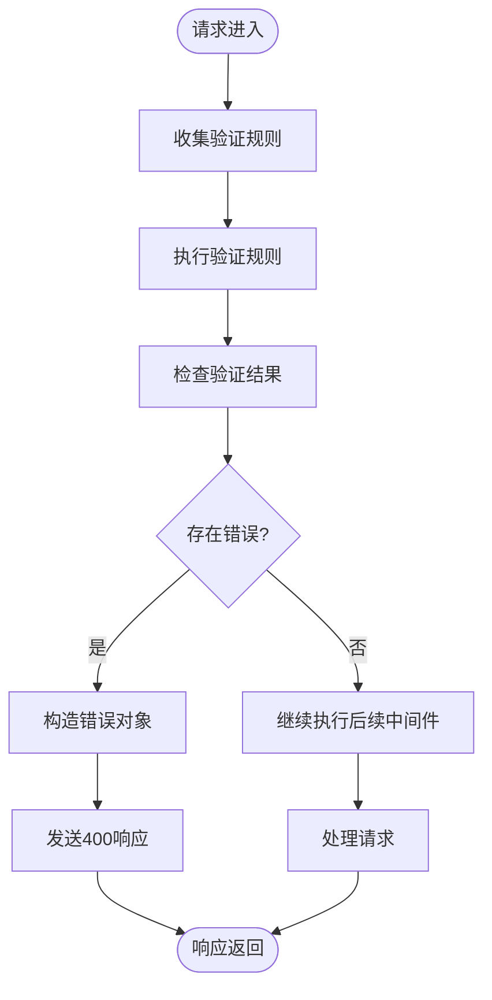
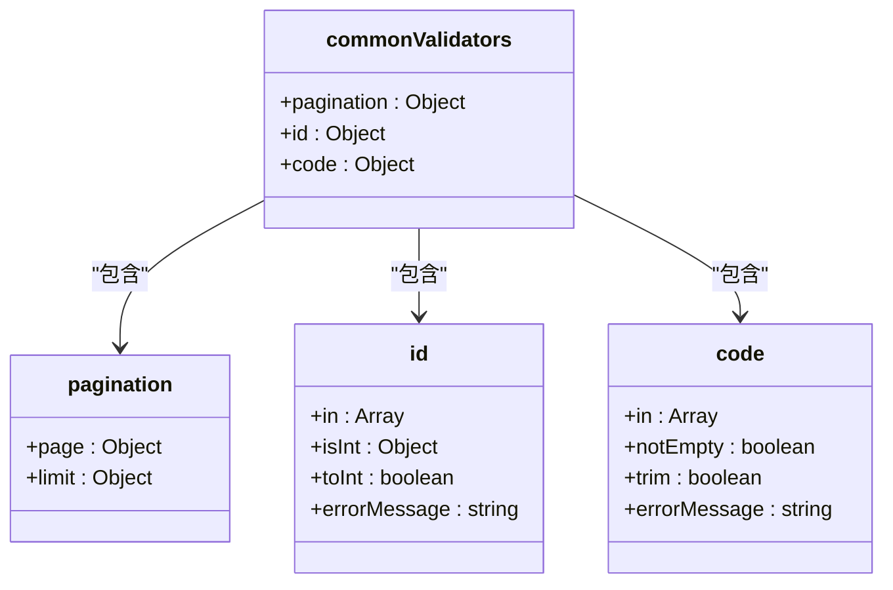
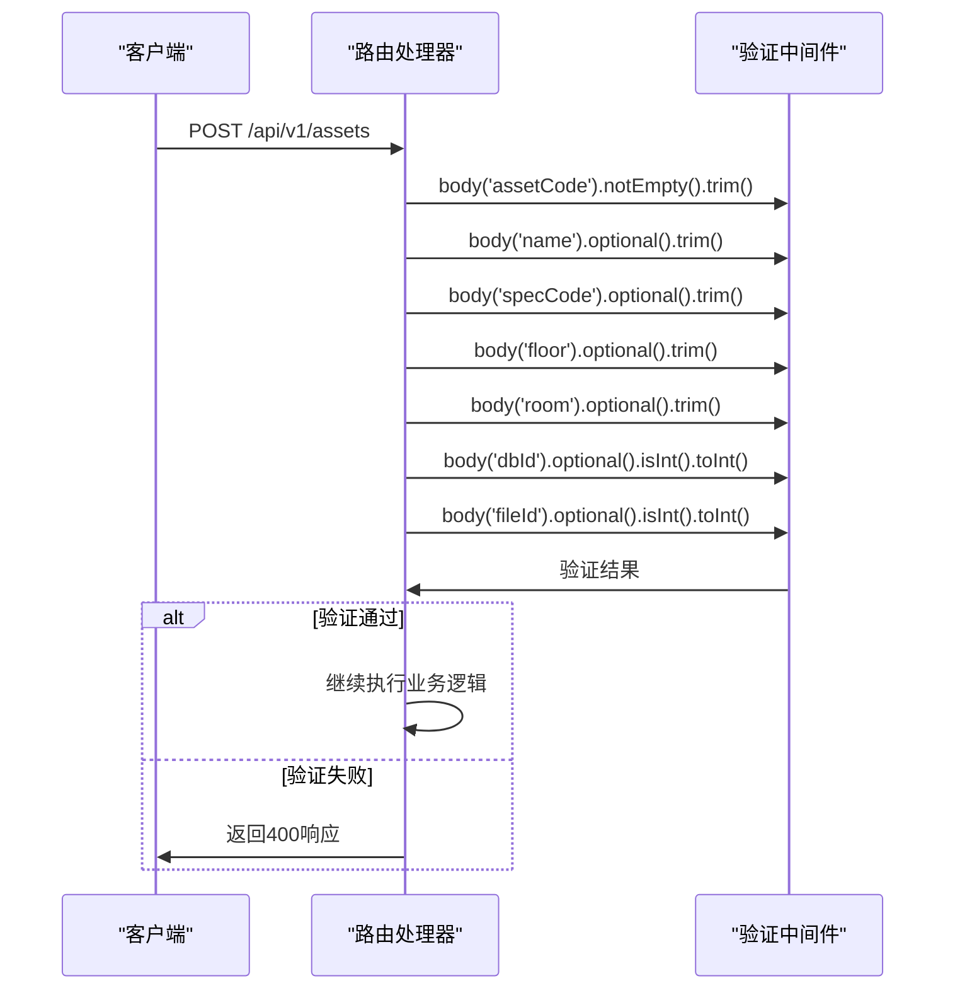
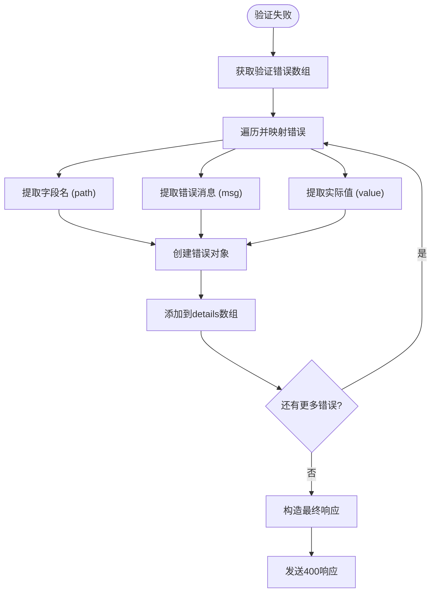
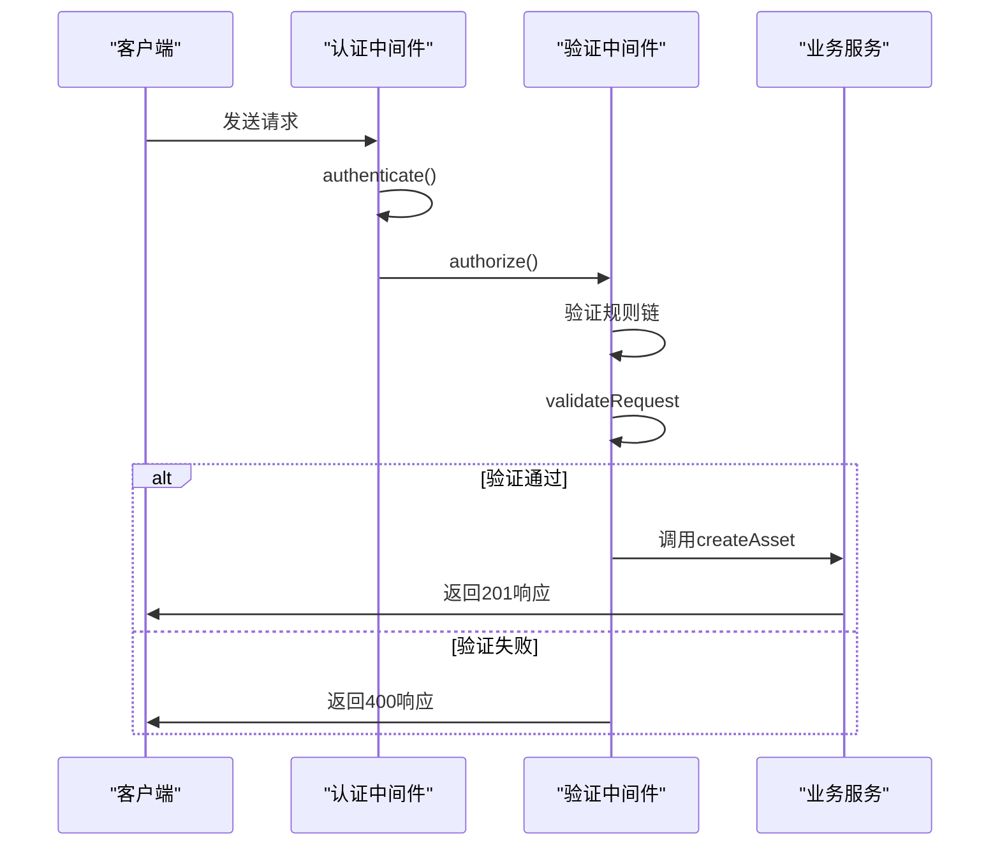
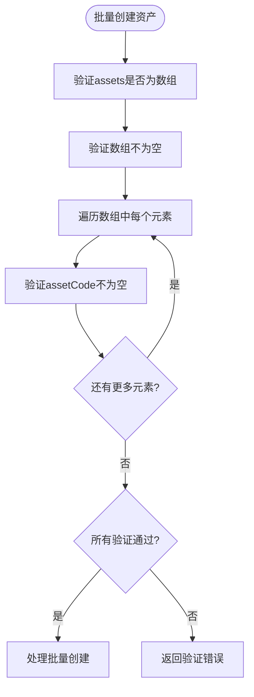

# 请求验证中间件

<cite>
**本文档引用的文件**
- [validate.js](file://server/middleware/validate.js)
- [assets.js](file://server/routes/v1/assets.js)
- [documents.js](file://server/routes/v1/documents.js)
- [spaces.js](file://server/routes/v1/spaces.js)
- [models.js](file://server/routes/v1/models.js)
- [timeseries.js](file://server/routes/v1/timeseries.js)
- [error-handler.js](file://server/middleware/error-handler.js)
- [index.js](file://server/middleware/index.js)
</cite>

## 目录
1. [简介](#简介)
2. [核心实现机制](#核心实现机制)
3. [验证规则定义与注册](#验证规则定义与注册)
4. [错误处理与响应格式](#错误处理与响应格式)
5. [实际使用示例](#实际使用示例)
6. [常见验证场景配置](#常见验证场景配置)
7. [性能优化建议](#性能优化建议)
8. [结论](#结论)

## 简介
请求验证中间件是 TwinSight 后端系统中用于确保 API 请求数据完整性和有效性的关键组件。该中间件基于 `express-validator` 库实现，为系统提供了统一的请求参数验证机制。通过在路由处理前对 `req.body`、`req.params` 和 `req.query` 进行模式匹配与类型检查，该中间件能够有效防止无效或恶意数据进入业务逻辑层，从而提高系统的稳定性和安全性。

验证中间件的设计遵循了模块化和可复用的原则，既提供了针对特定场景的自定义验证规则，也包含了可跨多个路由复用的通用验证规则。当验证失败时，中间件会构造标准化的错误对象并返回统一的 400 响应，确保客户端能够获得清晰的错误信息以进行调试和修正。

**Section sources**
- [validate.js](file://server/middleware/validate.js#L1-L72)

## 核心实现机制

### 中间件工作流程
请求验证中间件的核心实现位于 `validate.js` 文件中，其主要功能是通过 `express-validator` 提供的验证结果检查机制来拦截和处理无效请求。中间件的执行流程如下：首先，`express-validator` 在路由定义阶段收集并执行所有预定义的验证规则，将验证结果存储在 `req` 对象中；然后，`validateRequest` 中间件通过调用 `validationResult(req)` 方法获取这些验证结果；最后，根据结果是否为空来决定是继续执行后续中间件还是立即返回错误响应。



**Diagram sources**
- [validate.js](file://server/middleware/validate.js#L11-L27)

### 验证工具选择
系统选择了 `express-validator` 作为主要的验证工具，这在 `package.json` 文件的依赖列表中得到了证实。`express-validator` 是一个基于 `validator.js` 的 Express.js 验证中间件，它提供了丰富的验证方法和灵活的组合方式。与 Joi 等其他验证库相比，`express-validator` 更加轻量级，且与 Express 框架的集成更为紧密，无需额外的模式定义语法，可以直接在路由中链式调用验证方法。

验证规则的定义采用了函数式编程风格，通过 `body()`、`param()` 和 `query()` 等函数来指定需要验证的请求部分。这些函数返回的验证链对象可以链式调用各种验证方法，如 `notEmpty()`、`isInt()`、`trim()` 等，使得验证逻辑既清晰又易于维护。

**Section sources**
- [validate.js](file://server/middleware/validate.js#L5-L27)
- [package.json](file://server/package.json#L23)

## 验证规则定义与注册

### 通用验证规则
`validate.js` 文件中定义了一个 `commonValidators` 对象，包含了多个可复用的通用验证规则。这些规则被设计为跨多个路由使用的标准验证模式，有助于保持验证逻辑的一致性并减少代码重复。



**Diagram sources**
- [validate.js](file://server/middleware/validate.js#L30-L66)

`commonValidators` 对象包含三个主要的验证规则：
- **分页参数** (`pagination`)：用于验证分页请求中的 `page` 和 `limit` 参数，确保页码为大于 0 的整数，每页数量在 1-100 之间。
- **ID 参数** (`id`)：用于验证路径参数中的 ID 值，确保其为正整数。
- **编码参数** (`code`)：用于验证各种编码（如资产编码、空间编码等），确保其不为空并已去除首尾空格。

这些通用规则通过模块导出，可以在任何需要的地方导入并直接使用，极大地提高了开发效率和代码的可维护性。

### 路由级验证规则
除了通用规则外，系统还支持在每个路由中定义特定的验证规则。这种灵活性使得开发者可以根据具体业务需求定制验证逻辑。以 `assets.js` 路由为例，创建资产的 POST 请求定义了详细的验证规则：



**Diagram sources**
- [assets.js](file://server/routes/v1/assets.js#L94-L101)

在 `assets.js` 中，`router.post('/')` 路由定义了对 `req.body` 中多个字段的验证规则。例如，`assetCode` 字段被要求不能为空且已去除首尾空格，而 `dbId` 和 `fileId` 字段则被要求为整数类型。这些规则通过 `body()` 函数链式调用的方式定义，清晰地表达了每个字段的验证要求。

**Section sources**
- [validate.js](file://server/middleware/validate.js#L30-L66)
- [assets.js](file://server/routes/v1/assets.js#L94-L101)

## 错误处理与响应格式

### 错误对象构造逻辑
当验证失败时，`validateRequest` 中间件会构造一个结构化的错误对象，该对象包含了详细的错误信息，帮助客户端开发者快速定位问题。错误对象的构造逻辑如下：首先，通过 `validationResult(req)` 获取所有验证错误；然后，遍历这些错误，将每个错误的字段名、错误消息和实际值提取出来，构造成一个包含 `field`、`message` 和 `value` 属性的对象数组；最后，将这些信息整合到一个统一的响应对象中。



**Diagram sources**
- [validate.js](file://server/middleware/validate.js#L18-L23)

### 统一400响应格式
系统采用统一的 400 响应格式来返回验证错误，确保了 API 的一致性和可预测性。响应体包含三个主要字段：`success`（布尔值，表示请求是否成功）、`error`（字符串，表示错误的总体描述）和 `details`（数组，包含每个具体错误的详细信息）。这种结构化的响应格式不仅便于客户端解析，也为前端错误提示提供了足够的信息。

```json
{
  "success": false,
  "error": "请求参数验证失败",
  "details": [
    {
      "field": "assetCode",
      "message": "资产编码不能为空",
      "value": ""
    },
    {
      "field": "page",
      "message": "页码必须是大于 0 的整数",
      "value": -1
    }
  ]
}
```

这种响应格式与系统的全局错误处理机制相协调，`error-handler.js` 中的 `errorHandler` 中间件能够识别并正确处理这类验证错误，确保在开发和生产环境中都能提供适当的错误信息。

**Section sources**
- [validate.js](file://server/middleware/validate.js#L15-L23)
- [error-handler.js](file://server/middleware/error-handler.js#L55-L66)

## 实际使用示例

### POST /api/v1/assets 路由验证
`POST /api/v1/assets` 路由是验证中间件的一个典型使用示例。该路由用于创建新的资产记录，需要对请求体中的多个字段进行严格验证。在路由定义中，验证规则被作为中间件链的一部分插入到认证和授权中间件之后、业务逻辑处理函数之前。



**Diagram sources**
- [assets.js](file://server/routes/v1/assets.js#L91-L110)

在代码实现上，该路由通过一系列 `body()` 函数调用定义了对 `req.body` 中各个字段的验证规则。例如，`body('assetCode').notEmpty().trim().withMessage('资产编码不能为空')` 这一行代码就完成了对资产编码字段的验证：首先检查其是否为空，然后去除首尾空格，最后指定自定义的错误消息。这种链式调用的方式使得验证逻辑既紧凑又易读。

**Section sources**
- [assets.js](file://server/routes/v1/assets.js#L91-L110)

### 批量操作验证
系统还展示了如何在批量操作中使用验证中间件。以 `POST /api/v1/assets/batch` 路由为例，该路由需要验证一个包含多个资产对象的数组。验证规则首先检查 `assets` 字段是否为数组，然后使用 `body('assets.*.assetCode')` 语法对数组中每个对象的 `assetCode` 字段进行验证。



**Diagram sources**
- [assets.js](file://server/routes/v1/assets.js#L176-L178)

这种嵌套验证模式展示了 `express-validator` 的强大功能，能够处理复杂的嵌套数据结构。通过使用通配符 `*`，开发者可以轻松地对数组中的每个元素应用相同的验证规则，而无需手动遍历数组。

**Section sources**
- [assets.js](file://server/routes/v1/assets.js#L176-L178)

## 常见验证场景配置

### 必填字段验证
必填字段的验证是最常见的场景之一。系统通过 `notEmpty()` 方法来实现这一功能，该方法检查字段值是否为空字符串、null 或 undefined。在 `assets.js` 路由中，`assetCode` 字段被定义为必填字段：

```javascript
body('assetCode').notEmpty().trim().withMessage('资产编码不能为空')
```

这个配置确保了 `assetCode` 字段不仅不能为空，而且在验证前会自动去除首尾空格。`withMessage()` 方法允许开发者提供自定义的错误消息，使得错误提示更加友好和具体。

### 字符串长度验证
虽然在当前代码中没有直接展示字符串长度验证，但 `express-validator` 提供了 `isLength()` 方法来实现这一功能。开发者可以通过以下方式配置字符串长度限制：

```javascript
body('name').isLength({ min: 2, max: 50 }).withMessage('名称长度必须在2-50个字符之间')
```

这种配置可以有效防止过长或过短的字符串进入数据库，保护系统免受潜在的注入攻击或存储问题。

### 数值范围验证
数值范围验证在分页参数和ID字段中得到了充分体现。系统使用 `isInt()` 方法的 `options` 参数来定义数值范围。例如，在分页参数中：

```javascript
isInt: { options: { min: 1, max: 100 } }
```

这个配置确保了 `limit` 参数的值必须在 1 到 100 之间，防止客户端请求过大的数据集，从而保护服务器性能。对于ID字段，系统使用 `min: 1` 来确保ID为正整数，避免了无效的负数或零值。

**Section sources**
- [validate.js](file://server/middleware/validate.js#L38-L48)
- [assets.js](file://server/routes/v1/assets.js#L99-L100)

## 性能优化建议

### 验证规则缓存
虽然 `express-validator` 本身已经相当高效，但在高并发场景下，频繁的正则表达式匹配和类型检查仍可能成为性能瓶颈。一个潜在的优化方向是实现验证规则的缓存机制。通过将常用的验证规则编译后的函数缓存起来，可以避免重复的解析和编译过程，从而提高验证速度。

### 异步验证批处理
对于需要查询数据库的复杂验证（如检查唯一性约束），建议采用批处理的方式。而不是在验证中间件中对每个字段进行单独的数据库查询，可以将所有需要验证的字段收集起来，然后通过一次批量查询完成所有检查。这可以显著减少数据库连接和查询的开销。

### 验证规则模块化
当前系统已经实现了通用验证规则的模块化，这是一个很好的实践。建议进一步将验证规则按业务领域进行分组，例如创建 `asset-validators.js`、`space-validators.js` 等专门的验证规则模块。这不仅可以提高代码的组织性，还可以通过按需加载的方式减少内存占用。

### 错误信息本地化
虽然当前的错误信息已经是中文，但建议将错误消息外部化到资源文件中。这样不仅可以方便地支持多语言，还可以在不修改代码的情况下调整错误提示的措辞，提高系统的可维护性。

## 结论
TwinSight 系统的请求验证中间件通过 `express-validator` 实现了一套高效、灵活且易于维护的请求数据校验机制。该中间件不仅提供了对 `req.body`、`req.params` 和 `req.query` 的全面验证能力，还通过通用验证规则和模块化设计提高了代码的复用性和一致性。当验证失败时，系统能够构造结构化的错误对象并返回统一的 400 响应，为客户端提供了清晰的错误信息。通过在实际 API 路由中的应用示例，我们看到了该中间件如何有效地保护业务逻辑层免受无效数据的影响。未来，通过进一步的性能优化和模块化改进，该验证机制有望为系统提供更加强大和高效的数据校验支持。