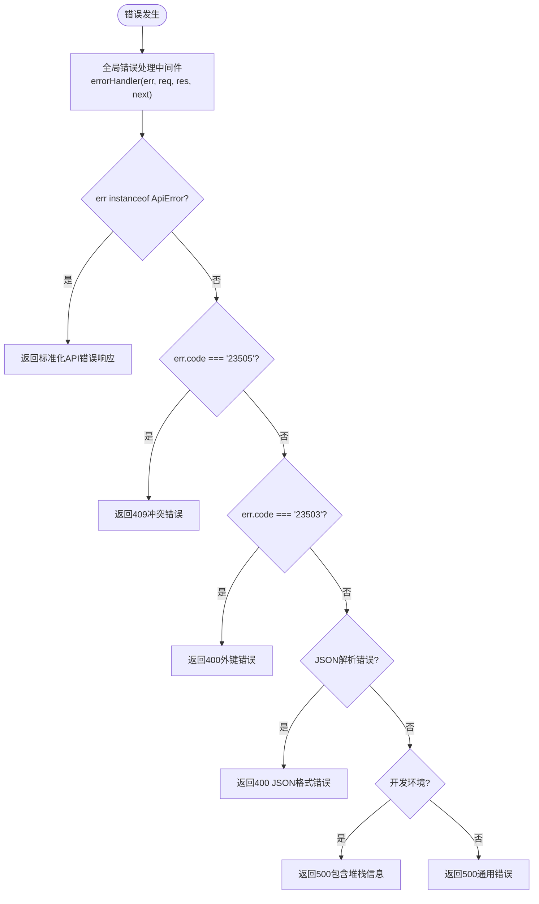
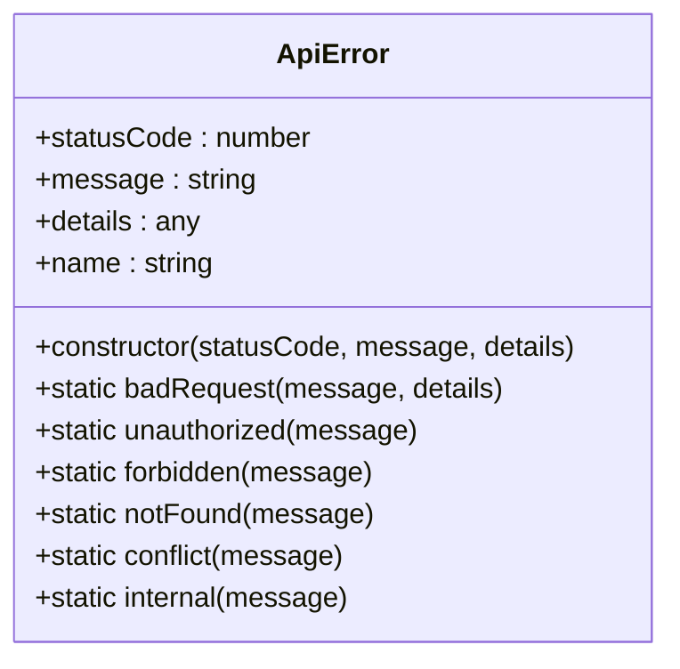
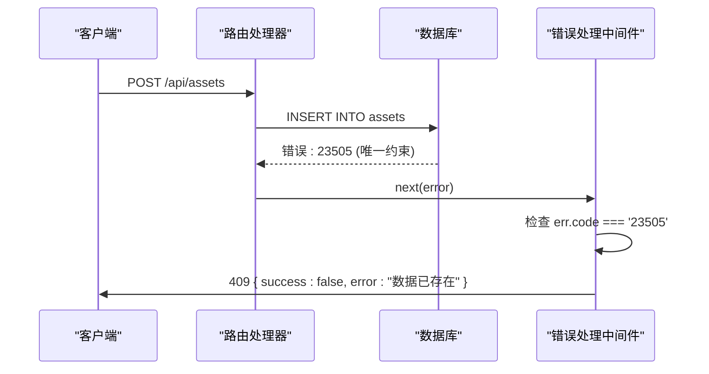
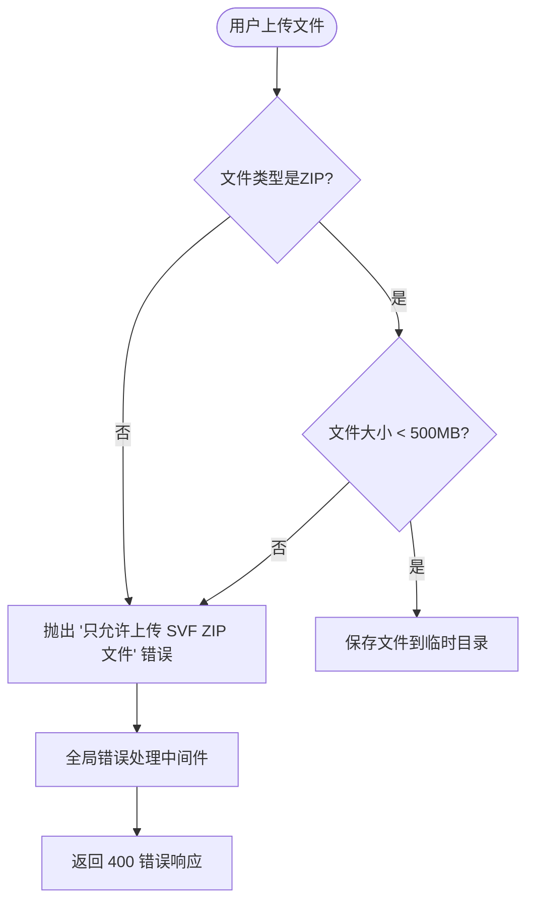
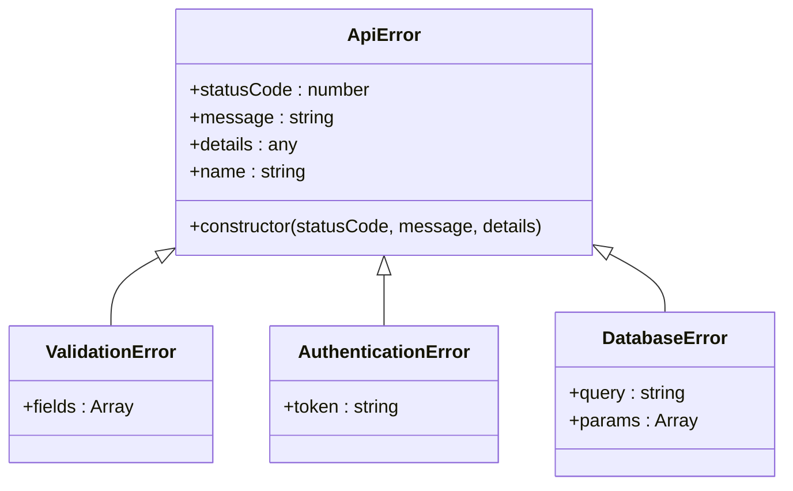

# 错误处理中间件

<cite>
**本文档引用的文件**   
- [error-handler.js](file://server/middleware/error-handler.js)
- [index.js](file://server/index.js)
- [api.js](file://server/routes/api.js)
- [assets.js](file://server/routes/v1/assets.js)
- [validate.js](file://server/middleware/validate.js)
- [auth.js](file://server/middleware/auth.js)
- [asset.js](file://server/models/asset.js)
- [model-file.js](file://server/models/model-file.js)
- [files.js](file://server/routes/files.js)
- [config/index.js](file://server/config/index.js)
</cite>

## 目录
1. [简介](#简介)
2. [核心组件](#核心组件)
3. [错误处理流程](#错误处理流程)
4. [错误类型分类处理](#错误类型分类处理)
5. [实际错误场景分析](#实际错误场景分析)
6. [自定义错误类扩展](#自定义错误类扩展)
7. [日志集成建议](#日志集成建议)
8. [结论](#结论)

## 简介
本文档系统化描述了 `error-handler.js` 文件中的全局异常捕获机制。该中间件作为 Express 错误处理链的末端，负责统一处理应用程序中的所有错误，并以标准化的格式返回响应。文档详细解释了中间件如何接收 `err`、`req`、`res`、`next` 参数，并对不同类型的错误进行差异化处理。

## 核心组件

`error-handler.js` 文件定义了全局错误处理的核心组件，包括自定义的 `ApiError` 类和两个主要的中间件函数：`notFoundHandler` 和 `errorHandler`。这些组件共同构成了应用程序的统一错误处理机制。

**Section sources**
- [error-handler.js](file://server/middleware/error-handler.js#L1-L115)

## 错误处理流程

**Diagram sources **
- [error-handler.js](file://server/middleware/error-handler.js#L55-L108)

**Section sources**
- [error-handler.js](file://server/middleware/error-handler.js#L55-L108)
- [index.js](file://server/index.js#L27-L28)

## 错误类型分类处理

### 已知 API 错误
当错误是 `ApiError` 实例时，中间件会直接使用其 `statusCode` 和 `message` 属性来构建响应体。

**Diagram sources **
- [error-handler.js](file://server/middleware/error-handler.js#L9-L40)

### 数据库约束错误
中间件能够识别 PostgreSQL 的特定错误代码，如唯一约束冲突（23505）和外键约束失败（23503），并返回相应的用户友好错误信息。

**Diagram sources **
- [error-handler.js](file://server/middleware/error-handler.js#L68-L75)
- [asset.js](file://server/models/asset.js#L32-L61)

### JSON 解析错误
当请求体的 JSON 格式不正确时，Express 会抛出 `SyntaxError`，中间件会捕获并返回标准化的错误响应。

**Section sources**
- [error-handler.js](file://server/middleware/error-handler.js#L86-L92)

### 环境相关错误
在开发环境中，中间件会返回详细的错误信息和堆栈跟踪，而在生产环境中则会隐藏敏感信息，只返回通用的“服务器内部错误”消息。

**Section sources**
- [error-handler.js](file://server/middleware/error-handler.js#L94-L107)
- [config/index.js](file://server/config/index.js#L20)

## 实际错误场景分析

### 数据库约束冲突
当尝试插入具有重复主键或唯一字段的记录时，PostgreSQL 会抛出 `23505` 错误代码。例如，在 `assets.js` 路由中创建资产时，如果资产编码已存在，数据库会拒绝插入。

**Section sources**
- [error-handler.js](file://server/middleware/error-handler.js#L68-L75)
- [asset.js](file://server/routes/v1/assets.js#L110-L111)

### 文件上传失败
在 `files.js` 路由中，文件上传可能因多种原因失败，如文件类型不被允许或文件大小超出限制。这些错误会被捕获并传递给全局错误处理中间件。

**Diagram sources **
- [files.js](file://server/routes/files.js#L138-L152)
- [error-handler.js](file://server/middleware/error-handler.js#L55-L108)

## 自定义错误类扩展

`ApiError` 类提供了静态工厂方法，可以方便地创建不同类型的错误实例。开发者可以通过继承 `ApiError` 类或创建新的静态方法来扩展错误类型。

**Diagram sources **
- [error-handler.js](file://server/middleware/error-handler.js#L9-L40)

**Section sources**
- [error-handler.js](file://server/middleware/error-handler.js#L9-L40)
- [assets.js](file://server/routes/v1/assets.js#L8)

## 日志集成建议

当前的错误处理中间件已经集成了基本的日志功能，使用 `console.error` 打印错误信息。为了更完善的日志管理，建议集成专业的日志库如 `winston` 或 `pino`，并配置日志级别、格式化和输出目标。

**Section sources**
- [error-handler.js](file://server/middleware/error-handler.js#L57)

## 结论
`error-handler.js` 提供了一个健壮且可扩展的全局错误处理机制。它通过统一的响应格式、对特定错误类型的差异化处理以及环境感知的错误信息展示，极大地提升了应用程序的稳定性和用户体验。通过自定义错误类和适当的日志集成，可以进一步增强系统的可观测性和维护性。