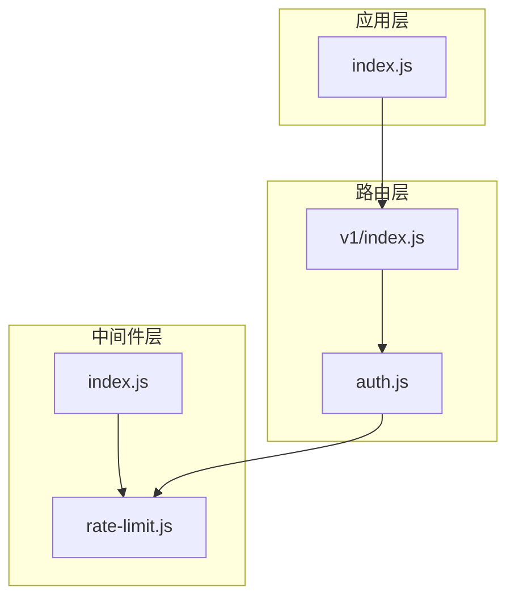
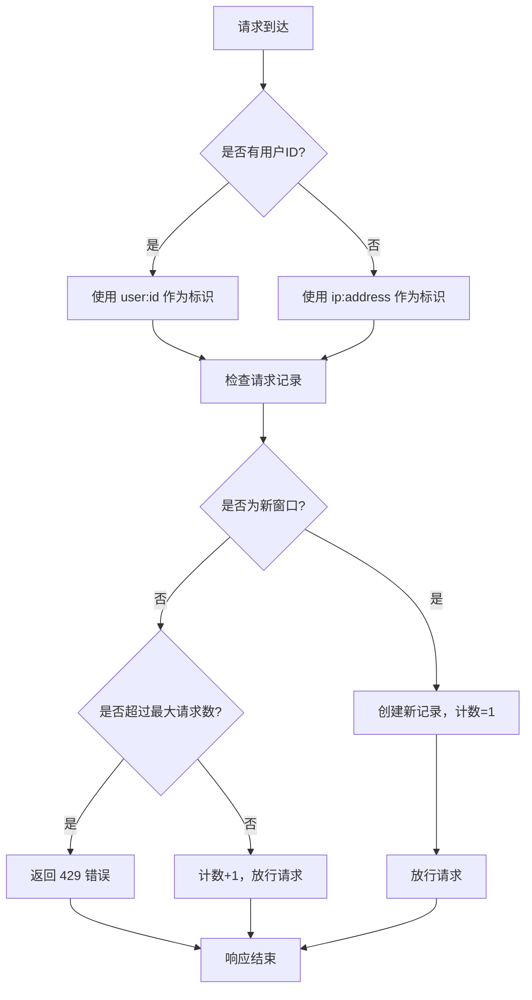
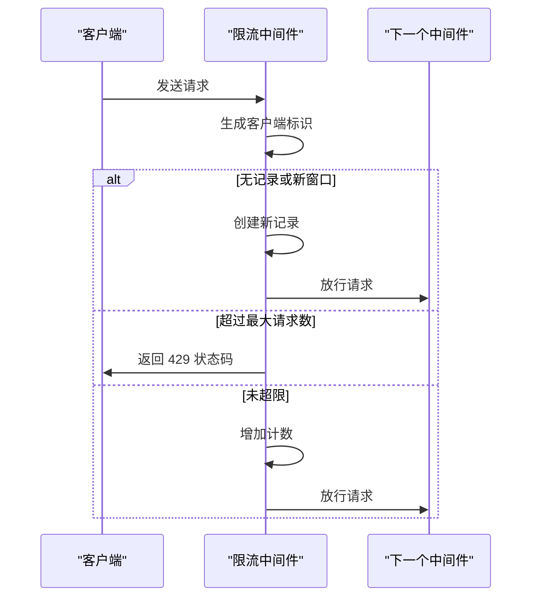
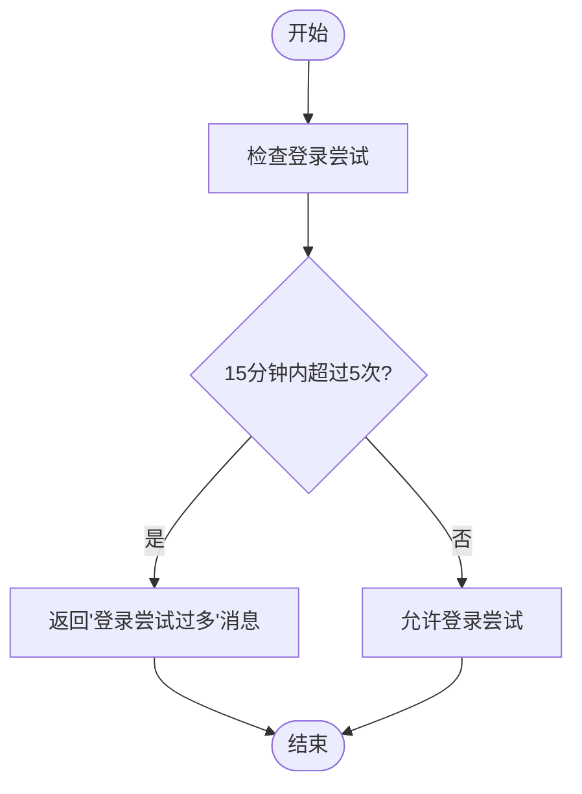
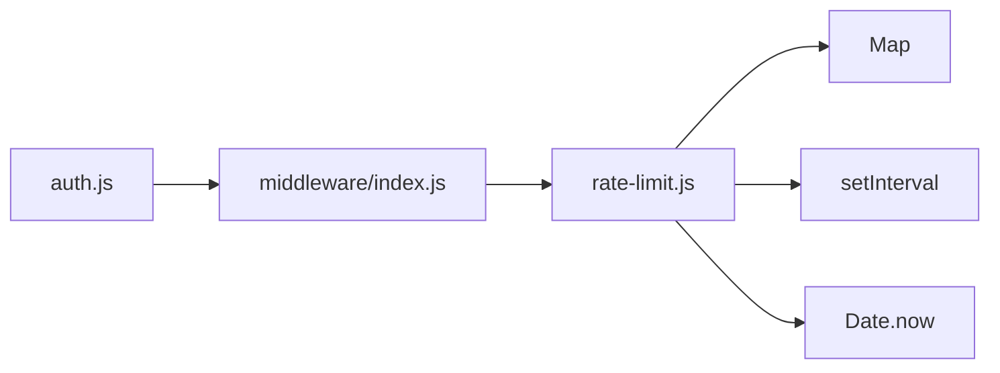

# 限流中间件

<cite>
**本文档引用的文件**
- [rate-limit.js](file://server/middleware/rate-limit.js)
- [index.js](file://server/middleware/index.js)
- [auth.js](file://server/routes/v1/auth.js)
- [index.js](file://server/routes/v1/index.js)
- [index.js](file://server/index.js)
</cite>

## 目录
1. [简介](#简介)
2. [项目结构](#项目结构)
3. [核心组件](#核心组件)
4. [架构概述](#架构概述)
5. [详细组件分析](#详细组件分析)
6. [依赖分析](#依赖分析)
7. [性能考量](#性能考量)
8. [故障排除指南](#故障排除指南)
9. [结论](#结论)

## 简介
本文档全面解析 `rate-limit.js` 限流中间件的实现机制。该中间件用于防止 API 被滥用，通过内存存储记录客户端请求频次，采用固定窗口算法控制访问速率。文档将详细说明其配置项、与 Express 框架的集成方式、在高并发场景下的表现，以及在生产环境中的使用建议。

## 项目结构
限流中间件位于 `server/middleware/` 目录下，作为独立模块被路由和其他中间件引用。该中间件通过 `middleware/index.js` 统一导出，并在需要的路由中进行应用。

**图示来源**
- [rate-limit.js](file://server/middleware/rate-limit.js)
- [index.js](file://server/middleware/index.js)
- [auth.js](file://server/routes/v1/auth.js)
- [index.js](file://server/routes/v1/index.js)

**章节来源**
- [rate-limit.js](file://server/middleware/rate-limit.js)
- [index.js](file://server/middleware/index.js)

## 核心组件
`rate-limit.js` 文件实现了基于内存的简单限流功能，包含三个主要导出函数：`rateLimit`（通用限流）、`strictRateLimit`（严格限流）和 `loginRateLimit`（登录限流）。这些函数通过闭包共享内存存储和清理机制。

**章节来源**
- [rate-limit.js](file://server/middleware/rate-limit.js#L6-L93)

## 架构概述
限流中间件采用固定窗口算法，使用 `Map` 对象在内存中存储客户端请求计数。系统定期清理过期记录，确保内存使用效率。中间件通过客户端标识（用户ID或IP地址）区分不同请求源，并在请求超过阈值时返回 429 状态码。

**图示来源**
- [rate-limit.js](file://server/middleware/rate-limit.js#L33-L68)

**章节来源**
- [rate-limit.js](file://server/middleware/rate-limit.js#L6-L68)

## 详细组件分析

### 通用限流分析
`rateLimit` 函数接受配置选项，包括时间窗口（windowMs）、最大请求数（max）和超限消息（message）。函数返回一个 Express 中间件，该中间件在每次请求时检查客户端的请求频率。

**图示来源**
- [rate-limit.js](file://server/middleware/rate-limit.js#L33-L68)

**章节来源**
- [rate-limit.js](file://server/middleware/rate-limit.js#L33-L68)

### 严格限流分析
`strictRateLimit` 是 `rateLimit` 的预配置实例，用于敏感操作，设置为每分钟最多 10 次请求。这种预配置模式简化了在多个路由中应用相同限流策略的过程。

**章节来源**
- [rate-limit.js](file://server/middleware/rate-limit.js#L74-L78)

### 登录限流分析
`loginRateLimit` 是专门针对登录接口的限流策略，设置为 15 分钟内最多 5 次尝试。这种配置有效防止暴力破解攻击，同时给予用户合理的重试机会。

**图示来源**
- [rate-limit.js](file://server/middleware/rate-limit.js#L83-L87)

**章节来源**
- [rate-limit.js](file://server/middleware/rate-limit.js#L83-L87)

## 依赖分析
限流中间件主要依赖于 Node.js 的原生功能，如 `Map` 数据结构和定时器。它通过 `middleware/index.js` 被其他模块导入，并在 `auth.js` 路由中实际应用。目前的实现完全基于内存存储，未集成 Redis 或其他外部存储。

**图示来源**
- [rate-limit.js](file://server/middleware/rate-limit.js)
- [index.js](file://server/middleware/index.js)
- [auth.js](file://server/routes/v1/auth.js)

**章节来源**
- [rate-limit.js](file://server/middleware/rate-limit.js)
- [index.js](file://server/middleware/index.js)

## 性能考量
当前的内存限流实现适用于单实例部署，但在高并发或分布式环境下存在局限性。由于使用内存存储，不同服务器实例间的限流状态无法同步。对于生产环境的分布式部署，建议扩展此中间件以支持 Redis 作为后端存储，实现跨实例的请求计数同步。

## 故障排除指南
当遇到限流相关问题时，应首先检查客户端标识生成逻辑，确保用户ID和IP地址能正确识别。其次，验证时间窗口和最大请求数配置是否符合预期。在分布式环境中，如果出现不一致的限流行为，可能是由于缺少共享存储导致。

**章节来源**
- [rate-limit.js](file://server/middleware/rate-limit.js#L40-L42)
- [rate-limit.js](file://server/middleware/rate-limit.js#L34-L35)

## 结论
`rate-limit.js` 提供了一个简单有效的限流解决方案，适用于防止 API 滥用。通过预配置的 `strictRateLimit` 和 `loginRateLimit`，可以轻松在不同场景下应用适当的保护策略。虽然当前实现基于内存，适合开发和单实例部署，但在生产环境的分布式系统中，应考虑集成 Redis 以实现跨实例的状态同步，确保限流策略的一致性和可靠性。