# 后端入口与初始化

<cite>
**本文档引用的文件**  
- [server/index.js](file://server/index.js)
- [server/start.sh](file://server/start.sh)
- [server/start.bat](file://server/start.bat)
- [server/config/index.js](file://server/config/index.js)
- [server/config/database.js](file://server/config/database.js)
- [server/scripts/post-deploy.js](file://server/scripts/post-deploy.js)
- [server/middleware/error-handler.js](file://server/middleware/error-handler.js)
- [server/services/document-sync-service.js](file://server/services/document-sync-service.js)
- [server/.env](file://server/.env)
- [server/db/index.js](file://server/db/index.js)
- [server/routes/v1/index.js](file://server/routes/v1/index.js)
- [server/routes/api.js](file://server/routes/api.js)
- [server/services/openwebui-service.js](file://server/services/openwebui-service.js)
- [server/config/openwebui-config.js](file://server/config/openwebui-config.js)
</cite>

## 目录
1. [简介](#简介)
2. [项目结构](#项目结构)
3. [核心组件](#核心组件)
4. [架构概述](#架构概述)
5. [详细组件分析](#详细组件分析)
6. [依赖分析](#依赖分析)
7. [性能考虑](#性能考虑)
8. [故障排除指南](#故障排除指南)
9. [结论](#结论)

## 简介
本文档详细描述了 Twinsight 后端服务的启动流程，重点分析 `server/index.js` 作为应用主入口的角色。文档涵盖了服务如何加载配置、连接数据库、注册中间件、挂载路由并启动 Express 服务器的完整过程。同时解释了 `start.sh` 和 `start.bat` 脚本在不同操作系统下的启动行为，提供了服务初始化的时序图，并结合代码实例说明了错误处理策略和进程守护机制，确保系统的高可用性。

## 项目结构
后端服务位于 `server/` 目录下，采用模块化设计，主要包含配置、数据库、中间件、路由、服务和脚本等组件。该结构支持清晰的职责分离，便于维护和扩展。

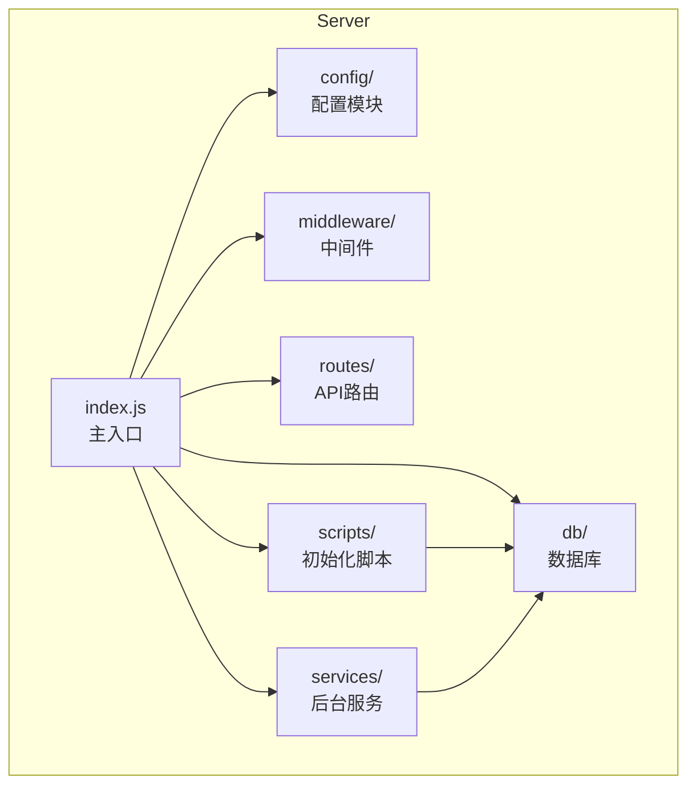

**图示来源**  
- [server/index.js](file://server/index.js#L1-L199)
- [server/config/index.js](file://server/config/index.js#L1-L93)
- [server/db/index.js](file://server/db/index.js#L1-L93)
- [server/middleware/error-handler.js](file://server/middleware/error-handler.js#L1-L115)
- [server/routes/v1/index.js](file://server/routes/v1/index.js#L1-L42)
- [server/services/document-sync-service.js](file://server/services/document-sync-service.js#L1-L250)
- [server/scripts/post-deploy.js](file://server/scripts/post-deploy.js#L1-L182)

**本节来源**  
- [server/index.js](file://server/index.js#L1-L199)
- [server/config/index.js](file://server/config/index.js#L1-L93)

## 核心组件
核心组件包括主入口文件 `index.js`，它负责协调整个应用的启动过程。配置模块 `config/index.js` 统一管理所有环境变量和应用配置。数据库模块 `db/index.js` 和 `config/database.js` 负责与 PostgreSQL 数据库建立连接池。中间件模块 `middleware/error-handler.js` 提供统一的错误处理机制。路由模块 `routes/v1/index.js` 和 `routes/api.js` 定义了 API 接口。后台服务 `services/document-sync-service.js` 在服务器启动后异步运行，执行文档同步任务。

**本节来源**  
- [server/index.js](file://server/index.js#L1-L199)
- [server/config/index.js](file://server/config/index.js#L1-L93)
- [server/db/index.js](file://server/db/index.js#L1-L93)
- [server/config/database.js](file://server/config/database.js#L1-L74)
- [server/middleware/error-handler.js](file://server/middleware/error-handler.js#L1-L115)
- [server/routes/v1/index.js](file://server/routes/v1/index.js#L1-L42)
- [server/routes/api.js](file://server/routes/api.js#L1-L603)
- [server/services/document-sync-service.js](file://server/services/document-sync-service.js#L1-L250)

## 架构概述
系统采用 Express.js 作为 Web 框架，PostgreSQL 作为主数据库，实现了 RESTful API 设计。启动流程由 `start.sh` 或 `start.bat` 脚本触发，通过 `npm start` 命令调用 `index.js`。`index.js` 作为主入口，依次加载配置、设置中间件、挂载路由，最后启动 HTTP 服务器。数据库初始化和后台服务在服务器启动后异步执行，确保服务能快速响应。

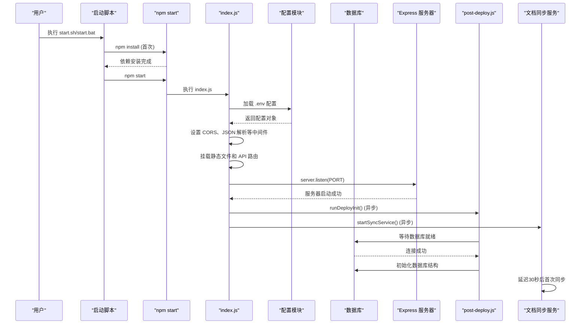

**图示来源**  
- [server/start.sh](file://server/start.sh#L1-L54)
- [server/start.bat](file://server/start.bat#L1-L55)
- [server/index.js](file://server/index.js#L1-L199)
- [server/config/index.js](file://server/config/index.js#L1-L93)
- [server/scripts/post-deploy.js](file://server/scripts/post-deploy.js#L1-L182)
- [server/services/document-sync-service.js](file://server/services/document-sync-service.js#L1-L250)

## 详细组件分析

### 主入口文件分析
`server/index.js` 是应用的主入口，负责初始化整个 Express 应用。

#### 初始化流程
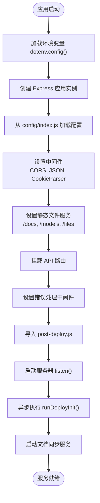

**图示来源**  
- [server/index.js](file://server/index.js#L1-L199)
- [server/config/index.js](file://server/config/index.js#L1-L93)
- [server/scripts/post-deploy.js](file://server/scripts/post-deploy.js#L1-L182)
- [server/services/document-sync-service.js](file://server/services/document-sync-service.js#L1-L250)

#### 配置加载机制
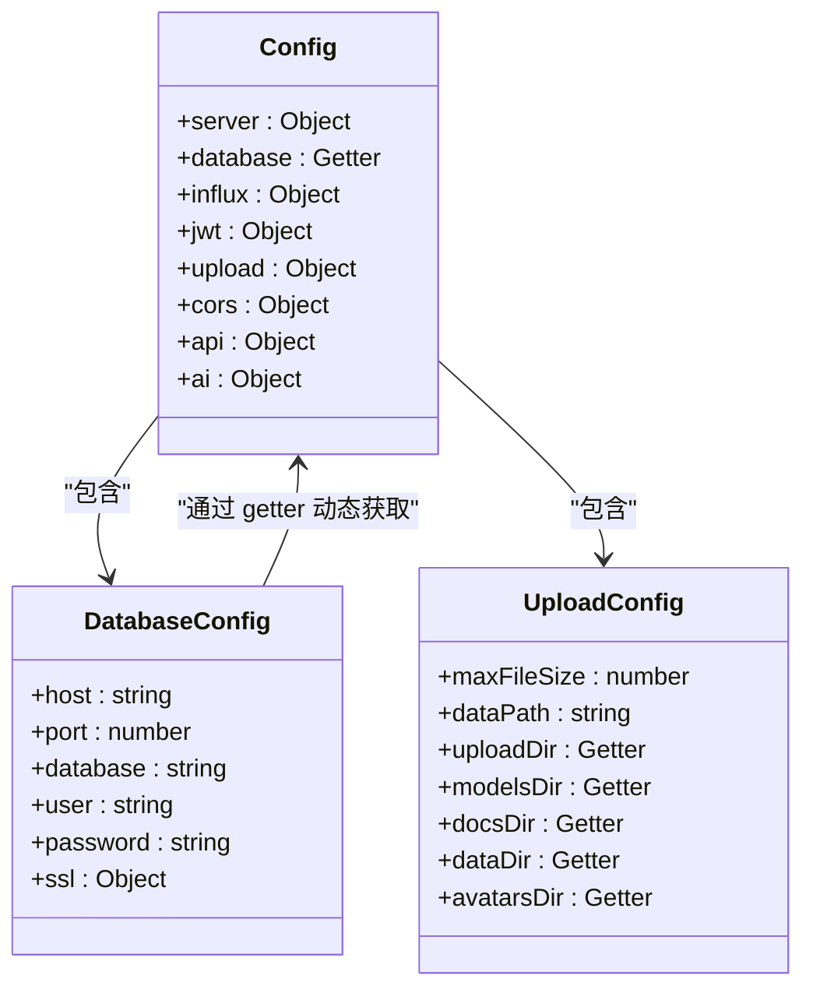

**图示来源**  
- [server/config/index.js](file://server/config/index.js#L1-L93)

**本节来源**  
- [server/index.js](file://server/index.js#L1-L199)
- [server/config/index.js](file://server/config/index.js#L1-L93)

### 启动脚本分析
`start.sh` 和 `start.bat` 脚本为不同操作系统提供一致的启动体验。

#### Shell 脚本流程
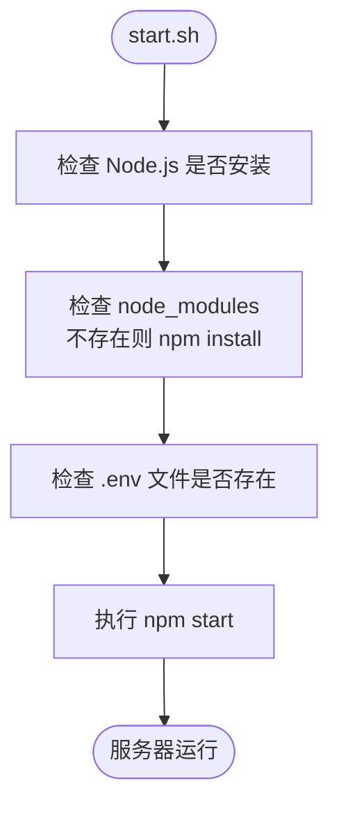

#### 批处理脚本流程
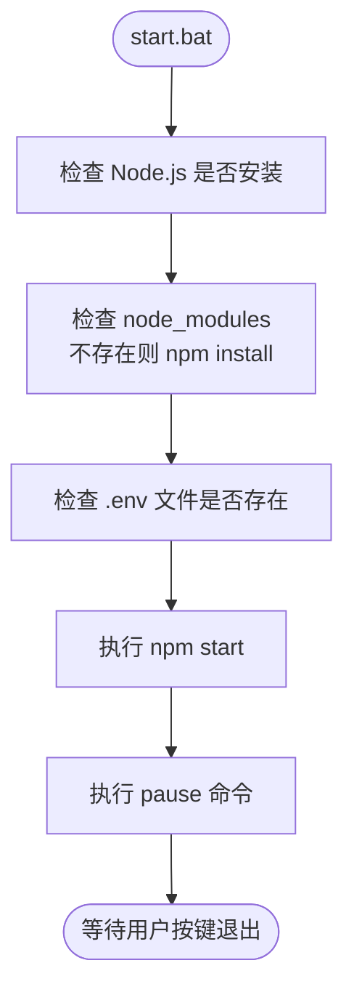

**图示来源**  
- [server/start.sh](file://server/start.sh#L1-L54)
- [server/start.bat](file://server/start.bat#L1-L55)

**本节来源**  
- [server/start.sh](file://server/start.sh#L1-L54)
- [server/start.bat](file://server/start.bat#L1-L55)

### 数据库初始化分析
`scripts/post-deploy.js` 脚本在服务器启动后异步执行，负责数据库的初始化和健康检查。

#### 数据库初始化流程
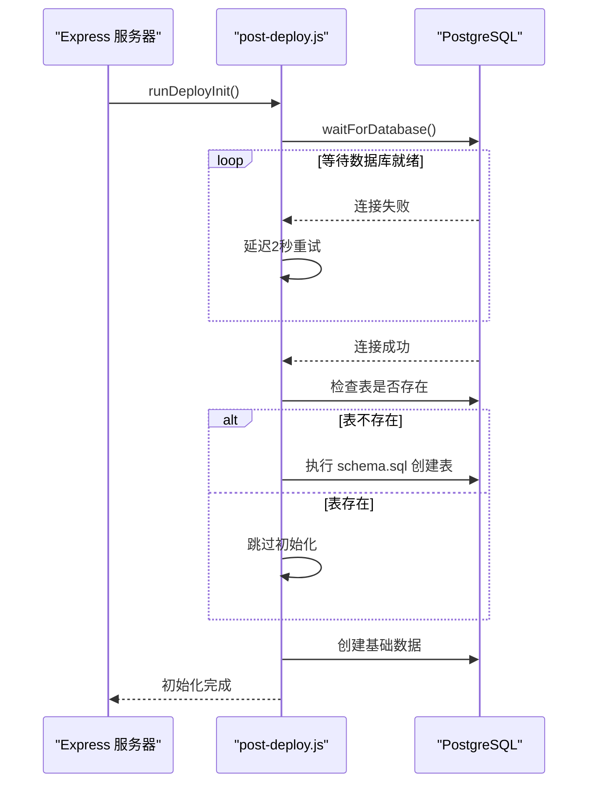

**图示来源**  
- [server/scripts/post-deploy.js](file://server/scripts/post-deploy.js#L1-L182)
- [server/db/index.js](file://server/db/index.js#L1-L93)

**本节来源**  
- [server/scripts/post-deploy.js](file://server/scripts/post-deploy.js#L1-L182)

### 错误处理机制分析
系统通过 `middleware/error-handler.js` 提供了全面的错误处理策略。

#### 错误处理类结构
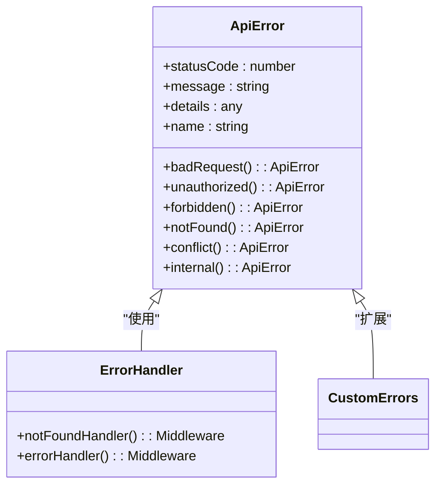

#### 全局错误处理流程
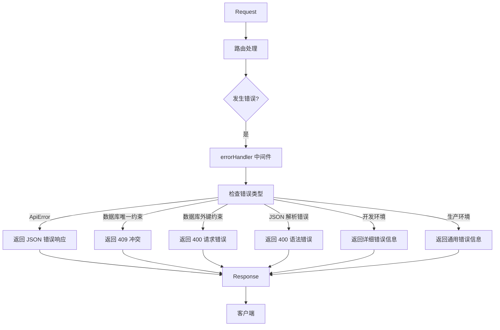

**图示来源**  
- [server/middleware/error-handler.js](file://server/middleware/error-handler.js#L1-L115)

**本节来源**  
- [server/middleware/error-handler.js](file://server/middleware/error-handler.js#L1-L115)

### 后台服务分析
`services/document-sync-service.js` 实现了文档同步到 Open WebUI 知识库的后台任务。

#### 文档同步服务流程
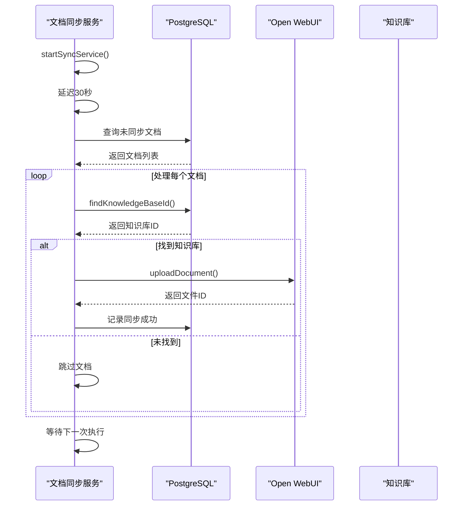

**图示来源**  
- [server/services/document-sync-service.js](file://server/services/document-sync-service.js#L1-L250)
- [server/services/openwebui-service.js](file://server/services/openwebui-service.js#L1-L359)
- [server/config/openwebui-config.js](file://server/config/openwebui-config.js#L1-L56)

**本节来源**  
- [server/services/document-sync-service.js](file://server/services/document-sync-service.js#L1-L250)

## 依赖分析
系统依赖关系清晰，主入口 `index.js` 依赖所有核心模块。配置模块是基础，被数据库、中间件、服务等广泛依赖。数据库模块被所有数据访问组件依赖。路由模块依赖模型和业务逻辑。后台服务依赖数据库和第三方 API 服务。

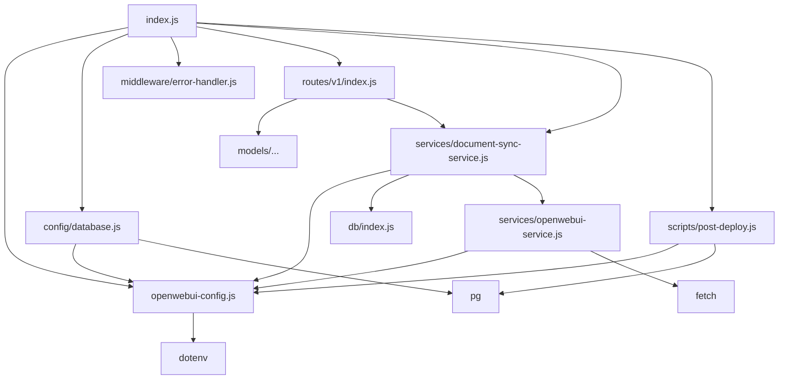

**图示来源**  
- [server/index.js](file://server/index.js#L1-L199)
- [server/config/index.js](file://server/config/index.js#L1-L93)
- [server/config/database.js](file://server/config/database.js#L1-L74)
- [server/scripts/post-deploy.js](file://server/scripts/post-deploy.js#L1-L182)
- [server/services/document-sync-service.js](file://server/services/document-sync-service.js#L1-L250)
- [server/services/openwebui-service.js](file://server/services/openwebui-service.js#L1-L359)
- [server/config/openwebui-config.js](file://server/config/openwebui-config.js#L1-L56)
- [server/routes/v1/index.js](file://server/routes/v1/index.js#L1-L42)

**本节来源**  
- [server/index.js](file://server/index.js#L1-L199)
- [server/package.json](file://server/package.json#L1-L30)

## 性能考虑
系统在性能方面进行了多项优化。使用连接池（最大20个连接）管理数据库连接，避免频繁创建和销毁连接的开销。静态文件服务配置了适当的缓存头（max-age=86400），减少重复请求。请求体大小限制为200MB，防止恶意大文件上传。后台服务采用定时任务（默认5分钟）而非实时同步，平衡了数据新鲜度和系统负载。错误处理中禁用了开发环境的查询日志，减少不必要的I/O操作。

## 故障排除指南
当服务启动失败时，应按以下步骤排查：

1. **检查 Node.js 环境**：确保 `start.sh` 或 `start.bat` 能正确检测到 Node.js 版本。
2. **验证依赖安装**：确认 `node_modules` 目录存在且完整，必要时重新运行 `npm install`。
3. **检查配置文件**：确保 `.env` 文件存在且包含正确的数据库连接信息。
4. **数据库连接问题**：查看日志中是否有 "等待数据库就绪" 的信息，确认数据库服务是否正常运行。
5. **端口占用**：检查 `SERVER_PORT` 或 `PORT` 环境变量指定的端口是否被其他进程占用。
6. **文件路径问题**：在生产环境中，确保 `DATA_PATH` 环境变量指向正确的上传目录（如 `/app/uploads`）。
7. **Open WebUI 集成**：如果文档同步失败，检查 `OPENWEBUI_URL` 和 `OPENWEBUI_API_KEY` 配置是否正确。

**本节来源**  
- [server/start.sh](file://server/start.sh#L1-L54)
- [server/start.bat](file://server/start.bat#L1-L55)
- [server/.env](file://server/.env#L1-L24)
- [server/scripts/post-deploy.js](file://server/scripts/post-deploy.js#L1-L182)
- [server/services/openwebui-service.js](file://server/services/openwebui-service.js#L1-L359)

## 结论
Twinsight 后端服务的启动流程设计合理，具有良好的健壮性和可维护性。通过 `start.sh` 和 `start.bat` 脚本实现了跨平台的便捷启动。主入口 `index.js` 清晰地组织了配置加载、中间件设置、路由挂载和服务器启动等步骤。关键的数据库初始化和后台服务采用异步执行，确保了主服务的快速启动。系统具备完善的错误处理和日志记录机制，便于故障排查。整体架构支持高可用性，适合生产环境部署。