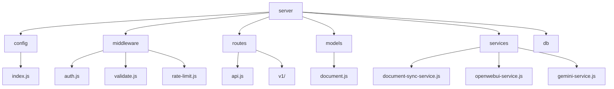
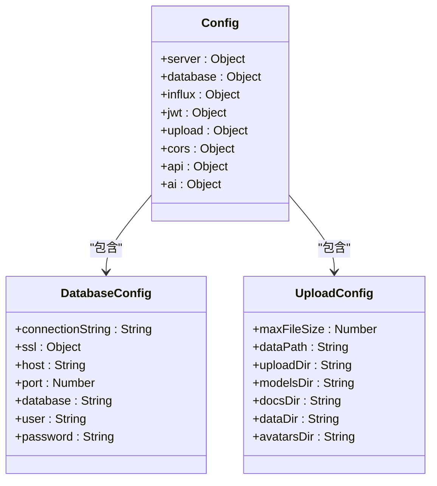
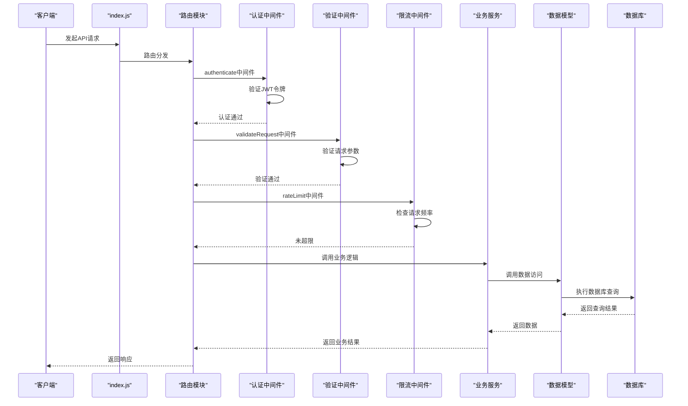
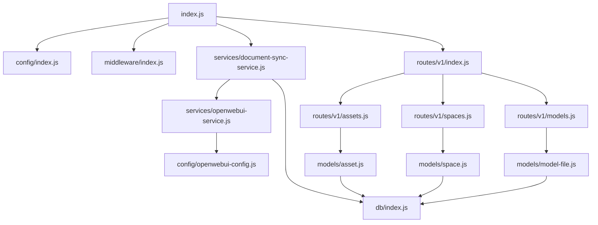

# 后端架构

<cite>
**本文档引用的文件**  
- [index.js](file://server/index.js)
- [config/index.js](file://server/config/index.js)
- [middleware/index.js](file://server/middleware/index.js)
- [middleware/auth.js](file://server/middleware/auth.js)
- [middleware/validate.js](file://server/middleware/validate.js)
- [middleware/rate-limit.js](file://server/middleware/rate-limit.js)
- [routes/api.js](file://server/routes/api.js)
- [routes/v1/index.js](file://server/routes/v1/index.js)
- [services/document-sync-service.js](file://server/services/document-sync-service.js)
- [services/openwebui-service.js](file://server/services/openwebui-service.js)
- [services/gemini-service.js](file://server/services/gemini-service.js)
- [models/document.js](file://server/models/document.js)
- [config/auth.js](file://server/config/auth.js)
- [db/index.js](file://server/db/index.js)
</cite>

## 目录
1. [项目结构](#项目结构)
2. [核心架构](#核心架构)
3. [请求处理流程](#请求处理流程)
4. [配置中心化](#配置中心化)
5. [服务层设计](#服务层设计)
6. [中间件机制](#中间件机制)
7. [API请求处理序列图](#api请求处理序列图)
8. [可扩展性设计](#可扩展性设计)
9. [安全性实践](#安全性实践)
10. [依赖分析](#依赖分析)

## 项目结构



**图表来源**  
- [server](file://server)

**章节来源**  
- [server](file://server)

## 核心架构

本系统采用基于Express.js的MVC模式实现，构建了一个模块化、可扩展的后端服务架构。系统通过清晰的分层设计实现了关注点分离，包括路由分发、中间件链、业务逻辑服务层和数据访问模型层。整个架构以`server/index.js`为入口，通过模块化的方式组织代码，确保了系统的可维护性和可测试性。

**章节来源**  
- [index.js](file://server/index.js)

## 请求处理流程

系统遵循标准的MVC请求处理流程：入口（index.js）→ 路由分发（routes）→ 中间件链（auth, validate, rate-limit）→ 业务逻辑（services）→ 数据访问（models）。当客户端发起API请求时，首先由`index.js`中的Express应用实例接收，然后根据请求路径分发到相应的路由模块。路由模块在执行具体业务逻辑前，会先通过中间件链进行认证、权限验证、输入验证和限流控制，确保请求的安全性和有效性。

**章节来源**  
- [index.js](file://server/index.js)
- [routes/api.js](file://server/routes/api.js)

## 配置中心化



**图表来源**  
- [config/index.js](file://server/config/index.js)

**章节来源**  
- [config/index.js](file://server/config/index.js)

系统通过`config/index.js`实现了配置的中心化管理，统一管理所有配置项。这种设计带来了显著优势：首先，所有配置集中在一个文件中，便于维护和查找；其次，通过环境变量动态加载配置，支持不同环境（开发、生产）的差异化配置；最后，配置项的getter方法确保了运行时动态读取环境变量，解决了ES模块静态导入时环境变量可能尚未加载的问题。

## 服务层设计

```mermaid
classDiagram
class DocumentSyncService {
+isSyncing : boolean
+getUnsyncedDocuments() : Promise~Array~
+findKnowledgeBaseId(doc) : Promise~String~
+syncDocument(doc, kbId) : Promise~boolean~
+runBatchSync() : Promise~Object~
+startSyncService(intervalMs) : void
+triggerSync() : Promise~Object~
}
class OpenWebUIService {
+checkHealth() : Promise~boolean~
+createKnowledgeBase(name, desc) : Promise~Object~
+listKnowledgeBases() : Promise~Array~
+getKnowledgeBase(kbId) : Promise~Object~
+deleteKnowledgeBase(kbId) : void
+isSupportedFormat(filePath) : boolean
+uploadDocument(kbId, filePath, fileName) : Promise~Object~
+listDocuments(kbId) : Promise~Array~
+chatWithRAG(options) : Promise~Object~
+syncDocumentsToKB(kbId, docs) : Promise~Object~
}
class GeminiService {
+analyzeTemperatureAlert(alertData) : Promise~Object~
}
DocumentSyncService --> OpenWebUIService : "依赖"
DocumentSyncService --> "db/index.js" : "依赖"
GeminiService --> "config-service.js" : "依赖"
```

**图表来源**  
- [services/document-sync-service.js](file://server/services/document-sync-service.js)
- [services/openwebui-service.js](file://server/services/openwebui-service.js)
- [services/gemini-service.js](file://server/services/gemini-service.js)

**章节来源**  
- [services/document-sync-service.js](file://server/services/document-sync-service.js)
- [services/openwebui-service.js](file://server/services/openwebui-service.js)
- [services/gemini-service.js](file://server/services/gemini-service.js)

服务层（services）封装了核心业务逻辑，实现了与路由的解耦。`document-sync-service.js`实现了文档同步的核心功能，通过定时任务自动将文档同步到Open WebUI知识库，实现了AI分析的自动化流程。`gemini-service.js`封装了与Google Gemini API的交互逻辑，提供温度异常分析等AI分析功能。这种设计使得业务逻辑可以独立于HTTP请求/响应周期进行测试和维护，提高了代码的可重用性和可测试性。

## 中间件机制

```mermaid
classDiagram
class AuthMiddleware {
+authenticate(req, res, next) : void
+authorize(permission) : Middleware
+optionalAuth(req, res, next) : void
}
class ValidateMiddleware {
+validateRequest(req, res, next) : void
+commonValidators : Object
}
class RateLimitMiddleware {
+rateLimit(options) : Middleware
+strictRateLimit : Middleware
+loginRateLimit : Middleware
}
class ErrorHandler {
+ApiError
+notFoundHandler
+errorHandler
}
AuthMiddleware --> "config/index.js" : "依赖"
AuthMiddleware --> "config/auth.js" : "依赖"
ValidateMiddleware --> "express-validator" : "依赖"
RateLimitMiddleware --> "requestCounts" : "依赖"
```

**图表来源**  
- [middleware/auth.js](file://server/middleware/auth.js)
- [middleware/validate.js](file://server/middleware/validate.js)
- [middleware/rate-limit.js](file://server/middleware/rate-limit.js)

**章节来源**  
- [middleware/auth.js](file://server/middleware/auth.js)
- [middleware/validate.js](file://server/middleware/validate.js)
- [middleware/rate-limit.js](file://server/middleware/rate-limit.js)

中间件机制在认证、输入验证和错误处理中发挥着关键作用。认证中间件（auth.js）实现了JWT验证和权限检查，通过`authenticate`中间件验证JWT令牌，`authorize`中间件检查用户权限，`optionalAuth`中间件提供可选认证。输入验证中间件（validate.js）使用express-validator进行请求参数验证，确保输入数据的合法性。限流中间件（rate-limit.js）防止API滥用，通过内存存储请求计数实现简单的限流功能。这些中间件通过组合使用，构建了一个安全可靠的API防护体系。

## API请求处理序列图



**图表来源**  
- [index.js](file://server/index.js)
- [middleware/auth.js](file://server/middleware/auth.js)
- [middleware/validate.js](file://server/middleware/validate.js)
- [middleware/rate-limit.js](file://server/middleware/rate-limit.js)
- [services/document-sync-service.js](file://server/services/document-sync-service.js)
- [models/document.js](file://server/models/document.js)

**章节来源**  
- [index.js](file://server/index.js)
- [middleware/auth.js](file://server/middleware/auth.js)
- [middleware/validate.js](file://server/middleware/validate.js)
- [middleware/rate-limit.js](file://server/middleware/rate-limit.js)

## 可扩展性设计

系统通过模块化路由设计实现了良好的可扩展性。`routes/v1/index.js`作为API v1版本的路由聚合点，通过导入和挂载不同的路由模块（如assetsRouter、spacesRouter等），实现了功能模块的解耦。这种设计允许开发团队并行开发不同的功能模块，而不会相互影响。同时，系统保留了旧版API路由以确保向后兼容性，体现了良好的版本管理策略。

**章节来源**  
- [routes/v1/index.js](file://server/routes/v1/index.js)

## 安全性实践

系统实施了多层次的安全性实践。首先，通过JWT认证（JWT）和基于角色的权限控制（RBAC）确保只有授权用户才能访问特定资源。`config/auth.js`文件中定义了详细的权限和角色映射，为细粒度的权限控制提供了基础。其次，通过输入验证中间件防止恶意输入和注入攻击。再次，通过限流中间件防止API滥用和DDoS攻击。此外，系统还通过CORS配置控制跨域请求，通过环境变量管理敏感信息（如数据库连接字符串、API密钥），避免硬编码带来的安全风险。

**章节来源**  
- [config/auth.js](file://server/config/auth.js)
- [middleware/auth.js](file://server/middleware/auth.js)
- [config/index.js](file://server/config/index.js)

## 依赖分析



**图表来源**  
- [index.js](file://server/index.js)
- [config/index.js](file://server/config/index.js)
- [middleware/index.js](file://server/middleware/index.js)
- [routes/v1/index.js](file://server/routes/v1/index.js)
- [services/document-sync-service.js](file://server/services/document-sync-service.js)
- [services/openwebui-service.js](file://server/services/openwebui-service.js)
- [db/index.js](file://server/db/index.js)

**章节来源**  
- [index.js](file://server/index.js)
- [config/index.js](file://server/config/index.js)
- [middleware/index.js](file://server/middleware/index.js)
- [routes/v1/index.js](file://server/routes/v1/index.js)
- [services/document-sync-service.js](file://server/services/document-sync-service.js)
- [services/openwebui-service.js](file://server/services/openwebui-service.js)
- [db/index.js](file://server/db/index.js)