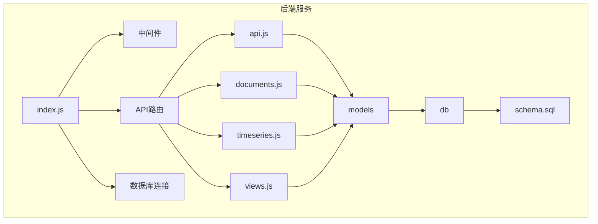
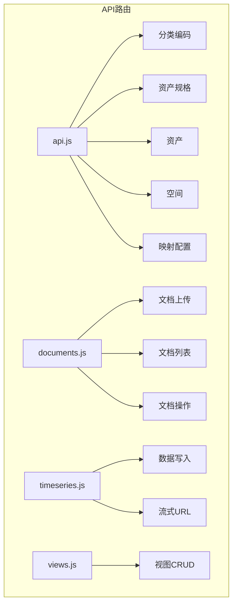
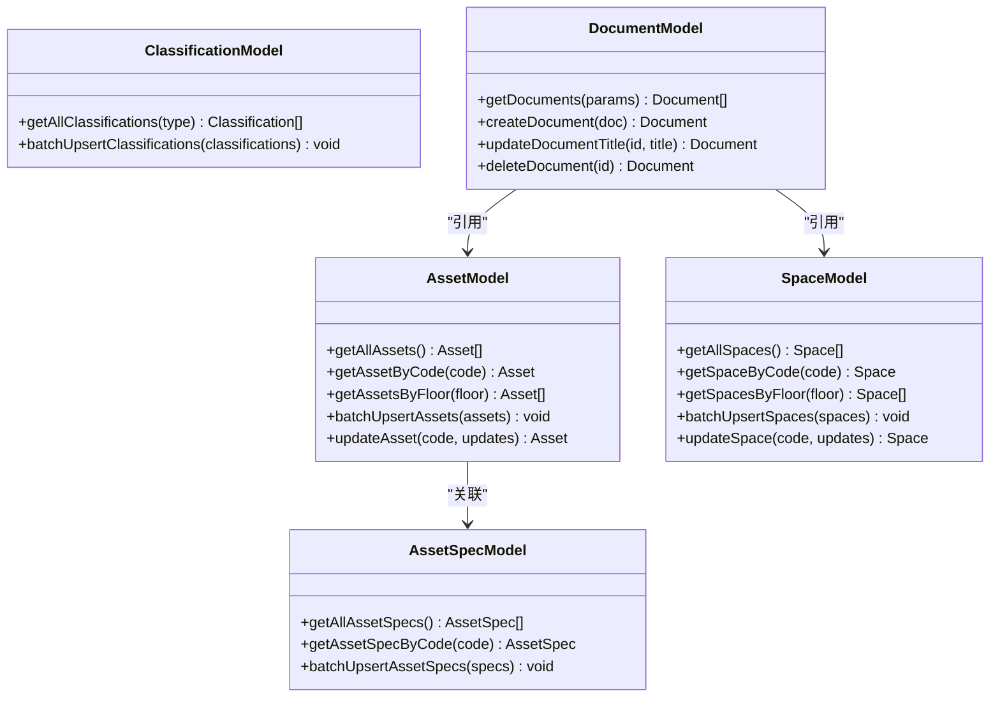
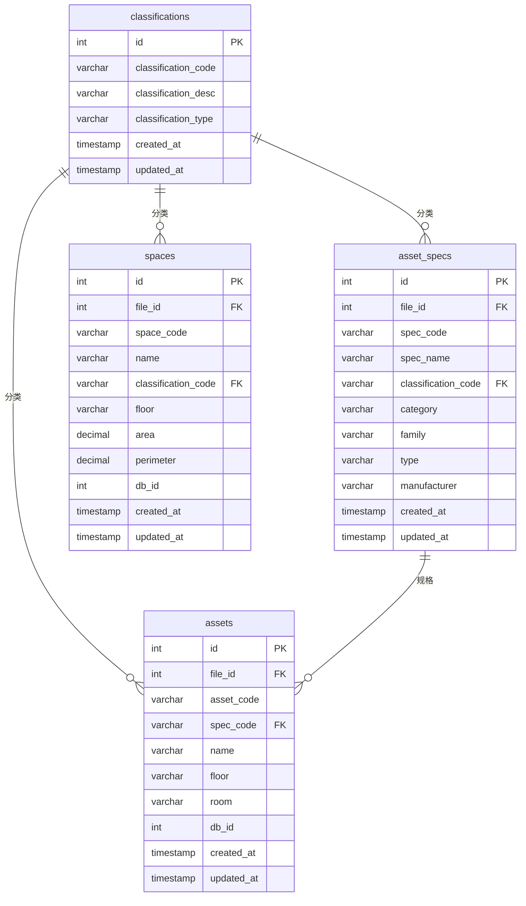
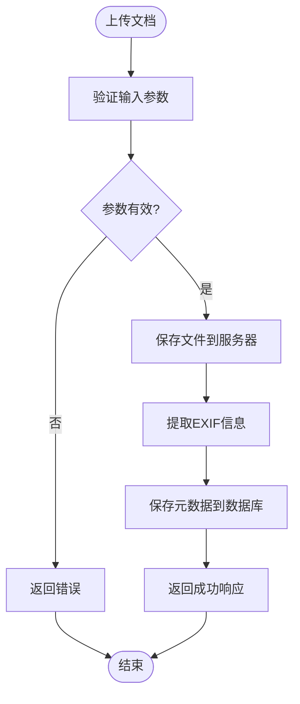
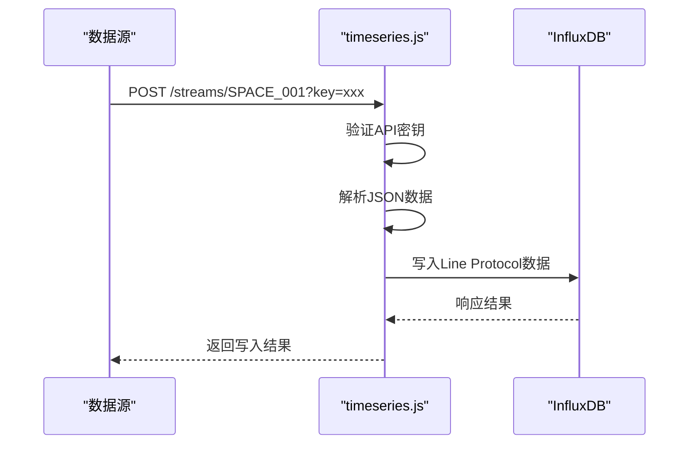

# 后端架构

<cite>
**本文档引用的文件**   
- [index.js](file://server/index.js)
- [api.js](file://server/routes/api.js)
- [documents.js](file://server/routes/documents.js)
- [timeseries.js](file://server/routes/timeseries.js)
- [views.js](file://server/routes/views.js)
- [asset.js](file://server/models/asset.js)
- [space.js](file://server/models/space.js)
- [document.js](file://server/models/document.js)
- [classification.js](file://server/models/classification.js)
- [asset-spec.js](file://server/models/asset-spec.js)
- [document-exif.js](file://server/models/document-exif.js)
- [view.js](file://server/models/view.js)
- [schema.sql](file://server/db/schema.sql)
- [index.js](file://server/db/index.js)
</cite>

## 目录
1. [项目结构](#项目结构)
2. [应用入口与中间件](#应用入口与中间件)
3. [API路由设计](#api路由设计)
4. [数据模型与数据库映射](#数据模型与数据库映射)
5. [数据库表结构设计](#数据库表结构设计)
6. [文档管理模块](#文档管理模块)
7. [时序数据接入](#时序数据接入)
8. [视图管理功能](#视图管理功能)
9. [综合导入流程](#综合导入流程)

## 项目结构

该项目采用分层架构设计，后端服务位于`server`目录下，主要分为四个核心模块：`db`（数据库）、`models`（数据模型）、`routes`（API路由）和入口文件。这种结构清晰地分离了关注点，便于维护和扩展。

**图表来源**
- [index.js](file://server/index.js#L1-L92)
- [schema.sql](file://server/db/schema.sql#L1-L160)

**本节来源**
- [index.js](file://server/index.js#L1-L92)
- [schema.sql](file://server/db/schema.sql#L1-L160)

## 应用入口与中间件

`server/index.js`作为应用的入口文件，负责初始化Express应用、配置中间件、注册路由和启动服务器。它首先导入必要的模块，包括Express框架、CORS中间件和环境变量配置。

该文件通过`config()`加载环境变量，创建Express应用实例，并设置服务器监听端口（默认为3001）。在中间件配置方面，应用启用了CORS以允许来自特定开发环境的跨域请求，配置了JSON和URL编码解析器以处理请求体，并设置了静态文件服务以提供`public/docs`目录下的上传文档。

此外，应用还包含请求日志中间件，用于记录每个请求的时间、方法和路径，便于调试和监控。错误处理中间件捕获未处理的异常并返回统一的错误响应。最后，服务器启动后会输出一个格式化的启动信息，包含服务地址和数据库类型。

**本节来源**
- [index.js](file://server/index.js#L1-L92)

## API路由设计

API路由模块采用模块化设计，将不同功能的端点分组到独立的路由文件中。主路由`api.js`定义了核心数据实体的CRUD操作，包括分类编码、资产规格、资产和空间的获取、批量导入和更新接口。

`documents.js`路由专门处理文档管理功能，支持文档上传、列表获取、详情查询、标题更新和删除操作。它使用Multer中间件处理文件上传，并配置了严格的文件类型过滤和大小限制。`timeseries.js`路由实现了时序数据的接入功能，通过API密钥验证机制确保数据写入的安全性，并支持生成安全的流式传输URL。

`views.js`路由管理模型视图状态，提供视图的创建、读取、更新和删除（CRUD）操作。所有路由均遵循RESTful设计原则，返回统一的JSON响应格式，包含`success`标志和相应的数据或错误信息。

**图表来源**
- [api.js](file://server/routes/api.js#L1-L517)
- [documents.js](file://server/routes/documents.js#L1-L386)
- [timeseries.js](file://server/routes/timeseries.js#L1-L263)
- [views.js](file://server/routes/views.js#L1-L181)

**本节来源**
- [api.js](file://server/routes/api.js#L1-L517)
- [documents.js](file://server/routes/documents.js#L1-L386)
- [timeseries.js](file://server/routes/timeseries.js#L1-L263)
- [views.js](file://server/routes/views.js#L1-L181)

## 数据模型与数据库映射

数据模型层位于`server/models`目录，实现了数据访问对象（DAO）模式，将业务逻辑与数据库操作分离。每个模型文件对应一个数据库表，提供一组封装的数据库操作方法。

`asset.js`和`space.js`模型定义了资产和空间实体的CRUD操作，包括获取所有记录、根据编码查询、按楼层或房间筛选以及批量导入功能。这些模型通过JOIN查询关联`asset_specs`表，以获取完整的资产规格信息。

`classification.js`和`asset-spec.js`模型管理分类编码和资产规格数据，支持批量上载（upsert）操作，确保数据的唯一性和一致性。`document.js`模型处理文档元数据的持久化，而`document-exif.js`模型则专门管理图像文件的EXIF元数据。

所有模型都使用`db/index.js`提供的`query`函数执行SQL语句，并利用参数化查询防止SQL注入攻击。批量操作在事务中执行，确保数据完整性。

**图表来源**
- [asset.js](file://server/models/asset.js#L1-L253)
- [space.js](file://server/models/space.js#L1-L220)
- [classification.js](file://server/models/classification.js#L1-L119)
- [asset-spec.js](file://server/models/asset-spec.js#L1-L166)
- [document.js](file://server/models/document.js#L1-L163)

**本节来源**
- [asset.js](file://server/models/asset.js#L1-L253)
- [space.js](file://server/models/space.js#L1-L220)
- [classification.js](file://server/models/classification.js#L1-L119)
- [asset-spec.js](file://server/models/asset-spec.js#L1-L166)
- [document.js](file://server/models/document.js#L1-L163)

## 数据库表结构设计

数据库表结构在`server/db/schema.sql`文件中定义，采用PostgreSQL作为持久化存储。核心表包括`classifications`（分类编码）、`asset_specs`（资产规格）、`assets`（资产）和`spaces`（空间），每个表都有明确的字段定义和约束。

`classifications`表存储资产和空间的分类信息，通过`classification_type`字段区分类型，并在`classification_code`和`classification_type`上建立唯一约束。`asset_specs`表存储资产的规格（类型）信息，包含制造商、类别等详细属性，并通过`file_id`与模型文件关联。

`assets`和`spaces`表分别存储资产和空间的实例数据，`asset_code`和`space_code`作为业务主键。所有表都包含`created_at`和`updated_at`时间戳，并通过触发器自动更新`updated_at`字段。外键约束确保了数据引用的完整性，例如`asset_specs`表的`classification_code`引用`classifications`表。

**图表来源**
- [schema.sql](file://server/db/schema.sql#L1-L160)

**本节来源**
- [schema.sql](file://server/db/schema.sql#L1-L160)

## 文档管理模块

文档管理模块由`documents.js`路由和`document.js`、`document-exif.js`模型组成，提供完整的文档生命周期管理功能。该模块支持PDF、JPG、PNG、SVG和MP4等格式的文件上传，最大文件大小限制为200MB。

上传的文件存储在`public/docs`目录下，使用时间戳和随机字符串生成唯一文件名，避免命名冲突。文档元数据（如标题、文件名、路径、大小等）存储在`documents`表中，并通过`asset_code`、`space_code`或`spec_code`与相应的实体关联。

对于JPG/JPEG图像文件，系统会自动提取EXIF元数据（如拍摄时间、相机型号、GPS坐标等）并存储在`document_exif`表中。`document-exif.js`模型提供了格式化EXIF数据的功能，将其组织为文件、相机和GPS三个逻辑分组，便于前端展示。

**图表来源**
- [documents.js](file://server/routes/documents.js#L1-L386)
- [document.js](file://server/models/document.js#L1-L163)
- [document-exif.js](file://server/models/document-exif.js#L1-L169)

**本节来源**
- [documents.js](file://server/routes/documents.js#L1-L386)
- [document.js](file://server/models/document.js#L1-L163)
- [document-exif.js](file://server/models/document-exif.js#L1-L169)

## 时序数据接入

时序数据接入功能由`timeseries.js`路由实现，专门用于接收外部传感器或系统的实时数据。该模块采用安全的API密钥机制进行身份验证，密钥基于空间编码和服务器密钥通过HMAC-SHA256算法生成，确保每个空间的流式URL唯一且不可预测。

数据写入接口`/api/v1/timeseries/streams/:spaceCode`接受JSON格式的时序数据，支持通过查询参数或Authorization头提供API密钥。接收到的数据被转换为InfluxDB的Line Protocol格式，并通过HTTP API写入InfluxDB时序数据库。

模块还提供了生成流式URL的功能，前端可以调用`/api/v1/timeseries/stream-url/:spaceCode`获取预配置的写入端点。批量获取多个空间URL的接口支持一次性生成多个流式传输链接，提高配置效率。

**图表来源**
- [timeseries.js](file://server/routes/timeseries.js#L1-L263)

**本节来源**
- [timeseries.js](file://server/routes/timeseries.js#L1-L263)

## 视图管理功能

视图管理功能允许用户保存和恢复模型查看器的状态。`views.js`路由提供RESTful API来管理视图，`view.js`模型负责数据库操作。每个视图记录包含名称、缩略图和完整的查看器状态（如相机位置、可见图层等）。

创建视图时，系统会检查同一文件下是否存在同名视图，防止命名冲突。更新视图时，同样会进行名称唯一性校验。视图状态以JSON格式存储在`viewer_state`字段中，支持灵活的结构而无需修改数据库模式。

该功能支持按名称搜索视图，并可按名称或创建时间排序。删除视图会级联删除其关联的缩略图文件，确保系统资源的清理。

**本节来源**
- [views.js](file://server/routes/views.js#L1-L181)
- [view.js](file://server/models/view.js#L1-L199)

## 综合导入流程

综合导入流程是系统的核心功能之一，通过`/api/import/model-data`端点实现。该流程接收从BIM模型提取的资产和空间数据，并将其持久化到数据库中。

流程首先根据`fileId`清理旧数据（如果请求中包含`clearExisting`标志），然后从资产和空间数据中提取分类编码和资产规格。这些元数据被批量保存到相应的表中。接着，资产和空间的实例数据被关联到`fileId`并批量插入。

整个流程在多个独立的数据库事务中执行，确保每个数据类型的导入原子性。系统会记录详细的日志，包括导入的记录数量和处理时间，便于监控和调试。导入成功后，返回包含统计摘要的响应。

**本节来源**
- [api.js](file://server/routes/api.js#L297-L464)
- [asset.js](file://server/models/asset.js#L162-L199)
- [space.js](file://server/models/space.js#L129-L168)