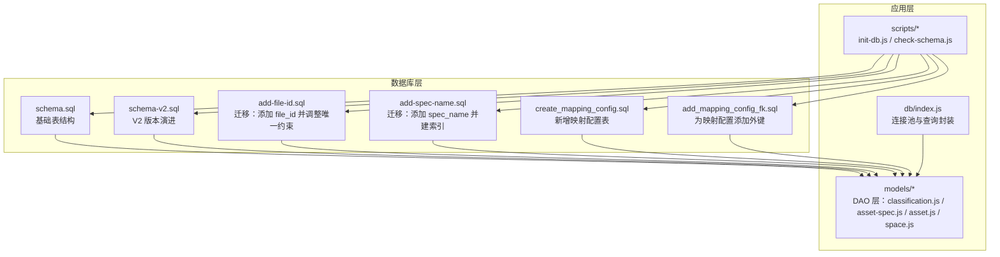
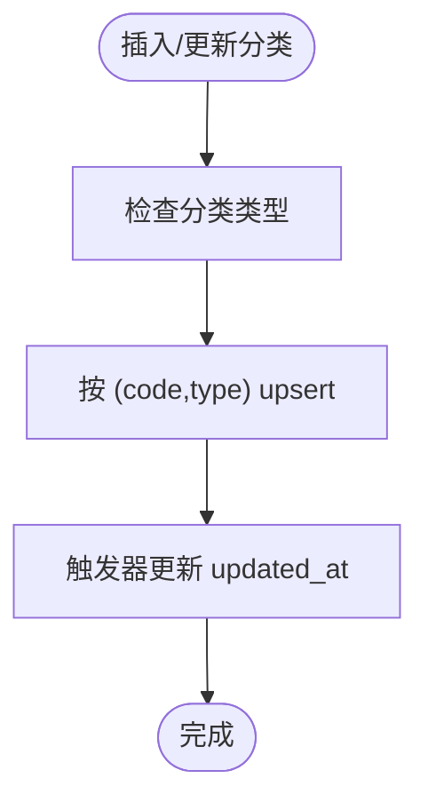
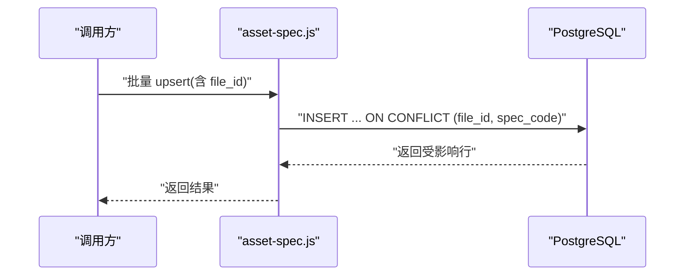
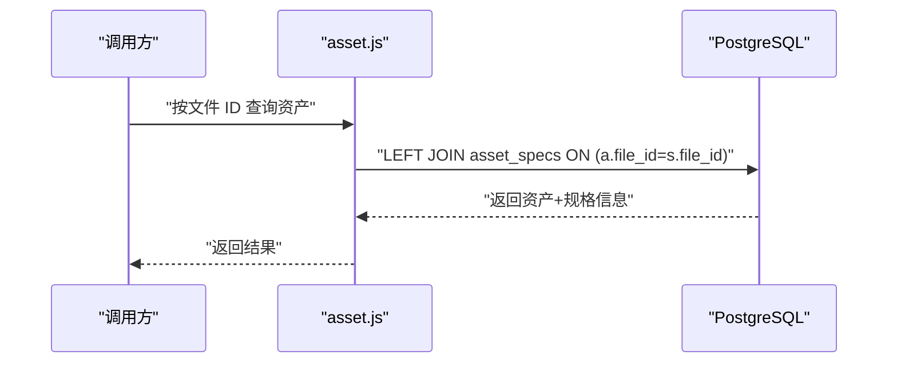
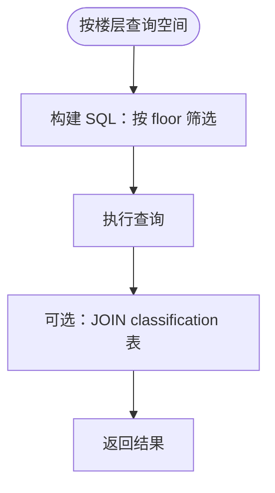
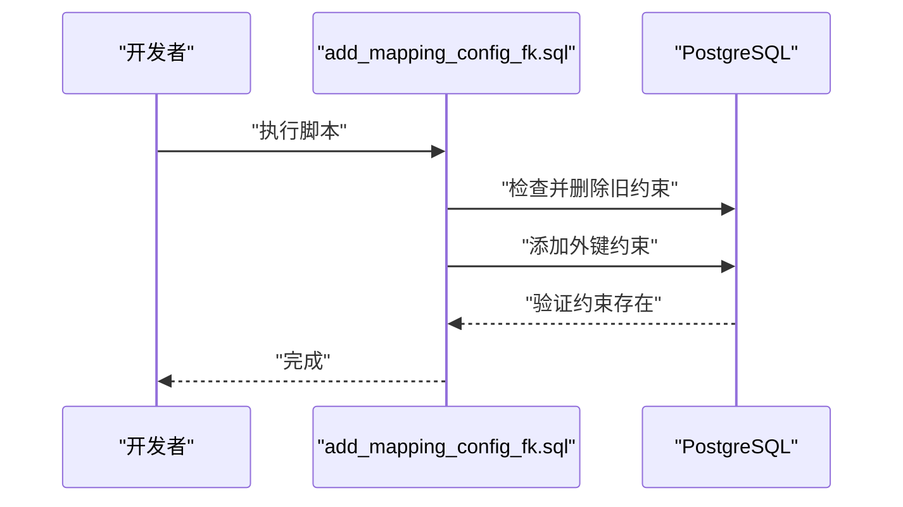
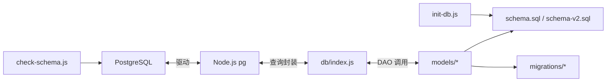

# 数据库架构

<cite>
**本文引用的文件**
- [schema.sql](file://server/db/schema.sql)
- [schema-v2.sql](file://server/db/schema-v2.sql)
- [add-file-id.sql](file://server/db/migrations/add-file-id.sql)
- [add-spec-name.sql](file://server/db/migrations/add-spec-name.sql)
- [create_mapping_config.sql](file://server/db/migrations/create_mapping_config.sql)
- [add_mapping_config_fk.sql](file://server/db/migrations/add_mapping_config_fk.sql)
- [index.js](file://server/db/index.js)
- [classification.js](file://server/models/classification.js)
- [asset-spec.js](file://server/models/asset-spec.js)
- [asset.js](file://server/models/asset.js)
- [space.js](file://server/models/space.js)
- [init-db.js](file://server/scripts/init-db.js)
- [check-schema.js](file://server/scripts/check-schema.js)
- [DATABASE_MIGRATION.md](file://DATABASE_MIGRATION.md)
</cite>

## 目录
1. [简介](#简介)
2. [项目结构](#项目结构)
3. [核心组件](#核心组件)
4. [架构总览](#架构总览)
5. [详细组件分析](#详细组件分析)
6. [依赖分析](#依赖分析)
7. [性能考量](#性能考量)
8. [故障排查指南](#故障排查指南)
9. [结论](#结论)
10. [附录](#附录)

## 简介
本文件面向数据库架构与设计，基于仓库中的 schema.sql、schema-v2.sql 与多份迁移脚本，系统化解析 PostgreSQL 数据库的表结构、索引策略、约束关系与触发器机制。重点覆盖以下主题：
- classifications、asset_specs、assets、spaces 等核心表的字段定义、约束与业务含义
- UNIQUE 索引如何保障数据唯一性
- 通过 FOREIGN KEY 实现的跨表关联
- 为提升查询性能而创建的索引设计考量
- update_updated_at_column() 触发器函数如何自动维护记录的更新时间戳
- 数据库迁移脚本在版本演进中的作用，特别是 add-file-id.sql 等迁移文件如何安全地修改表结构
- ER 图描述表间关系，并说明数据库设计如何支持 BIM 模型与 IoT 数据的融合需求

## 项目结构
数据库相关的核心文件集中在 server/db 目录，包含基础表结构定义、版本演进脚本与迁移脚本；配套的 Node.js 数据访问层位于 server/models，负责对数据库进行 CRUD 操作与事务封装；初始化与校验脚本位于 server/scripts。



图表来源
- [schema.sql](file://server/db/schema.sql#L1-L160)
- [schema-v2.sql](file://server/db/schema-v2.sql#L1-L70)
- [add-file-id.sql](file://server/db/migrations/add-file-id.sql#L1-L51)
- [add-spec-name.sql](file://server/db/migrations/add-spec-name.sql#L1-L12)
- [create_mapping_config.sql](file://server/db/migrations/create_mapping_config.sql#L1-L29)
- [add_mapping_config_fk.sql](file://server/db/migrations/add_mapping_config_fk.sql#L1-L26)
- [index.js](file://server/db/index.js#L1-L70)
- [classification.js](file://server/models/classification.js#L1-L119)
- [asset-spec.js](file://server/models/asset-spec.js#L1-L166)
- [asset.js](file://server/models/asset.js#L1-L253)
- [space.js](file://server/models/space.js#L1-L220)
- [init-db.js](file://server/scripts/init-db.js#L1-L40)
- [check-schema.js](file://server/scripts/check-schema.js#L1-L54)

章节来源
- [schema.sql](file://server/db/schema.sql#L1-L160)
- [schema-v2.sql](file://server/db/schema-v2.sql#L1-L70)
- [add-file-id.sql](file://server/db/migrations/add-file-id.sql#L1-L51)
- [add-spec-name.sql](file://server/db/migrations/add-spec-name.sql#L1-L12)
- [create_mapping_config.sql](file://server/db/migrations/create_mapping_config.sql#L1-L29)
- [add_mapping_config_fk.sql](file://server/db/migrations/add_mapping_config_fk.sql#L1-L26)
- [index.js](file://server/db/index.js#L1-L70)
- [classification.js](file://server/models/classification.js#L1-L119)
- [asset-spec.js](file://server/models/asset-spec.js#L1-L166)
- [asset.js](file://server/models/asset.js#L1-L253)
- [space.js](file://server/models/space.js#L1-L220)
- [init-db.js](file://server/scripts/init-db.js#L1-L40)
- [check-schema.js](file://server/scripts/check-schema.js#L1-L54)

## 核心组件
本节从数据库层面解析四大核心表的字段、约束与业务含义，并结合迁移脚本说明版本演进带来的结构变化。

- 分类编码表 classifications
  - 字段要点：主键 id、分类编码 classification_code、分类描述 classification_desc、分类类型 classification_type（'asset' 或 'space'）、时间戳 created_at/updated_at
  - 约束：UNIQUE(classification_code, classification_type)，用于确保同类型下的分类编码唯一
  - 业务含义：统一承载资产与空间的 OmniClass 分类体系，便于跨表检索与统计
  - 索引：针对 classification_code 与 classification_type 的索引，提升按类型与编码检索效率

- 资产规格表 asset_specs
  - 字段要点：主键 id、file_id（V2 引入，关联 model_files）、规格编码 spec_code、规格名称 spec_name（迁移引入）、OmniClass 分类信息（classification_code、classification_desc）、类别 category、族 family、类型 type、制造商 manufacturer、地址 address、电话 phone、时间戳 created_at/updated_at
  - 约束：UNIQUE(file_id, spec_code)（V2 后），确保同一文件内的规格编码唯一
  - 业务含义：描述构件类型的规格与属性，支撑资产与空间的分类与属性检索
  - 索引：针对 spec_name、classification_code、category、family 的索引，优化按规格名、分类、类别、族的查询

- 资产表 assets
  - 字段要点：主键 id、file_id（V2 引入）、资产编码 asset_code、规格编码 spec_code（外键关联 asset_specs）、名称 name、楼层 floor、房间 room、Viewer db_id、时间戳 created_at/updated_at
  - 约束：UNIQUE(file_id, asset_code)（V2 后），确保同一文件内的资产编码唯一
  - 业务含义：存储具体资产实例，承载空间定位与规格关联
  - 索引：针对 spec_code、floor、room、db_id 的索引，优化按规格、楼层、房间与 Viewer 关联的查询

- 空间表 spaces
  - 字段要点：主键 id、file_id（V2 引入）、空间编码 space_code、名称 name、OmniClass 分类信息（classification_code、classification_desc）、楼层 floor、面积 area、周长 perimeter、Viewer db_id、时间戳 created_at/updated_at
  - 约束：UNIQUE(file_id, space_code)（V2 后），确保同一文件内的空间编码唯一
  - 业务含义：存储房间/空间实体，承载面积、周长等几何与分类信息
  - 索引：针对 classification_code、floor、db_id 的索引，优化按分类、楼层与 Viewer 关联的查询

- 映射配置表 mapping_configs（新增）
  - 字段要点：主键 id、file_id、config_type（'asset'、'asset_spec'、'space'）、field_name、category、property、时间戳 created_at/updated_at
  - 约束：UNIQUE(file_id, config_type, field_name)，确保同一文件内字段映射唯一
  - 业务含义：将 BIM 模型属性映射到数据库字段，支撑数据抽取与导出流程

章节来源
- [schema.sql](file://server/db/schema.sql#L6-L160)
- [schema-v2.sql](file://server/db/schema-v2.sql#L1-L70)
- [add-file-id.sql](file://server/db/migrations/add-file-id.sql#L1-L51)
- [add-spec-name.sql](file://server/db/migrations/add-spec-name.sql#L1-L12)
- [create_mapping_config.sql](file://server/db/migrations/create_mapping_config.sql#L1-L29)
- [add_mapping_config_fk.sql](file://server/db/migrations/add_mapping_config_fk.sql#L1-L26)

## 架构总览
数据库整体采用“文件隔离 + 统一分类”的设计思路：
- 通过 model_files 统一管理上传的模型文件，资产、空间、规格等数据均以 file_id 与之关联，实现多文件并存与隔离
- 通过 classifications 提供统一的分类编码体系，资产与空间均可引用
- 通过 mapping_configs 支持将 BIM 属性映射到数据库字段，便于自动化抽取与导出
- 通过触发器自动维护 updated_at，确保审计与变更追踪

```mermaid
erDiagram
MODEL_FILES {
int id PK
varchar file_code UK
varchar title
varchar original_name
varchar file_path
bigint file_size
varchar status
boolean is_active
varchar extracted_path
timestamp created_at
timestamp updated_at
}
CLASSIFICATIONS {
int id PK
int file_id FK
varchar classification_code
varchar classification_desc
varchar classification_type
timestamp created_at
timestamp updated_at
unique(file_id, classification_code)
}
ASSET_SPECS {
int id PK
int file_id FK
varchar spec_code
varchar spec_name
varchar classification_code
varchar classification_desc
varchar category
varchar family
varchar type
varchar manufacturer
varchar address
varchar phone
timestamp created_at
timestamp updated_at
unique(file_id, spec_code)
}
ASSETS {
int id PK
int file_id FK
varchar asset_code
varchar spec_code FK
varchar name
varchar floor
varchar room
int db_id
timestamp created_at
timestamp updated_at
unique(file_id, asset_code)
}
SPACES {
int id PK
int file_id FK
varchar space_code
varchar name
varchar classification_code
varchar classification_desc
varchar floor
decimal area
decimal perimeter
int db_id
timestamp created_at
timestamp updated_at
unique(file_id, space_code)
}
MAPPING_CONFIGS {
int id PK
int file_id FK
varchar config_type
varchar field_name
varchar category
varchar property
timestamp created_at
timestamp updated_at
unique(file_id, config_type, field_name)
}
MODEL_FILES ||--o{ ASSET_SPECS : "has"
MODEL_FILES ||--o{ ASSETS : "has"
MODEL_FILES ||--o{ SPACES : "has"
MODEL_FILES ||--o{ CLASSIFICATIONS : "has"
MODEL_FILES ||--o{ MAPPING_CONFIGS : "has"
ASSET_SPECS ||--o{ ASSETS : "spec_code"
CLASSIFICATIONS ||--o{ ASSETS : "classification_code/type"
CLASSIFICATIONS ||--o{ SPACES : "classification_code"
```

图表来源
- [schema.sql](file://server/db/schema.sql#L6-L160)
- [schema-v2.sql](file://server/db/schema-v2.sql#L1-L70)
- [add-file-id.sql](file://server/db/migrations/add-file-id.sql#L1-L51)
- [create_mapping_config.sql](file://server/db/migrations/create_mapping_config.sql#L1-L29)
- [add_mapping_config_fk.sql](file://server/db/migrations/add_mapping_config_fk.sql#L1-L26)

## 详细组件分析

### 分类编码表 classifications
- 设计要点
  - 使用复合唯一约束 UNIQUE(classification_code, classification_type) 保证同类型下的分类编码唯一
  - 通过 classification_type 区分资产与空间两类分类，便于跨表检索
- 查询与更新
  - DAO 层提供按类型过滤与按编码+类型的 upsert 逻辑，支持并发场景下的幂等写入
- 索引
  - 对 classification_code 与 classification_type 建立索引，提升按类型与编码检索效率



图表来源
- [schema.sql](file://server/db/schema.sql#L6-L16)
- [classification.js](file://server/models/classification.js#L13-L29)

章节来源
- [schema.sql](file://server/db/schema.sql#L6-L16)
- [classification.js](file://server/models/classification.js#L13-L29)

### 资产规格表 asset_specs
- 设计要点
  - V2 引入 file_id 外键，使规格与模型文件关联，规格在文件维度内唯一
  - 迁移脚本 add-spec-name.sql 引入 spec_name 字段并建立索引，便于按规格名称检索
- 查询与更新
  - DAO 层提供按规格编码、分类编码、类别、族等维度的查询接口
  - 支持带 file_id 的 upsert，确保多文件场景下规格唯一性
- 索引
  - 针对 spec_name、classification_code、category、family 建立索引，覆盖常见筛选条件



图表来源
- [asset-spec.js](file://server/models/asset-spec.js#L107-L145)
- [add-spec-name.sql](file://server/db/migrations/add-spec-name.sql#L1-L12)

章节来源
- [schema-v2.sql](file://server/db/schema-v2.sql#L44-L62)
- [add-file-id.sql](file://server/db/migrations/add-file-id.sql#L1-L51)
- [add-spec-name.sql](file://server/db/migrations/add-spec-name.sql#L1-L12)
- [asset-spec.js](file://server/models/asset-spec.js#L107-L145)

### 资产表 assets
- 设计要点
  - V2 引入 file_id 外键，资产在文件维度内唯一
  - 通过 spec_code 外键关联资产规格，形成“资产实例”与“规格模板”的关系
- 查询与更新
  - DAO 层提供按资产编码、规格编码、楼层、房间、文件 ID 等多种查询
  - 支持带 file_id 的 upsert，确保多文件场景下资产唯一性
- 索引
  - 针对 spec_code、floor、room、db_id 建立索引，覆盖常见筛选与关联条件



图表来源
- [asset.js](file://server/models/asset.js#L144-L157)
- [schema-v2.sql](file://server/db/schema-v2.sql#L48-L66)

章节来源
- [schema-v2.sql](file://server/db/schema-v2.sql#L48-L66)
- [asset.js](file://server/models/asset.js#L144-L157)

### 空间表 spaces
- 设计要点
  - V2 引入 file_id 外键，空间在文件维度内唯一
  - 通过 classification_code 与 classifications 表关联，统一空间分类
- 查询与更新
  - DAO 层提供按空间编码、楼层、分类编码、文件 ID 等查询
  - 支持带 file_id 的 upsert，确保多文件场景下空间唯一性
- 索引
  - 针对 classification_code、floor、db_id 建立索引，覆盖常见筛选与关联条件



图表来源
- [space.js](file://server/models/space.js#L90-L97)
- [schema.sql](file://server/db/schema.sql#L92-L96)

章节来源
- [schema-v2.sql](file://server/db/schema-v2.sql#L52-L69)
- [space.js](file://server/models/space.js#L90-L97)

### 映射配置表 mapping_configs
- 设计要点
  - 用于将 BIM 模型属性映射到数据库字段，支持按文件与类型区分
  - 通过 UNIQUE(file_id, config_type, field_name) 保证映射唯一性
- 外键约束
  - 迁移脚本 add_mapping_config_fk.sql 为 mapping_configs 添加外键约束，指向 model_files
- 应用价值
  - 支撑 BIM 模型与数据库之间的字段映射，便于自动化抽取与导出



图表来源
- [create_mapping_config.sql](file://server/db/migrations/create_mapping_config.sql#L1-L29)
- [add_mapping_config_fk.sql](file://server/db/migrations/add_mapping_config_fk.sql#L1-L26)

章节来源
- [create_mapping_config.sql](file://server/db/migrations/create_mapping_config.sql#L1-L29)
- [add_mapping_config_fk.sql](file://server/db/migrations/add_mapping_config_fk.sql#L1-L26)

## 依赖分析
- 外部依赖
  - PostgreSQL 16，使用 plpgsql 编写触发器函数
  - Node.js pg 连接池，提供查询封装与事务支持
- 内部依赖
  - models/* 依赖 db/index.js 的连接池与查询封装
  - 迁移脚本依赖 schema.sql 与 schema-v2.sql 的结构定义
  - 初始化脚本 init-db.js 读取 schema.sql 并一次性创建表结构



图表来源
- [index.js](file://server/db/index.js#L1-L70)
- [classification.js](file://server/models/classification.js#L1-L119)
- [asset-spec.js](file://server/models/asset-spec.js#L1-L166)
- [asset.js](file://server/models/asset.js#L1-L253)
- [space.js](file://server/models/space.js#L1-L220)
- [init-db.js](file://server/scripts/init-db.js#L1-L40)
- [check-schema.js](file://server/scripts/check-schema.js#L1-L54)

章节来源
- [index.js](file://server/db/index.js#L1-L70)
- [classification.js](file://server/models/classification.js#L1-L119)
- [asset-spec.js](file://server/models/asset-spec.js#L1-L166)
- [asset.js](file://server/models/asset.js#L1-L253)
- [space.js](file://server/models/space.js#L1-L220)
- [init-db.js](file://server/scripts/init-db.js#L1-L40)
- [check-schema.js](file://server/scripts/check-schema.js#L1-L54)

## 性能考量
- 索引设计
  - 分类编码表：按 classification_code 与 classification_type 建立索引，提升分类检索效率
  - 资产规格表：按 spec_name、classification_code、category、family 建立索引，覆盖常见筛选维度
  - 资产表：按 spec_code、floor、room、db_id 建立索引，优化按规格、楼层、房间与 Viewer 关联的查询
  - 空间表：按 classification_code、floor、db_id 建立索引，优化分类与楼层检索
  - 文件维度：为 file_id 建立索引，确保多文件场景下的高效筛选
- 触发器
  - update_updated_at_column() 在每次 UPDATE 前设置 updated_at，避免手工维护，保证审计一致性
- 迁移脚本
  - add-file-id.sql 与 schema-v2.sql 将唯一约束从全局改为“文件+编码”，配合 file_id 索引，既满足多文件隔离又保持查询性能

章节来源
- [schema.sql](file://server/db/schema.sql#L72-L133)
- [add-file-id.sql](file://server/db/migrations/add-file-id.sql#L40-L45)
- [schema-v2.sql](file://server/db/schema-v2.sql#L22-L32)

## 故障排查指南
- 迁移失败（认证问题）
  - 若自动迁移因密码认证失败无法执行，可参考 DATABASE_MIGRATION.md 中的手动执行方案（pgAdmin 或 psql）
  - 验证迁移是否成功：使用 check-schema.js 或直接查询 information_schema 与 pg_indexes
- 初始化失败
  - 使用 init-db.js 一次性执行 schema.sql 创建表结构
- 约束冲突
  - 若出现唯一约束冲突，检查是否正确使用 file_id 与组合唯一键
  - 参考 check-schema.js 输出的列结构、约束与索引，核对实际数据库状态

章节来源
- [DATABASE_MIGRATION.md](file://DATABASE_MIGRATION.md#L1-L87)
- [init-db.js](file://server/scripts/init-db.js#L1-L40)
- [check-schema.js](file://server/scripts/check-schema.js#L1-L54)

## 结论
本数据库架构围绕“文件隔离 + 统一分类”的核心思想，通过 model_files、asset_specs、assets、spaces 与 mapping_configs 的协同，实现了对 BIM 模型与空间/资产数据的结构化管理。UNIQUE 索引与 FOREIGN KEY 约束共同保障了数据完整性与一致性；update_updated_at_column() 触发器确保了审计时间戳的自动维护；迁移脚本安全地推进了版本演进，支持多文件并存与字段扩展。该设计为后续融合 IoT 数据（如通过 mapping_configs 与资产/空间关联）奠定了坚实基础。

## 附录
- BIM 与 IoT 融合建议
  - 利用 mapping_configs 将 BIM 属性映射到数据库字段，形成统一的数据模型
  - 通过 assets/spaces 的 file_id 与 db_id，将模型数据与 IoT 时序数据进行关联
  - 借助现有索引与触发器机制，确保查询性能与审计一致性