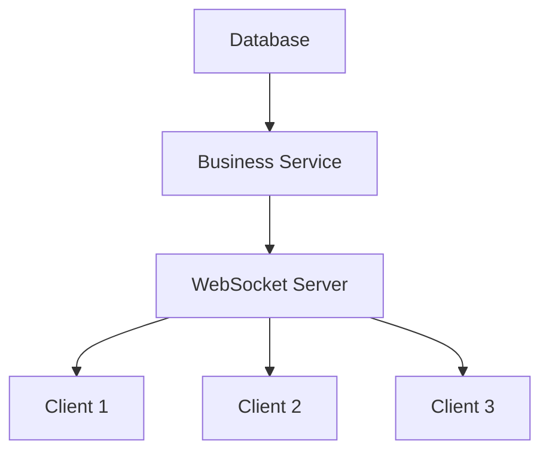
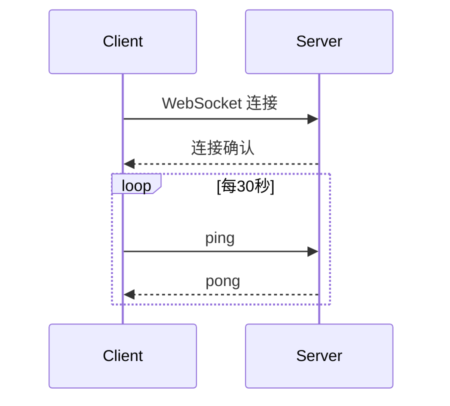

# WebSocket 控制通道

<cite>
**本文档引用的文件**  
- [services/ws-control-channel.js](file://server/services/ws-control-channel.js)
- [src/composables/useControlChannel.js](file://src/composables/useControlChannel.js)
</cite>

## 概述

WebSocket 控制通道提供了实时双向通信能力，支持服务器主动向客户端推送状态更新和接收远程控制命令。

## 目录

1. [架构设计](#架构设计)
2. [核心功能](#核心功能)
3. [服务端实现](#服务端实现)
4. [客户端使用](#客户端使用)
5. [消息协议](#消息协议)
6. [连接管理](#连接管理)
7. [安全性](#安全性)

## 架构设计



## 核心功能

- **实时状态推送** - 服务器主动推送设备状态变化
- **远程控制命令** - 客户端发送控制命令到服务器
- **多客户端广播** - 向所有连接客户端广播消息
- **连接管理** - 心跳检测、自动重连
- **消息路由** - 根据消息类型路由到不同处理器

## 服务端实现

### 初始化

```javascript
const { ControlChannel } = require('./services/ws-control-channel');

// 在 HTTP server 启动后初始化 WebSocket
const server = app.listen(PORT, () => {
  console.log(`Server running on port ${PORT}`);
});

// 初始化 WebSocket 控制通道
ControlChannel.initialize(server);
```

### 核心API

```javascript
// 广播消息到所有客户端
ControlChannel.broadcast({
  type: 'status_update',
  data: { temperature: 25.5 }
});

// 发送消息到指定客户端
ControlChannel.sendToClient(clientId, {
  type: 'command_response',
  data: { success: true }
});

// 获取连接统计
const stats = ControlChannel.getStats();
console.log(`Active connections: ${stats.activeConnections}`);
```

**章节来源**  
- [services/ws-control-channel.js](file://server/services/ws-control-channel.js)

## 客户端使用

### Vue Composable

```javascript
import { useControlChannel } from '@/composables/useControlChannel';

export default {
  setup() {
    const { 
      isConnected, 
      connect, 
      disconnect, 
      sendCommand,
      onMessage 
    } = useControlChannel();

    // 监听消息
    onMessage((message) => {
      if (message.type === 'status_update') {
        console.log('Status updated:', message.data);
      }
    });

    // 发送控制命令
    const toggleDevice = async (deviceId) => {
      await sendCommand({
        type: 'toggle_device',
        payload: { deviceId }
      });
    };

    return {
      isConnected,
      toggleDevice
    };
  }
};
```

**章节来源**  
- [src/composables/useControlChannel.js](file://src/composables/useControlChannel.js)

## 消息协议

### 消息格式

```typescript
interface WebSocketMessage {
  id: string;           // 消息唯一ID
  type: MessageType;    // 消息类型
  timestamp: string;    // ISO 8601 时间戳
  payload: any;         // 消息数据
}

type MessageType = 
  | 'status_update'     // 状态更新
  | 'command_request'   // 控制命令请求
  | 'command_response'  // 控制命令响应
  | 'error'             // 错误消息
  | 'ping' | 'pong';    // 心跳
```

### 状态更新消息

```json
{
  "id": "msg-001",
  "type": "status_update",
  "timestamp": "2025-03-10T12:00:00Z",
  "payload": {
    "assetId": "sensor-001",
    "metric": "temperature",
    "value": 25.5,
    "unit": "celsius"
  }
}
```

### 控制命令消息

```json
{
  "id": "cmd-001",
  "type": "command_request",
  "timestamp": "2025-03-10T12:00:00Z",
  "payload": {
    "action": "toggle",
    "target": "device-001",
    "parameters": {}
  }
}
```

## 连接管理

### 心跳机制



### 自动重连

客户端实现了自动重连机制：

```javascript
const RECONNECT_INTERVAL = 3000;  // 3秒后重连
const MAX_RECONNECT_ATTEMPTS = 5; // 最大重连次数

function connect() {
  ws = new WebSocket(WS_URL);
  
  ws.onclose = () => {
    if (reconnectAttempts < MAX_RECONNECT_ATTEMPTS) {
      setTimeout(connect, RECONNECT_INTERVAL);
      reconnectAttempts++;
    }
  };
  
  ws.onopen = () => {
    reconnectAttempts = 0;
  };
}
```

## 安全性

### 认证

WebSocket 连接复用 HTTP 认证的 JWT Token：

```javascript
// 客户端连接时携带 token
const ws = new WebSocket(`wss://api.example.com/ws?token=${jwtToken}`);

// 服务端验证
token = new URLSearchParams(req.url.split('?')[1]).get('token');
const user = await verifyJWT(token);
```

### 权限控制

```javascript
// 检查用户是否有权限执行命令
if (!user.hasPermission('device:control')) {
  ws.send(JSON.stringify({
    type: 'error',
    payload: { message: 'Permission denied' }
  }));
  return;
}
```

### 速率限制

```javascript
// 限制每个客户端的命令频率
const rateLimiter = new Map();

function checkRateLimit(clientId) {
  const now = Date.now();
  const clientLimit = rateLimiter.get(clientId);
  
  if (clientLimit && now - clientLimit.lastCommand < 1000) {
    return false; // 超过速率限制
  }
  
  rateLimiter.set(clientId, { lastCommand: now });
  return true;
}
```

---

**最后更新**: 2025-03-10
