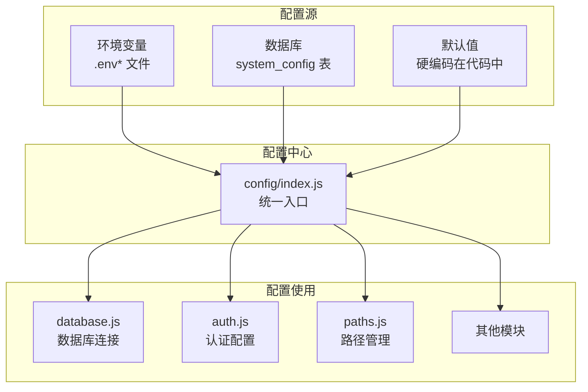
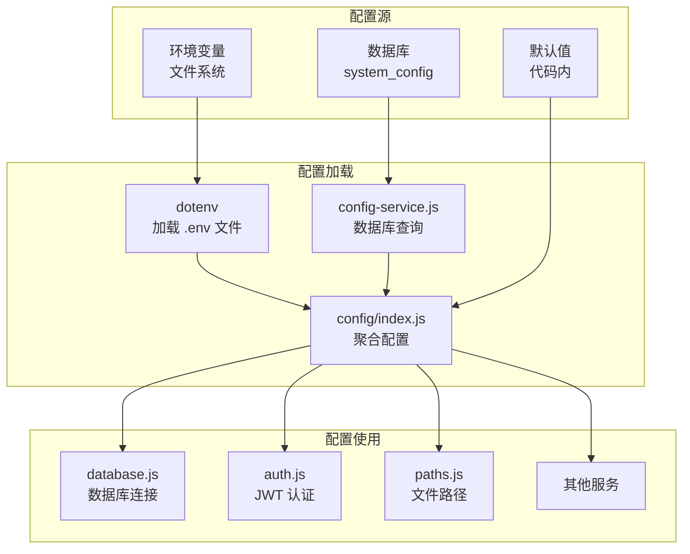
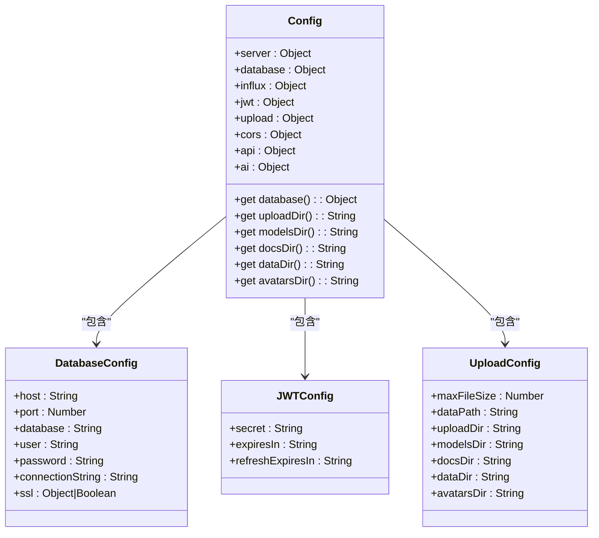
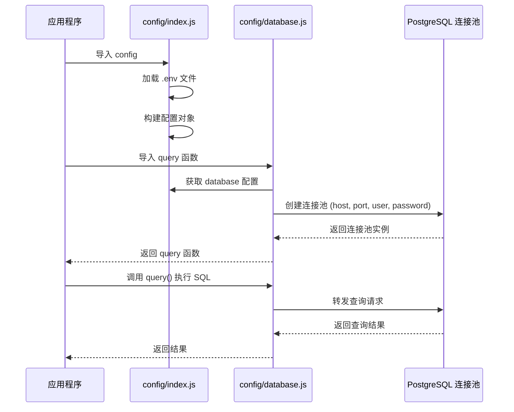
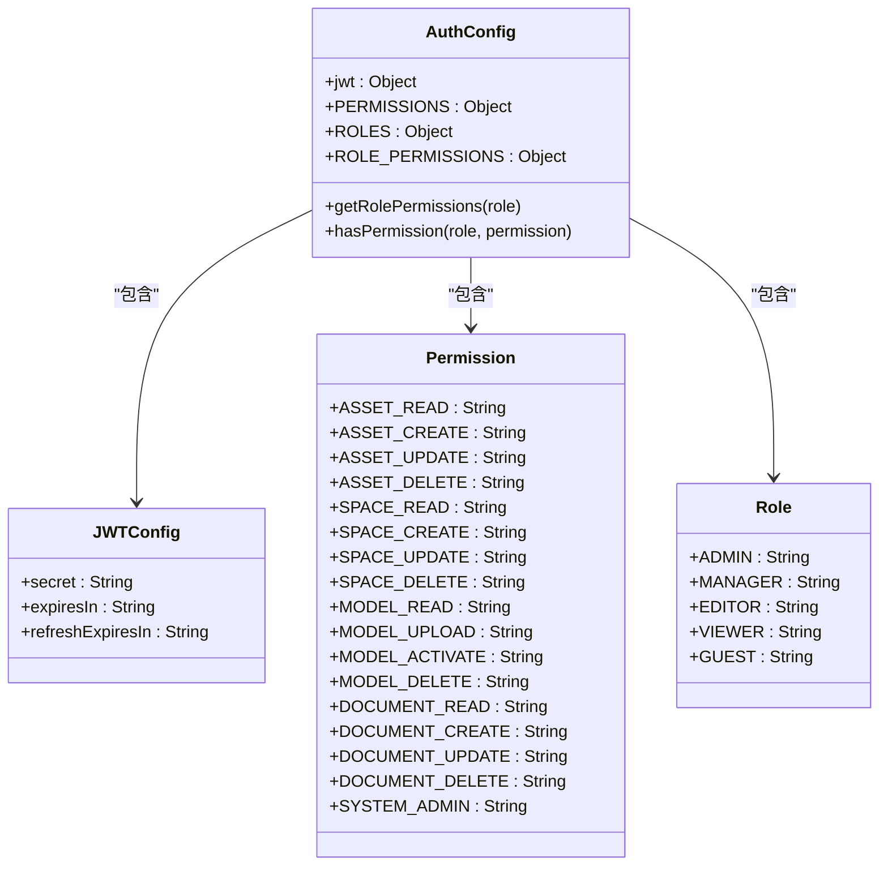
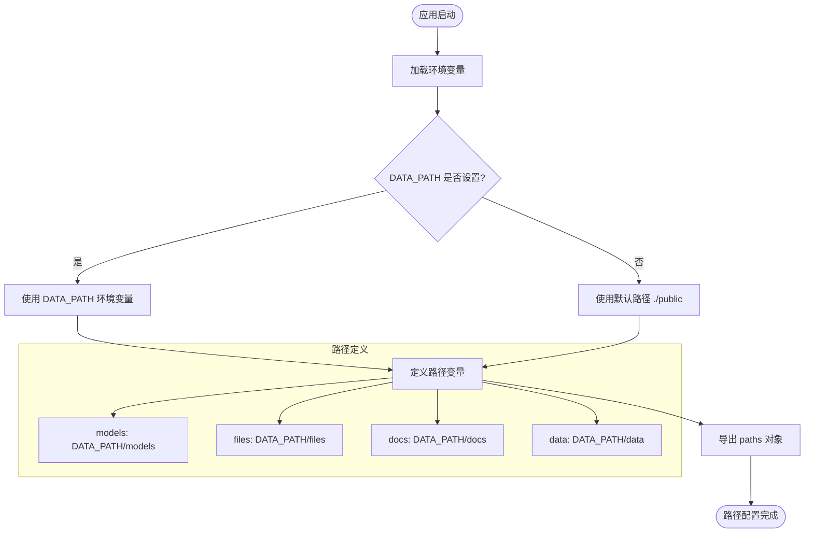
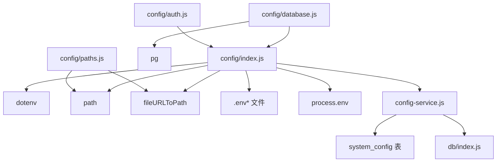
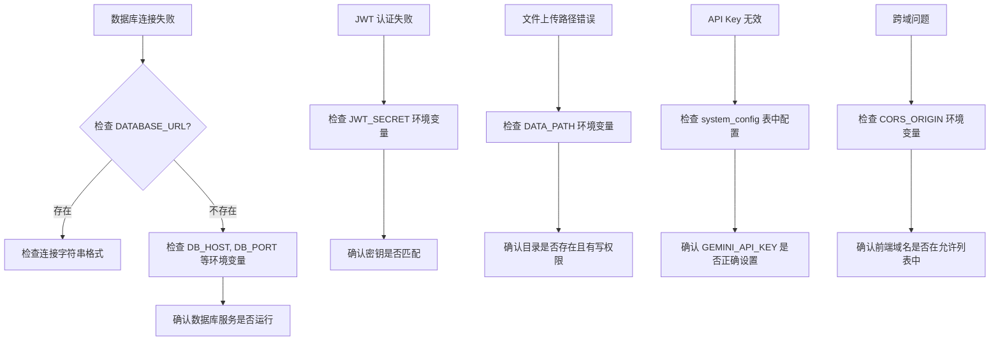

# 配置管理

<cite>
**本文档引用的文件**  
- [index.js](file://server/config/index.js)
- [database.js](file://server/config/database.js)
- [auth.js](file://server/config/auth.js)
- [paths.js](file://server/config/paths.js)
- [.env](file://.env)
- [.env.development](file://.env.development)
- [.env.production](file://.env.production)
- [config-service.js](file://server/services/config-service.js)
- [db/index.js](file://server/db/index.js)
- [004_system_config.sql](file://server/migrations/004_system_config.sql)
</cite>

## 目录
1. [简介](#简介)
2. [项目结构](#项目结构)
3. [核心组件](#核心组件)
4. [架构概览](#架构概览)
5. [详细组件分析](#详细组件分析)
6. [依赖分析](#依赖分析)
7. [性能考虑](#性能考虑)
8. [故障排除指南](#故障排除指南)
9. [结论](#结论)

## 简介
本文档详细描述 TwinSight 项目中配置中心化管理的实现机制。重点阐述 `config/index.js` 如何统一管理所有应用配置，实现开发与生产环境的隔离。文档解析了数据库连接参数的加载机制、JWT 安全配置、文件存储路径策略、配置优先级规则以及热更新可能性，并提供完整的配置项清单及其作用说明。

## 项目结构
TwinSight 项目的配置系统采用分层设计，核心配置文件集中存放在 `server/config` 目录下，通过环境变量和数据库实现灵活的配置管理。



**Diagram sources**
- [index.js](file://server/config/index.js#L1-L93)
- [database.js](file://server/config/database.js#L1-L74)
- [auth.js](file://server/config/auth.js#L1-L142)
- [paths.js](file://server/config/paths.js#L1-L47)

**Section sources**
- [index.js](file://server/config/index.js#L1-L93)
- [database.js](file://server/config/database.js#L1-L74)
- [auth.js](file://server/config/auth.js#L1-L142)
- [paths.js](file://server/config/paths.js#L1-L47)

## 核心组件
本系统的核心是 `config/index.js`，它作为所有配置的统一入口，通过模块化设计整合了服务器、数据库、认证、文件上传等关键配置。配置系统实现了环境隔离，支持开发和生产环境的不同设置，并通过环境变量优先级机制确保配置的灵活性和安全性。

**Section sources**
- [index.js](file://server/config/index.js#L1-L93)
- [database.js](file://server/config/database.js#L1-L74)
- [auth.js](file://server/config/auth.js#L1-L142)
- [paths.js](file://server/config/paths.js#L1-L47)

## 架构概览
配置管理系统采用分层架构，从多个来源获取配置信息，并通过统一的接口提供给应用程序使用。



**Diagram sources**
- [index.js](file://server/config/index.js#L1-L93)
- [config-service.js](file://server/services/config-service.js#L1-L111)
- [004_system_config.sql](file://server/migrations/004_system_config.sql#L1-L21)

## 详细组件分析

### 配置中心化管理分析
`config/index.js` 是整个应用的配置中心，它通过 `dotenv` 模块加载环境变量，并定义了所有核心配置项。



**Diagram sources**
- [index.js](file://server/config/index.js#L1-L93)

**Section sources**
- [index.js](file://server/config/index.js#L1-L93)

### 数据库连接参数加载机制
数据库配置通过 `config/database.js` 实现，它从 `config/index.js` 获取配置信息并创建连接池。



**Diagram sources**
- [database.js](file://server/config/database.js#L1-L74)
- [index.js](file://server/config/index.js#L1-L93)

**Section sources**
- [database.js](file://server/config/database.js#L1-L74)
- [index.js](file://server/config/index.js#L1-L93)

### JWT 安全配置分析
`auth.js` 文件定义了认证相关的配置，包括权限、角色和 JWT 设置。



**Diagram sources**
- [auth.js](file://server/config/auth.js#L1-L142)

**Section sources**
- [auth.js](file://server/config/auth.js#L1-L142)

### 文件存储路径策略
`paths.js` 文件定义了基于环境变量的数据存储路径策略。



**Diagram sources**
- [paths.js](file://server/config/paths.js#L1-L47)

**Section sources**
- [paths.js](file://server/config/paths.js#L1-L47)

## 依赖分析
配置系统依赖于多个模块和外部服务，形成了清晰的依赖关系。



**Diagram sources**
- [index.js](file://server/config/index.js#L1-L93)
- [database.js](file://server/config/database.js#L1-L74)
- [auth.js](file://server/config/auth.js#L1-L142)
- [paths.js](file://server/config/paths.js#L1-L47)
- [config-service.js](file://server/services/config-service.js#L1-L111)
- [db/index.js](file://server/db/index.js#L1-L93)

**Section sources**
- [index.js](file://server/config/index.js#L1-L93)
- [database.js](file://server/config/database.js#L1-L74)
- [auth.js](file://server/config/auth.js#L1-L142)
- [paths.js](file://server/config/paths.js#L1-L47)
- [config-service.js](file://server/services/config-service.js#L1-L111)

## 性能考虑
配置管理系统在设计时考虑了性能因素，特别是在数据库配置查询方面。

```mermaid
flowchart LR
A[首次请求] --> B{配置缓存存在?}
B --> |否| C[查询数据库 system_config 表]
C --> D[获取配置值]
D --> E[存入内存缓存 (5分钟)]
E --> F[返回配置值]
B --> |是| G[从缓存读取]
G --> F
H[配置更新] --> I[清除缓存]
I --> J[下次请求重新查询数据库]
```

**Diagram sources**
- [config-service.js](file://server/services/config-service.js#L1-L111)

**Section sources**
- [config-service.js](file://server/services/config-service.js#L1-L111)

## 故障排除指南
当配置系统出现问题时，可以参考以下常见问题和解决方案。



**Diagram sources**
- [database.js](file://server/config/database.js#L1-L74)
- [auth.js](file://server/config/auth.js#L1-L142)
- [paths.js](file://server/config/paths.js#L1-L47)
- [004_system_config.sql](file://server/migrations/004_system_config.sql#L1-L21)

**Section sources**
- [database.js](file://server/config/database.js#L1-L74)
- [auth.js](file://server/config/auth.js#L1-L142)
- [paths.js](file://server/config/paths.js#L1-L47)
- [004_system_config.sql](file://server/migrations/004_system_config.sql#L1-L21)

## 结论
TwinSight 项目的配置管理系统通过 `config/index.js` 实现了配置的中心化管理，支持环境隔离和灵活的配置优先级。系统通过环境变量、配置文件和数据库三层机制确保配置的安全性和灵活性。数据库连接参数通过 `config/database.js` 安全加载，JWT 配置在 `auth.js` 中定义，文件路径策略由 `paths.js` 管理。配置优先级遵循"环境变量 > 配置文件 > 默认值"的原则，敏感信息存储在数据库的 `system_config` 表中并通过缓存提高性能。该系统为应用提供了稳定、安全且易于维护的配置管理解决方案。