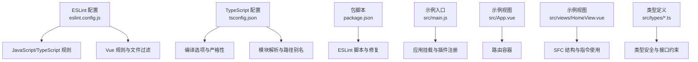
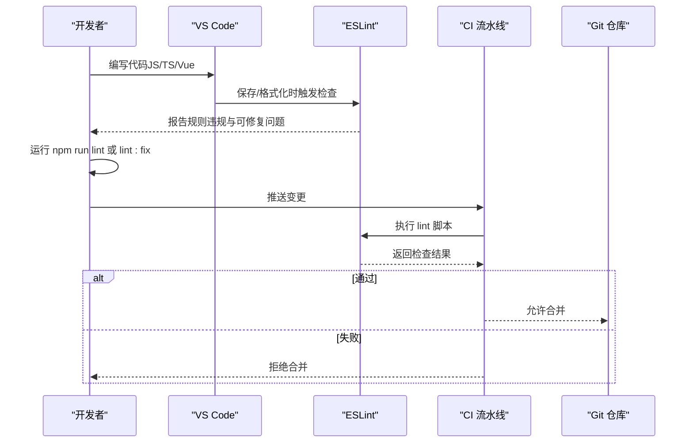
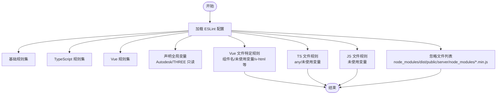
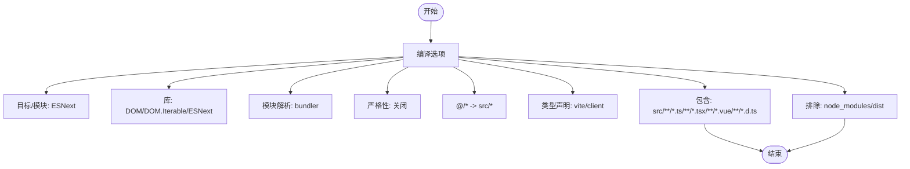
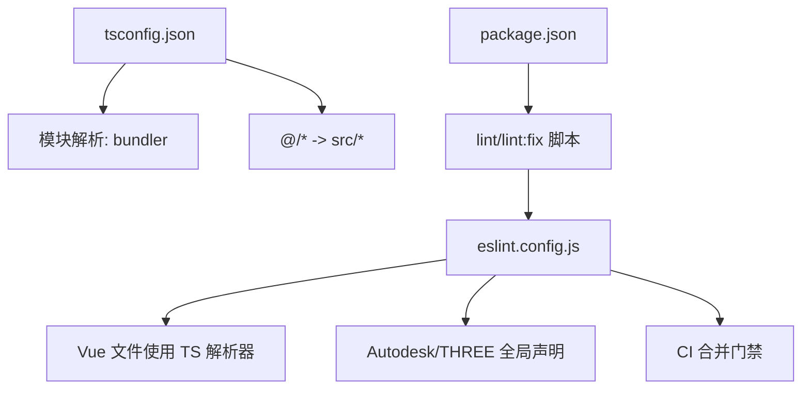

# 代码规范

<cite>
**本文引用的文件**
- [eslint.config.js](file://eslint.config.js)
- [tsconfig.json](file://tsconfig.json)
- [package.json](file://package.json)
- [README.md](file://README.md)
- [src/App.vue](file://src/App.vue)
- [src/main.js](file://src/main.js)
- [src/views/HomeView.vue](file://src/views/HomeView.vue)
- [src/types/auth.ts](file://src/types/auth.ts)
- [src/types/asset.ts](file://src/types/asset.ts)
- [src/types/model.ts](file://src/types/model.ts)
</cite>

## 目录
1. [引言](#引言)
2. [项目结构](#项目结构)
3. [核心组件](#核心组件)
4. [架构总览](#架构总览)
5. [详细组件分析](#详细组件分析)
6. [依赖关系分析](#依赖关系分析)
7. [性能考虑](#性能考虑)
8. [故障排查指南](#故障排查指南)
9. [结论](#结论)
10. [附录](#附录)

## 引言
本文件旨在制定统一的代码风格规范，确保团队在 JavaScript/TypeScript 与 Vue 单文件组件（SFC）开发中保持一致的风格与质量标准。规范以仓库中的 ESLint 配置与 TypeScript 配置为依据，覆盖以下方面：
- JavaScript/TypeScript 规则：如对 any 类型的处理策略、未使用变量的告警级别等
- Vue 单文件组件规则：如组件命名、v-html 的使用策略、未使用变量告警等
- 全局变量定义：如 Autodesk、THREE 等第三方全局对象
- 忽略文件配置：避免对构建产物与第三方目录进行不必要的检查
- 类型检查与模块解析：基于 tsconfig.json 的严格性与路径别名配置
- 编辑器（VS Code）集成建议：自动格式化、错误提示与保存时修复
- 提交前质量门禁：必须通过 ESLint 检查，否则 CI 将拒绝合并

## 项目结构
本项目采用前端单页应用（SPA）架构，核心由 Vue 3 + Vite 构建，TypeScript 提供类型安全，ESLint 统一代码风格。关键配置文件如下：
- ESLint 配置：eslint.config.js
- TypeScript 配置：tsconfig.json
- 包管理与脚本：package.json
- 示例入口与视图：src/main.js、src/App.vue、src/views/HomeView.vue
- 类型定义：src/types/*.ts

图表来源
- [eslint.config.js](file://eslint.config.js#L1-L79)
- [tsconfig.json](file://tsconfig.json#L1-L47)
- [package.json](file://package.json#L1-L34)
- [src/main.js](file://src/main.js#L1-L40)
- [src/App.vue](file://src/App.vue#L1-L12)
- [src/views/HomeView.vue](file://src/views/HomeView.vue#L1-L120)
- [src/types/auth.ts](file://src/types/auth.ts#L1-L46)
- [src/types/asset.ts](file://src/types/asset.ts#L1-L65)
- [src/types/model.ts](file://src/types/model.ts#L1-L34)

章节来源
- [eslint.config.js](file://eslint.config.js#L1-L79)
- [tsconfig.json](file://tsconfig.json#L1-L47)
- [package.json](file://package.json#L1-L34)
- [README.md](file://README.md#L1-L6)

## 核心组件
本节聚焦于 ESLint 与 TypeScript 的核心配置项，以及它们如何影响日常开发与质量门禁。

- ESLint 规则与文件过滤
  - 基础规则：启用官方推荐规则集
  - TypeScript 规则：启用推荐的 TypeScript ESLint 规则集
  - Vue 规则：启用推荐的 Vue ESLint 规则集
  - 全局变量：浏览器与 Node 环境内置变量基础上，额外声明 Autodesk 与 THREE 为只读全局变量
  - Vue 文件特定规则：关闭多词组件名限制、允许 v-html、对未使用变量发出警告、HTML 自闭合与换行策略等
  - TypeScript 文件规则：对 any 类型不强制显式标注 any；对未使用的变量支持忽略以“_”开头的参数
  - JavaScript 文件规则：对未使用的变量支持忽略以“_”开头的参数
  - 忽略文件：排除 node_modules、dist、public、server/node_modules 与 *.min.js

- TypeScript 配置
  - 目标与模块：ESNext 与 ESNext
  - 库：包含 DOM、DOM.Iterable、ESNext
  - 解析模式：bundler
  - 严格性：关闭严格模式，禁用未使用局部变量与未使用参数的报告
  - 路径别名：baseUrl 与 @/* 映射到 src/*
  - 类型声明：包含 vite/client
  - 包含与排除：src 下的 ts/tsx/vue/d.ts 文件，排除 node_modules 与 dist

- 包脚本与质量门禁
  - lint：对 src 下的 .vue/.js/.ts 执行 ESLint 检查
  - lint:fix：对上述文件执行 ESLint 自动修复
  - 质量门禁：提交前必须通过 lint 脚本，否则 CI 将拒绝合并

章节来源
- [eslint.config.js](file://eslint.config.js#L1-L79)
- [tsconfig.json](file://tsconfig.json#L1-L47)
- [package.json](file://package.json#L1-L34)

## 架构总览
下图展示了从开发到提交的质量控制流程，强调 ESLint 在其中的关键作用。

图表来源
- [package.json](file://package.json#L1-L34)
- [eslint.config.js](file://eslint.config.js#L1-L79)

## 详细组件分析

### ESLint 配置详解
- JavaScript/TypeScript 规则
  - 对 any 类型的处理：TypeScript 规则集中默认行为由推荐配置决定；当前项目对显式 any 的规则未强制开启，但可在团队内部约定中补充更严格的规则
  - 未使用变量告警：TS/JS 文件均对未使用变量发出警告，并支持忽略以“_”开头的参数，便于函数签名与占位符场景
- Vue 单文件组件规则
  - 组件命名：关闭多词组件名限制，允许短小组件名，提升开发效率
  - v-html：允许使用 v-html，但需配合内容来源与安全校验策略
  - 未使用变量：对 Vue 文件中的未使用变量发出警告
  - HTML 自闭合与换行：对自闭合标签与换行策略给出建议性警告，便于统一风格
- 全局变量定义
  - 在语言选项中声明 Autodesk 与 THREE 为只读全局变量，使相关第三方库在全局环境下可用且不会被误报为未定义
- 忽略文件配置
  - 排除 node_modules、dist、public、server/node_modules 与 *.min.js，避免对第三方与构建产物进行不必要的检查

图表来源
- [eslint.config.js](file://eslint.config.js#L1-L79)

章节来源
- [eslint.config.js](file://eslint.config.js#L1-L79)

### TypeScript 配置详解
- 编译目标与模块：ESNext，利于现代语法与打包工具链
- 库：包含 DOM、DOM.Iterable、ESNext，满足浏览器与 DOM API 使用
- 模块解析：bundler，适配 Vite 等现代打包器
- 严格性：关闭严格模式，未使用局部变量与未使用参数不报告，降低初期学习成本
- 路径别名：baseUrl 与 @/* 映射到 src/*，提升导入可读性
- 类型声明：包含 vite/client，增强 Vite 环境下的类型支持
- 包含与排除：仅对 src 下的 ts/tsx/vue/d.ts 进行类型检查，排除 node_modules 与 dist

图表来源
- [tsconfig.json](file://tsconfig.json#L1-L47)

章节来源
- [tsconfig.json](file://tsconfig.json#L1-L47)

### Vue 单文件组件实践要点
- 组件命名：根据 ESLint 配置，允许短组件名，但建议在团队内约定统一的命名风格与语义化命名，避免过度简短导致歧义
- v-html 使用：允许使用 v-html，但务必确保内容来源可信或经过严格转义，避免 XSS 风险
- 未使用变量：对未使用变量发出警告，建议及时清理或添加注释说明用途
- 指令与事件：示例视图中广泛使用 v-for、v-animate 等指令，建议在模板中保持简洁与可读性

章节来源
- [src/views/HomeView.vue](file://src/views/HomeView.vue#L1-L120)

### 类型系统与接口约束
- 认证类型：用户、角色、权限、登录请求/响应、Token 负载等接口清晰定义，便于前后端契约一致
- 资产类型：资产、规格、分类、创建/更新请求等接口，支持 Record<string, unknown> 作为动态属性预留
- 模型类型：模型状态枚举、模型文件、上传请求/响应等接口，便于模型管理与上传流程的类型约束

章节来源
- [src/types/auth.ts](file://src/types/auth.ts#L1-L46)
- [src/types/asset.ts](file://src/types/asset.ts#L1-L65)
- [src/types/model.ts](file://src/types/model.ts#L1-L34)

## 依赖关系分析
- ESLint 与 TypeScript 的耦合点
  - Vue 文件使用 TypeScript 解析器，确保 .vue 中的 TS/JS 逻辑得到一致的类型与风格检查
  - 全局变量声明与第三方库（Autodesk、THREE）的使用相辅相成，保证在全局上下文中引用这些库时不会产生未定义错误
- 包脚本与质量门禁
  - lint 与 lint:fix 脚本直接对接 ESLint 配置，形成本地与 CI 的统一检查标准
  - CI 拒绝未通过 lint 的变更，确保主干代码质量

图表来源
- [eslint.config.js](file://eslint.config.js#L1-L79)
- [tsconfig.json](file://tsconfig.json#L1-L47)
- [package.json](file://package.json#L1-L34)

章节来源
- [eslint.config.js](file://eslint.config.js#L1-L79)
- [tsconfig.json](file://tsconfig.json#L1-L47)
- [package.json](file://package.json#L1-L34)

## 性能考虑
- ESLint 检查范围：通过忽略 node_modules、dist、public、server/node_modules 与 *.min.js，减少不必要的检查开销
- TypeScript 严格性：关闭严格模式与未使用变量/参数报告，降低初期开发负担；建议在团队内逐步引入更严格的规则以提升长期质量
- 模块解析：bundler 模式与路径别名提升导入性能与可维护性

## 故障排查指南
- 未通过 ESLint 检查
  - 现象：本地或 CI 报告规则违规或无法修复
  - 处理：运行 npm run lint:fix 自动修复；手动修正剩余问题；确认全局变量声明与 Vue 特定规则符合预期
- 全局变量未定义
  - 现象：Autodesk/THREE 被标记为未定义
  - 处理：确认 ESLint 配置已声明 Autodesk 与 THREE 为只读全局变量；若仍报错，检查编辑器插件与缓存
- Vue 文件类型检查异常
  - 现象：Vue 文件中的 TS/JS 逻辑未按预期进行类型检查
  - 处理：确认 Vue 文件使用了 TS 解析器；检查 tsconfig.json 的 include/exclude 与路径别名配置
- CI 拒绝合并
  - 现象：推送后 CI 报告 lint 失败
  - 处理：在本地执行 npm run lint 并修复所有问题；确保提交前本地已通过检查

章节来源
- [eslint.config.js](file://eslint.config.js#L1-L79)
- [tsconfig.json](file://tsconfig.json#L1-L47)
- [package.json](file://package.json#L1-L34)

## 结论
本规范以 eslint.config.js 与 tsconfig.json 为核心，明确了 JavaScript/TypeScript 与 Vue 的风格与质量要求，并通过包脚本与 CI 门禁确保提交质量。建议团队在此基础上：
- 明确 any 类型使用边界与替代方案
- 在 Vue 开发中谨慎使用 v-html，建立内容来源与安全校验机制
- 逐步收紧 TypeScript 严格性，提升长期可维护性
- 在 VS Code 中启用保存时修复与 ESLint 插件，提高开发效率

## 附录

### VS Code 集成建议
- 安装并启用 ESLint 插件，确保在编辑器中即时显示规则违规与可修复问题
- 配置保存时自动修复：在设置中启用“ESLint: Fix on Save”，并在工作区设置中指定 ESLint 脚本
- 使用 Prettier 与 ESLint 配合：在编辑器中启用 Prettier 作为格式化器，确保风格统一
- 验证全局变量：确认编辑器已识别 Autodesk 与 THREE 为全局变量，避免误报

### 提交前质量门禁
- 必须通过 npm run lint（或 npm run lint:fix 后再次 lint）方可合并
- CI 将执行相同检查，未通过将拒绝合并

章节来源
- [package.json](file://package.json#L1-L34)
- [eslint.config.js](file://eslint.config.js#L1-L79)