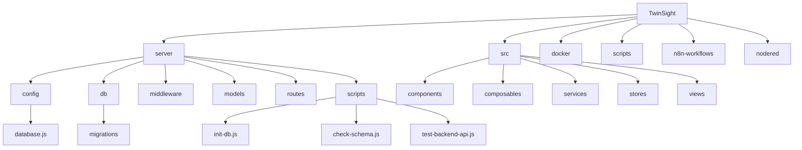

# 开发者指南

<cite>
**本文档中引用的文件**  
- [run-migration.js](file://server/run-migration.js)
- [check-tables.js](file://server/check-tables.js)
- [eslint.config.js](file://eslint.config.js)
- [package.json](file://package.json)
- [server/package.json](file://server/package.json)
- [server/config/database.js](file://server/config/database.js)
- [server/db/index.js](file://server/db/index.js)
- [server/scripts/init-db.js](file://server/scripts/init-db.js)
- [server/scripts/check-schema.js](file://server/scripts/check-schema.js)
- [server/scripts/test-backend-api.js](file://server/scripts/test-backend-api.js)
- [server/start.sh](file://server/start.sh)
- [server/start.bat](file://server/start.bat)
- [server/.env](file://server/.env)
- [docker/.env](file://docker/.env)
</cite>

## 目录
1. [简介](#简介)
2. [项目结构](#项目结构)
3. [本地开发环境搭建](#本地开发环境搭建)
4. [数据库初始化与迁移](#数据库初始化与迁移)
5. [数据校验脚本](#数据校验脚本)
6. [维护脚本详解](#维护脚本详解)
7. [代码风格与质量规范](#代码风格与质量规范)
8. [提交信息约定与分支管理](#提交信息约定与分支管理)
9. [测试策略](#测试策略)
10. [调试技巧](#调试技巧)
11. [Pull Request 审查流程](#pull-request-审查流程)

## 简介
本指南旨在为 TwinSight 项目的贡献者提供全面的开发指导。内容涵盖本地环境配置、数据库管理、代码规范、测试策略、调试技巧以及协作流程。通过遵循本指南，开发者可以快速上手并高效地参与项目开发。

## 项目结构
TwinSight 项目采用前后端分离的架构，主要目录结构如下：



**Diagram sources**
- [server](file://server)
- [src](file://src)
- [docker](file://docker)

## 本地开发环境搭建
### 前置条件
- Node.js (v18+)
- PostgreSQL 数据库
- Docker (可选，用于 n8n 和 Node-RED)

### 环境配置步骤
1. 克隆项目仓库
2. 安装依赖：
   ```bash
   npm install
   cd server && npm install
   ```
3. 配置环境变量：复制 `server/.env.example` 为 `server/.env` 并根据需要修改数据库连接参数
4. 启动服务器：
   - Linux/Mac: `./server/start.sh`
   - Windows: `server\start.bat`

**Section sources**
- [server/start.sh](file://server/start.sh#L1-L54)
- [server/start.bat](file://server/start.bat#L1-L55)
- [server/.env](file://server/.env#L1-L24)

## 数据库初始化与迁移
### 数据库初始化
使用 `init-db.js` 脚本初始化数据库表结构：

```bash
cd server
node scripts/init-db.js
```

该脚本会读取 `db/schema.sql` 文件并执行其中的 SQL 语句来创建所有必要的表。

### 数据库迁移
`run-migration.js` 脚本用于执行增量数据库迁移：

```bash
cd server
node run-migration.js
```

该脚本会：
1. 加载 `.env` 文件中的环境变量
2. 连接到 PostgreSQL 数据库
3. 执行 `db/add_view_id_to_documents.sql` 中的迁移语句
4. 输出执行结果

**Section sources**
- [server/scripts/init-db.js](file://server/scripts/init-db.js#L1-L40)
- [server/run-migration.js](file://server/run-migration.js#L1-L39)
- [server/db/schema.sql](file://server/db/schema.sql)
- [server/db/add_view_id_to_documents.sql](file://server/db/add_view_id_to_documents.sql)

## 数据校验脚本
### check-tables.js
该脚本用于验证数据库表的主键配置：

```bash
cd server
node check-tables.js
```

功能包括：
- 检查 `assets` 表的主键
- 检查 `spaces` 表的主键
- 检查 `asset_specs` 表的主键

输出示例：
```
Assets表主键: ['id']
Spaces表主键: ['id']
Asset_specs表主键: ['id']
```

### check-schema.js
更详细的数据库结构检查脚本：

```bash
cd server
node scripts/check-schema.js
```

提供以下信息：
- 列结构（名称、类型、长度、是否可为空）
- 约束条件
- 索引信息

**Section sources**
- [server/check-tables.js](file://server/check-tables.js#L1-L40)
- [server/scripts/check-schema.js](file://server/scripts/check-schema.js#L1-L54)

## 维护脚本详解
`server/scripts/` 目录包含多种维护脚本，分类如下：

### 数据库管理
- `init-db.js`: 初始化数据库表结构
- `add-uuid-columns.js`: 添加 UUID 列
- `add-influx-config-table.js`: 创建 InfluxDB 配置表

### 数据迁移
- `add-spec-name-migration.js`: 添加规格名称迁移
- `run_file_id_migration.js`: 执行文件 ID 迁移
- `migrate-influx-tags.js`: 迁移 InfluxDB 标签

### 数据验证与修复
- `check-schema.js`: 检查表结构
- `verify-constraints.js`: 验证约束条件
- `fix-constraints.js`: 修复约束问题
- `cleanup-influx-codes.js`: 清理 InfluxDB 代码

### 调试与测试
- `test-backend-api.js`: 测试后端 API 连通性
- `test-db-connection.js`: 测试数据库连接
- `debug_constraints.js`: 调试约束问题

### 系统维护
- `post-deploy.js`: 部署后执行脚本
- `update-admin-password.js`: 更新管理员密码
- `backfill-openwebui-file-ids.js`: 填充 OpenWebUI 文件 ID

**Section sources**
- [server/scripts](file://server/scripts)
- [server/scripts/test-backend-api.js](file://server/scripts/test-backend-api.js#L1-L58)

## 代码风格与质量规范
### ESLint 配置
项目使用 `eslint.config.js` 进行代码质量检查，主要规则包括：

```javascript
export default [
    js.configs.recommended,
    ...tseslint.configs.recommended,
    ...pluginVue.configs['flat/recommended'],
    {
        languageOptions: {
            globals: {
                ...globals.browser,
                ...globals.node,
                Autodesk: 'readonly',
                THREE: 'readonly'
            }
        }
    },
    {
        files: ['**/*.vue'],
        rules: {
            'vue/multi-word-component-names': 'off',
            'vue/no-v-html': 'off',
            'vue/require-default-prop': 'off'
        }
    }
]
```

### 代码检查命令
```bash
# 检查代码
npm run lint

# 自动修复可修复的问题
npm run lint:fix
```

**Section sources**
- [eslint.config.js](file://eslint.config.js#L1-L79)
- [package.json](file://package.json#L1-L34)

## 提交信息约定与分支管理
### 提交信息格式
采用 Angular 提交信息规范：
```
<type>(<scope>): <subject>
<BLANK LINE>
<body>
<BLANK LINE>
<footer>
```

类型包括：
- `feat`: 新功能
- `fix`: 修复 bug
- `docs`: 文档更新
- `style`: 代码格式调整
- `refactor`: 代码重构
- `test`: 测试相关
- `chore`: 构建过程或辅助工具变动

### 分支管理策略
采用 Git Flow 工作流：
- `main`: 主分支，生产环境代码
- `develop`: 开发分支，集成所有功能
- `feature/*`: 功能分支
- `release/*`: 发布分支
- `hotfix/*`: 热修复分支

**Section sources**
- [package.json](file://package.json#L6-L12)

## 测试策略
### API 测试
使用 `test-backend-api.js` 脚本测试后端 API：

```bash
cd server
node scripts/test-backend-api.js
```

测试内容包括：
1. 健康检查端点
2. 资产数据查询
3. 规格数据查询
4. 分类数据查询

### 手动测试
建议使用 Postman 或类似工具进行 API 手动测试，测试用例应覆盖：
- 正常请求
- 边界条件
- 错误处理
- 权限验证

**Section sources**
- [server/scripts/test-backend-api.js](file://server/scripts/test-backend-api.js#L1-L58)

## 调试技巧
### 启用详细日志
1. 在 `server/.env` 中添加调试配置
2. 使用 `add_debug_logging.cjs` 脚本启用调试日志
3. 查看控制台输出的详细日志信息

### 使用 Postman 测试 API
1. 导入项目提供的 Postman 集合
2. 配置环境变量（如 baseURL、token）
3. 按模块组织测试用例
4. 使用 Pre-request Script 和 Tests 编写自动化测试

### 数据库调试
- 使用 `check-schema.js` 验证表结构
- 使用 `debug_constraints.js` 调试约束问题
- 使用 `quick-count.js` 快速统计表记录数

**Section sources**
- [server/.env](file://server/.env#L1-L24)
- [server/scripts/add_debug_logging.cjs](file://server/scripts/add_debug_logging.cjs)
- [server/scripts/debug_constraints.js](file://server/scripts/debug_constraints.js)

## Pull Request 审查流程
### 提交 PR 前检查
1. 确保代码符合 ESLint 规范
2. 运行相关测试用例
3. 更新文档（如有必要）
4. 确保提交信息格式正确

### 审查要点
- 代码质量：是否符合编码规范
- 功能实现：是否满足需求
- 性能影响：是否有性能问题
- 安全性：是否存在安全漏洞
- 可维护性：代码是否易于理解和维护

### 合并条件
- 至少一名核心成员批准
- CI/CD 流水线全部通过
- 覆盖必要的测试用例
- 文档更新完整

**Section sources**
- [server/package.json](file://server/package.json#L7-L12)