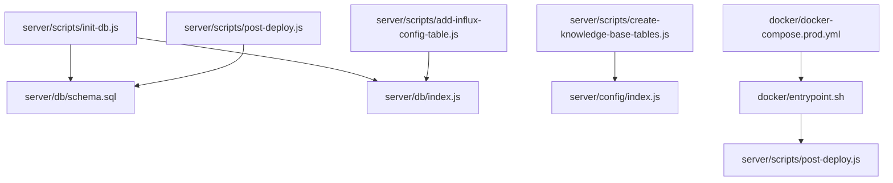
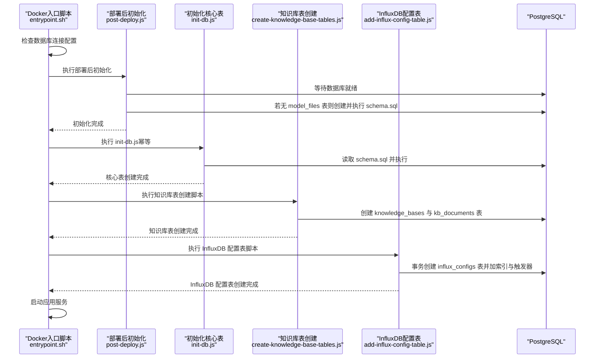
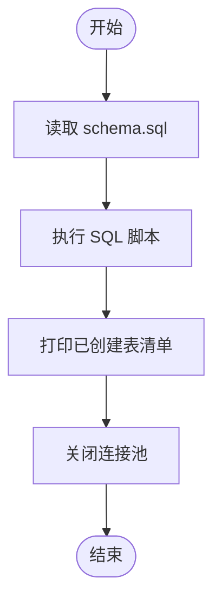
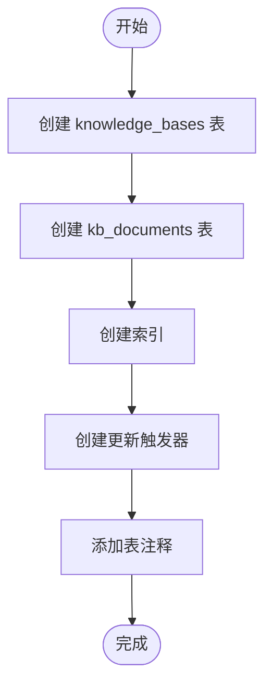
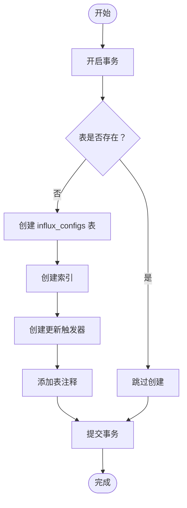
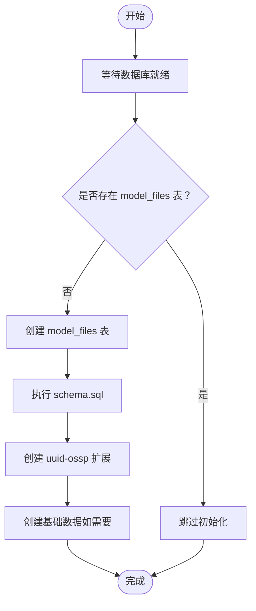
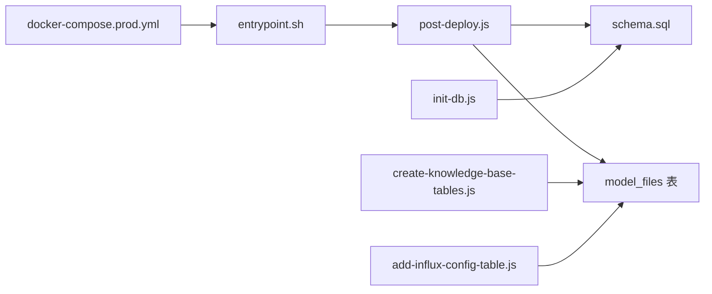

# 初始化脚本

<cite>
**本文引用的文件**
- [server/scripts/init-db.js](file://server/scripts/init-db.js)
- [server/scripts/create-knowledge-base-tables.js](file://server/scripts/create-knowledge-base-tables.js)
- [server/scripts/add-influx-config-table.js](file://server/scripts/add-influx-config-table.js)
- [server/db/index.js](file://server/db/index.js)
- [server/db/schema.sql](file://server/db/schema.sql)
- [server/scripts/post-deploy.js](file://server/scripts/post-deploy.js)
- [docker/entrypoint.sh](file://docker/entrypoint.sh)
- [docker/docker-compose.prod.yml](file://docker/docker-compose.prod.yml)
- [server/package.json](file://server/package.json)
- [server/config/index.js](file://server/config/index.js)
</cite>

## 目录
1. [简介](#简介)
2. [项目结构](#项目结构)
3. [核心组件](#核心组件)
4. [架构总览](#架构总览)
5. [详细组件分析](#详细组件分析)
6. [依赖关系分析](#依赖关系分析)
7. [性能考量](#性能考量)
8. [故障排查指南](#故障排查指南)
9. [结论](#结论)
10. [附录](#附录)

## 简介
本文件面向系统首次部署场景，系统性说明三类数据库初始化脚本：
- init-db.js：初始化核心表结构（基于 schema.sql）
- create-knowledge-base-tables.js：创建与 Open WebUI 知识库关联的映射表
- add-influx-config-table.js：为模型添加 InfluxDB 时序数据库配置表

文档涵盖执行顺序、依赖关系、命令行参数、预期输出，以及在 Docker 环境中容器启动时自动执行这些脚本的方法，并给出常见权限与连接问题的处理建议。

## 项目结构
与数据库初始化相关的文件主要位于 server/scripts 与 server/db 目录，配合 Docker 的入口脚本与编排文件实现自动化的首次部署流程。

图表来源
- [server/scripts/init-db.js](file://server/scripts/init-db.js#L1-L40)
- [server/db/schema.sql](file://server/db/schema.sql#L1-L202)
- [server/db/index.js](file://server/db/index.js#L1-L93)
- [server/scripts/create-knowledge-base-tables.js](file://server/scripts/create-knowledge-base-tables.js#L1-L84)
- [server/config/index.js](file://server/config/index.js#L1-L93)
- [server/scripts/add-influx-config-table.js](file://server/scripts/add-influx-config-table.js#L1-L95)
- [server/scripts/post-deploy.js](file://server/scripts/post-deploy.js#L1-L182)
- [docker/entrypoint.sh](file://docker/entrypoint.sh#L1-L36)
- [docker/docker-compose.prod.yml](file://docker/docker-compose.prod.yml#L1-L262)

章节来源
- [server/scripts/init-db.js](file://server/scripts/init-db.js#L1-L40)
- [server/scripts/create-knowledge-base-tables.js](file://server/scripts/create-knowledge-base-tables.js#L1-L84)
- [server/scripts/add-influx-config-table.js](file://server/scripts/add-influx-config-table.js#L1-L95)
- [server/db/schema.sql](file://server/db/schema.sql#L1-L202)
- [server/db/index.js](file://server/db/index.js#L1-L93)
- [server/scripts/post-deploy.js](file://server/scripts/post-deploy.js#L1-L182)
- [docker/entrypoint.sh](file://docker/entrypoint.sh#L1-L36)
- [docker/docker-compose.prod.yml](file://docker/docker-compose.prod.yml#L1-L262)

## 核心组件
- init-db.js：读取并执行 schema.sql，创建核心业务表与索引，打印已创建的表清单，最后关闭连接池。
- create-knowledge-base-tables.js：创建知识库映射表与文档同步表，建立索引与更新触发器，添加注释，使用独立连接池。
- add-influx-config-table.js：在事务中检查并创建 InfluxDB 配置表，建立索引与触发器，添加注释，支持幂等执行。
- post-deploy.js：等待数据库就绪、检测并创建 model_files 表、执行完整 schema、创建必要扩展与基础数据，作为容器启动时的统一初始化入口。

章节来源
- [server/scripts/init-db.js](file://server/scripts/init-db.js#L1-L40)
- [server/scripts/create-knowledge-base-tables.js](file://server/scripts/create-knowledge-base-tables.js#L1-L84)
- [server/scripts/add-influx-config-table.js](file://server/scripts/add-influx-config-table.js#L1-L95)
- [server/scripts/post-deploy.js](file://server/scripts/post-deploy.js#L1-L182)

## 架构总览
以下序列图展示容器启动时的初始化流程，重点体现 init-db.js、create-knowledge-base-tables.js、add-influx-config-table.js 的协作关系与执行顺序。

图表来源
- [docker/entrypoint.sh](file://docker/entrypoint.sh#L1-L36)
- [server/scripts/post-deploy.js](file://server/scripts/post-deploy.js#L1-L182)
- [server/scripts/init-db.js](file://server/scripts/init-db.js#L1-L40)
- [server/db/schema.sql](file://server/db/schema.sql#L1-L202)
- [server/scripts/create-knowledge-base-tables.js](file://server/scripts/create-knowledge-base-tables.js#L1-L84)
- [server/scripts/add-influx-config-table.js](file://server/scripts/add-influx-config-table.js#L1-L95)

## 详细组件分析

### init-db.js（初始化核心表结构）
- 作用：读取 server/db/schema.sql 并执行，创建核心业务表与索引，打印已创建的表清单，最后关闭连接池。
- 执行顺序：在 post-deploy.js 成功初始化后，由入口脚本再次调用，确保 schema.sql 在 model_files 存在后执行。
- 依赖关系：
  - 依赖 server/db/schema.sql（核心表结构定义）
  - 依赖 server/db/index.js（连接池与查询封装）
- 命令行参数：无；直接 node scripts/init-db.js
- 预期输出：成功时打印“数据库表结构创建成功”及已创建的表清单；失败时记录错误并退出进程。
- 错误处理：捕获异常并以非零退出码终止；最终关闭连接池。

图表来源
- [server/scripts/init-db.js](file://server/scripts/init-db.js#L1-L40)
- [server/db/schema.sql](file://server/db/schema.sql#L1-L202)
- [server/db/index.js](file://server/db/index.js#L1-L93)

章节来源
- [server/scripts/init-db.js](file://server/scripts/init-db.js#L1-L40)
- [server/db/schema.sql](file://server/db/schema.sql#L1-L202)
- [server/db/index.js](file://server/db/index.js#L1-L93)

### create-knowledge-base-tables.js（创建 Open WebUI 知识库关联表）
- 作用：创建知识库映射表 knowledge_bases 与文档同步表 kb_documents，建立索引与更新触发器，添加注释。
- 执行顺序：在 post-deploy.js 成功初始化后，由入口脚本调用，确保数据库已具备基础结构。
- 依赖关系：
  - 依赖 server/config/index.js 提供的数据库连接配置
  - 依赖 PostgreSQL 环境（需存在 model_files 表以满足外键约束）
- 命令行参数：无；直接 node scripts/create-knowledge-base-tables.js
- 预期输出：依次打印“表创建成功”、“索引创建成功”、“更新触发器创建成功”、“表注释添加成功”，最后提示“知识库相关表创建完成”。

图表来源
- [server/scripts/create-knowledge-base-tables.js](file://server/scripts/create-knowledge-base-tables.js#L1-L84)
- [server/config/index.js](file://server/config/index.js#L1-L93)

章节来源
- [server/scripts/create-knowledge-base-tables.js](file://server/scripts/create-knowledge-base-tables.js#L1-L84)
- [server/config/index.js](file://server/config/index.js#L1-L93)

### add-influx-config-table.js（添加时序数据库配置表）
- 作用：在事务中检查并创建 influx_configs 表，建立索引与更新触发器，添加注释；若表已存在则跳过。
- 执行顺序：在 post-deploy.js 成功初始化后，由入口脚本调用，确保数据库已具备基础结构。
- 依赖关系：
  - 依赖 server/db/index.js（使用 getClient 实现事务）
  - 依赖 PostgreSQL 环境（需存在 model_files 表以满足外键约束）
- 命令行参数：无；直接 node scripts/add-influx-config-table.js
- 预期输出：成功时打印“已创建表”“已创建索引”“已创建更新触发器”“已添加表注释”，最后提示“迁移完成”；失败时回滚并抛出错误。

图表来源
- [server/scripts/add-influx-config-table.js](file://server/scripts/add-influx-config-table.js#L1-L95)
- [server/db/index.js](file://server/db/index.js#L1-L93)

章节来源
- [server/scripts/add-influx-config-table.js](file://server/scripts/add-influx-config-table.js#L1-L95)
- [server/db/index.js](file://server/db/index.js#L1-L93)

### post-deploy.js（统一部署后初始化）
- 作用：等待数据库就绪、检测并创建 model_files 表、执行完整 schema.sql、创建必要扩展与基础数据，作为容器启动时的统一初始化入口。
- 执行顺序：容器启动时由 entrypoint.sh 调用，确保数据库可用后再进行初始化。
- 依赖关系：
  - 依赖 server/db/schema.sql（完整表结构）
  - 依赖 server/config/index.js（读取环境变量）
- 命令行参数：无；直接 node scripts/post-deploy.js
- 预期输出：打印数据库连接成功、首次部署检测、完整结构创建、扩展创建与基础数据创建完成等信息。

图表来源
- [server/scripts/post-deploy.js](file://server/scripts/post-deploy.js#L1-L182)
- [server/db/schema.sql](file://server/db/schema.sql#L1-L202)
- [server/config/index.js](file://server/config/index.js#L1-L93)

章节来源
- [server/scripts/post-deploy.js](file://server/scripts/post-deploy.js#L1-L182)
- [server/db/schema.sql](file://server/db/schema.sql#L1-L202)
- [server/config/index.js](file://server/config/index.js#L1-L93)

## 依赖关系分析
- 执行顺序与依赖
  - post-deploy.js 会先创建 model_files 表并执行完整 schema.sql，确保后续脚本所需的表结构存在。
  - init-db.js 作为幂等脚本，可在 post-deploy.js 成功后再次执行，保证 schema.sql 已被执行。
  - create-knowledge-base-tables.js 与 add-influx-config-table.js 依赖 PostgreSQL 环境与 model_files 表的存在。
- Docker 启动流程
  - entrypoint.sh 在检测到数据库连接配置后，调用 post-deploy.js 等待数据库就绪并完成初始化，随后启动应用服务。
  - docker-compose.prod.yml 定义了数据库、InfluxDB、API、Nginx 等服务及其健康检查与依赖关系。

图表来源
- [server/scripts/post-deploy.js](file://server/scripts/post-deploy.js#L1-L182)
- [server/db/schema.sql](file://server/db/schema.sql#L1-L202)
- [server/scripts/init-db.js](file://server/scripts/init-db.js#L1-L40)
- [server/scripts/create-knowledge-base-tables.js](file://server/scripts/create-knowledge-base-tables.js#L1-L84)
- [server/scripts/add-influx-config-table.js](file://server/scripts/add-influx-config-table.js#L1-L95)
- [docker/entrypoint.sh](file://docker/entrypoint.sh#L1-L36)
- [docker/docker-compose.prod.yml](file://docker/docker-compose.prod.yml#L1-L262)

章节来源
- [server/scripts/post-deploy.js](file://server/scripts/post-deploy.js#L1-L182)
- [server/scripts/init-db.js](file://server/scripts/init-db.js#L1-L40)
- [server/scripts/create-knowledge-base-tables.js](file://server/scripts/create-knowledge-base-tables.js#L1-L84)
- [server/scripts/add-influx-config-table.js](file://server/scripts/add-influx-config-table.js#L1-L95)
- [docker/entrypoint.sh](file://docker/entrypoint.sh#L1-L36)
- [docker/docker-compose.prod.yml](file://docker/docker-compose.prod.yml#L1-L262)

## 性能考量
- 连接池与事务
  - init-db.js 使用 server/db/index.js 的连接池，执行完成后关闭连接池，避免资源泄漏。
  - add-influx-config-table.js 使用 getClient 实现事务，确保表创建与索引、触发器、注释的一致性。
- 索引与触发器
  - create-knowledge-base-tables.js 与 add-influx-config-table.js 均创建索引与更新触发器，有助于提升查询性能与维护 updated_at 字段。
- 扩展
  - post-deploy.js 显式创建 uuid-ossp 扩展，为后续使用 UUID 提供支持。

章节来源
- [server/db/index.js](file://server/db/index.js#L1-L93)
- [server/scripts/add-influx-config-table.js](file://server/scripts/add-influx-config-table.js#L1-L95)
- [server/scripts/create-knowledge-base-tables.js](file://server/scripts/create-knowledge-base-tables.js#L1-L84)
- [server/scripts/post-deploy.js](file://server/scripts/post-deploy.js#L1-L182)

## 故障排查指南
- 数据库连接问题
  - 确认 DATABASE_URL 或 DB_HOST/DB_PORT/DB_NAME/DB_USER/DB_PASSWORD 环境变量正确配置。
  - 在生产环境或使用 DATABASE_URL 时，SSL 设置可能需要允许自签名证书。
- 权限问题
  - 确保数据库用户具有创建表、索引与触发器的权限。
  - 如使用 DATABASE_URL，确认连接字符串中的凭据有效。
- 表依赖问题
  - create-knowledge-base-tables.js 与 add-influx-config-table.js 依赖 model_files 表存在，应先由 post-deploy.js 创建。
- 脚本执行顺序
  - 在 Docker 环境中，entrypoint.sh 会先执行 post-deploy.js，再按需执行 init-db.js、create-knowledge-base-tables.js、add-influx-config-table.js。
- 常见错误与处理
  - 连接超时：增加等待重试次数或检查数据库健康状态。
  - 表已存在：脚本设计为幂等，重复执行不会报错；如出现异常，检查事务与回滚逻辑。

章节来源
- [server/scripts/post-deploy.js](file://server/scripts/post-deploy.js#L1-L182)
- [server/db/index.js](file://server/db/index.js#L1-L93)
- [server/config/index.js](file://server/config/index.js#L1-L93)
- [docker/entrypoint.sh](file://docker/entrypoint.sh#L1-L36)

## 结论
- 在首次部署时，推荐顺序执行：post-deploy.js → init-db.js → create-knowledge-base-tables.js → add-influx-config-table.js。
- Docker 环境下，entrypoint.sh 会在数据库就绪后自动执行 post-deploy.js，并可进一步调用上述脚本，确保系统具备完整的表结构与配置。
- 三个脚本均具备幂等特性，适合在重复部署或修复场景中安全运行。

## 附录
- 命令行与脚本入口
  - 通过 npm 脚本或直接 node 命令运行：
    - node scripts/init-db.js
    - node scripts/create-knowledge-base-tables.js
    - node scripts/add-influx-config-table.js
  - package.json 中提供了 db:init 等脚本入口，便于集成到 CI/CD 流程。
- Docker 部署要点
  - docker-compose.prod.yml 定义了数据库、InfluxDB、API、Nginx 等服务，entrypoint.sh 会在启动时执行初始化脚本。
  - 确保 .env 或环境变量中包含正确的数据库与 InfluxDB 配置。

章节来源
- [server/package.json](file://server/package.json#L1-L30)
- [docker/docker-compose.prod.yml](file://docker/docker-compose.prod.yml#L1-L262)
- [docker/entrypoint.sh](file://docker/entrypoint.sh#L1-L36)