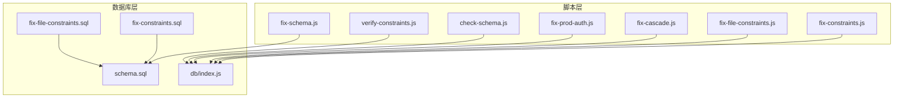
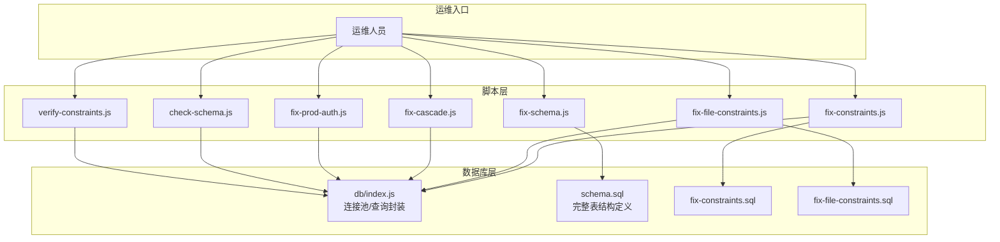
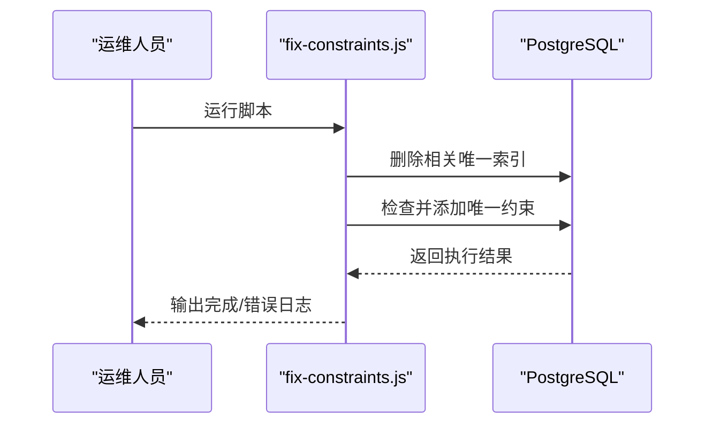
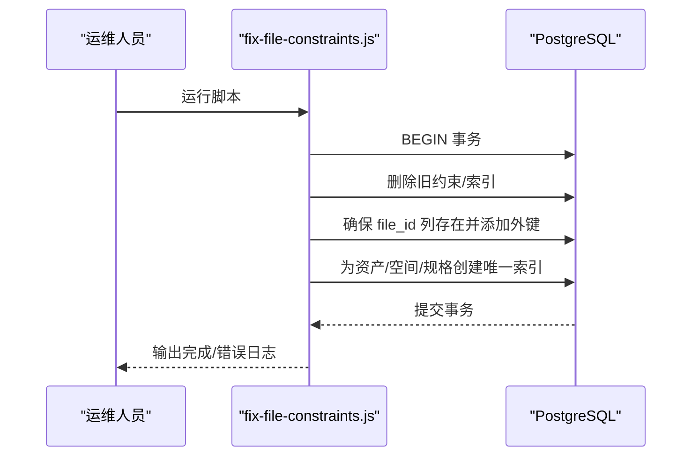
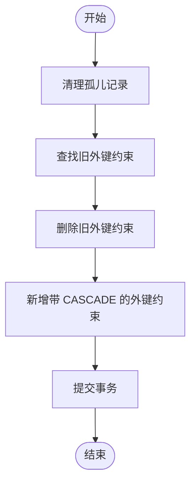
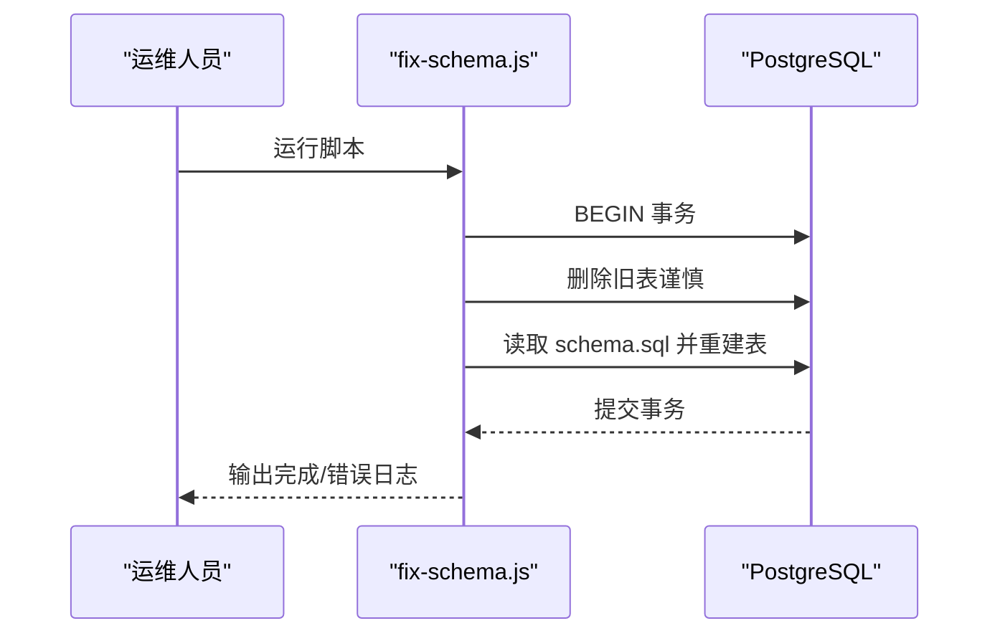
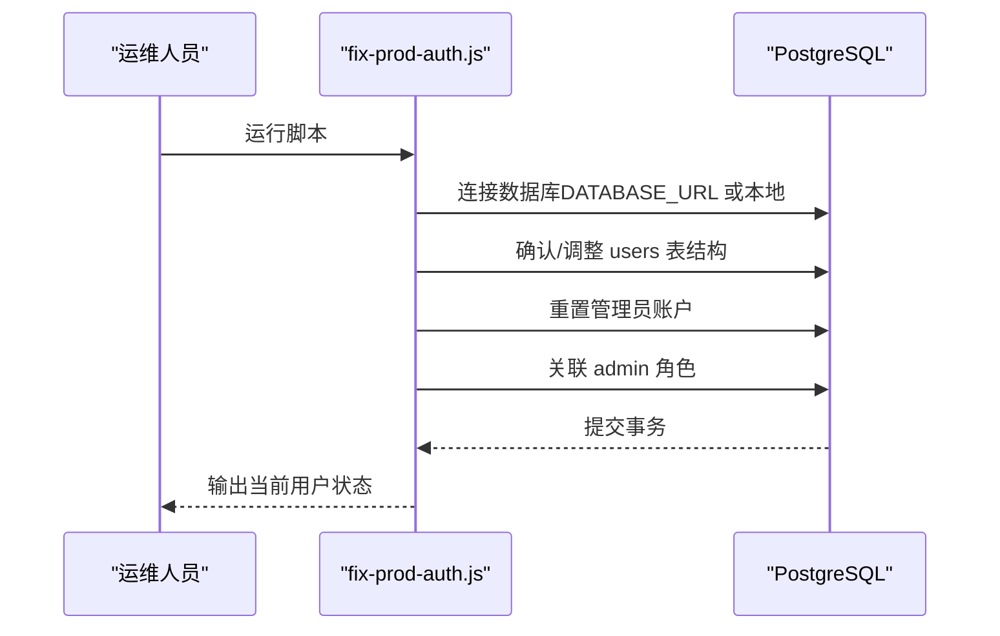
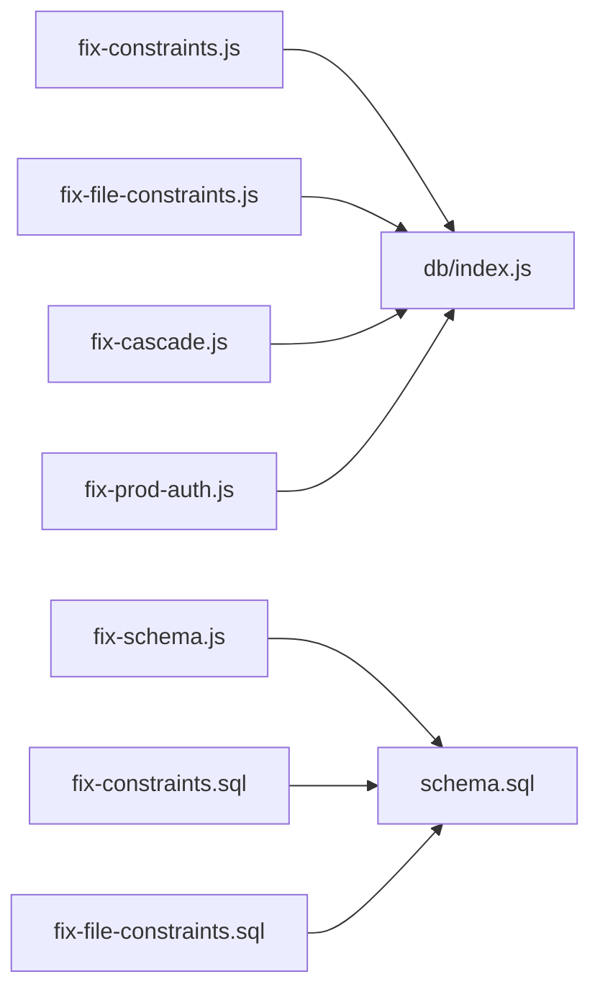

# 数据修复脚本

<cite>
**本文引用的文件**
- [server/scripts/fix-constraints.js](file://server/scripts/fix-constraints.js)
- [server/db/fix-constraints.sql](file://server/db/fix-constraints.sql)
- [server/scripts/fix-file-constraints.js](file://server/scripts/fix-file-constraints.js)
- [server/db/fix-file-constraints.sql](file://server/db/fix-file-constraints.sql)
- [server/scripts/fix-cascade.js](file://server/scripts/fix-cascade.js)
- [server/scripts/fix-schema.js](file://server/scripts/fix-schema.js)
- [server/db/schema.sql](file://server/db/schema.sql)
- [server/scripts/fix-prod-auth.js](file://server/scripts/fix-prod-auth.js)
- [server/db/index.js](file://server/db/index.js)
- [server/scripts/check-schema.js](file://server/scripts/check-schema.js)
- [server/scripts/verify-constraints.js](file://server/scripts/verify-constraints.js)
</cite>

## 目录
1. [简介](#简介)
2. [项目结构](#项目结构)
3. [核心组件](#核心组件)
4. [架构总览](#架构总览)
5. [详细组件分析](#详细组件分析)
6. [依赖分析](#依赖分析)
7. [性能考虑](#性能考虑)
8. [故障排查指南](#故障排查指南)
9. [结论](#结论)
10. [附录](#附录)

## 简介
本文件面向运维与开发人员，系统性解析五类数据修复脚本与两类辅助脚本，帮助在生产环境中安全地修复外键与约束、文件关联约束、级联删除规则、表结构偏差以及认证表数据。内容涵盖适用场景、执行风险、备份建议、回滚方案与执行后验证方法，确保最小化停机与数据一致性。

## 项目结构
与本次文档相关的脚本与数据库定义主要位于 server/scripts 与 server/db 目录：
- 修复脚本：fix-constraints.js、fix-file-constraints.js、fix-cascade.js、fix-schema.js、fix-prod-auth.js
- 数据库定义：schema.sql 及配套 SQL 修复脚本（fix-constraints.sql、fix-file-constraints.sql）
- 辅助验证脚本：check-schema.js、verify-constraints.js
- 数据库连接封装：db/index.js

图表来源
- [server/scripts/fix-constraints.js](file://server/scripts/fix-constraints.js#L1-L57)
- [server/scripts/fix-file-constraints.js](file://server/scripts/fix-file-constraints.js#L1-L97)
- [server/scripts/fix-cascade.js](file://server/scripts/fix-cascade.js#L1-L82)
- [server/scripts/fix-schema.js](file://server/scripts/fix-schema.js#L1-L64)
- [server/scripts/fix-prod-auth.js](file://server/scripts/fix-prod-auth.js#L1-L111)
- [server/db/schema.sql](file://server/db/schema.sql#L1-L200)
- [server/db/fix-constraints.sql](file://server/db/fix-constraints.sql#L1-L33)
- [server/db/fix-file-constraints.sql](file://server/db/fix-file-constraints.sql#L1-L67)
- [server/db/index.js](file://server/db/index.js#L1-L93)

章节来源
- [server/scripts/fix-constraints.js](file://server/scripts/fix-constraints.js#L1-L57)
- [server/scripts/fix-file-constraints.js](file://server/scripts/fix-file-constraints.js#L1-L97)
- [server/scripts/fix-cascade.js](file://server/scripts/fix-cascade.js#L1-L82)
- [server/scripts/fix-schema.js](file://server/scripts/fix-schema.js#L1-L64)
- [server/scripts/fix-prod-auth.js](file://server/scripts/fix-prod-auth.js#L1-L111)
- [server/db/schema.sql](file://server/db/schema.sql#L1-L200)
- [server/db/fix-constraints.sql](file://server/db/fix-constraints.sql#L1-L33)
- [server/db/fix-file-constraints.sql](file://server/db/fix-file-constraints.sql#L1-L67)
- [server/db/index.js](file://server/db/index.js#L1-L93)

## 核心组件
- 外键与唯一约束修复（JS/SQL）：统一修复资产、空间、规格等表的唯一约束与索引，确保数据唯一性与一致性。
- 文件关联约束修复（JS/SQL）：为资产、空间、规格表添加 file_id 列并建立唯一索引或约束，保证文件维度的数据唯一性。
- 级联删除规则调整（JS）：清理孤儿记录，为 file_id 建立带 ON DELETE CASCADE 的外键约束，避免数据悬挂。
- 表结构偏差修正（JS）：通过读取 schema.sql 并重建关键表，快速恢复结构一致。
- 认证表数据修复（JS）：重置管理员账户、确保角色关联、输出当前用户状态，保障登录可用性。
- 辅助验证脚本：检查列结构、约束与索引，以及唯一约束验证与冲突处理测试。

章节来源
- [server/scripts/fix-constraints.js](file://server/scripts/fix-constraints.js#L1-L57)
- [server/db/fix-constraints.sql](file://server/db/fix-constraints.sql#L1-L33)
- [server/scripts/fix-file-constraints.js](file://server/scripts/fix-file-constraints.js#L1-L97)
- [server/db/fix-file-constraints.sql](file://server/db/fix-file-constraints.sql#L1-L67)
- [server/scripts/fix-cascade.js](file://server/scripts/fix-cascade.js#L1-L82)
- [server/scripts/fix-schema.js](file://server/scripts/fix-schema.js#L1-L64)
- [server/db/schema.sql](file://server/db/schema.sql#L1-L200)
- [server/scripts/fix-prod-auth.js](file://server/scripts/fix-prod-auth.js#L1-L111)
- [server/scripts/check-schema.js](file://server/scripts/check-schema.js#L1-L54)
- [server/scripts/verify-constraints.js](file://server/scripts/verify-constraints.js#L1-L53)

## 架构总览
以下图展示修复脚本与数据库层的交互关系，以及关键依赖（连接池、模式定义）：

图表来源
- [server/scripts/fix-constraints.js](file://server/scripts/fix-constraints.js#L1-L57)
- [server/scripts/fix-file-constraints.js](file://server/scripts/fix-file-constraints.js#L1-L97)
- [server/scripts/fix-cascade.js](file://server/scripts/fix-cascade.js#L1-L82)
- [server/scripts/fix-schema.js](file://server/scripts/fix-schema.js#L1-L64)
- [server/scripts/fix-prod-auth.js](file://server/scripts/fix-prod-auth.js#L1-L111)
- [server/scripts/check-schema.js](file://server/scripts/check-schema.js#L1-L54)
- [server/scripts/verify-constraints.js](file://server/scripts/verify-constraints.js#L1-L53)
- [server/db/index.js](file://server/db/index.js#L1-L93)
- [server/db/schema.sql](file://server/db/schema.sql#L1-L200)
- [server/db/fix-constraints.sql](file://server/db/fix-constraints.sql#L1-L33)
- [server/db/fix-file-constraints.sql](file://server/db/fix-file-constraints.sql#L1-L67)

## 详细组件分析

### 外键与约束修复脚本（fix-constraints.js 与 fix-constraints.sql）
- 适用场景
  - 业务出现重复编码或唯一性异常，需恢复资产、空间、规格表的唯一约束。
  - 索引与约束不一致导致查询或写入失败。
- 执行流程
  - 删除相关唯一索引（避免冲突）。
  - 检查并添加唯一约束（如 spec_code、asset_code、space_code）。
  - 输出执行结果与错误处理。
- 风险与注意事项
  - 删除索引可能短暂影响查询性能。
  - 若存在重复数据，需先清理再添加约束。
- 回滚方案
  - 重新执行相同逻辑，恢复索引与约束。
  - 如需彻底回退，可基于备份还原。
- 验证方法
  - 使用 verify-constraints.js 检查唯一约束是否存在。
  - 使用 verify-constraints.js 的冲突测试验证 ON CONFLICT 语义。

图表来源
- [server/scripts/fix-constraints.js](file://server/scripts/fix-constraints.js#L1-L57)
- [server/db/fix-constraints.sql](file://server/db/fix-constraints.sql#L1-L33)

章节来源
- [server/scripts/fix-constraints.js](file://server/scripts/fix-constraints.js#L1-L57)
- [server/db/fix-constraints.sql](file://server/db/fix-constraints.sql#L1-L33)
- [server/scripts/verify-constraints.js](file://server/scripts/verify-constraints.js#L1-L53)

### 文件关联约束修复脚本（fix-file-constraints.js 与 fix-file-constraints.sql）
- 适用场景
  - 需要按“文件维度”保证资产、空间、规格编码唯一，避免跨文件重复。
  - 需要为资产、空间、规格表添加 file_id 列并建立唯一索引。
- 执行流程
  - 删除旧的唯一约束与索引。
  - 确保 file_id 列存在并建立外键引用 model_files(id)，ON DELETE CASCADE。
  - 为资产、空间、规格表创建基于 (code, file_id) 的唯一索引。
- 风险与注意事项
  - 删除旧约束与索引需在事务中进行，防止部分成功。
  - 若历史数据中存在 file_id 缺失，需先补齐或清理。
- 回滚方案
  - 重新应用相同逻辑，恢复旧索引与约束。
  - 如需彻底回退，可基于备份还原。
- 验证方法
  - 使用 check-schema.js 检查列结构与索引。
  - 使用 verify-constraints.js 验证唯一约束与冲突处理。

图表来源
- [server/scripts/fix-file-constraints.js](file://server/scripts/fix-file-constraints.js#L1-L97)
- [server/db/fix-file-constraints.sql](file://server/db/fix-file-constraints.sql#L1-L67)

章节来源
- [server/scripts/fix-file-constraints.js](file://server/scripts/fix-file-constraints.js#L1-L97)
- [server/db/fix-file-constraints.sql](file://server/db/fix-file-constraints.sql#L1-L67)
- [server/scripts/check-schema.js](file://server/scripts/check-schema.js#L1-L54)
- [server/scripts/verify-constraints.js](file://server/scripts/verify-constraints.js#L1-L53)

### 级联删除规则调整脚本（fix-cascade.js）
- 适用场景
  - 存在 orphaned 记录（file_id 指向不存在的 model_files），导致外键约束无法建立。
  - 需要为资产、空间、规格表的 file_id 建立 ON DELETE CASCADE 外键。
- 执行流程
  - 清理孤儿记录（删除 file_id 非空但不在 model_files 中的记录）。
  - 查找并删除旧的 file_id 外键约束。
  - 新增带 ON DELETE CASCADE 的外键约束。
- 风险与注意事项
  - 清理孤儿记录会永久删除数据，务必先备份或确认无价值。
  - 新增外键约束可能因违反现有数据而失败，需先清理。
- 回滚方案
  - 重新应用相同逻辑，恢复旧约束。
  - 如需彻底回退，可基于备份还原。
- 验证方法
  - 使用 check-schema.js 检查外键约束是否存在。
  - 使用 verify-constraints.js 验证唯一约束与冲突处理。

图表来源
- [server/scripts/fix-cascade.js](file://server/scripts/fix-cascade.js#L1-L82)

章节来源
- [server/scripts/fix-cascade.js](file://server/scripts/fix-cascade.js#L1-L82)
- [server/scripts/check-schema.js](file://server/scripts/check-schema.js#L1-L54)
- [server/scripts/verify-constraints.js](file://server/scripts/verify-constraints.js#L1-L53)

### 表结构偏差修正脚本（fix-schema.js）
- 适用场景
  - 表结构与 schema.sql 不一致，导致功能异常或迁移失败。
  - 需要快速恢复到最新 schema 定义。
- 执行流程
  - 删除关键表（谨慎操作，会清空数据）。
  - 读取 schema.sql 并重建所有表结构。
  - 提交事务，完成修复。
- 风险与注意事项
  - 删除表会清空数据，必须提前备份。
  - 仅适用于允许重建的环境或离线窗口。
- 回滚方案
  - 基于备份还原。
  - 重新执行相同逻辑，恢复表结构。
- 验证方法
  - 使用 check-schema.js 检查列结构与索引。
  - 使用 verify-constraints.js 验证唯一约束与冲突处理。

图表来源
- [server/scripts/fix-schema.js](file://server/scripts/fix-schema.js#L1-L64)
- [server/db/schema.sql](file://server/db/schema.sql#L1-L200)

章节来源
- [server/scripts/fix-schema.js](file://server/scripts/fix-schema.js#L1-L64)
- [server/db/schema.sql](file://server/db/schema.sql#L1-L200)
- [server/scripts/check-schema.js](file://server/scripts/check-schema.js#L1-L54)
- [server/scripts/verify-constraints.js](file://server/scripts/verify-constraints.js#L1-L53)

### 认证表数据修复脚本（fix-prod-auth.js）
- 适用场景
  - 生产环境管理员账户丢失或密码错误，无法登录。
  - 需要确保用户表结构正确、管理员角色存在并关联。
- 执行流程
  - 优先使用 DATABASE_URL 连接（Railway 标准配置）。
  - 确保 users 表的 password_hash 列长度足够。
  - 重置管理员账户（邮箱、哈希、激活状态）。
  - 关联 admin 角色（幂等插入）。
  - 输出当前用户与角色状态。
- 风险与注意事项
  - 修改管理员账户涉及安全，需严格控制执行环境。
  - 建议在维护窗口执行，并记录操作日志。
- 回滚方案
  - 基于备份还原。
  - 重新执行相同逻辑，恢复管理员账户状态。
- 验证方法
  - 使用数据库客户端登录验证。
  - 输出当前用户状态核对角色关联。

图表来源
- [server/scripts/fix-prod-auth.js](file://server/scripts/fix-prod-auth.js#L1-L111)
- [server/db/index.js](file://server/db/index.js#L1-L93)

章节来源
- [server/scripts/fix-prod-auth.js](file://server/scripts/fix-prod-auth.js#L1-L111)
- [server/db/index.js](file://server/db/index.js#L1-L93)

## 依赖分析
- 连接池与查询封装
  - db/index.js 提供统一的连接池、查询封装与客户端获取，修复脚本通过该模块执行 SQL。
- 模式定义
  - schema.sql 定义了资产、空间、规格等表的结构、索引与约束，fix-schema.js 依据此文件重建。
- SQL 修复脚本
  - fix-constraints.sql 与 fix-file-constraints.sql 提供直接的 SQL 实现，便于在 psql 环境中执行。

图表来源
- [server/scripts/fix-constraints.js](file://server/scripts/fix-constraints.js#L1-L57)
- [server/scripts/fix-file-constraints.js](file://server/scripts/fix-file-constraints.js#L1-L97)
- [server/scripts/fix-cascade.js](file://server/scripts/fix-cascade.js#L1-L82)
- [server/scripts/fix-schema.js](file://server/scripts/fix-schema.js#L1-L64)
- [server/scripts/fix-prod-auth.js](file://server/scripts/fix-prod-auth.js#L1-L111)
- [server/db/index.js](file://server/db/index.js#L1-L93)
- [server/db/schema.sql](file://server/db/schema.sql#L1-L200)
- [server/db/fix-constraints.sql](file://server/db/fix-constraints.sql#L1-L33)
- [server/db/fix-file-constraints.sql](file://server/db/fix-file-constraints.sql#L1-L67)

章节来源
- [server/db/index.js](file://server/db/index.js#L1-L93)
- [server/db/schema.sql](file://server/db/schema.sql#L1-L200)

## 性能考虑
- 索引与约束变更
  - 删除索引与重建约束会短暂影响写入性能，建议在低峰期执行。
  - 唯一索引的创建应避免频繁并发写入，必要时分批执行。
- 事务边界
  - 所有修复脚本均采用事务包裹，减少部分成功风险；但仍需关注锁竞争与长事务。
- 大表重建
  - fix-schema.js 删除并重建关键表会带来显著停机窗口，需评估业务影响。

## 故障排查指南
- 连接失败
  - 检查 DATABASE_URL 或本地连接参数是否正确。
  - 确认数据库可达与凭据有效。
- 权限不足
  - 确保连接用户具备 DDL 与 DML 权限。
- 约束冲突
  - 先清理重复数据或孤儿记录，再重建约束。
- 验证步骤
  - 使用 check-schema.js 检查列结构与索引。
  - 使用 verify-constraints.js 验证唯一约束与冲突处理。
  - 对认证修复，核对输出的用户与角色状态。

章节来源
- [server/scripts/check-schema.js](file://server/scripts/check-schema.js#L1-L54)
- [server/scripts/verify-constraints.js](file://server/scripts/verify-constraints.js#L1-L53)
- [server/scripts/fix-prod-auth.js](file://server/scripts/fix-prod-auth.js#L1-L111)
- [server/db/index.js](file://server/db/index.js#L1-L93)

## 结论
上述脚本覆盖了生产环境常见的数据修复场景：唯一约束与索引恢复、文件维度唯一性保障、外键级联规则调整、表结构快速恢复以及认证数据修复。建议在执行前制定详细的备份与回滚策略，并在低峰期执行，配合验证脚本确保修复效果。

## 附录
- 执行前准备
  - 备份数据库（推荐全量备份）。
  - 明确当前数据库版本与 schema 差异。
  - 准备回滚方案（备份还原或逆向 SQL）。
- 执行顺序建议
  - 先执行 fix-cascade.js 清理孤儿记录并建立外键。
  - 再执行 fix-file-constraints.js 或 fix-constraints.js 修复唯一约束。
  - 最后执行 fix-schema.js（如需）或 fix-prod-auth.js（如需）。
- 验证清单
  - 使用 check-schema.js 与 verify-constraints.js 核验结构与约束。
  - 对认证修复，使用数据库客户端登录验证。