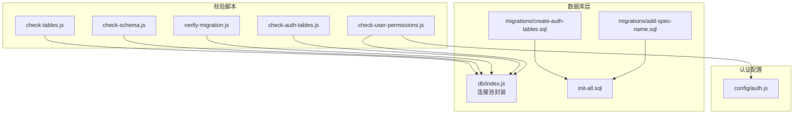
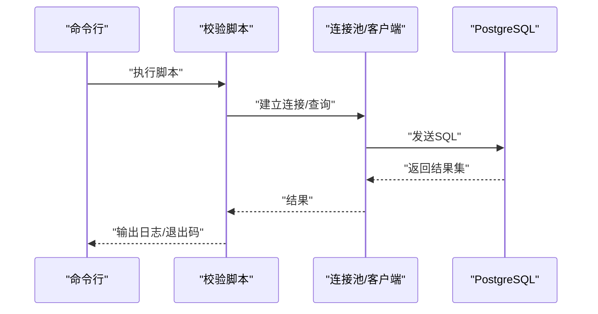
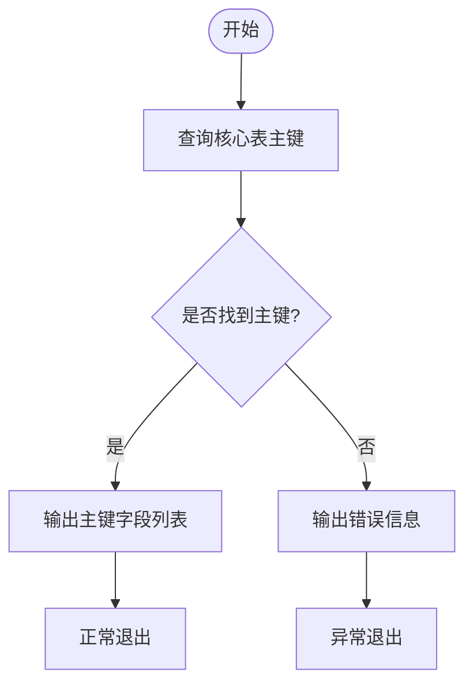
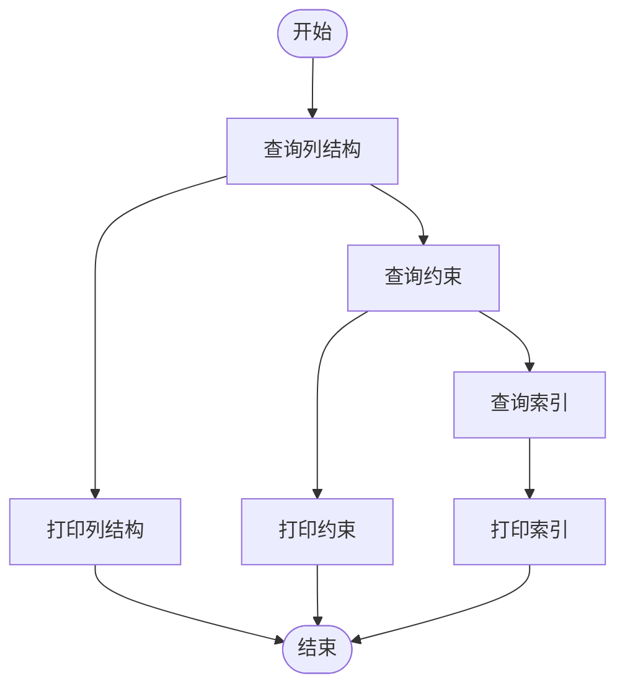
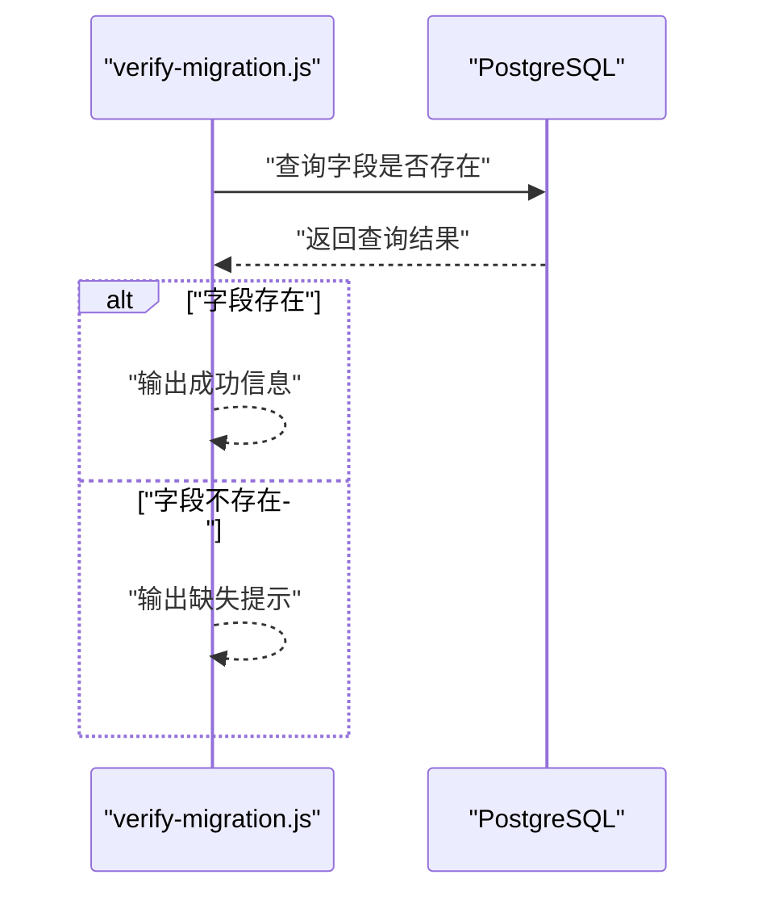
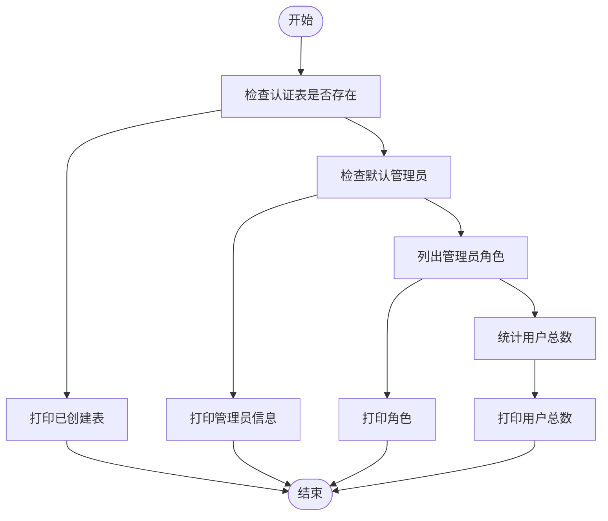
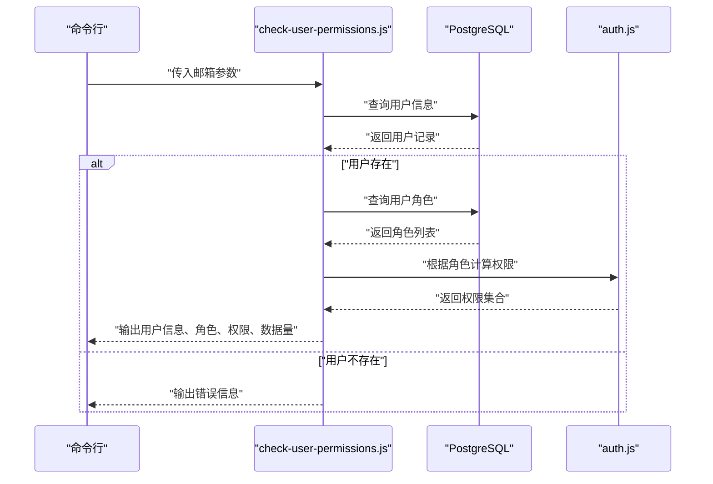
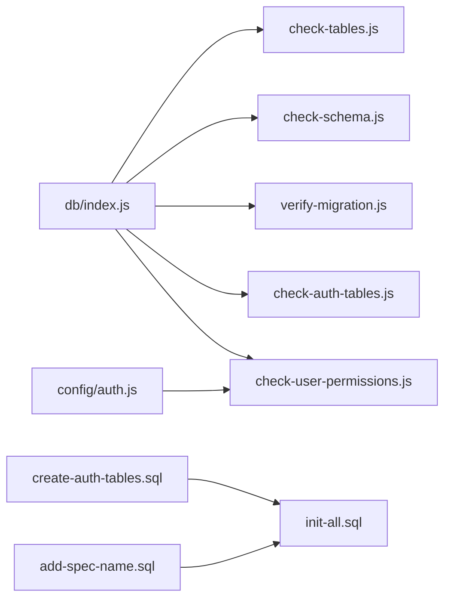

# 数据校验脚本

<cite>
**本文引用的文件**
- [server/check-tables.js](file://server/check-tables.js)
- [server/scripts/check-schema.js](file://server/scripts/check-schema.js)
- [server/scripts/verify-migration.js](file://server/scripts/verify-migration.js)
- [server/scripts/check-auth-tables.js](file://server/scripts/check-auth-tables.js)
- [server/scripts/check-user-permissions.js](file://server/scripts/check-user-permissions.js)
- [server/db/index.js](file://server/db/index.js)
- [server/config/auth.js](file://server/config/auth.js)
- [server/db/migrations/create-auth-tables.sql](file://server/db/migrations/create-auth-tables.sql)
- [server/db/migrations/add-spec-name.sql](file://server/db/migrations/add-spec-name.sql)
- [server/db/init-all.sql](file://server/db/init-all.sql)
</cite>

## 目录
1. [简介](#简介)
2. [项目结构](#项目结构)
3. [核心组件](#核心组件)
4. [架构总览](#架构总览)
5. [详细组件分析](#详细组件分析)
6. [依赖关系分析](#依赖关系分析)
7. [性能考量](#性能考量)
8. [故障排查指南](#故障排查指南)
9. [结论](#结论)

## 简介
本文件面向部署后的健康检查与故障排查，系统性介绍五类数据校验脚本：
- 核心表完整性检查：验证关键业务表的存在与主键完整性
- 数据库模式一致性检查：核对表结构、约束与索引
- 迁移脚本执行状态验证：确认特定字段是否按预期存在
- 认证表专项检查：核对认证相关表、默认管理员与计数
- 用户权限配置检查：基于角色计算权限并进行关键权限校验

通过输出日志解读、常见失败原因与应对策略，帮助快速定位问题并恢复系统健康。

## 项目结构
五个校验脚本分别位于 server 目录下，采用直接连接数据库的方式进行检查；部分脚本复用统一的数据库连接池模块，另一些脚本则直接使用 PostgreSQL 客户端库进行连接。

图示来源
- [server/check-tables.js](file://server/check-tables.js#L1-L40)
- [server/scripts/check-schema.js](file://server/scripts/check-schema.js#L1-L54)
- [server/scripts/verify-migration.js](file://server/scripts/verify-migration.js#L1-L37)
- [server/scripts/check-auth-tables.js](file://server/scripts/check-auth-tables.js#L1-L59)
- [server/scripts/check-user-permissions.js](file://server/scripts/check-user-permissions.js#L1-L115)
- [server/db/index.js](file://server/db/index.js#L1-L93)
- [server/config/auth.js](file://server/config/auth.js#L1-L142)
- [server/db/migrations/create-auth-tables.sql](file://server/db/migrations/create-auth-tables.sql#L1-L78)
- [server/db/migrations/add-spec-name.sql](file://server/db/migrations/add-spec-name.sql#L1-L12)
- [server/db/init-all.sql](file://server/db/init-all.sql#L1-L389)

章节来源
- [server/check-tables.js](file://server/check-tables.js#L1-L40)
- [server/scripts/check-schema.js](file://server/scripts/check-schema.js#L1-L54)
- [server/scripts/verify-migration.js](file://server/scripts/verify-migration.js#L1-L37)
- [server/scripts/check-auth-tables.js](file://server/scripts/check-auth-tables.js#L1-L59)
- [server/scripts/check-user-permissions.js](file://server/scripts/check-user-permissions.js#L1-L115)
- [server/db/index.js](file://server/db/index.js#L1-L93)
- [server/config/auth.js](file://server/config/auth.js#L1-L142)
- [server/db/migrations/create-auth-tables.sql](file://server/db/migrations/create-auth-tables.sql#L1-L78)
- [server/db/migrations/add-spec-name.sql](file://server/db/migrations/add-spec-name.sql#L1-L12)
- [server/db/init-all.sql](file://server/db/init-all.sql#L1-L389)

## 核心组件
- 核心表完整性检查脚本：检查核心业务表的主键是否存在，确保关键表具备主键约束，避免后续外键关联与唯一性约束失效。
- 数据库模式一致性检查脚本：列出目标表的列结构、约束与索引，便于比对实际与期望的模式差异。
- 迁移脚本执行状态验证脚本：针对特定字段（如规格名称字段）进行存在性验证，确保迁移步骤已正确应用。
- 认证表专项检查脚本：核对认证相关表的存在性、默认管理员账户与计数，辅助认证链路的健康检查。
- 用户权限配置检查脚本：根据角色计算权限集合，输出关键权限检查结果，并统计相关数据量，辅助排查权限问题。

章节来源
- [server/check-tables.js](file://server/check-tables.js#L1-L40)
- [server/scripts/check-schema.js](file://server/scripts/check-schema.js#L1-L54)
- [server/scripts/verify-migration.js](file://server/scripts/verify-migration.js#L1-L37)
- [server/scripts/check-auth-tables.js](file://server/scripts/check-auth-tables.js#L1-L59)
- [server/scripts/check-user-permissions.js](file://server/scripts/check-user-permissions.js#L1-L115)

## 架构总览
五个脚本均通过 PostgreSQL 客户端访问数据库，部分脚本复用统一的连接池封装，另一些脚本直接使用客户端库。权限检查脚本还依赖认证配置模块以解析角色到权限的映射。

图示来源
- [server/db/index.js](file://server/db/index.js#L1-L93)
- [server/scripts/check-schema.js](file://server/scripts/check-schema.js#L1-L54)
- [server/scripts/verify-migration.js](file://server/scripts/verify-migration.js#L1-L37)
- [server/scripts/check-auth-tables.js](file://server/scripts/check-auth-tables.js#L1-L59)
- [server/scripts/check-user-permissions.js](file://server/scripts/check-user-permissions.js#L1-L115)

## 详细组件分析

### 核心表完整性检查（check-tables.js）
- 功能要点
  - 检查核心业务表的主键是否存在，输出每个表的主键字段列表。
  - 通过系统目录查询主键信息，确保表具备主键约束。
- 输出解读
  - 成功时输出每张表的主键字段名列表。
  - 失败时输出错误信息并以非零退出码结束。
- 常见失败原因
  - 表不存在或未初始化。
  - 主键缺失或被删除。
- 应对策略
  - 使用初始化脚本重建表结构与主键。
  - 检查迁移脚本是否完整执行。
- 适用场景
  - 部署后健康检查、迁移后验证。

图示来源
- [server/check-tables.js](file://server/check-tables.js#L1-L40)

章节来源
- [server/check-tables.js](file://server/check-tables.js#L1-L40)

### 数据库模式一致性检查（check-schema.js）
- 功能要点
  - 查询目标表的列结构、约束与索引，输出表格化结果。
  - 便于与期望模式对比，发现字段缺失、类型不一致、索引缺失等问题。
- 输出解读
  - 列结构：包含列名、数据类型、长度、可空性等。
  - 约束：显示约束名称与类型。
  - 索引：显示索引名称与定义。
- 常见失败原因
  - 表不存在或未初始化。
  - 迁移未执行导致字段或索引缺失。
- 应对策略
  - 使用初始化脚本或迁移脚本补齐缺失对象。
  - 对照期望模式逐项修复。

图示来源
- [server/scripts/check-schema.js](file://server/scripts/check-schema.js#L1-L54)

章节来源
- [server/scripts/check-schema.js](file://server/scripts/check-schema.js#L1-L54)

### 迁移脚本执行状态验证（verify-migration.js）
- 功能要点
  - 针对特定字段（如规格名称字段）进行存在性验证。
  - 若字段存在，输出成功信息；否则提示缺失。
- 输出解读
  - 成功：显示字段存在并给出提示。
  - 失败：显示未找到字段或查询异常。
- 常见失败原因
  - 迁移脚本未执行或执行失败。
  - 字段名拼写错误或大小写不一致。
- 应对策略
  - 执行对应迁移脚本。
  - 对照迁移脚本内容修正字段名。

图示来源
- [server/scripts/verify-migration.js](file://server/scripts/verify-migration.js#L1-L37)

章节来源
- [server/scripts/verify-migration.js](file://server/scripts/verify-migration.js#L1-L37)

### 认证表专项检查（check-auth-tables.js）
- 功能要点
  - 检查认证相关表是否存在（用户、角色、身份、刷新令牌）。
  - 检查默认管理员账户是否存在及其角色。
  - 统计用户总数。
- 输出解读
  - 已创建的认证表列表。
  - 默认管理员信息与角色。
  - 用户总数。
- 常见失败原因
  - 认证表未初始化。
  - 默认管理员未创建或被删除。
- 应对策略
  - 执行认证表初始化迁移脚本。
  - 检查默认管理员插入逻辑。

图示来源
- [server/scripts/check-auth-tables.js](file://server/scripts/check-auth-tables.js#L1-L59)

章节来源
- [server/scripts/check-auth-tables.js](file://server/scripts/check-auth-tables.js#L1-L59)
- [server/db/migrations/create-auth-tables.sql](file://server/db/migrations/create-auth-tables.sql#L1-L78)

### 用户权限配置检查（check-user-permissions.js）
- 功能要点
  - 接收用户邮箱作为参数，查询用户基本信息与角色。
  - 基于角色计算权限集合，输出关键权限检查结果。
  - 统计相关数据量（如模型文件数量），辅助判断数据侧问题。
- 输出解读
  - 用户基本信息表格。
  - 用户角色列表。
  - 权限集合（前若干项与关键权限检查）。
  - 数据量统计。
- 常见失败原因
  - 未提供邮箱参数或邮箱无效。
  - 用户不存在。
  - 用户无任何角色。
- 应对策略
  - 提供正确的邮箱参数。
  - 为用户分配角色。
  - 对照认证配置模块的角色-权限映射进行修正。

图示来源
- [server/scripts/check-user-permissions.js](file://server/scripts/check-user-permissions.js#L1-L115)
- [server/config/auth.js](file://server/config/auth.js#L1-L142)

章节来源
- [server/scripts/check-user-permissions.js](file://server/scripts/check-user-permissions.js#L1-L115)
- [server/config/auth.js](file://server/config/auth.js#L1-L142)

## 依赖关系分析
- 数据库连接
  - 复用统一连接池封装：核心表检查、模式检查、迁移验证、认证表检查均通过统一连接池模块进行查询。
  - 直连客户端：部分脚本直接使用客户端库进行连接，便于快速验证。
- 认证配置
  - 用户权限检查脚本依赖认证配置模块的角色-权限映射，用于计算用户权限集合。
- 迁移与初始化
  - 认证表初始化脚本与规格名称字段迁移脚本共同构成认证与核心表的关键依赖。
  - 初始化脚本定义了完整的表结构、索引与外键约束，是模式一致性检查的重要参考。

图示来源
- [server/db/index.js](file://server/db/index.js#L1-L93)
- [server/scripts/check-schema.js](file://server/scripts/check-schema.js#L1-L54)
- [server/scripts/verify-migration.js](file://server/scripts/verify-migration.js#L1-L37)
- [server/scripts/check-auth-tables.js](file://server/scripts/check-auth-tables.js#L1-L59)
- [server/scripts/check-user-permissions.js](file://server/scripts/check-user-permissions.js#L1-L115)
- [server/config/auth.js](file://server/config/auth.js#L1-L142)
- [server/db/migrations/create-auth-tables.sql](file://server/db/migrations/create-auth-tables.sql#L1-L78)
- [server/db/migrations/add-spec-name.sql](file://server/db/migrations/add-spec-name.sql#L1-L12)
- [server/db/init-all.sql](file://server/db/init-all.sql#L1-L389)

章节来源
- [server/db/index.js](file://server/db/index.js#L1-L93)
- [server/config/auth.js](file://server/config/auth.js#L1-L142)
- [server/db/migrations/create-auth-tables.sql](file://server/db/migrations/create-auth-tables.sql#L1-L78)
- [server/db/migrations/add-spec-name.sql](file://server/db/migrations/add-spec-name.sql#L1-L12)
- [server/db/init-all.sql](file://server/db/init-all.sql#L1-L389)

## 性能考量
- 连接池复用：统一连接池封装有助于减少连接开销，提升批量查询效率。
- 查询粒度：模式检查与权限检查涉及多表查询，建议在低峰期执行，避免对在线业务造成影响。
- 日志输出：部分脚本使用表格化输出，便于快速审阅，但大量数据时可能增加输出开销。

## 故障排查指南
- 核心表完整性检查
  - 现象：输出错误或主键为空。
  - 排查：确认表是否已初始化；检查迁移脚本是否执行；核对主键约束是否存在。
  - 参考：初始化脚本与核心表定义。
- 数据库模式一致性检查
  - 现象：列结构、约束或索引缺失。
  - 排查：对照初始化脚本逐项比对；执行缺失的迁移或重建索引。
  - 参考：初始化脚本与迁移脚本。
- 迁移脚本执行状态验证
  - 现象：字段不存在提示。
  - 排查：执行对应迁移脚本；核对字段名与类型。
  - 参考：规格名称字段迁移脚本。
- 认证表专项检查
  - 现象：认证表缺失、默认管理员不存在。
  - 排查：执行认证表初始化迁移；检查默认管理员插入逻辑。
  - 参考：认证表初始化脚本。
- 用户权限配置检查
  - 现象：用户不存在、无角色、关键权限缺失。
  - 排查：提供有效邮箱；为用户分配角色；核对角色-权限映射。
  - 参考：认证配置模块与权限定义。

章节来源
- [server/check-tables.js](file://server/check-tables.js#L1-L40)
- [server/scripts/check-schema.js](file://server/scripts/check-schema.js#L1-L54)
- [server/scripts/verify-migration.js](file://server/scripts/verify-migration.js#L1-L37)
- [server/scripts/check-auth-tables.js](file://server/scripts/check-auth-tables.js#L1-L59)
- [server/scripts/check-user-permissions.js](file://server/scripts/check-user-permissions.js#L1-L115)
- [server/db/migrations/create-auth-tables.sql](file://server/db/migrations/create-auth-tables.sql#L1-L78)
- [server/db/migrations/add-spec-name.sql](file://server/db/migrations/add-spec-name.sql#L1-L12)
- [server/db/init-all.sql](file://server/db/init-all.sql#L1-L389)
- [server/config/auth.js](file://server/config/auth.js#L1-L142)

## 结论
上述五个校验脚本覆盖了部署后健康检查的关键路径：表完整性、模式一致性、迁移状态、认证表与用户权限。通过规范化的输出日志与清晰的失败原因定位，能够快速识别并修复数据库层面的问题，保障系统的稳定运行。建议在每次部署或重大变更后执行这些脚本，形成例行巡检流程。