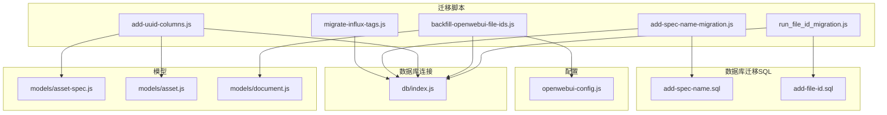
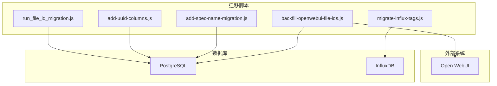
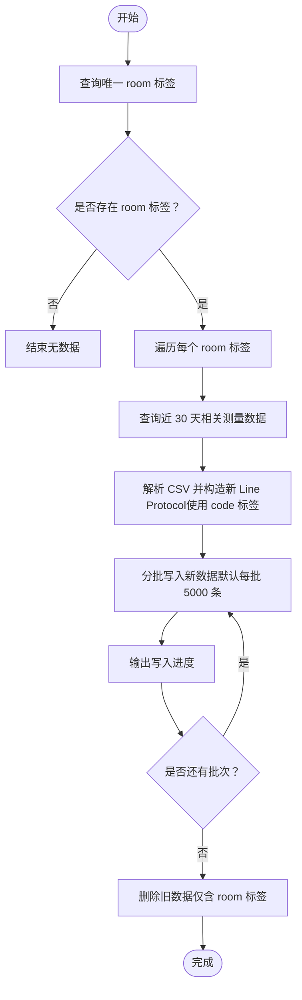
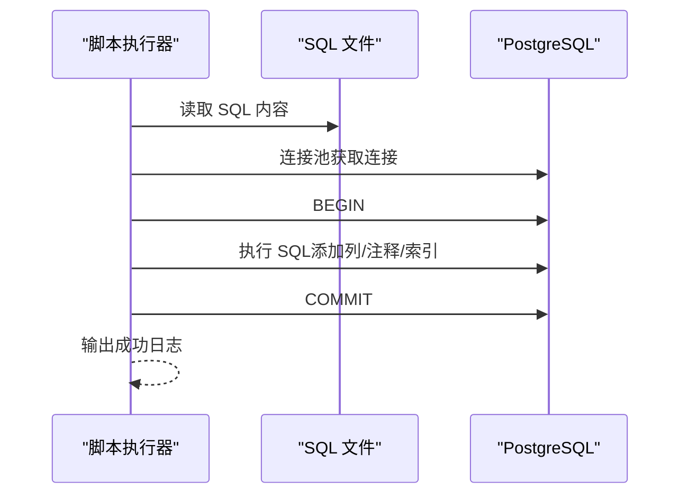
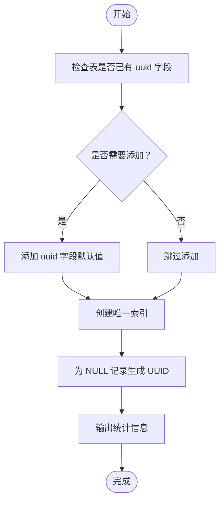
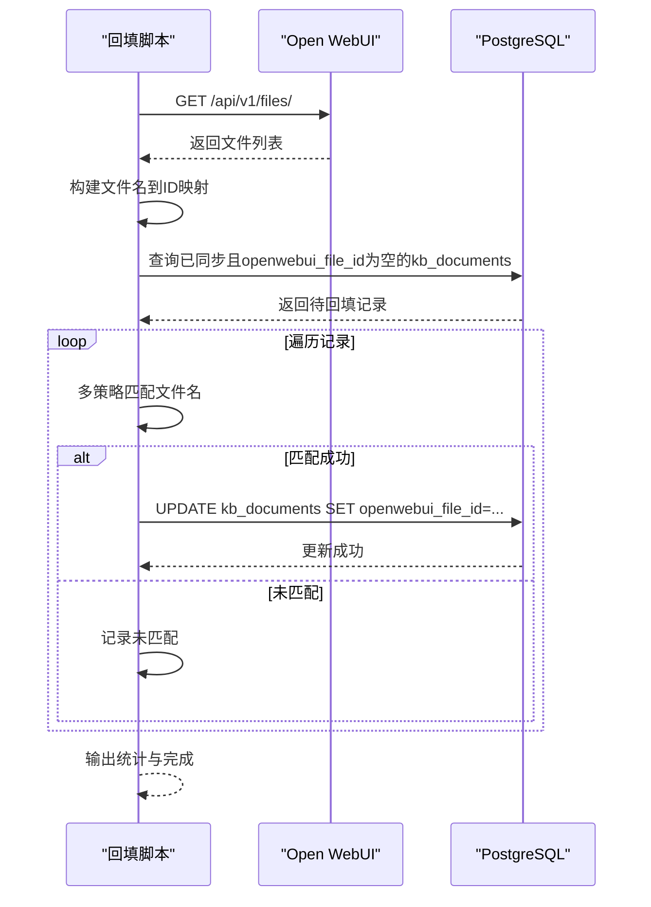
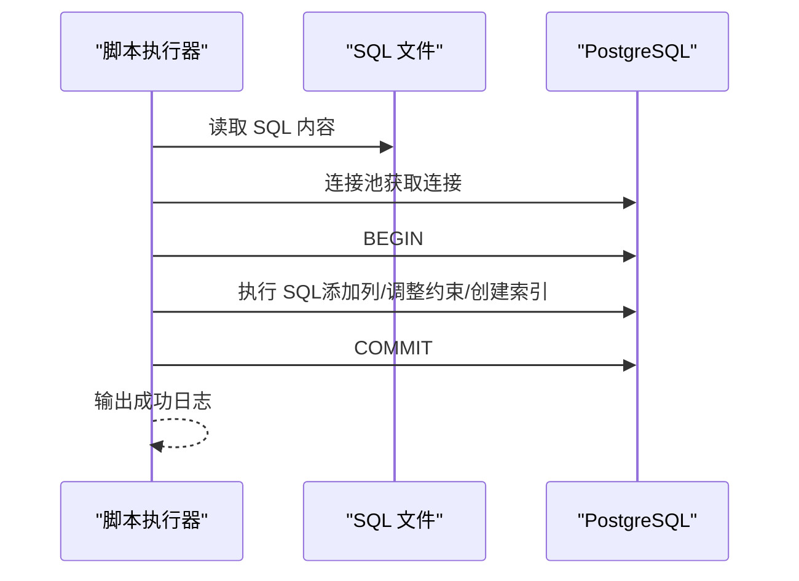
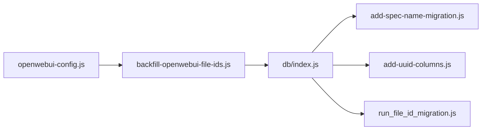

# 数据迁移脚本

<cite>
**本文引用的文件**
- [migrate-influx-tags.js](file://server/scripts/migrate-influx-tags.js)
- [add-spec-name-migration.js](file://server/scripts/add-spec-name-migration.js)
- [add-uuid-columns.js](file://server/scripts/add-uuid-columns.js)
- [backfill-openwebui-file-ids.js](file://server/scripts/backfill-openwebui-file-ids.js)
- [run_file_id_migration.js](file://server/scripts/run_file_id_migration.js)
- [add-spec-name.sql](file://server/db/migrations/add-spec-name.sql)
- [add-file-id.sql](file://server/db/migrations/add-file-id.sql)
- [openwebui-config.js](file://server/config/openwebui-config.js)
- [db/index.js](file://server/db/index.js)
- [models/asset-spec.js](file://server/models/asset-spec.js)
- [models/asset.js](file://server/models/asset.js)
- [models/document.js](file://server/models/document.js)
</cite>

## 目录
1. [简介](#简介)
2. [项目结构](#项目结构)
3. [核心组件](#核心组件)
4. [架构总览](#架构总览)
5. [详细组件分析](#详细组件分析)
6. [依赖关系分析](#依赖关系分析)
7. [性能考虑](#性能考虑)
8. [故障排查指南](#故障排查指南)
9. [结论](#结论)
10. [附录](#附录)

## 简介
本文件系统化介绍四类数据迁移脚本与两类配套脚本，覆盖时序数据标签重构、资产规格名称字段迁移、关键表 UUID 主键补全，以及文档 ID 同步至 Open WebUI 的回填流程。文档同时给出迁移步骤、数据一致性保障机制、性能优化建议（如分批处理）与迁移后验证流程，帮助运维与开发人员安全高效地完成数据库与外部系统的数据对齐。

## 项目结构
这些迁移脚本位于服务端脚本目录，配合数据库迁移 SQL 文件与配置模块共同工作：
- server/scripts：迁移脚本集合
- server/db/migrations：数据库迁移 SQL 文件
- server/config：外部系统配置（如 Open WebUI）
- server/db/index.js：数据库连接池封装
- server/models：业务模型层（用于理解数据结构与约束）

图表来源
- [migrate-influx-tags.js](file://server/scripts/migrate-influx-tags.js#L1-L240)
- [add-spec-name-migration.js](file://server/scripts/add-spec-name-migration.js#L1-L58)
- [add-uuid-columns.js](file://server/scripts/add-uuid-columns.js#L1-L138)
- [backfill-openwebui-file-ids.js](file://server/scripts/backfill-openwebui-file-ids.js#L1-L139)
- [run_file_id_migration.js](file://server/scripts/run_file_id_migration.js#L1-L53)
- [add-spec-name.sql](file://server/db/migrations/add-spec-name.sql#L1-L12)
- [add-file-id.sql](file://server/db/migrations/add-file-id.sql#L1-L51)
- [openwebui-config.js](file://server/config/openwebui-config.js#L1-L56)
- [db/index.js](file://server/db/index.js#L1-L93)
- [models/asset-spec.js](file://server/models/asset-spec.js#L1-L170)
- [models/asset.js](file://server/models/asset.js#L1-L257)
- [models/document.js](file://server/models/document.js#L1-L167)

章节来源
- [migrate-influx-tags.js](file://server/scripts/migrate-influx-tags.js#L1-L240)
- [add-spec-name-migration.js](file://server/scripts/add-spec-name-migration.js#L1-L58)
- [add-uuid-columns.js](file://server/scripts/add-uuid-columns.js#L1-L138)
- [backfill-openwebui-file-ids.js](file://server/scripts/backfill-openwebui-file-ids.js#L1-L139)
- [run_file_id_migration.js](file://server/scripts/run_file_id_migration.js#L1-L53)
- [add-spec-name.sql](file://server/db/migrations/add-spec-name.sql#L1-L12)
- [add-file-id.sql](file://server/db/migrations/add-file-id.sql#L1-L51)
- [openwebui-config.js](file://server/config/openwebui-config.js#L1-L56)
- [db/index.js](file://server/db/index.js#L1-L93)
- [models/asset-spec.js](file://server/models/asset-spec.js#L1-L170)
- [models/asset.js](file://server/models/asset.js#L1-L257)
- [models/document.js](file://server/models/document.js#L1-L167)

## 核心组件
- 时序数据标签重构脚本：将 InfluxDB 中的 room 标签迁移到 code 标签，并删除旧数据，保证查询与存储的一致性。
- 资产规格名称迁移脚本：为资产规格表添加 spec_name 字段并创建索引，提升按名称检索效率。
- 关键表 UUID 主键补全脚本：为资产、资产规格、空间表添加 UUID 字段并生成唯一索引，统一主键策略。
- 文档 ID 同步回填脚本：从 Open WebUI 获取文件列表，基于文件名匹配回填 kb_documents 的 openwebui_file_id。
- 文件 ID 迁移脚本：为多张表添加 file_id 字段并调整唯一约束，支持按文件维度隔离数据。

章节来源
- [migrate-influx-tags.js](file://server/scripts/migrate-influx-tags.js#L1-L240)
- [add-spec-name-migration.js](file://server/scripts/add-spec-name-migration.js#L1-L58)
- [add-uuid-columns.js](file://server/scripts/add-uuid-columns.js#L1-L138)
- [backfill-openwebui-file-ids.js](file://server/scripts/backfill-openwebui-file-ids.js#L1-L139)
- [run_file_id_migration.js](file://server/scripts/run_file_id_migration.js#L1-L53)

## 架构总览
下图展示各迁移脚本与数据库、外部系统之间的交互关系与职责边界。

图表来源
- [migrate-influx-tags.js](file://server/scripts/migrate-influx-tags.js#L1-L240)
- [backfill-openwebui-file-ids.js](file://server/scripts/backfill-openwebui-file-ids.js#L1-L139)
- [add-spec-name-migration.js](file://server/scripts/add-spec-name-migration.js#L1-L58)
- [add-uuid-columns.js](file://server/scripts/add-uuid-columns.js#L1-L138)
- [run_file_id_migration.js](file://server/scripts/run_file_id_migration.js#L1-L53)

## 详细组件分析

### 时序数据标签重构：migrate-influx-tags.js
- 目标：将 room 标签迁移到 code 标签，删除旧数据，保持查询与存储一致。
- 步骤：
  1) 读取 bucket 中所有唯一的 room 标签值。
  2) 针对每个 room，查询近 30 天内相关测量的数据，解析 CSV 并构造新的 Line Protocol（仅使用 code 标签）。
  3) 分批写入新数据（默认每批 5000 条），并输出进度。
  4) 清理旧数据（删除仅含 room 标签的数据）。
- 数据一致性保障：
  - 使用时间窗口（最近 30 天）限定清理范围，避免误删。
  - 分批写入与进度提示，便于中断恢复与审计。
- 性能优化建议：
  - 采用分批写入与批量大小控制，降低内存峰值。
  - 在查询阶段限制测量与字段，减少 CSV 数据量。
- 迁移后验证：
  - 对比新旧数据条数与时间范围，确认无遗漏。
  - 验证查询结果中 code 标签可用且 room 标签不再存在。

图表来源
- [migrate-influx-tags.js](file://server/scripts/migrate-influx-tags.js#L1-L240)

章节来源
- [migrate-influx-tags.js](file://server/scripts/migrate-influx-tags.js#L1-L240)

### 资产规格名称字段迁移：add-spec-name-migration.js 与 add-spec-name.sql
- 目标：为资产规格表添加 spec_name 字段并创建索引，提升按名称检索效率。
- 步骤：
  1) 读取 SQL 文件内容。
  2) 通过数据库连接池执行 SQL，完成列添加、注释与索引创建。
- 数据一致性保障：
  - 使用连接池与单事务执行，确保原子性。
  - 索引创建在列添加之后，避免重复执行导致的冲突。
- 性能优化建议：
  - 在生产环境选择低峰时段执行，避免阻塞。
  - 确保数据库具备足够资源（连接数、磁盘 IO）。
- 迁移后验证：
  - 查询索引是否存在并检查部分数据是否具备 spec_name。
  - 对高频查询路径进行压测，确认索引命中率。

图表来源
- [add-spec-name-migration.js](file://server/scripts/add-spec-name-migration.js#L1-L58)
- [add-spec-name.sql](file://server/db/migrations/add-spec-name.sql#L1-L12)
- [db/index.js](file://server/db/index.js#L1-L93)

章节来源
- [add-spec-name-migration.js](file://server/scripts/add-spec-name-migration.js#L1-L58)
- [add-spec-name.sql](file://server/db/migrations/add-spec-name.sql#L1-L12)
- [db/index.js](file://server/db/index.js#L1-L93)

### 关键表 UUID 主键补全：add-uuid-columns.js
- 目标：为资产、资产规格、空间表添加 UUID 字段并生成唯一索引，统一主键策略。
- 步骤：
  1) 检查表是否已有 uuid 字段，若无则添加并设置默认值。
  2) 为每张表创建唯一索引。
  3) 为现有记录生成 UUID（仅对空值记录进行填充）。
  4) 输出统计信息与完成提示。
- 数据一致性保障：
  - 使用事务包裹结构变更，失败自动回滚。
  - 仅对空值记录生成 UUID，避免覆盖既有值。
- 性能优化建议：
  - 在大表上执行索引创建时，优先选择低峰时段。
  - 控制并发与连接数，避免锁竞争。
- 迁移后验证：
  - 统计各表 UUID 分布，确认无重复。
  - 检查唯一索引状态与查询性能变化。

图表来源
- [add-uuid-columns.js](file://server/scripts/add-uuid-columns.js#L1-L138)
- [models/asset-spec.js](file://server/models/asset-spec.js#L1-L170)
- [models/asset.js](file://server/models/asset.js#L1-L257)

章节来源
- [add-uuid-columns.js](file://server/scripts/add-uuid-columns.js#L1-L138)
- [models/asset-spec.js](file://server/models/asset-spec.js#L1-L170)
- [models/asset.js](file://server/models/asset.js#L1-L257)

### 文档 ID 同步回填：backfill-openwebui-file-ids.js
- 目标：从 Open WebUI 获取文件列表，基于文件名匹配回填 kb_documents 的 openwebui_file_id。
- 步骤：
  1) 从 Open WebUI 获取文件列表，建立文件名到 ID 的映射（支持基础名与大小写不敏感匹配）。
  2) 查询本地 kb_documents 中已同步但 openwebui_file_id 为空的记录。
  3) 逐条匹配并更新 openwebui_file_id，输出成功与未匹配统计。
- 数据一致性保障：
  - 严格限定“已同步”状态与空 ID 条件，避免覆盖既有值。
  - 多种匹配策略（完整名、基础名、去扩展名、大小写不敏感）提升成功率。
- 性能优化建议：
  - 批量匹配与更新，减少往返次数。
  - 对文件名映射使用 Map 结构，提高查找效率。
- 迁移后验证：
  - 统计回填成功率与未匹配原因（如路径差异、扩展名不一致）。
  - 对关键知识库文档进行抽样核对。

图表来源
- [backfill-openwebui-file-ids.js](file://server/scripts/backfill-openwebui-file-ids.js#L1-L139)
- [openwebui-config.js](file://server/config/openwebui-config.js#L1-L56)
- [models/document.js](file://server/models/document.js#L1-L167)

章节来源
- [backfill-openwebui-file-ids.js](file://server/scripts/backfill-openwebui-file-ids.js#L1-L139)
- [openwebui-config.js](file://server/config/openwebui-config.js#L1-L56)
- [models/document.js](file://server/models/document.js#L1-L167)

### 文件 ID 迁移：run_file_id_migration.js 与 add-file-id.sql
- 目标：为资产、资产规格、空间、分类等表添加 file_id 字段，并调整唯一约束，支持按文件维度隔离数据。
- 步骤：
  1) 读取 SQL 文件内容。
  2) 通过连接池执行 SQL，添加列、删除旧唯一约束、新增组合唯一约束、创建索引。
  3) 提交事务并输出成功日志。
- 数据一致性保障：
  - 使用事务包裹结构变更，失败回滚。
  - 先删除旧约束再添加新约束，确保脚本可重复执行。
- 性能优化建议：
  - 在执行前备份关键表，评估索引重建成本。
  - 选择低峰时段执行，避免长事务锁表。
- 迁移后验证：
  - 检查唯一约束与索引状态。
  - 对高频查询路径进行回归测试。

图表来源
- [run_file_id_migration.js](file://server/scripts/run_file_id_migration.js#L1-L53)
- [add-file-id.sql](file://server/db/migrations/add-file-id.sql#L1-L51)
- [db/index.js](file://server/db/index.js#L1-L93)

章节来源
- [run_file_id_migration.js](file://server/scripts/run_file_id_migration.js#L1-L53)
- [add-file-id.sql](file://server/db/migrations/add-file-id.sql#L1-L51)
- [db/index.js](file://server/db/index.js#L1-L93)

## 依赖关系分析
- 数据库连接：
  - 所有脚本通过统一的数据库连接池封装执行 SQL，确保连接复用与错误处理一致。
- 外部系统集成：
  - 回填脚本依赖 Open WebUI 配置模块提供的基础地址与认证密钥。
- 模型层影响：
  - UUID 与 file_id 的变更会影响模型层的查询条件与唯一约束，需同步调整业务逻辑。

图表来源
- [db/index.js](file://server/db/index.js#L1-L93)
- [add-spec-name-migration.js](file://server/scripts/add-spec-name-migration.js#L1-L58)
- [add-uuid-columns.js](file://server/scripts/add-uuid-columns.js#L1-L138)
- [run_file_id_migration.js](file://server/scripts/run_file_id_migration.js#L1-L53)
- [openwebui-config.js](file://server/config/openwebui-config.js#L1-L56)
- [backfill-openwebui-file-ids.js](file://server/scripts/backfill-openwebui-file-ids.js#L1-L139)

章节来源
- [db/index.js](file://server/db/index.js#L1-L93)
- [openwebui-config.js](file://server/config/openwebui-config.js#L1-L56)

## 性能考虑
- 分批处理：
  - InfluxDB 写入默认每批 5000 条，建议根据数据量与内存情况调整批次大小。
  - 回填脚本对匹配与更新采用循环处理，建议结合批量更新策略进一步优化。
- 索引与约束：
  - 新增唯一索引与组合唯一约束会增加写入开销，建议在低峰时段执行。
  - 执行前评估索引重建时间与锁等待。
- 连接池与并发：
  - 使用统一连接池，合理设置最大连接数与超时参数，避免资源耗尽。
- 外部系统调用：
  - Open WebUI 文件列表接口可能返回大量数据，建议限制请求频率与分页处理。

[本节为通用指导，无需列出具体文件来源]

## 故障排查指南
- InfluxDB 迁移失败：
  - 检查令牌配置与网络连通性；确认查询与写入响应状态码与错误信息。
  - 若写入失败，检查 Line Protocol 格式与时间戳精度。
- 数据库迁移失败：
  - 查看事务回滚日志与错误堆栈；确认连接池配置与数据库权限。
  - 对于重复执行的脚本，关注约束删除与索引创建的幂等性。
- Open WebUI 回填失败：
  - 核对配置模块中的基础地址与 API 密钥；检查文件列表接口返回格式。
  - 若匹配失败，检查文件名差异（路径、扩展名、大小写）并调整匹配策略。
- UUID 与 file_id 迁移：
  - 确认表结构变更是否成功；检查唯一索引状态与唯一性冲突。
  - 对历史数据进行抽样校验，确保无重复 UUID 与 file_id 组合冲突。

章节来源
- [migrate-influx-tags.js](file://server/scripts/migrate-influx-tags.js#L1-L240)
- [add-spec-name-migration.js](file://server/scripts/add-spec-name-migration.js#L1-L58)
- [add-uuid-columns.js](file://server/scripts/add-uuid-columns.js#L1-L138)
- [backfill-openwebui-file-ids.js](file://server/scripts/backfill-openwebui-file-ids.js#L1-L139)
- [run_file_id_migration.js](file://server/scripts/run_file_id_migration.js#L1-L53)
- [openwebui-config.js](file://server/config/openwebui-config.js#L1-L56)
- [db/index.js](file://server/db/index.js#L1-L93)

## 结论
上述迁移脚本覆盖了时序数据标签重构、资产规格名称字段迁移、关键表 UUID 主键补全与文档 ID 同步回填等关键场景。通过分批处理、事务保障与多策略匹配，能够在保证数据一致性的同时提升执行效率。建议在低峰时段执行，并结合迁移后验证流程确保质量与稳定性。

[本节为总结性内容，无需列出具体文件来源]

## 附录
- 迁移步骤清单（建议）
  - InfluxDB 标签重构：准备令牌与环境变量，执行脚本并监控写入进度与清理结果。
  - 资产规格名称迁移：备份数据库，执行 SQL，验证索引与数据。
  - UUID 主键补全：检查表结构，执行脚本，验证唯一索引与统计数据。
  - 文档 ID 回填：配置 Open WebUI 凭据，执行回填脚本，统计匹配率。
  - 文件 ID 迁移：执行 SQL，验证唯一约束与索引，回归关键查询。
- 迁移后验证清单（建议）
  - InfluxDB：对比新旧数据条数与时间范围，确认查询结果。
  - PostgreSQL：检查索引状态、唯一约束、UUID 分布与 file_id 组合唯一性。
  - Open WebUI：抽样核对 kb_documents 的 openwebui_file_id 与文件名映射。

[本节为通用指导，无需列出具体文件来源]