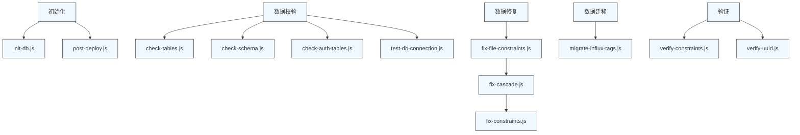

# 维护脚本使用指南

<cite>
**本文档引用的文件**
- [init-db.js](file://server/scripts/init-db.js)
- [check-tables.js](file://server/check-tables.js)
- [check-schema.js](file://server/scripts/check-schema.js)
- [check-auth-tables.js](file://server/scripts/check-auth-tables.js)
- [fix-constraints.js](file://server/scripts/fix-constraints.js)
- [fix-file-constraints.js](file://server/scripts/fix-file-constraints.js)
- [fix-cascade.js](file://server/scripts/fix-cascade.js)
- [migrate-influx-tags.js](file://server/scripts/migrate-influx-tags.js)
- [verify-constraints.js](file://server/scripts/verify-constraints.js)
- [verify-uuid.js](file://server/scripts/verify-uuid.js)
- [test-db-connection.js](file://server/scripts/test-db-connection.js)
- [post-deploy.js](file://server/scripts/post-deploy.js)
- [schema.sql](file://server/db/schema.sql)
</cite>

## 目录
1. [简介](#简介)
2. [初始化脚本](#初始化脚本)
3. [数据校验脚本](#数据校验脚本)
4. [数据修复脚本](#数据修复脚本)
5. [数据迁移脚本](#数据迁移脚本)
6. [生产环境数据修复流程](#生产环境数据修复流程)
7. [附录：脚本执行依赖关系图](#附录脚本执行依赖关系图)

## 简介
本文档详细说明 `server/scripts/` 目录下各类维护脚本的功能与使用方式。这些脚本主要用于数据库初始化、数据校验、约束修复和时序数据迁移等关键运维任务。文档将脚本分为四类进行介绍：初始化脚本、数据校验脚本、数据修复脚本和数据迁移脚本，并提供每个脚本的执行命令、参数说明、预期输出及错误处理。最后结合实际场景，说明生产环境中的脚本执行顺序与依赖关系。

**本节不涉及具体源码分析，因此无引用文件**

## 初始化脚本
初始化脚本用于系统首次部署时创建数据库结构和基础数据。

### init-db.js
该脚本用于首次部署时创建数据库表结构。

**功能说明**
- 读取 `server/db/schema.sql` 文件
- 执行 SQL 创建所有基础表
- 输出创建成功的表名列表

**执行命令**
```bash
node server/scripts/init-db.js
```

**预期输出**
```
🚀 开始初始化数据库...
✅ 数据库表结构创建成功！
📋 已创建的表:
   - classifications (分类编码表)
   - asset_specs (资产规格表)
   - assets (资产表)
   - spaces (空间表)
```

**错误处理**
- 若数据库连接失败，输出错误信息并退出进程
- 若 SQL 执行出错，捕获异常并显示具体错误消息

**相关脚本：post-deploy.js**
`post-deploy.js` 是一个更完整的部署后初始化脚本，具有以下特点：
- 支持环境变量配置（包括云服务如 Railway）
- 具备数据库连接重试机制
- 幂等执行，可重复运行不会报错
- 自动创建系统基础数据

**执行命令**
```bash
node server/scripts/post-deploy.js
```

**Section sources**
- [init-db.js](file://server/scripts/init-db.js#L1-L40)
- [post-deploy.js](file://server/scripts/post-deploy.js#L1-L182)

## 数据校验脚本
数据校验脚本用于检查数据库表结构、约束和数据完整性。

### check-tables.js
该脚本检查数据库中核心表的存在性和基本状态。

**功能说明**
- 检查 `classifications`、`asset_specs`、`assets`、`spaces` 等核心表是否存在
- 验证表的基本结构完整性

**执行命令**
```bash
node server/check-tables.js
```

**预期输出**
```
✅ 所有核心表存在
- classifications
- asset_specs
- assets
- spaces
```

**Section sources**
- [check-tables.js](file://server/check-tables.js)

### check-schema.js
该脚本详细检查 `asset_specs` 表的结构。

**功能说明**
- 查询表的所有列信息（列名、数据类型、长度、是否可空）
- 检查表的约束定义
- 列出所有索引信息

**执行命令**
```bash
node server/scripts/check-schema.js
```

**预期输出**
```
✅ asset_specs 表的列结构:
┌────────────────────────┬────────────┬───────────────────────────┬────────────┐
│ column_name            │ data_type  │ character_maximum_length  │ is_nullable │
├────────────────────────┼────────────┼───────────────────────────┼────────────┤
│ id                     │ integer    │ null                      │ NO         │
│ spec_code              │ character  │ 50                        │ NO         │
└────────────────────────┴────────────┴───────────────────────────┴────────────┘

✅ asset_specs 表的约束:
┌────────────────────────┬─────────────────┐
│ constraint_name        │ constraint_type │
├────────────────────────┼─────────────────┤
│ asset_specs_pkey       │ PRIMARY KEY     │
│ asset_specs_spec_code_key │ UNIQUE        │
└────────────────────────┴─────────────────┘
```

**Section sources**
- [check-schema.js](file://server/scripts/check-schema.js#L1-L54)

### check-auth-tables.js
该脚本专门检查认证相关表的状态。

**功能说明**
- 检查认证系统表（`users`、`user_roles`、`user_identities`、`refresh_tokens`）是否存在
- 验证默认管理员账户是否存在
- 统计用户总数

**执行命令**
```bash
node server/scripts/check-auth-tables.js
```

**预期输出**
```
✅ 已创建的认证表:
   - user_identities
   - user_roles
   - users

✅ 默认管理员账户: admin@tandem.local
   角色: admin

📊 用户总数: 1
```

**Section sources**
- [check-auth-tables.js](file://server/scripts/check-auth-tables.js#L1-L59)

### test-db-connection.js
该脚本测试数据库连接并提供全面的数据库状态检查。

**功能说明**
- 测试数据库连接是否正常
- 显示当前数据库信息
- 列出所有表名
- 统计关键表的数据量

**执行命令**
```bash
node server/scripts/test-db-connection.js
```

**预期输出**
```
✅ 数据库连接成功！
   当前时间: 2024-01-15T08:30:45.123Z
   当前数据库: tandem

📋 数据库表:
   - classifications
   - asset_specs
   - assets
   - spaces
   - users

📊 表数据统计:
   分类: 15
   规格: 42
   资产: 231
   空间: 89
```

**Section sources**
- [test-db-connection.js](file://server/scripts/test-db-connection.js#L1-L68)

## 数据修复脚本
数据修复脚本用于修复数据库中的外键、约束和数据一致性问题。

### fix-constraints.js
该脚本修复数据库表的唯一性约束。

**功能说明**
- 删除旧的索引
- 检查并为 `asset_specs`、`assets`、`spaces` 表添加唯一约束
- 确保 `spec_code`、`asset_code`、`space_code` 字段的唯一性

**执行命令**
```bash
node server/scripts/fix-constraints.js
```

**预期输出**
```
🔧 开始修复数据库约束...
✓ 已删除部分索引
✓ 已创建 asset_specs 唯一约束
✓ 已创建 assets 唯一约束
✓ 已创建 spaces 唯一约束
✅ 数据库约束修复完成！
```

**Section sources**
- [fix-constraints.js](file://server/scripts/fix-constraints.js#L1-L57)

### fix-file-constraints.js
该脚本修复与 `file_id` 字段相关的约束问题。

**功能说明**
- 删除旧的唯一约束和索引
- 确保 `file_id` 列存在，若不存在则添加
- 为 `assets`、`spaces`、`asset_specs` 表添加 `file_id` 外键约束
- 创建新的组合唯一索引，使用 `COALESCE` 处理 `NULL` 值情况

**执行命令**
```bash
node server/scripts/fix-file-constraints.js
```

**预期输出**
```
🔧 开始修复数据库约束...
📦 删除旧约束...
📦 确保 file_id 列存在...
  ✓ 为 assets 表添加了 file_id 列
  ✓ 为 spaces 表添加了 file_id 列
  ✓ 为 asset_specs 表添加了 file_id 列
📦 创建新的唯一约束...
  ✓ 创建了 assets 的唯一索引
  ✓ 创建了 spaces 的唯一索引
  ✓ 创建了 asset_specs 的唯一索引
✅ 数据库约束修复完成！
```

**Section sources**
- [fix-file-constraints.js](file://server/scripts/fix-file-constraints.js#L1-L97)

### fix-cascade.js
该脚本修复外键的级联删除行为。

**功能说明**
- 清理孤立的记录（`file_id` 存在但指向不存在的 `model_files` 记录）
- 查找并删除现有的外键约束
- 重新添加带有 `ON DELETE CASCADE` 的外键约束
- 确保删除 `model_files` 记录时，相关记录能自动级联删除

**执行命令**
```bash
node server/scripts/fix-cascade.js
```

**预期输出**
```
🏁 Starting cascade fix...

Checking table: assets
- Cleaned 3 orphaned records from assets
- Found FK constraint: assets_file_id_fkey
- Dropped constraint: assets_file_id_fkey
+ Added constraint: assets_file_id_fkey_cascade (ON DELETE CASCADE)

Checking table: spaces
- Cleaned 1 orphaned records from spaces
- No existing FK constraint found for file_id (will create one)
+ Added constraint: spaces_file_id_fkey_cascade (ON DELETE CASCADE)

Checking table: asset_specs
- Cleaned 0 orphaned records from asset_specs
- No existing FK constraint found for file_id (will create one)
+ Added constraint: asset_specs_file_id_fkey_cascade (ON DELETE CASCADE)

✅ All constraints updated successfully.
```

**Section sources**
- [fix-cascade.js](file://server/scripts/fix-cascade.js#L1-L82)

## 数据迁移脚本
数据迁移脚本用于处理时序数据库中的数据结构变更。

### migrate-influx-tags.js
该脚本将 InfluxDB 中的 `room` tag 数据迁移到 `code` tag。

**功能说明**
- 连接到 InfluxDB 实例
- 查询所有唯一的 `room` tag 值
- 对每个 `room` 值，查询其所有时序数据
- 将数据重新写入，使用 `code` tag 替代 `room` tag
- 删除旧的带有 `room` tag 的数据

**执行命令**
```bash
node server/scripts/migrate-influx-tags.js
```

**环境变量要求**
- `INFLUX_URL`: InfluxDB 地址
- `INFLUX_ORG`: 组织名称
- `INFLUX_BUCKET`: 存储桶名称
- `INFLUX_TOKEN`: 认证令牌（必需）

**预期输出**
```
🔄 开始迁移 InfluxDB 数据...
   URL: http://localhost:8086
   Org: demo
   Bucket: tandem

📋 查询现有的 room tag 值...
   找到 12 个唯一的 room tag 值
   示例: A101, A102, A103, A201, A202...

🔄 迁移房间: A101
   📊 迁移 15840 条数据点
   ✅ 写入进度: 5000/15840
   ✅ 写入进度: 10000/15840
   ✅ 写入进度: 15840/15840

...

✅ 迁移写入完成！共写入 189234 条新数据点

🗑️ 清理旧数据（带 room tag 的数据）...
   删除 room="A101" 的旧数据...
   ✅ 已删除
   ...

🎉 迁移完成！
   - 迁移了 12 个房间
   - 写入了 189234 条新数据点（使用 code tag）
   - 删除了旧数据（使用 room tag）
```

**错误处理**
- 若 `INFLUX_TOKEN` 未配置，脚本立即退出
- 查询、写入或删除操作失败时，捕获并显示错误信息
- 使用分批处理避免内存溢出

**Section sources**
- [migrate-influx-tags.js](file://server/scripts/migrate-influx-tags.js#L1-L240)

## 生产环境数据修复流程
在生产环境中执行数据修复时，应遵循严格的流程和依赖关系，以确保数据安全和系统稳定性。

### 执行顺序与依赖关系
1. **连接测试**：首先运行 `test-db-connection.js` 确认数据库连接正常
2. **状态检查**：运行 `check-tables.js` 和 `check-schema.js` 获取当前数据库状态
3. **执行修复**：按顺序执行修复脚本
4. **验证结果**：运行验证脚本确认修复效果

### 完整修复流程示例
```bash
# 1. 测试数据库连接
node server/scripts/test-db-connection.js

# 2. 检查当前约束状态
node server/scripts/verify-constraints.js

# 3. 修复文件约束（添加 file_id 列和约束）
node server/scripts/fix-file-constraints.js

# 4. 修复级联删除行为
node server/scripts/fix-cascade.js

# 5. 修复其他约束
node server/scripts/fix-constraints.js

# 6. 验证 UUID 字段
node server/scripts/verify-uuid.js

# 7. 再次检查数据库状态
node server/scripts/test-db-connection.js
```

### 验证脚本
系统提供多个验证脚本来确认修复结果：

**verify-constraints.js**：验证唯一约束是否正确创建
```bash
node server/scripts/verify-constraints.js
```

**verify-uuid.js**：验证 UUID 字段是否已正确添加和填充
```bash
node server/scripts/verify-uuid.js
```

### 注意事项
- 在生产环境执行前，务必备份数据库
- 建议在低峰期执行数据修复操作
- 每个脚本执行后应检查输出结果，确认无误后再执行下一个
- 对于 `migrate-influx-tags.js` 这类影响时序数据的脚本，建议先在测试环境验证

**Section sources**
- [verify-constraints.js](file://server/scripts/verify-constraints.js#L1-L53)
- [verify-uuid.js](file://server/scripts/verify-uuid.js#L1-L49)

## 附录：脚本执行依赖关系图



**Diagram sources**
- [init-db.js](file://server/scripts/init-db.js#L1-L40)
- [post-deploy.js](file://server/scripts/post-deploy.js#L1-L182)
- [check-tables.js](file://server/check-tables.js)
- [check-schema.js](file://server/scripts/check-schema.js#L1-L54)
- [check-auth-tables.js](file://server/scripts/check-auth-tables.js#L1-L59)
- [test-db-connection.js](file://server/scripts/test-db-connection.js#L1-L68)
- [fix-file-constraints.js](file://server/scripts/fix-file-constraints.js#L1-L97)
- [fix-cascade.js](file://server/scripts/fix-cascade.js#L1-L82)
- [fix-constraints.js](file://server/scripts/fix-constraints.js#L1-L57)
- [migrate-influx-tags.js](file://server/scripts/migrate-influx-tags.js#L1-L240)
- [verify-constraints.js](file://server/scripts/verify-constraints.js#L1-L53)
- [verify-uuid.js](file://server/scripts/verify-uuid.js#L1-L49)