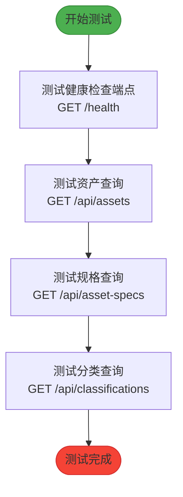
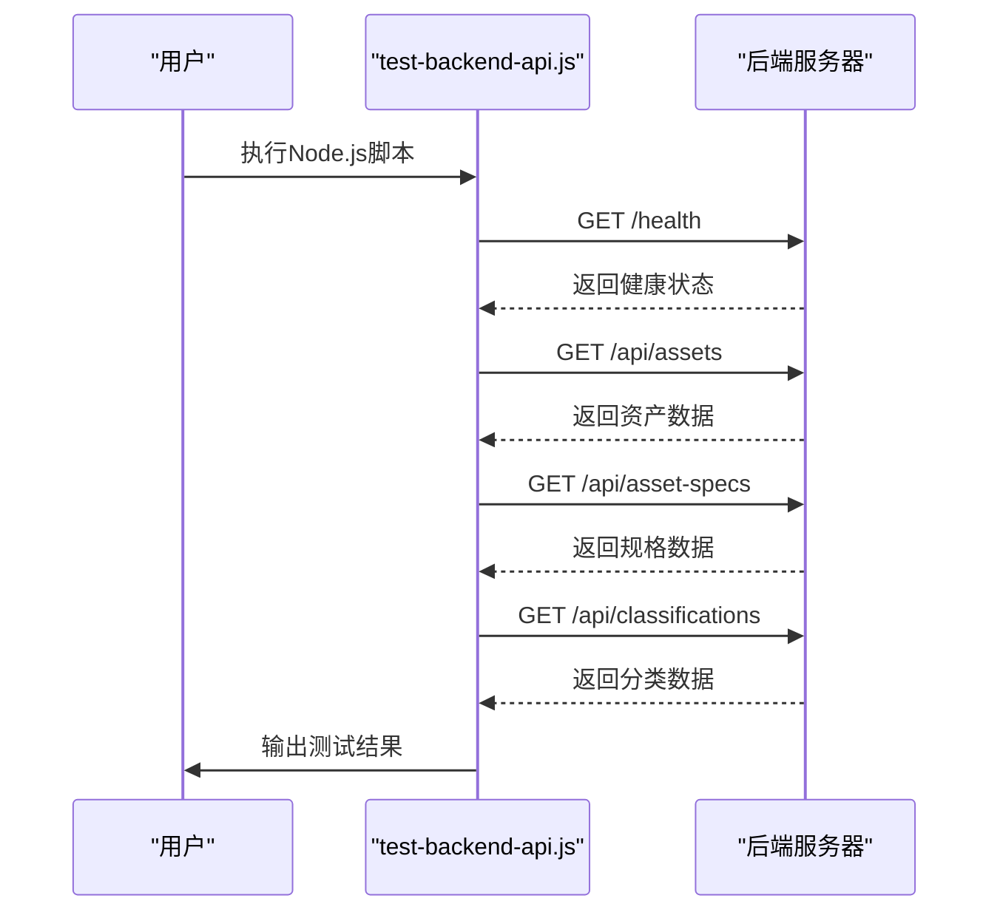
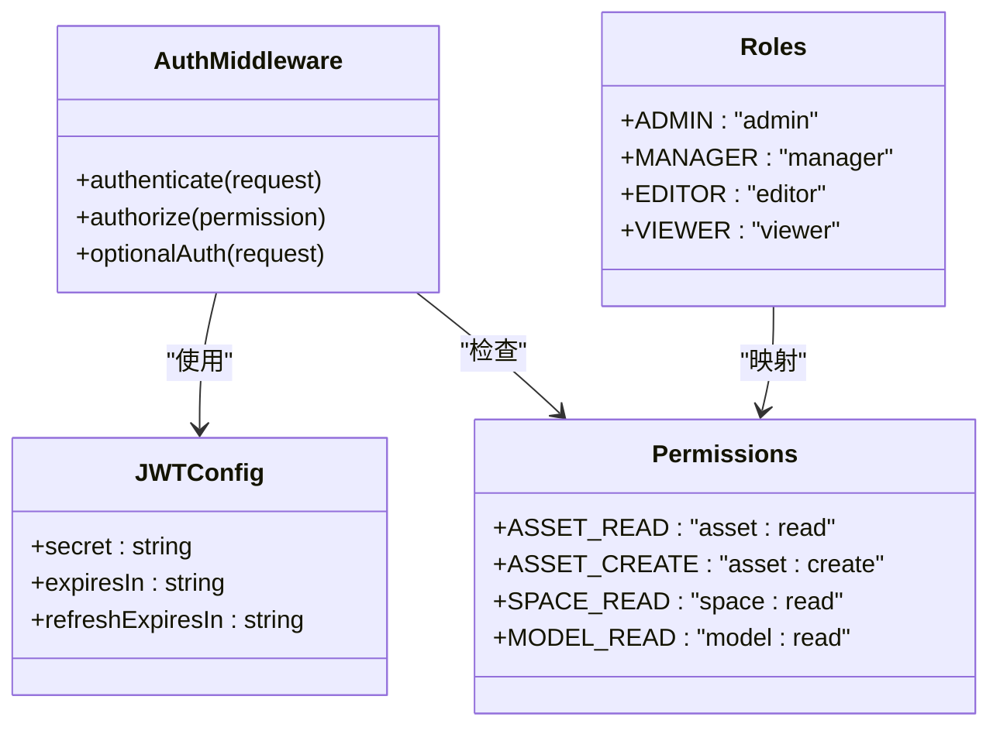
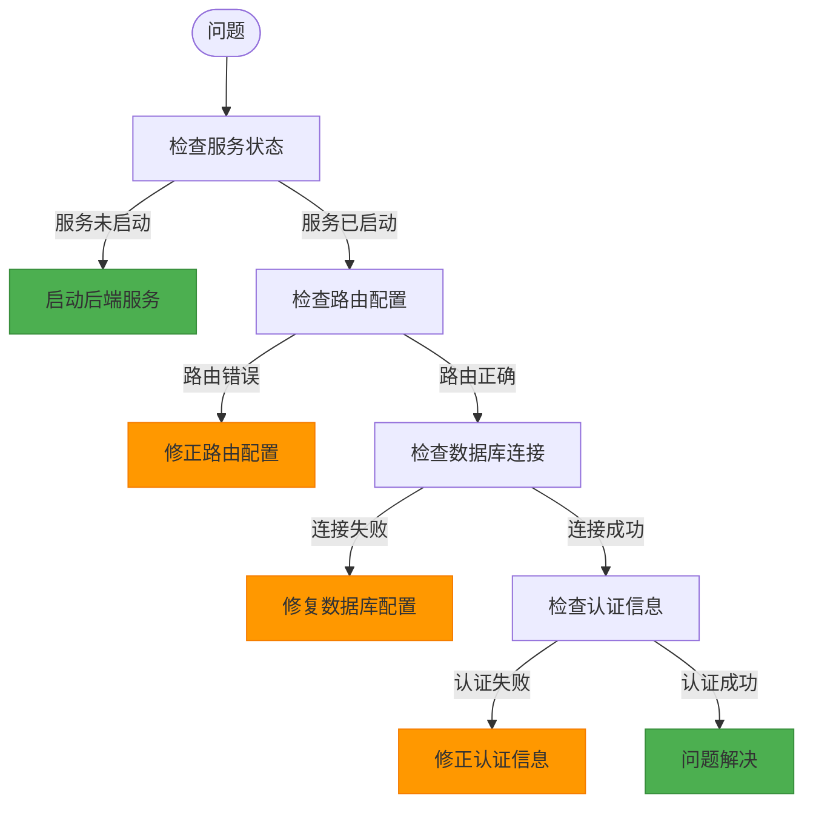

# API测试

<cite>
**本文档引用的文件**  
- [test-backend-api.js](file://server/scripts/test-backend-api.js)
- [api.js](file://server/routes/api.js)
- [assets.js](file://server/routes/v1/assets.js)
- [spaces.js](file://server/routes/v1/spaces.js)
- [models.js](file://server/routes/v1/models.js)
- [auth.js](file://server/middleware/auth.js)
- [auth.js](file://server/config/auth.js)
- [index.js](file://server/index.js)
- [error-handler.js](file://server/middleware/error-handler.js)
- [test-db-connection.js](file://server/scripts/test-db-connection.js)
</cite>

## 目录
1. [简介](#简介)
2. [核心API端点测试](#核心api端点测试)
3. [测试脚本执行方式](#测试脚本执行方式)
4. [认证机制与受保护接口测试](#认证机制与受保护接口测试)
5. [手动测试工具推荐](#手动测试工具推荐)
6. [常见问题与故障排查](#常见问题与故障排查)
7. [错误处理策略](#错误处理策略)

## 简介
本文档详细说明TwinSight系统的API测试方法，重点介绍如何使用`test-backend-api.js`脚本验证健康检查、资产、规格和分类等核心API端点的可用性与响应数据结构。文档涵盖测试脚本的执行方式、JWT认证机制的应用、手动测试工具的使用建议以及常见问题的排查方法。

## 核心API端点测试

TwinSight系统提供了多个核心API端点用于验证系统健康状态和数据访问能力。`test-backend-api.js`脚本通过`fetch`发起GET请求，验证以下核心端点：

1. **健康检查端点**：`/health`，用于验证后端服务是否正常运行
2. **资产查询端点**：`/api/assets`，用于获取资产列表
3. **规格查询端点**：`/api/asset-specs`，用于获取资产规格列表
4. **分类查询端点**：`/api/classifications`，用于获取分类列表

测试脚本通过异步方式依次调用这些端点，并解析JSON响应，验证数据结构的完整性和正确性。



**图示来源**
- [test-backend-api.js](file://server/scripts/test-backend-api.js#L4-L57)

**本节来源**
- [test-backend-api.js](file://server/scripts/test-backend-api.js#L4-L57)
- [index.js](file://server/index.js#L121-L124)
- [api.js](file://server/routes/api.js#L193-L197)

## 测试脚本执行方式

`test-backend-api.js`脚本使用Node.js环境运行，通过`fetch` API发起HTTP请求并解析JSON响应。脚本的执行方式如下：

1. 确保后端服务已启动（默认端口3001）
2. 在项目根目录下执行命令：`node server/scripts/test-backend-api.js`
3. 脚本将输出测试结果，包括成功和失败的信息

预期输出格式包含：
- 健康检查结果：显示后端运行状态和时间戳
- 资产查询结果：显示查询到的资产数量和前3条记录的表格
- 规格查询结果：显示查询到的规格数量和前3条记录的表格
- 分类查询结果：显示查询到的分类数量



**图示来源**
- [test-backend-api.js](file://server/scripts/test-backend-api.js#L4-L57)

**本节来源**
- [test-backend-api.js](file://server/scripts/test-backend-api.js#L4-L57)
- [package.json](file://server/package.json#L7-L9)

## 认证机制与受保护接口测试

TwinSight系统采用JWT（JSON Web Token）认证机制保护API接口。所有受保护的API端点都需要在请求头中携带有效的JWT token。

### JWT认证流程

1. 用户登录获取JWT token
2. 在后续API请求的`Authorization`头中携带`Bearer <token>`格式的token
3. 服务器验证token的有效性
4. 根据用户权限决定是否允许访问

### 受保护接口测试

测试受保护接口时，需要在`fetch`请求中添加认证头：

```javascript
const response = await fetch('http://localhost:3001/api/protected-endpoint', {
  headers: {
    'Authorization': 'Bearer <your-jwt-token>'
  }
});
```

系统定义了多种权限类型，包括资产读取(`asset:read`)、空间创建(`space:create`)、模型上传(`model:upload`)等，不同角色拥有不同的权限组合。



**图示来源**
- [auth.js](file://server/middleware/auth.js#L12-L86)
- [auth.js](file://server/config/auth.js#L8-L141)

**本节来源**
- [auth.js](file://server/middleware/auth.js#L12-L86)
- [auth.js](file://server/config/auth.js#L8-L141)
- [assets.js](file://server/routes/v1/assets.js#L33-L35)

## 手动测试工具推荐

除了使用`test-backend-api.js`脚本进行自动化测试外，推荐使用Postman或curl进行手动测试。

### Postman测试

1. 创建新的请求
2. 设置请求方法为GET
3. 输入API端点URL
4. 在Headers中添加`Authorization`头，值为`Bearer <your-jwt-token>`
5. 发送请求并查看响应

### curl命令测试

```bash
# 健康检查
curl -X GET http://localhost:3001/health

# 带认证的资产查询
curl -X GET http://localhost:3001/api/assets \
  -H "Authorization: Bearer <your-jwt-token>"

# 带认证的规格查询
curl -X GET http://localhost:3001/api/asset-specs \
  -H "Authorization: Bearer <your-jwt-token>"
```

**本节来源**
- [test-backend-api.js](file://server/scripts/test-backend-api.js#L7-L8)
- [auth.js](file://server/middleware/auth.js#L24-L32)

## 常见问题与故障排查

### 服务未启动

**症状**：`fetch`请求超时或连接被拒绝
**解决方案**：
1. 检查后端服务是否已启动
2. 验证端口配置（默认3001）
3. 检查防火墙设置

### 路由错误

**症状**：返回404错误
**解决方案**：
1. 验证API端点URL是否正确
2. 检查路由配置文件
3. 确认服务器是否正确加载了路由模块

### 数据库查询失败

**症状**：返回500错误或查询结果为空
**解决方案**：
1. 使用`test-db-connection.js`脚本测试数据库连接
2. 检查数据库配置
3. 验证数据库表结构和数据

### 认证失败

**症状**：返回401或403错误
**解决方案**：
1. 验证JWT token是否有效
2. 检查token是否过期
3. 确认用户权限是否足够



**图示来源**
- [test-backend-api.js](file://server/scripts/test-backend-api.js#L52-L54)
- [test-db-connection.js](file://server/scripts/test-db-connection.js#L17-L67)

**本节来源**
- [test-backend-api.js](file://server/scripts/test-backend-api.js#L52-L54)
- [test-db-connection.js](file://server/scripts/test-db-connection.js#L17-L67)
- [error-handler.js](file://server/middleware/error-handler.js#L55-L108)

## 错误处理策略

TwinSight系统采用统一的错误处理策略，确保API响应的一致性和可预测性。

### 错误响应格式

所有错误响应都遵循统一的JSON格式：
```json
{
  "success": false,
  "error": "错误信息",
  "details": "详细信息（可选）"
}
```

### 错误类型处理

系统处理多种类型的错误，包括：
- **客户端错误**（4xx）：如400（请求错误）、401（未授权）、403（禁止访问）、404（未找到）
- **服务器错误**（5xx）：如500（内部服务器错误）、502（网关错误）
- **数据库错误**：如唯一约束冲突（23505）、外键约束冲突（23503）

### 开发与生产模式差异

在开发模式下，错误响应包含详细的堆栈信息，便于调试；在生产模式下，错误响应隐藏详细信息，防止敏感信息泄露。

**本节来源**
- [error-handler.js](file://server/middleware/error-handler.js#L9-L108)
- [test-backend-api.js](file://server/scripts/test-backend-api.js#L52-L54)