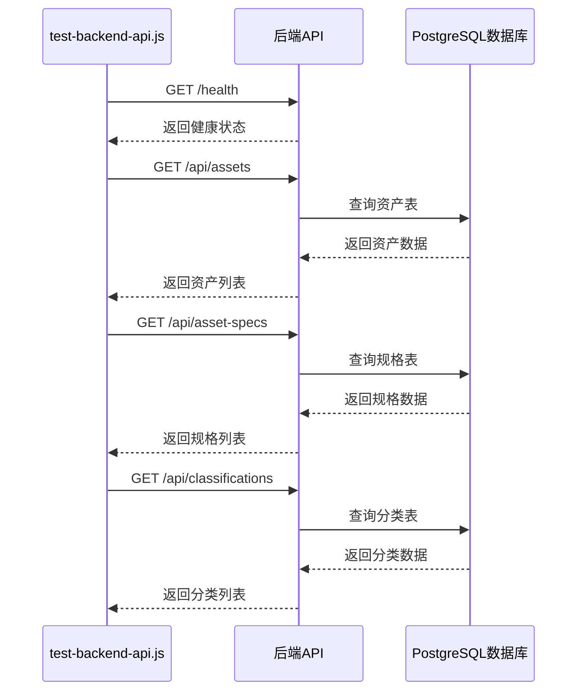
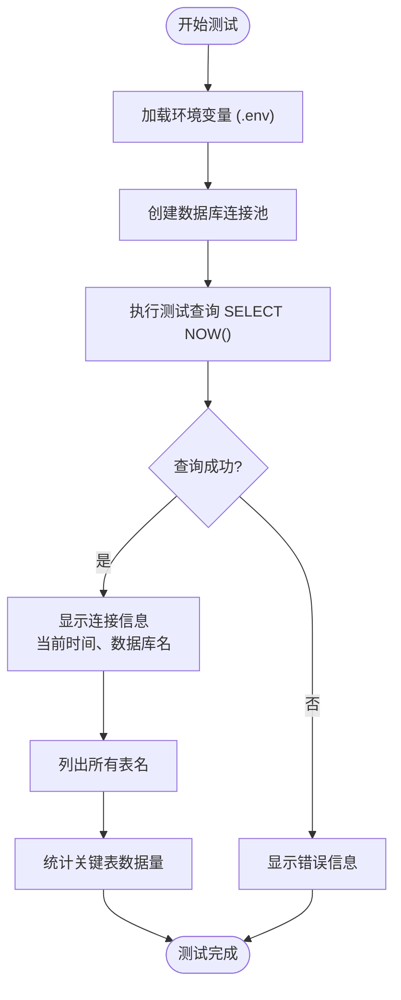
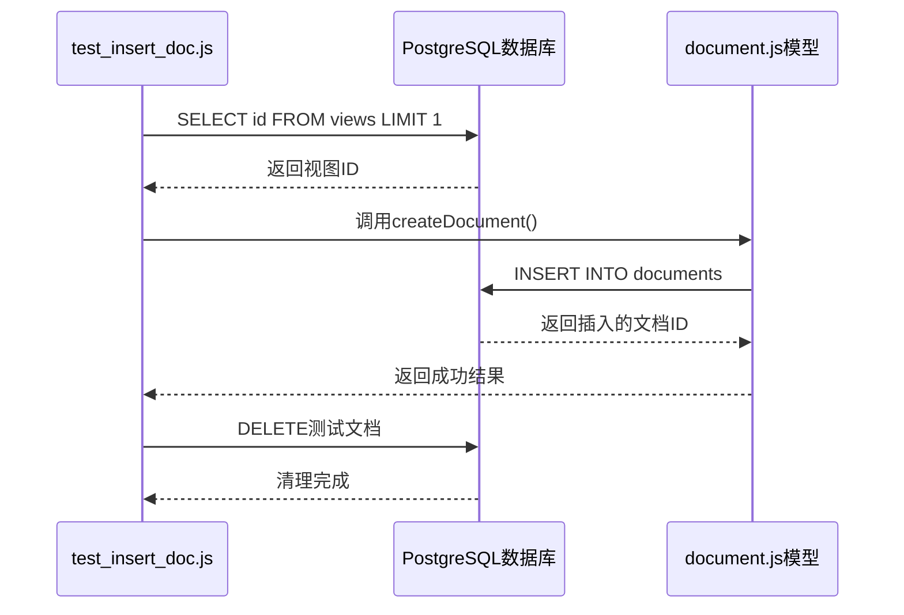
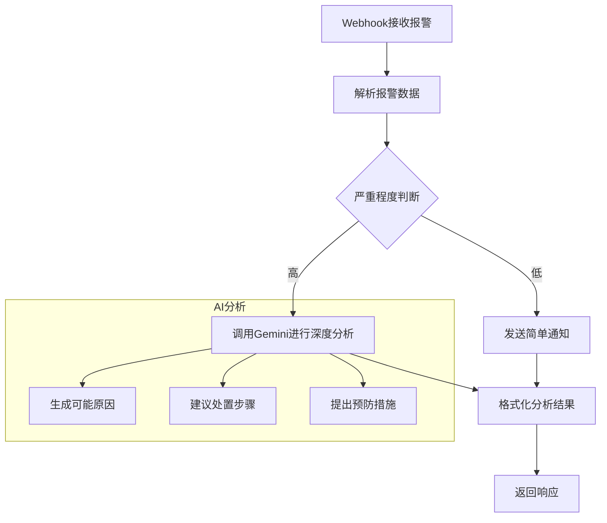

# 测试方法

<cite>
**本文档引用的文件**  
- [test-backend-api.js](file://server/scripts/test-backend-api.js)
- [test-db-connection.js](file://server/scripts/test-db-connection.js)
- [check-backend-connection.js](file://server/scripts/check-backend-connection.js)
- [test_insert_doc.js](file://server/scripts/test_insert_doc.js)
- [temperature-alert.json](file://n8n-workflows/temperature-alert.json)
- [temperature-alert-workflow.json](file://n8n-workflows/temperature-alert-workflow.json)
- [.env](file://server/.env)
- [auth.js](file://server/routes/v1/auth.js)
- [documents.js](file://server/routes/v1/documents.js)
- [assets.js](file://server/routes/v1/assets.js)
- [database.js](file://server/config/database.js)
- [influx-config.js](file://server/models/influx-config.js)
- [influx-config.js](file://server/routes/influx-config.js)
</cite>

## 目录
1. [引言](#引言)
2. [核心API连通性测试](#核心api连通性测试)
3. [数据库连接状态验证](#数据库连接状态验证)
4. [端到端文档上传与写入测试](#端到端文档上传与写入测试)
5. [自动化工作流测试](#自动化工作流测试)
6. [手动接口测试方法](#手动接口测试方法)
7. [常见失败原因分析](#常见失败原因分析)
8. [结论](#结论)

## 引言
本文档系统化地介绍了TwinSight系统的测试策略与实施方法。通过一系列脚本和工具，确保后端服务、数据库连接、核心API功能以及自动化工作流的稳定性和正确性。测试覆盖了从基础连接性验证到复杂业务逻辑的端到端场景，为系统的可靠运行提供了保障。

## 核心API连通性测试

使用 `test-backend-api.js` 脚本可以验证用户认证、文档上传、资产查询等核心API的连通性与响应正确性。该脚本通过模拟HTTP请求，检查后端服务的健康状态和数据查询能力。



**图示来源**
- [test-backend-api.js](file://server/scripts/test-backend-api.js#L1-L58)
- [health路由](file://server/index.js)
- [assets.js](file://server/routes/v1/assets.js#L33-L57)
- [database.js](file://server/config/database.js#L34-L45)

**本节来源**
- [test-backend-api.js](file://server/scripts/test-backend-api.js#L1-L58)
- [assets.js](file://server/routes/v1/assets.js#L33-L57)
- [documents.js](file://server/routes/v1/documents.js#L54-L98)

## 数据库连接状态验证

通过 `test-db-connection.js` 和 `check-backend-connection.js` 脚本，可以确认服务与PostgreSQL数据库的连接状态。这些脚本不仅测试连接，还验证了数据库的配置和基本操作能力。



**图示来源**
- [test-db-connection.js](file://server/scripts/test-db-connection.js#L1-L68)
- [check-backend-connection.js](file://server/scripts/check-backend-connection.js#L1-L90)
- [.env](file://server/.env#L1-L24)
- [database.js](file://server/config/database.js#L10-L20)

**本节来源**
- [test-db-connection.js](file://server/scripts/test-db-connection.js#L1-L68)
- [check-backend-connection.js](file://server/scripts/check-backend-connection.js#L1-L90)
- [.env](file://server/.env#L1-L24)

## 端到端文档上传与写入测试

`test_insert_doc.js` 脚本用于进行端到端的文档上传与数据库写入测试。该脚本模拟了完整的文档创建流程，包括从数据库获取视图ID、插入文档记录以及清理测试数据。



**图示来源**
- [test_insert_doc.js](file://server/scripts/test_insert_doc.js#L1-L56)
- [document.js](file://server/models/document.js)
- [documents.js](file://server/routes/v1/documents.js#L142-L187)
- [database.js](file://server/config/database.js#L34-L45)

**本节来源**
- [test_insert_doc.js](file://server/scripts/test_insert_doc.js#L1-L56)
- [documents.js](file://server/routes/v1/documents.js#L142-L187)

## 自动化工作流测试

通过分析n8n工作流文件（如 `temperature-alert.json` 和 `temperature-alert-workflow.json`），可以设计自动化测试用例来模拟温度告警等场景的触发与执行。这些工作流实现了从接收报警到AI分析的完整流程。



**图示来源**
- [temperature-alert.json](file://n8n-workflows/temperature-alert.json#L1-L143)
- [temperature-alert-workflow.json](file://n8n-workflows/temperature-alert-workflow.json#L1-L197)
- [n8n-service.js](file://server/services/n8n-service.js)

**本节来源**
- [temperature-alert.json](file://n8n-workflows/temperature-alert.json#L1-L143)
- [temperature-alert-workflow.json](file://n8n-workflows/temperature-alert-workflow.json#L1-L197)

## 手动接口测试方法

推荐使用Postman或curl进行手动接口测试。以下展示带JWT认证头的请求示例：

### 使用curl测试用户登录
```bash
curl -X POST http://localhost:3001/api/v1/auth/login \
  -H "Content-Type: application/json" \
  -d '{
    "email": "user@example.com",
    "password": "password123"
  }'
```

### 使用curl测试带JWT的文档查询
```bash
curl -X GET http://localhost:3001/api/v1/documents \
  -H "Authorization: Bearer YOUR_JWT_TOKEN_HERE" \
  -H "Content-Type: application/json"
```

### Postman测试配置
1. 在Headers中添加 `Authorization: Bearer <JWT_TOKEN>`
2. 使用POST请求 `/api/v1/auth/login` 获取令牌
3. 将获取的令牌用于后续需要认证的API调用

**本节来源**
- [auth.js](file://server/routes/v1/auth.js#L82-L119)
- [documents.js](file://server/routes/v1/documents.js#L54-L98)
- [middleware/auth.js](file://server/middleware/auth.js)

## 常见失败原因分析

### 数据库连接超时
- **可能原因**：数据库服务未启动、网络不通、防火墙阻止、连接池耗尽
- **排查方法**：检查 `DB_HOST`、`DB_PORT` 配置，使用 `ping` 和 `telnet` 测试网络连通性
- **解决方案**：确保PostgreSQL服务运行，检查防火墙设置，调整连接池大小

### 认证失败
- **可能原因**：JWT令牌过期、无效的用户名/密码、刷新令牌Cookie丢失
- **排查方法**：检查登录接口返回，验证令牌有效期，确认Cookie设置
- **解决方案**：重新登录获取新令牌，检查 `refreshToken` Cookie的Secure和HttpOnly属性

### 文档上传失败
- **可能原因**：文件类型不支持、文件大小超限、存储目录权限不足
- **排查方法**：检查 `allowedTypes` 配置，验证文件大小限制，确认目录可写
- **解决方案**：修改 `multer` 配置，确保 `config.upload.documentsDir` 目录存在且可写

### InfluxDB连接失败
- **可能原因**：URL配置错误、认证信息无效、网络不通
- **排查方法**：使用 `testInfluxConnection` 函数测试连接，检查 `influx_configs` 表配置
- **解决方案**：修正InfluxDB配置，确保使用正确的Token或Basic Auth

**本节来源**
- [test-db-connection.js](file://server/scripts/test-db-connection.js#L60-L64)
- [auth.js](file://server/routes/v1/auth.js#L113-L118)
- [documents.js](file://server/routes/v1/documents.js#L153-L155)
- [influx-config.js](file://server/models/influx-config.js#L168-L175)

## 结论
TwinSight系统提供了一套完整的测试策略，涵盖了从基础设施到业务逻辑的各个层面。通过自动化脚本和手动测试相结合的方式，能够有效保障系统的稳定性和可靠性。建议在部署新版本或修改配置后，按顺序执行数据库连接测试、核心API测试和端到端流程测试，以确保所有功能正常工作。