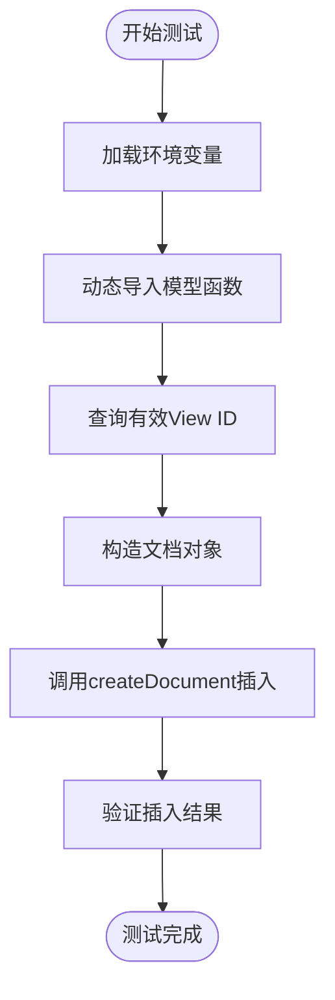

# 集成测试

<cite>
**本文档引用的文件**
- [test_insert_doc.js](file://server/scripts/test_insert_doc.js)
- [temperature-alert-workflow.json](file://n8n-workflows/temperature-alert-workflow.json)
- [document.js](file://server/models/document.js)
- [ai.js](file://server/routes/v1/ai.js)
- [database.js](file://server/config/database.js)
- [openwebui-service.js](file://server/services/openwebui-service.js)
- [n8n-service.js](file://server/services/n8n-service.js)
</cite>

## 目录
1. [引言](#引言)
2. [模型层文档插入测试](#模型层文档插入测试)
3. [动态导入与业务逻辑执行](#动态导入与业务逻辑执行)
4. [测试数据准备与清理](#测试数据准备与清理)
5. [基于n8n的自动化集成测试](#基于n8n的自动化集成测试)
6. [用户操作流程模拟](#用户操作流程模拟)
7. [集成测试运行策略](#集成测试运行策略)
8. [异常恢复与日志监控](#异常恢复与日志监控)
9. [结论](#结论)

## 引言
TwinSight系统通过集成测试确保从文件上传到AI分析的完整链路正确性。本文档系统化介绍其集成测试实践，涵盖端到端测试、自动化工作流、数据一致性验证等关键方面。测试覆盖数据库写入、外键约束、知识库同步及外部服务调用等核心功能。

## 模型层文档插入测试
通过`test_insert_doc.js`脚本实现从模型层插入文档的端到端测试，验证数据库写入与外键约束的正确性。测试流程包括获取有效viewId、构造文档对象、调用createDocument函数并验证返回结果。

**图示来源**
- [test_insert_doc.js](file://server/scripts/test_insert_doc.js#L1-L56)

**本节来源**
- [test_insert_doc.js](file://server/scripts/test_insert_doc.js#L1-L56)
- [document.js](file://server/models/document.js#L58-L82)

## 动态导入与业务逻辑执行
演示如何动态导入模型函数并在独立脚本中执行业务逻辑。通过ES模块的动态导入功能，避免循环依赖并实现灵活的测试脚本编写。

**图示来源**
- [test_insert_doc.js](file://server/scripts/test_insert_doc.js#L15-L43)
- [document.js](file://server/models/document.js#L58-L82)

**本节来源**
- [test_insert_doc.js](file://server/scripts/test_insert_doc.js#L15-L43)
- [document.js](file://server/models/document.js#L58-L82)

## 测试数据准备与清理
展示测试前数据准备与测试后清理的最佳实践。测试脚本在执行前查询有效viewId作为测试数据，在测试完成后执行DELETE操作清理测试数据，确保测试环境的纯净。

**图示来源**
- [test_insert_doc.js](file://server/scripts/test_insert_doc.js#L18-L47)

**本节来源**
- [test_insert_doc.js](file://server/scripts/test_insert_doc.js#L18-L47)
- [document.js](file://server/models/document.js#L107-L114)

## 基于n8n的自动化集成测试
基于`temperature-alert-workflow.json`设计自动化集成测试，验证告警触发、数据传递与外部服务调用的连贯性。工作流从Webhook接收温度报警开始，依次执行上下文查询、Prompt构建、RAG查询、AI回复解析和结果返回。

**图示来源**
- [temperature-alert-workflow.json](file://n8n-workflows/temperature-alert-workflow.json#L1-L197)

**本节来源**
- [temperature-alert-workflow.json](file://n8n-workflows/temperature-alert-workflow.json#L1-L197)
- [n8n-service.js](file://server/services/n8n-service.js#L36-L81)

## 用户操作流程模拟
模拟真实用户操作流程，覆盖文件上传→数据库记录→知识库同步→AI分析的完整链路。系统通过n8n工作流协调各服务组件，确保数据在各环节正确传递和处理。

**图示来源**
- [ai.js](file://server/routes/v1/ai.js#L89-L192)
- [openwebui-service.js](file://server/services/openwebui-service.js#L318-L345)

**本节来源**
- [ai.js](file://server/routes/v1/ai.js#L89-L192)
- [openwebui-service.js](file://server/services/openwebui-service.js#L318-L345)
- [temperature-alert-workflow.json](file://n8n-workflows/temperature-alert-workflow.json#L1-L197)

## 集成测试运行策略
提出集成测试的运行策略与日志监控建议。测试脚本可在CI/CD流水线中执行，通过环境变量配置不同测试环境。建议在测试执行前后记录关键日志，便于问题排查。

**图示来源**
- [test_insert_doc.js](file://server/scripts/test_insert_doc.js#L12-L56)
- [test-db-connection.js](file://server/scripts/test-db-connection.js#L17-L68)

**本节来源**
- [test_insert_doc.js](file://server/scripts/test_insert_doc.js#L12-L56)
- [test-db-connection.js](file://server/scripts/test-db-connection.js#L17-L68)

## 异常恢复与日志监控
集成测试应包含异常恢复机制和完善的日志监控。测试脚本需捕获异常并确保测试环境清理，同时记录详细的执行日志，便于定位问题和优化测试流程。

**图示来源**
- [test_insert_doc.js](file://server/scripts/test_insert_doc.js#L49-L52)
- [database.js](file://server/config/database.js#L58-L70)

**本节来源**
- [test_insert_doc.js](file://server/scripts/test_insert_doc.js#L49-L52)
- [database.js](file://server/config/database.js#L58-L70)

## 结论
TwinSight的集成测试实践通过端到端测试脚本、自动化工作流和完整的用户流程模拟，确保了系统的稳定性和可靠性。测试覆盖了从数据持久化到AI分析的完整链路，结合CI/CD运行策略和日志监控，形成了完善的质量保障体系。