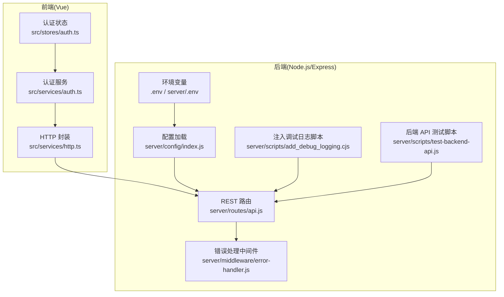
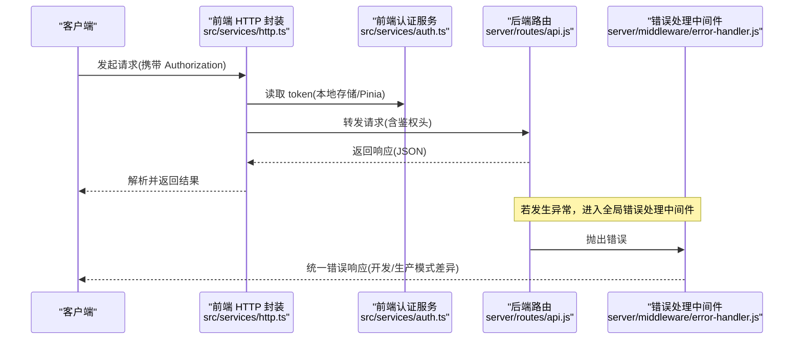
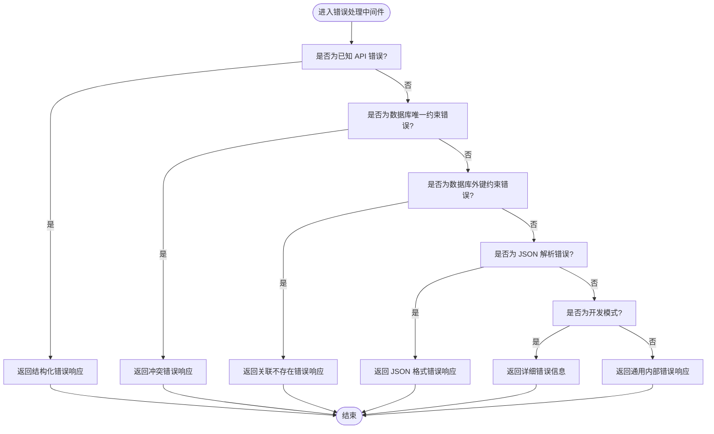
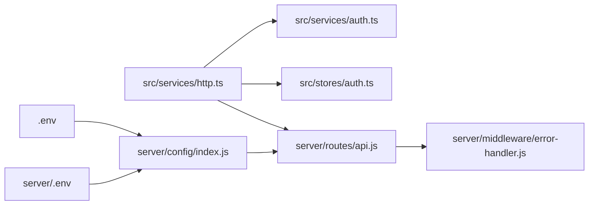

# 调试与测试

<cite>
**本文引用的文件**
- [server/scripts/add_debug_logging.cjs](file://server/scripts/add_debug_logging.cjs)
- [server/scripts/test-backend-api.js](file://server/scripts/test-backend-api.js)
- [server/middleware/error-handler.js](file://server/middleware/error-handler.js)
- [server/config/index.js](file://server/config/index.js)
- [server/routes/api.js](file://server/routes/api.js)
- [src/services/http.ts](file://src/services/http.ts)
- [src/services/auth.ts](file://src/services/auth.ts)
- [src/stores/auth.ts](file://src/stores/auth.ts)
- [.env](file://.env)
- [server/.env](file://server/.env)
</cite>

## 目录
1. [简介](#简介)
2. [项目结构](#项目结构)
3. [核心组件](#核心组件)
4. [架构总览](#架构总览)
5. [详细组件分析](#详细组件分析)
6. [依赖分析](#依赖分析)
7. [性能考虑](#性能考虑)
8. [故障排查指南](#故障排查指南)
9. [结论](#结论)
10. [附录](#附录)

## 简介
本指南聚焦于 TwinSight 项目的调试与测试实践，帮助开发者快速定位问题、验证接口连通性，并建立稳定的前后端联调流程。内容覆盖：
- 启用调试日志：通过脚本注入日志或在环境变量中设置日志级别
- 使用脚本验证核心 API 连通性
- 使用 Postman/curl 测试 RESTful 接口并演示 JWT 认证传递方式
- 分析全局错误处理机制，定位服务端异常
- 前端 Vue 组件调试技巧（含 Vue Devtools 使用要点）
- 建议在开发中开启详细日志，并结合数据库查询验证数据流

## 项目结构
本项目采用前后端分离架构，前端为 Vue 应用，后端为 Node.js + Express 服务。调试与测试相关的关键位置如下：
- 后端调试脚本：server/scripts/add_debug_logging.cjs、server/scripts/test-backend-api.js
- 全局错误处理：server/middleware/error-handler.js
- 配置与环境变量：server/config/index.js、server/.env、.env
- 前端 HTTP 封装与认证：src/services/http.ts、src/services/auth.ts、src/stores/auth.ts
- 后端路由与 API：server/routes/api.js

图表来源
- [server/config/index.js](file://server/config/index.js#L1-L93)
- [server/routes/api.js](file://server/routes/api.js#L1-L603)
- [server/middleware/error-handler.js](file://server/middleware/error-handler.js#L1-L115)
- [server/scripts/add_debug_logging.cjs](file://server/scripts/add_debug_logging.cjs#L1-L39)
- [server/scripts/test-backend-api.js](file://server/scripts/test-backend-api.js#L1-L58)
- [src/services/http.ts](file://src/services/http.ts#L1-L220)
- [src/services/auth.ts](file://src/services/auth.ts#L1-L191)
- [src/stores/auth.ts](file://src/stores/auth.ts#L1-L115)
- [.env](file://.env#L1-L6)
- [server/.env](file://server/.env#L1-L24)

章节来源
- [server/config/index.js](file://server/config/index.js#L1-L93)
- [server/routes/api.js](file://server/routes/api.js#L1-L603)
- [server/middleware/error-handler.js](file://server/middleware/error-handler.js#L1-L115)
- [server/scripts/add_debug_logging.cjs](file://server/scripts/add_debug_logging.cjs#L1-L39)
- [server/scripts/test-backend-api.js](file://server/scripts/test-backend-api.js#L1-L58)
- [src/services/http.ts](file://src/services/http.ts#L1-L220)
- [src/services/auth.ts](file://src/services/auth.ts#L1-L191)
- [src/stores/auth.ts](file://src/stores/auth.ts#L1-L115)
- [.env](file://.env#L1-L6)
- [server/.env](file://server/.env#L1-L24)

## 核心组件
- 后端调试日志注入：通过 server/scripts/add_debug_logging.cjs 在指定文件中插入调试输出，便于观察关键数据结构
- 后端 API 连通性测试：server/scripts/test-backend-api.js 对健康检查、资产、规格、分类等关键接口进行自动化验证
- 全局错误处理：server/middleware/error-handler.js 统一捕获并格式化错误响应，支持开发/生产模式差异
- 前端 HTTP 封装与认证：src/services/http.ts 统一封装请求、鉴权头、超时与错误处理；src/services/auth.ts 提供登录/刷新/登出等认证接口；src/stores/auth.ts 管理认证状态与持久化
- 配置与环境变量：server/config/index.js 动态加载根目录 .env 并提供数据库、JWT、上传、CORS 等配置；server/.env 提供数据库与服务器端口等基础配置；.env 提供前端 API 基础地址

章节来源
- [server/scripts/add_debug_logging.cjs](file://server/scripts/add_debug_logging.cjs#L1-L39)
- [server/scripts/test-backend-api.js](file://server/scripts/test-backend-api.js#L1-L58)
- [server/middleware/error-handler.js](file://server/middleware/error-handler.js#L1-L115)
- [src/services/http.ts](file://src/services/http.ts#L1-L220)
- [src/services/auth.ts](file://src/services/auth.ts#L1-L191)
- [src/stores/auth.ts](file://src/stores/auth.ts#L1-L115)
- [server/config/index.js](file://server/config/index.js#L1-L93)
- [server/.env](file://server/.env#L1-L24)
- [.env](file://.env#L1-L6)

## 架构总览
下图展示从前端发起请求到后端路由与错误处理的整体流程，以及调试脚本与配置对调试的支持点。

图表来源
- [src/services/http.ts](file://src/services/http.ts#L1-L220)
- [src/services/auth.ts](file://src/services/auth.ts#L1-L191)
- [server/routes/api.js](file://server/routes/api.js#L1-L603)
- [server/middleware/error-handler.js](file://server/middleware/error-handler.js#L1-L115)

## 详细组件分析

### 启用调试日志
- 方案一：使用 server/scripts/add_debug_logging.cjs 在指定文件中注入调试输出，便于观察关键数据结构
- 方案二：在环境变量中设置日志级别（例如 LOG_LEVEL=debug），配合后端配置加载逻辑生效

建议步骤
- 在需要观察的数据流处运行注入脚本，确认目标行存在后再执行
- 开发阶段可临时提高日志级别，便于定位问题；生产环境谨慎开启详细日志

章节来源
- [server/scripts/add_debug_logging.cjs](file://server/scripts/add_debug_logging.cjs#L1-L39)
- [server/config/index.js](file://server/config/index.js#L1-L93)
- [server/.env](file://server/.env#L1-L24)
- [.env](file://.env#L1-L6)

### 使用 test-backend-api.js 验证核心 API
该脚本对以下接口进行连通性测试：
- 健康检查：/health
- 资产查询：/api/assets
- 规格查询：/api/asset-specs
- 分类查询：/api/classifications

建议流程
- 启动后端服务后，在终端运行该脚本，观察输出中的成功/失败提示与数据概览
- 如遇失败，结合全局错误处理中间件定位具体错误原因

章节来源
- [server/scripts/test-backend-api.js](file://server/scripts/test-backend-api.js#L1-L58)
- [server/routes/api.js](file://server/routes/api.js#L1-L603)

### 使用 Postman/curl 测试 RESTful 接口与 JWT 传递
- 基础地址：前端通过 .env 中的 VITE_API_URL 指向后端，默认 http://localhost:3001
- 认证方式：前端 HTTP 封装会在请求头中添加 Authorization: Bearer <token>，token 来自本地存储或 Pinia 状态
- 常用接口参考：/api/assets、/api/asset-specs、/api/classifications 等

Postman/curl 示例思路
- 登录获取 token 后，将 Authorization: Bearer <token> 写入请求头
- 访问受保护接口，观察响应结构与状态码
- 如需查看后端调试输出，可在目标文件运行注入脚本后再发起请求

章节来源
- [.env](file://.env#L1-L6)
- [src/services/http.ts](file://src/services/http.ts#L1-L220)
- [src/services/auth.ts](file://src/services/auth.ts#L1-L191)
- [server/routes/api.js](file://server/routes/api.js#L1-L603)

### 分析全局错误处理机制
全局错误处理中间件负责：
- 识别已知 API 错误并返回结构化错误响应
- 处理数据库约束错误（唯一约束、外键约束）
- 处理 JSON 解析错误
- 开发模式返回详细错误信息，生产模式隐藏细节

建议定位流程
- 查看错误响应中的 success、error、details 字段
- 开发模式下可获取 stack 信息辅助定位
- 结合后端日志与注入脚本输出，复现问题上下文

图表来源
- [server/middleware/error-handler.js](file://server/middleware/error-handler.js#L1-L115)

章节来源
- [server/middleware/error-handler.js](file://server/middleware/error-handler.js#L1-L115)

### 前端 Vue 组件调试技巧
- 使用 Vue Devtools 检查组件树、状态与事件流
- 关注 Pinia 状态（src/stores/auth.ts）中的 token、isAuthenticated、permissions 等字段变化
- 结合 src/services/http.ts 的请求封装，观察请求头 Authorization 是否正确注入
- 在 src/services/auth.ts 的登录/刷新/登出流程中设置断点，验证 JWT 生命周期

章节来源
- [src/stores/auth.ts](file://src/stores/auth.ts#L1-L115)
- [src/services/http.ts](file://src/services/http.ts#L1-L220)
- [src/services/auth.ts](file://src/services/auth.ts#L1-L191)

## 依赖分析
- 前端依赖后端路由与配置，路由层依赖错误处理中间件统一处理异常
- 配置加载模块负责从根目录 .env 读取变量，后端路由与脚本均依赖此配置
- 前端 HTTP 封装依赖认证服务与 Pinia 状态，形成“认证状态 -> 请求头 -> 后端路由”的链路

图表来源
- [src/services/http.ts](file://src/services/http.ts#L1-L220)
- [src/services/auth.ts](file://src/services/auth.ts#L1-L191)
- [src/stores/auth.ts](file://src/stores/auth.ts#L1-L115)
- [server/routes/api.js](file://server/routes/api.js#L1-L603)
- [server/middleware/error-handler.js](file://server/middleware/error-handler.js#L1-L115)
- [server/config/index.js](file://server/config/index.js#L1-L93)
- [.env](file://.env#L1-L6)
- [server/.env](file://server/.env#L1-L24)

章节来源
- [server/config/index.js](file://server/config/index.js#L1-L93)
- [server/routes/api.js](file://server/routes/api.js#L1-L603)
- [server/middleware/error-handler.js](file://server/middleware/error-handler.js#L1-L115)
- [src/services/http.ts](file://src/services/http.ts#L1-L220)
- [src/services/auth.ts](file://src/services/auth.ts#L1-L191)
- [src/stores/auth.ts](file://src/stores/auth.ts#L1-L115)
- [.env](file://.env#L1-L6)
- [server/.env](file://server/.env#L1-L24)

## 性能考虑
- 在开发阶段适度开启详细日志，有助于快速定位问题；生产环境避免输出敏感堆栈与详细错误
- 前端请求设置合理超时时间，避免长时间阻塞
- 后端批量导入等重操作建议分批处理并记录进度，减少单次事务压力

## 故障排查指南
- 后端 API 连通性：使用 server/scripts/test-backend-api.js 快速验证健康检查与关键接口
- 错误响应定位：根据 server/middleware/error-handler.js 的分支判断，结合响应中的 error、details 字段快速定位
- 日志注入：在关键数据流处运行 server/scripts/add_debug_logging.cjs 注入调试输出，复现问题上下文
- 前端鉴权：检查 src/stores/auth.ts 中 token 是否存在，src/services/http.ts 是否正确附加 Authorization 头
- 配置核对：确认 .env 与 server/.env 中的 API 地址、端口、数据库连接等配置一致

章节来源
- [server/scripts/test-backend-api.js](file://server/scripts/test-backend-api.js#L1-L58)
- [server/middleware/error-handler.js](file://server/middleware/error-handler.js#L1-L115)
- [server/scripts/add_debug_logging.cjs](file://server/scripts/add_debug_logging.cjs#L1-L39)
- [src/stores/auth.ts](file://src/stores/auth.ts#L1-L115)
- [src/services/http.ts](file://src/services/http.ts#L1-L220)
- [.env](file://.env#L1-L6)
- [server/.env](file://server/.env#L1-L24)

## 结论
通过“日志注入 + 脚本测试 + 统一错误处理 + 前端调试工具”的组合，可以在开发阶段高效定位问题、验证接口连通性，并建立稳定的联调流程。建议在日常开发中默认开启详细日志，结合数据库查询与后端日志共同验证数据流，确保问题可追溯、可复现。

## 附录
- 常用调试命令与要点
  - 运行后端 API 测试脚本：node server/scripts/test-backend-api.js
  - 在目标文件注入调试日志：node server/scripts/add_debug_logging.cjs
  - 打开 Vue Devtools 检查 Pinia 状态与组件树
  - 使用 Postman/curl 时在请求头添加 Authorization: Bearer <token>