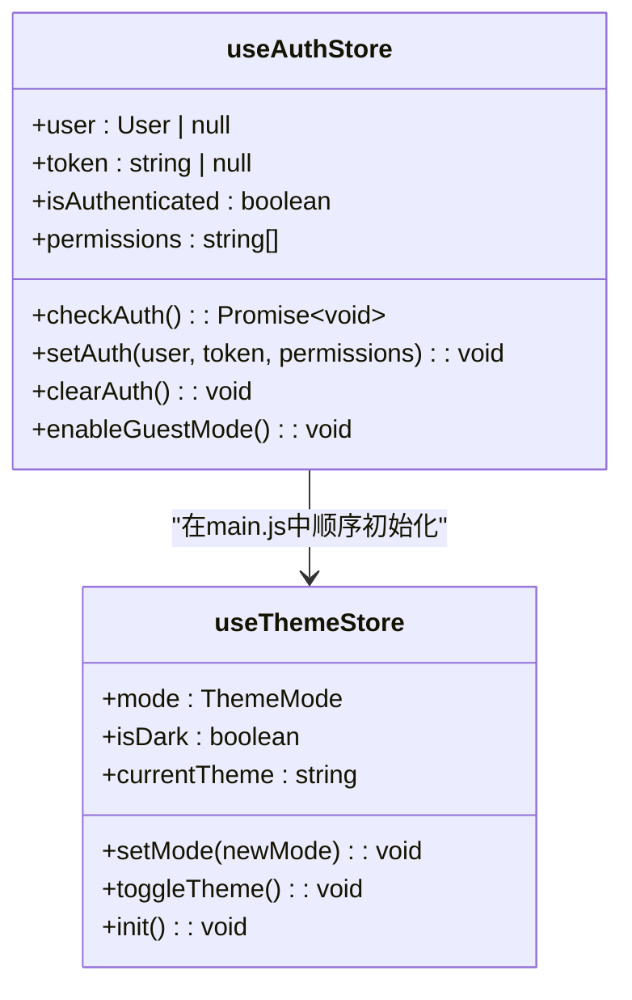
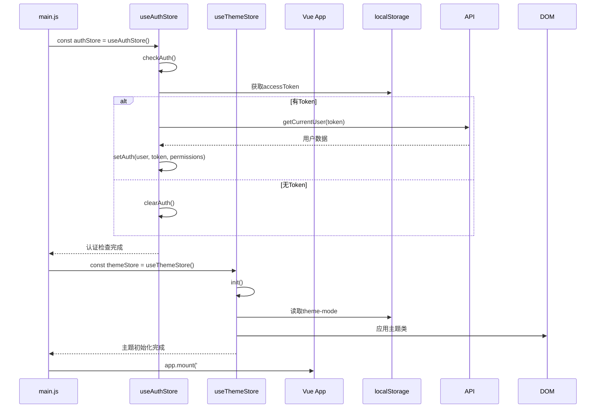
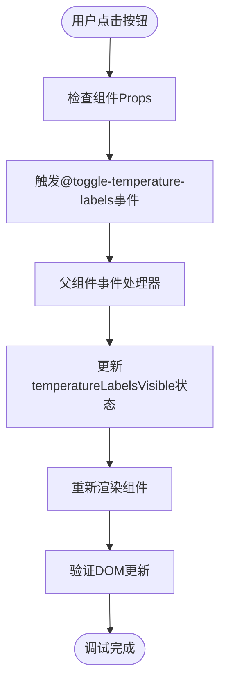
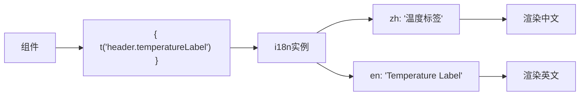

# 前端调试

<cite>
**本文档引用的文件**   
- [main.js](file://src/main.js)
- [auth.ts](file://src/stores/auth.ts)
- [theme.ts](file://src/stores/theme.ts)
- [ViewerControls.vue](file://src/components/viewer/ViewerControls.vue)
- [auth.ts](file://src/services/auth.ts)
- [i18n/index.js](file://src/i18n/index.js)
- [router/index.js](file://src/router/index.js)
</cite>

## 目录
1. [使用Vue Devtools调试组件与状态](#使用vue-devtools调试组件与状态)
2. [异步初始化与生命周期调试](#异步初始化与生命周期调试)
3. [用户交互事件流断点调试](#用户交互事件流断点调试)
4. [路由与国际化加载问题排查](#路由与国际化加载问题排查)
5. [手动修改Store状态测试权限场景](#手动修改store状态测试权限场景)
6. [API请求与响应数据分析](#api请求与响应数据分析)

## 使用Vue Devtools调试组件与状态

Vue Devtools是调试TwinSight前端应用的核心工具，可用于检查组件树、props、事件和Pinia store状态变化。

### 组件树与Props检查
通过Vue Devtools可以查看当前页面的组件层级结构。例如，在查看器页面中，`ViewerControls.vue`组件接收`showTemperatureButton`、`showHeatmapButton`、`temperatureLabelsVisible`和`heatmapEnabled`等props，这些状态控制着温度标签和热力图按钮的显示与激活状态。

### Pinia Store状态调试
TwinSight使用Pinia进行状态管理，重点关注`useAuthStore`和`useThemeStore`两个store的初始化流程。



**Diagram sources**
- [auth.ts](file://src/stores/auth.ts#L22-L114)
- [theme.ts](file://src/stores/theme.ts#L10-L92)

**Section sources**
- [auth.ts](file://src/stores/auth.ts#L22-L114)
- [theme.ts](file://src/stores/theme.ts#L10-L92)

## 异步初始化与生命周期调试

在`main.js`中采用异步IIFE模式确保认证状态检查完成后再挂载应用，这是防止未授权访问的关键机制。



**Diagram sources**
- [main.js](file://src/main.js#L28-L37)
- [auth.ts](file://src/stores/auth.ts#L50-L78)
- [theme.ts](file://src/stores/theme.ts#L73-L76)

**Section sources**
- [main.js](file://src/main.js#L28-L37)

## 用户交互事件流断点调试

利用浏览器开发者工具的断点调试功能，可以深入分析`ViewerControls.vue`中的用户交互事件流。

### 事件流分析
当用户点击温度标签按钮时，触发以下事件流：
1. 用户点击按钮
2. 触发`@click="$emit('toggle-temperature-labels')"`
3. 父组件监听`toggle-temperature-labels`事件
4. 更新`temperatureLabelsVisible`状态
5. 重新渲染按钮，应用`active`类

### 断点调试技巧
1. 在`ViewerControls.vue`的`@click`事件处理函数处设置断点
2. 检查事件触发时的组件props值
3. 观察事件发射后父组件的状态变化
4. 验证DOM是否正确更新



**Diagram sources**
- [ViewerControls.vue](file://src/components/viewer/ViewerControls.vue#L8-L9)
- [ViewerControls.vue](file://src/components/viewer/ViewerControls.vue#L62)

**Section sources**
- [ViewerControls.vue](file://src/components/viewer/ViewerControls.vue#L1-L112)

## 路由与国际化加载问题排查

检查路由导航守卫和i18n国际化加载过程中的潜在问题。

### 路由配置分析
当前路由配置定义了三个主要路由：
- `/`：首页
- `/viewer`：查看器页面
- `/assets`：资产页面

```mermaid
graph TB
A[/] --> B[HomeView.vue]
C[/viewer] --> D[AppViewer.vue]
E[/assets] --> F[AppViewer.vue]
```

**Diagram sources**
- [router/index.js](file://src/router/index.js#L3-L18)

### 国际化加载调试
i18n配置包含中英文两种语言，通过`useI18n()`组合式API在组件中使用。



**Diagram sources**
- [i18n/index.js](file://src/i18n/index.js#L1-L863)
- [ViewerControls.vue](file://src/components/viewer/ViewerControls.vue#L41)

**Section sources**
- [i18n/index.js](file://src/i18n/index.js#L1-L863)
- [router/index.js](file://src/router/index.js#L1-L27)

## 手动修改Store状态测试权限场景

通过`localStorage`手动修改store状态以测试不同用户权限场景。

### 认证状态测试
1. 打开浏览器开发者工具
2. 进入Application/Storage标签
3. 找到localStorage中的`accessToken`
4. 修改或删除token测试不同认证状态

### 权限场景测试
```javascript
// 在浏览器控制台执行
const authStore = useAuthStore();
// 测试管理员权限
authStore.setAuth(
  { id: 1, username: 'admin', email: 'admin@twinsight.com', roles: ['admin'], avatarUrl: null },
  'fake-token',
  ['*']
);
// 测试普通用户权限
authStore.setAuth(
  { id: 2, username: 'user', email: 'user@twinsight.com', roles: ['user'], avatarUrl: null },
  'fake-token',
  ['view', 'edit']
);
```

**Section sources**
- [auth.ts](file://src/stores/auth.ts#L83-L91)

## API请求与响应数据分析

结合网络面板分析API请求与响应数据，并在Pinia store action中添加调试日志。

### API服务调用分析
`auth.ts`服务文件包含多个API调用方法：

```mermaid
classDiagram
class AuthService {
+login(email, password) : Promise~LoginResponse~
+register(email, password, name) : Promise~RegisterResponse~
+getCurrentUser(token) : Promise~LoginResponse~
+logout() : Promise~{success}~
+changePassword(current, new) : Promise~{success}~
}
AuthService --> Axios : "使用axios进行HTTP请求"
AuthService --> API_BASE : "http : //localhost : 3001"
```

**Diagram sources**
- [auth.ts](file://src/services/auth.ts#L41-L190)

### 调试日志添加
在Pinia store action中添加调试日志：

```typescript
async checkAuth() {
    console.log('开始检查认证状态');
    const token = localStorage.getItem('accessToken');
    console.log('获取到的token:', token ? '存在' : '不存在');
    
    if (!token) {
        console.log('无token，清除认证状态');
        this.clearAuth();
        return;
    }
    
    const { getCurrentUser } = await import('../services/auth');
    console.log('调用API获取用户信息...');
    const result = await getCurrentUser(token);
    
    if (result.success && result.data) {
        console.log('用户信息获取成功:', result.data);
        // ...设置认证信息
    } else {
        console.log('用户信息获取失败:', result.error);
        this.clearAuth();
    }
}
```

**Section sources**
- [auth.ts](file://src/stores/auth.ts#L50-L78)
- [auth.ts](file://src/services/auth.ts#L108-L122)