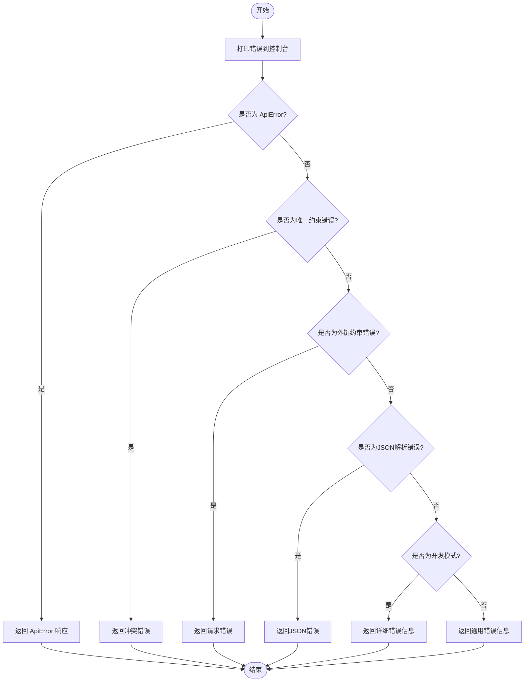
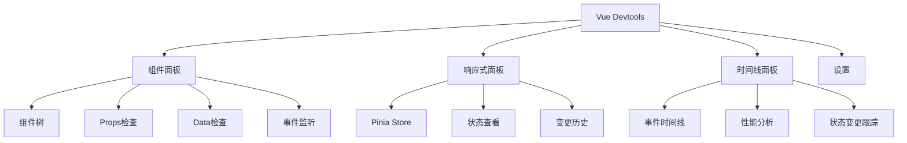
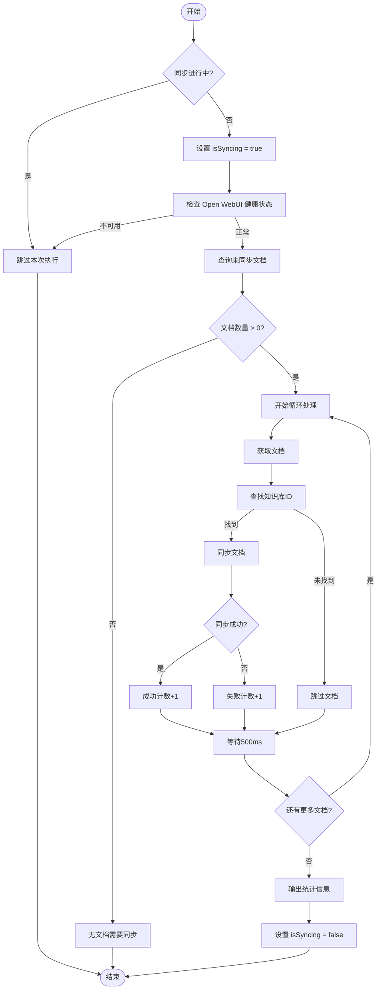

# 调试技巧

<cite>
**本文档中引用的文件**  
- [add_debug_logging.cjs](file://server/scripts/add_debug_logging.cjs)
- [.env](file://.env)
- [.env.development](file://.env.development)
- [.env.production](file://.env.production)
- [error-handler.js](file://server/middleware/error-handler.js)
- [document-sync-service.js](file://server/services/document-sync-service.js)
- [main.js](file://src/main.js)
</cite>

## 目录
1. [简介](#简介)
2. [关键服务中注入调试日志](#关键服务中注入调试日志)
3. [配置全局调试输出](#配置全局调试输出)
4. [错误处理中间件分析](#错误处理中间件分析)
5. [前端调试实践](#前端调试实践)
6. [前后端数据流调试](#前后端数据流调试)
7. [端到端问题定位](#端到端问题定位)

## 简介
本文档详细说明TwinSight系统的调试方法，涵盖后端日志注入、全局日志级别配置、错误处理机制、前端状态检查以及数据流调试等关键实践。通过结合服务器日志与浏览器开发者工具，帮助开发者高效定位和解决系统问题。

## 关键服务中注入调试日志
通过运行 `node server/scripts/add_debug_logging.cjs` 脚本，可以在关键服务中自动注入调试日志代码。该脚本会修改 `ai-analysis.js` 文件，在特定代码行前插入详细的 `console.log` 输出，用于查看 `ragResult.sources` 的原始数据结构。

脚本会输出以下调试信息：
- `ragResult.sources` 的类型和长度
- 完整的 `sources` 内容（JSON格式化）
- `sources[0]` 的所有键名
- `metadata[0]` 的示例数据

执行成功后，控制台将显示 "Successfully added debug logging" 提示。

**Section sources**
- [add_debug_logging.cjs](file://server/scripts/add_debug_logging.cjs#L1-L39)

## 配置全局调试输出
通过在 `.env` 文件中设置 `LOG_LEVEL=debug`，可以启用系统的全局调试输出。此配置会影响所有使用日志记录功能的模块，提供更详细的运行时信息。

项目包含多个环境配置文件：
- `.env`：主环境配置文件
- `.env.development`：开发环境配置
- `.env.production`：生产环境配置

这些文件中定义了API地址和Open WebUI密钥等关键配置，通过修改这些文件可以调整前端请求的目标服务器和调试行为。

**Section sources**
- [.env](file://.env#L1-L6)
- [.env.development](file://.env.development#L1-L3)
- [.env.production](file://.env.production#L1-L4)

## 错误处理中间件分析
`error-handler.js` 文件实现了系统的统一错误处理机制，包含错误捕获、日志记录和响应格式化功能。

### 自定义API错误类
系统定义了 `ApiError` 类，继承自JavaScript的 `Error` 类，包含状态码、消息和详细信息等属性。提供了多个静态方法创建常见错误类型：
- `badRequest`：400错误
- `unauthorized`：401错误
- `forbidden`：403错误
- `notFound`：404错误
- `conflict`：409错误
- `internal`：500错误

### 全局错误处理流程
`errorHandler` 中间件按照以下顺序处理错误：
1. 打印错误到控制台
2. 处理自定义 `ApiError` 类型
3. 处理数据库唯一约束错误（code: 23505）
4. 处理数据库外键约束错误（code: 23503）
5. 处理JSON解析错误
6. 在开发模式下返回详细错误堆栈
7. 在生产模式下隐藏错误详情，返回通用错误信息



**Diagram sources**
- [error-handler.js](file://server/middleware/error-handler.js#L9-L108)

**Section sources**
- [error-handler.js](file://server/middleware/error-handler.js#L1-L115)

## 前端调试实践
前端调试主要通过Vue Devtools进行，可以检查组件状态、事件流和Pinia store的变化。

### Pinia状态管理
系统使用Pinia作为状态管理库，在 `main.js` 中创建Pinia实例并注册到Vue应用。关键状态存储包括：
- `authStore`：认证状态
- `themeStore`：主题状态

应用启动时会异步检查认证状态，确保权限加载完成后再挂载应用。

### Vue Devtools使用
通过Vue Devtools可以：
- 查看组件树结构和层级关系
- 检查组件的props、data和computed属性
- 监听组件事件的触发和传递
- 查看Pinia store的当前状态和变更历史
- 跟踪状态变更的时间线



**Diagram sources**
- [main.js](file://src/main.js#L1-L40)
- [App.vue](file://src/App.vue#L1-L12)

**Section sources**
- [main.js](file://src/main.js#L1-L40)

## 前后端数据流调试
在复杂流程如文档同步和AI分析中，可以结合 `console.log` 和断点调试来跟踪数据流。

### 文档同步服务调试
`document-sync-service.js` 实现了文档同步功能，包含多个可调试的关键点：



**Diagram sources**
- [document-sync-service.js](file://server/services/document-sync-service.js#L1-L250)

**Section sources**
- [document-sync-service.js](file://server/services/document-sync-service.js#L1-L250)

### 临时日志添加示例
可以在 `document-sync-service.js` 中添加临时日志来调试特定流程：

```javascript
// ========== 调试输出：文档同步详细信息 ==========
console.log('\n📄 文档同步详情:');
console.log('📝 文档ID:', doc.id);
console.log('📁 文件路径:', doc.file_path);
console.log('🏷️  文件名:', doc.file_name);
console.log('🗂️  资产代码:', doc.asset_code);
console.log('🏢 空间代码:', doc.space_code);
console.log('🧩 规格代码:', doc.spec_code);
console.log('🔍 知识库ID:', kbId);
console.log('========== 调试输出结束 ==========\n');
```

## 端到端问题定位
结合浏览器开发者工具和服务器日志进行端到端问题定位是调试复杂问题的有效方法。

### 调试流程
1. **前端观察**：使用浏览器开发者工具的Network面板查看API请求和响应
2. **日志关联**：在服务器日志中查找对应的请求处理记录
3. **状态检查**：使用Vue Devtools检查前端组件和Pinia store的状态
4. **断点调试**：在关键代码点设置断点或添加 `console.log`
5. **错误追踪**：根据错误处理中间件的输出定位问题根源

### 工具组合使用
| 工具 | 用途 | 关键功能 |
|------|------|----------|
| 浏览器开发者工具 | 前端调试 | Network请求监控、Console日志、Elements元素检查 |
| Vue Devtools | Vue应用调试 | 组件树、状态管理、事件追踪 |
| 服务器日志 | 后端调试 | 错误追踪、流程监控、性能分析 |
| Postman | API测试 | 请求构造、响应验证、自动化测试 |

通过综合使用这些工具，可以快速定位跨前后端的复杂问题，提高调试效率。

**Section sources**
- [error-handler.js](file://server/middleware/error-handler.js#L1-L115)
- [document-sync-service.js](file://server/services/document-sync-service.js#L1-L250)
- [main.js](file://src/main.js#L1-L40)