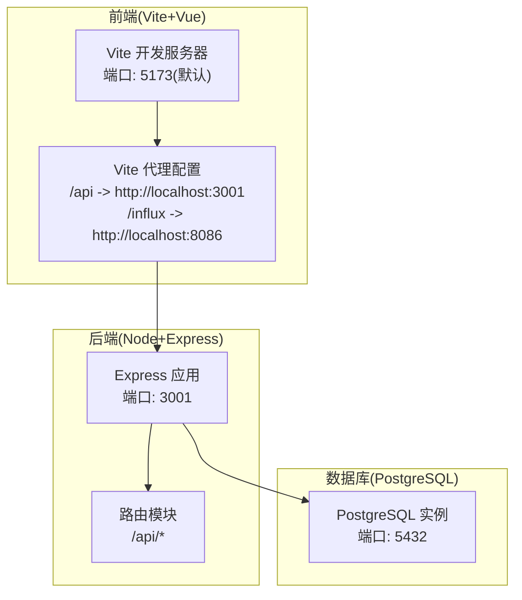
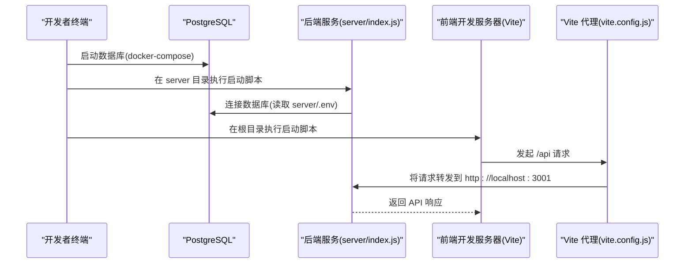
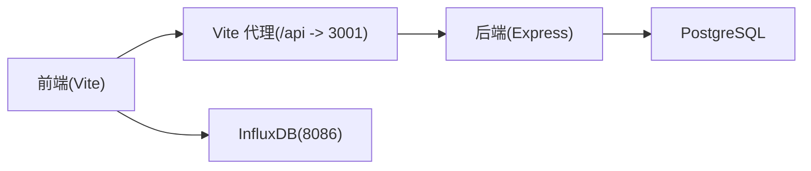

# 快速入门

<cite>
**本文引用的文件**
- [README.md](file://README.md)
- [server/README.md](file://server/README.md)
- [docker-compose.yml](file://docker-compose.yml)
- [server/.env](file://server/.env)
- [.env](file://.env)
- [.env.local](file://.env.local)
- [package.json](file://package.json)
- [server/package.json](file://server/package.json)
- [server/scripts/init-db.js](file://server/scripts/init-db.js)
- [server/index.js](file://server/index.js)
- [src/services/postgres.js](file://src/services/postgres.js)
- [vite.config.js](file://vite.config.js)
</cite>

## 目录
1. [简介](#简介)
2. [项目结构](#项目结构)
3. [核心组件](#核心组件)
4. [架构总览](#架构总览)
5. [详细组件分析](#详细组件分析)
6. [依赖关系分析](#依赖关系分析)
7. [性能注意事项](#性能注意事项)
8. [故障排查指南](#故障排查指南)
9. [结论](#结论)
10. [附录](#附录)

## 简介
本指南面向零基础用户，帮助你在本地环境快速运行 tandem-demo 项目。你将完成以下步骤：
- 使用 docker-compose 启动 PostgreSQL 数据库
- 在 server 目录和项目根目录分别安装前后端依赖
- 初始化数据库表结构
- 同时启动后端服务（端口 3001）与前端开发服务器
- 配置环境变量，确保前后端能正确连接数据库与 API

## 项目结构
项目采用前后端分离架构：
- 前端使用 Vite + Vue 3，位于项目根目录，开发服务器默认端口由 Vite 配置决定
- 后端使用 Node.js + Express，位于 server 目录，监听端口 3001
- 数据库使用 PostgreSQL，通过 docker-compose 提供
- 前端通过代理将 /api 请求转发至后端 3001 端口，/influx 请求转发至 InfluxDB 8086 端口

图表来源
- [vite.config.js](file://vite.config.js#L1-L21)
- [server/index.js](file://server/index.js#L1-L92)
- [docker-compose.yml](file://docker-compose.yml#L1-L51)

章节来源
- [README.md](file://README.md#L1-L6)
- [server/README.md](file://server/README.md#L57-L93)
- [docker-compose.yml](file://docker-compose.yml#L1-L51)
- [vite.config.js](file://vite.config.js#L1-L21)

## 核心组件
- 后端服务：负责提供 REST API、静态文件服务、健康检查等
- 数据库：PostgreSQL，包含分类、资产规格、资产、空间等表
- 前端服务：Vite 开发服务器，通过代理访问后端 API
- 环境变量：控制数据库连接、API 端口、InfluxDB 访问等

章节来源
- [server/index.js](file://server/index.js#L1-L92)
- [server/scripts/init-db.js](file://server/scripts/init-db.js#L1-L40)
- [server/package.json](file://server/package.json#L1-L26)
- [package.json](file://package.json#L1-L30)

## 架构总览
下面的序列图展示了“启动后端 + 启动前端”的典型流程，以及前端如何通过代理访问后端 API。

图表来源
- [server/index.js](file://server/index.js#L1-L92)
- [vite.config.js](file://vite.config.js#L1-L21)
- [docker-compose.yml](file://docker-compose.yml#L1-L51)

## 详细组件分析

### 1) 使用 docker-compose 启动 PostgreSQL 数据库
- 执行命令：在项目根目录运行 docker-compose，后台启动数据库与管理工具
- 预期输出：容器启动成功，数据库端口映射为 5432，管理工具端口映射为 5050
- 注意事项：如需使用 pgAdmin，请在浏览器访问 http://localhost:5050 并使用容器内主机名连接数据库

章节来源
- [server/README.md](file://server/README.md#L59-L64)
- [docker-compose.yml](file://docker-compose.yml#L1-L51)

### 2) 安装前后端依赖
- 后端依赖安装：进入 server 目录，执行安装命令
- 前端依赖安装：回到项目根目录，执行安装命令
- 依赖说明：后端使用 Express、CORS、pg 等；前端使用 Vue、Vite、相关插件等

章节来源
- [server/README.md](file://server/README.md#L66-L73)
- [server/package.json](file://server/package.json#L1-L26)
- [package.json](file://package.json#L1-L30)

### 3) 初始化数据库表结构
- 执行命令：在 server 目录执行数据库初始化脚本
- 行为说明：脚本会读取数据库模式文件并创建表，包括分类、资产规格、资产、空间等
- 预期输出：控制台显示初始化成功，并列出已创建的表名

章节来源
- [server/README.md](file://server/README.md#L73-L77)
- [server/scripts/init-db.js](file://server/scripts/init-db.js#L1-L40)

### 4) 启动后端服务与前端开发服务器
- 后端服务：在 server 目录执行开发脚本，服务监听端口 3001
- 前端开发：在项目根目录执行开发脚本，Vite 默认端口通常为 5173
- 代理配置：Vite 将 /api 请求转发到后端 3001 端口，/influx 请求转发到 InfluxDB 8086 端口

章节来源
- [server/README.md](file://server/README.md#L79-L93)
- [server/index.js](file://server/index.js#L1-L92)
- [vite.config.js](file://vite.config.js#L1-L21)

### 5) 环境变量配置说明
- 后端数据库连接(server/.env)：包含数据库主机、端口、用户名、密码、数据库名、服务器端口等
- 前端 API 基础 URL(.env.local)：可覆盖 VITE_API_URL，默认指向后端 3001 端口
- 其他前端配置(.env)：包含 InfluxDB 的访问参数，用于时序数据查询

章节来源
- [server/README.md](file://server/README.md#L159-L178)
- [server/.env](file://server/.env#L1-L19)
- [.env.local](file://.env.local#L1-L15)
- [.env](file://.env#L1-L6)
- [src/services/postgres.js](file://src/services/postgres.js#L1-L20)

## 依赖关系分析
- 前端对后端的依赖：通过 Vite 代理将 /api 请求转发到后端 3001 端口
- 前端对数据库的依赖：通过后端 API 间接访问 PostgreSQL
- 后端对数据库的依赖：通过 pg 驱动连接 PostgreSQL
- 数据库与管理工具：docker-compose 同时启动 PostgreSQL 与 pgAdmin

图表来源
- [vite.config.js](file://vite.config.js#L1-L21)
- [server/index.js](file://server/index.js#L1-L92)
- [docker-compose.yml](file://docker-compose.yml#L1-L51)

章节来源
- [vite.config.js](file://vite.config.js#L1-L21)
- [server/index.js](file://server/index.js#L1-L92)
- [docker-compose.yml](file://docker-compose.yml#L1-L51)

## 性能注意事项
- 启动顺序：先启动数据库，再启动后端，最后启动前端，避免连接超时
- 代理配置：确认 /api 与 /influx 代理规则正确，避免跨域与路径重写问题
- 端口占用：确保 5432、5050、3001、5173 等端口未被其他程序占用
- 大体积数据：后端中间件已设置较大的请求体限制，适合处理大文件上传

章节来源
- [server/index.js](file://server/index.js#L20-L36)
- [vite.config.js](file://vite.config.js#L1-L21)

## 故障排查指南
- 数据库无法连接
  - 检查 docker-compose 是否正常运行，数据库端口是否映射
  - 核对 server/.env 中的数据库连接信息
- 后端服务启动失败
  - 查看后端控制台输出，确认端口占用情况
  - 确认数据库初始化已完成
- 前端无法访问后端 API
  - 检查 Vite 代理配置是否正确
  - 确认 .env.local 中的 VITE_API_URL 指向正确的后端地址
- 健康检查失败
  - 在浏览器或终端访问后端健康接口，确认服务状态

章节来源
- [server/README.md](file://server/README.md#L57-L93)
- [server/index.js](file://server/index.js#L51-L70)
- [vite.config.js](file://vite.config.js#L1-L21)
- [src/services/postgres.js](file://src/services/postgres.js#L1-L20)

## 结论
按照本指南的步骤，你可以顺利在本地启动 tandem-demo 项目。建议先完成数据库与后端服务的启动，再启动前端开发服务器，并根据需要调整环境变量以适配你的网络与部署需求。

## 附录
- 常用命令清单
  - 启动数据库：在项目根目录执行 docker-compose 启动命令
  - 安装后端依赖：进入 server 目录执行安装命令
  - 初始化数据库：在 server 目录执行数据库初始化脚本
  - 启动后端服务：在 server 目录执行开发脚本
  - 启动前端开发：在项目根目录执行开发脚本
- 环境变量参考
  - 后端数据库连接：server/.env
  - 前端 API 基础 URL：.env.local
  - InfluxDB 参数：.env

章节来源
- [server/README.md](file://server/README.md#L57-L93)
- [server/.env](file://server/.env#L1-L19)
- [.env.local](file://.env.local#L1-L15)
- [.env](file://.env#L1-L6)