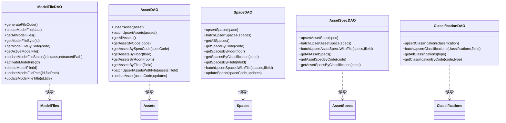

# 关系图

<cite>
**本文引用的文件**
- [server/db/schema.sql](file://server/db/schema.sql)
- [server/db/schema-v2.sql](file://server/db/schema-v2.sql)
- [server/models/model-file.js](file://server/models/model-file.js)
- [server/models/asset.js](file://server/models/asset.js)
- [server/models/space.js](file://server/models/space.js)
- [server/models/asset-spec.js](file://server/models/asset-spec.js)
- [server/models/classification.js](file://server/models/classification.js)
</cite>

## 目录
1. [简介](#简介)
2. [项目结构](#项目结构)
3. [核心组件](#核心组件)
4. [架构总览](#架构总览)
5. [详细组件分析](#详细组件分析)
6. [依赖分析](#依赖分析)
7. [性能考虑](#性能考虑)
8. [故障排查指南](#故障排查指南)
9. [结论](#结论)

## 简介
本文件基于数据库模式文件生成数据库实体关系图（ERD），聚焦以下五张表之间的关联关系：
- model_files：模型文件元数据
- asset_specs：资产规格（类型）信息
- assets：资产构件数据
- spaces：空间（房间）构件数据
- classifications：OmniClass 分类编码（资产/空间）

重点标注外键引用路径：
- assets 表通过 file_id 关联 model_files
- assets 表通过 spec_code 关联 asset_specs
- spaces 表通过 file_id 关联 model_files
- spaces 和 assets 通过 classification_code 与 classifications 表建立分类关系
- asset_specs 通过 file_id 关联 model_files

该 ERD 旨在帮助开发者理解数据模型的整体拓扑结构与层级依赖，为复杂查询与 API 设计提供指导。

## 项目结构
数据库模式由两部分组成：
- schema.sql：定义 classifications、asset_specs、assets、spaces 的核心结构与索引、触发器、注释
- schema-v2.sql：新增 model_files 并为现有表增加 file_id 外键，调整唯一约束以支持多文件场景

**图表来源**
- [server/db/schema.sql](file://server/db/schema.sql#L1-L160)
- [server/db/schema-v2.sql](file://server/db/schema-v2.sql#L1-L70)
- [server/models/model-file.js](file://server/models/model-file.js#L1-L179)
- [server/models/asset.js](file://server/models/asset.js#L1-L253)
- [server/models/space.js](file://server/models/space.js#L1-L220)
- [server/models/asset-spec.js](file://server/models/asset-spec.js#L1-L166)
- [server/models/classification.js](file://server/models/classification.js#L1-L119)

**章节来源**
- [server/db/schema.sql](file://server/db/schema.sql#L1-L160)
- [server/db/schema-v2.sql](file://server/db/schema-v2.sql#L1-L70)

## 核心组件
- model_files：存储上传的 SVF 模型文件元数据，提供 file_code、title、original_name、file_path、file_size、status、is_active、extracted_path 等字段；通过 file_id 与资产、空间、资产规格建立文件维度关联。
- asset_specs：存储资产构件的类型规格信息，包含 spec_code、spec_name、classification_code、classification_desc、category、family、type、manufacturer、address、phone 等；在 schema-v2 中通过 file_id 与 model_files 关联。
- assets：存储资产构件数据，包含 asset_code、spec_code、name、floor、room、db_id 等；在 schema-v2 中通过 file_id 与 model_files 关联，并通过 spec_code 与 asset_specs 建立类型关联。
- spaces：存储空间（房间）构件数据，包含 space_code、name、classification_code、classification_desc、floor、area、perimeter、db_id 等；在 schema-v2 中通过 file_id 与 model_files 关联。
- classifications：存储 OmniClass 分类编码，支持资产与空间两类分类，包含 classification_code、classification_desc、classification_type（'asset'/'space'）等；assets 与 spaces 通过 classification_code 与其建立分类关系。

**章节来源**
- [server/db/schema.sql](file://server/db/schema.sql#L6-L160)
- [server/db/schema-v2.sql](file://server/db/schema-v2.sql#L1-L70)

## 架构总览
下图展示了五张表之间的实体关系与外键引用路径，帮助理解数据模型的拓扑结构与层级依赖。

**图表来源**
- [server/db/schema.sql](file://server/db/schema.sql#L6-L160)
- [server/db/schema-v2.sql](file://server/db/schema-v2.sql#L1-L70)

## 详细组件分析

### 组件一：模型文件与资产/空间/规格的关系
- model_files 为资产、空间、资产规格提供“文件维度”的归属。所有三者均通过 file_id 与 model_files 建立一对多关系，确保同一文件内的资产/空间/规格在业务上隔离。
- schema-v2 对三张表新增 file_id 外键并调整唯一约束，使资产、空间、资产规格在“文件+编码”维度上保持唯一性，避免跨文件同编码冲突。

**图表来源**
- [server/db/schema-v2.sql](file://server/db/schema-v2.sql#L44-L70)
- [server/db/schema.sql](file://server/db/schema.sql#L38-L70)

**章节来源**
- [server/db/schema-v2.sql](file://server/db/schema-v2.sql#L44-L70)
- [server/db/schema.sql](file://server/db/schema.sql#L38-L70)

### 组件二：资产与资产规格的类型关联
- assets 通过 spec_code 与 asset_specs 建立一对一关联，实现资产与类型规格的绑定。
- 在查询资产时，通常需要左连接 asset_specs 以获取规格名称与分类信息，便于前端展示与筛选。

**图表来源**
- [server/db/schema.sql](file://server/db/schema.sql#L38-L70)
- [server/models/asset.js](file://server/models/asset.js#L62-L103)

**章节来源**
- [server/db/schema.sql](file://server/db/schema.sql#L38-L70)
- [server/models/asset.js](file://server/models/asset.js#L62-L103)

### 组件三：资产/空间与分类编码的关联
- assets 与 spaces 均通过 classification_code 与 classifications 建立一对多关系，实现资产与空间的 OmniClass 分类管理。
- classification_type 字段用于区分资产分类与空间分类，保证分类编码在类型维度上的唯一性。

**图表来源**
- [server/db/schema.sql](file://server/db/schema.sql#L6-L16)
- [server/db/schema.sql](file://server/db/schema.sql#L54-L70)
- [server/models/classification.js](file://server/models/classification.js#L1-L119)

**章节来源**
- [server/db/schema.sql](file://server/db/schema.sql#L6-L16)
- [server/db/schema.sql](file://server/db/schema.sql#L54-L70)
- [server/models/classification.js](file://server/models/classification.js#L1-L119)

### 组件四：模型层 DAO 与表结构的映射
- model-file.js：提供 model_files 的创建、查询、激活、状态更新等操作，支撑文件维度的数据隔离与生命周期管理。
- asset.js：提供资产的插入/批量插入、按文件/楼层/房间/规格查询、更新等，内部通过 LEFT JOIN 联合资产规格信息。
- space.js：提供空间的插入/批量插入、按文件/楼层/分类查询、更新等。
- asset-spec.js：提供资产规格的插入/批量插入、按文件/分类查询、更新等，注意规格在文件维度上的唯一性处理。
- classification.js：提供分类编码的插入/批量插入、按类型查询、按编码查询等。

**图表来源**
- [server/models/model-file.js](file://server/models/model-file.js#L1-L179)
- [server/models/asset.js](file://server/models/asset.js#L1-L253)
- [server/models/space.js](file://server/models/space.js#L1-L220)
- [server/models/asset-spec.js](file://server/models/asset-spec.js#L1-L166)
- [server/models/classification.js](file://server/models/classification.js#L1-L119)

**章节来源**
- [server/models/model-file.js](file://server/models/model-file.js#L1-L179)
- [server/models/asset.js](file://server/models/asset.js#L1-L253)
- [server/models/space.js](file://server/models/space.js#L1-L220)
- [server/models/asset-spec.js](file://server/models/asset-spec.js#L1-L166)
- [server/models/classification.js](file://server/models/classification.js#L1-L119)

## 依赖分析
- 外键依赖链
  - assets.file_id → model_files.id
  - asset_specs.file_id → model_files.id
  - spaces.file_id → model_files.id
  - assets.spec_code → asset_specs.spec_code
  - assets.classification_code → classifications.classification_code（结合 classification_type）
  - spaces.classification_code → classifications.classification_code（结合 classification_type）

- 索引与约束
  - classifications：classification_code + classification_type 唯一约束（schema.sql）
  - asset_specs：file_id + spec_code 唯一约束（schema-v2.sql）
  - assets：file_id + asset_code 唯一约束（schema-v2.sql）
  - spaces：file_id + space_code 唯一约束（schema-v2.sql）
  - 各表均有针对常用查询字段的索引（schema.sql）

**图表来源**
- [server/db/schema.sql](file://server/db/schema.sql#L6-L160)
- [server/db/schema-v2.sql](file://server/db/schema-v2.sql#L44-L70)

**章节来源**
- [server/db/schema.sql](file://server/db/schema.sql#L6-L160)
- [server/db/schema-v2.sql](file://server/db/schema-v2.sql#L44-L70)

## 性能考虑
- 索引策略
  - classifications：按 classification_code 与 classification_type 建立索引，加速分类查询与去重。
  - asset_specs：按 spec_name、classification_code、category、family 建立索引，提升规格检索效率。
  - assets：按 spec_code、floor、room、db_id 建立索引，优化资产筛选与定位。
  - spaces：按 classification_code、floor、db_id 建立索引，提升空间分类与楼层筛选性能。
- 唯一约束
  - 通过 file_id + 编码的组合唯一约束，避免跨文件同编码冲突，同时降低重复数据风险。
- 触发器
  - 各表统一使用 update_updated_at_column 触发器，自动维护 updated_at 字段，减少应用层代码冗余。

[本节为通用性能建议，无需特定文件引用]

## 故障排查指南
- 常见问题与定位
  - 外键约束失败：当插入资产或空间时，若 spec_code 或 file_id 不匹配，将触发外键约束错误。请确认 asset_specs 中存在对应 spec_code，且 model_files 中存在对应 file_id。
  - 分类编码冲突：当插入分类时，若 classification_code + classification_type 已存在，将触发唯一约束冲突。请检查 classification_type 是否正确。
  - 跨文件编码重复：当同一文件内出现重复 asset_code 或 space_code，将触发唯一约束冲突。请确认 file_id 与编码的组合唯一性。
- 排查步骤
  - 核对 model_files 是否存在对应 file_id
  - 核对 asset_specs 是否存在对应 spec_code
  - 核对 classifications 是否存在对应 classification_code 与 classification_type
  - 使用各 DAO 的查询方法验证数据一致性

**章节来源**
- [server/db/schema.sql](file://server/db/schema.sql#L6-L160)
- [server/db/schema-v2.sql](file://server/db/schema-v2.sql#L44-L70)
- [server/models/asset.js](file://server/models/asset.js#L144-L157)
- [server/models/space.js](file://server/models/space.js#L117-L124)
- [server/models/asset-spec.js](file://server/models/asset-spec.js#L103-L156)
- [server/models/classification.js](file://server/models/classification.js#L1-L119)

## 结论
本文基于数据库模式文件生成了清晰的 ERD，明确了 model_files、asset_specs、assets、spaces、classifications 之间的外键与分类关系。通过文件维度的 file_id 关联，实现了多文件场景下的数据隔离；通过 spec_code 与 classification_code 的关联，构建了资产/空间与类型规格、OmniClass 分类的完整数据链路。建议在复杂查询与 API 设计中遵循上述关系，充分利用索引与唯一约束，确保数据一致性与查询性能。