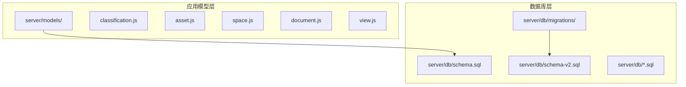

# 数据库设计

<cite>
**本文档引用的文件**   
- [server/db/schema.sql](file://server/db/schema.sql)
- [server/db/schema-v2.sql](file://server/db/schema-v2.sql)
- [server/db/create_documents_table.sql](file://server/db/create_documents_table.sql)
- [server/db/create_document_exif_table.sql](file://server/db/create_document_exif_table.sql)
- [server/db/create_views_table.sql](file://server/db/create_views_table.sql)
- [server/db/migrations/add-file-id.sql](file://server/db/migrations/add-file-id.sql)
- [server/db/migrations/add-spec-name.sql](file://server/db/migrations/add-spec-name.sql)
- [server/db/migrations/create_mapping_config.sql](file://server/db/migrations/create_mapping_config.sql)
- [server/db/migrations/add_mapping_config_fk.sql](file://server/db/migrations/add_mapping_config_fk.sql)
- [server/models/classification.js](file://server/models/classification.js)
- [server/models/asset.js](file://server/models/asset.js)
- [server/models/space.js](file://server/models/space.js)
- [server/models/document.js](file://server/models/document.js)
- [server/models/view.js](file://server/models/view.js)
</cite>

## 目录
1. [项目结构](#项目结构)
2. [核心表结构设计](#核心表结构设计)
3. [数据库关系图（ERD）](#数据库关系图erd)
4. [数据库版本控制与模式演进](#数据库版本控制与模式演进)
5. [应用数据模型映射](#应用数据模型映射)
6. [结论](#结论)

## 项目结构

项目采用分层架构，数据库相关文件集中存放在 `server/db` 目录下，应用模型文件存放在 `server/models` 目录中。这种组织方式清晰地分离了数据持久层和业务逻辑层。



**图源**
- [server/db/schema.sql](file://server/db/schema.sql#L1-L160)
- [server/db/schema-v2.sql](file://server/db/schema-v2.sql#L1-L70)
- [server/models/classification.js](file://server/models/classification.js#L1-L119)

## 核心表结构设计

### 分类编码表 (classifications)

该表存储资产和空间的OmniClass分类信息，是实现标准化分类管理的核心。

**字段定义**
- `id`: 主键，自增序列
- `classification_code`: 分类编码，取自 `Classification.OmniClass.21.Number`（资产）或 `Classification.Space.Number`（空间）
- `classification_desc`: 分类描述，取自 `Classification.OmniClass.21.Description` 或 `Classification.Space.Description`
- `classification_type`: 分类类型，枚举值 'asset' 或 'space'
- `created_at`: 创建时间，默认当前时间戳
- `updated_at`: 更新时间，由触发器自动更新

**约束与索引**
- 唯一约束：`(classification_code, classification_type)`
- 索引：`idx_classifications_code` (classification_code), `idx_classifications_type` (classification_type)

**表源**
- [server/db/schema.sql](file://server/db/schema.sql#L8-L16)

### 资产表 (assets)

该表存储资产构件的基本信息，与资产规格表通过规格编码关联。

**字段定义**
- `id`: 主键，自增序列
- `file_id`: 外键，关联 `model_files(id)`，实现按文件区分数据
- `asset_code`: 资产编码，取自MC编码，是资产的唯一标识
- `spec_code`: 规格编码，外键引用 `asset_specs(spec_code)`
- `name`: 资产名称，取自标识分组下的名称属性
- `floor`: 楼层
- `room`: 所在房间，取自房间分组下的名称属性
- `db_id`: Forge Viewer中的dbId，用于构件关联
- `created_at`: 创建时间
- `updated_at`: 更新时间

**约束与索引**
- 唯一约束：`(file_id, asset_code)`
- 索引：`idx_assets_spec_code`, `idx_assets_floor`, `idx_assets_room`, `idx_assets_db_id`, `idx_assets_file_id`

**表源**
- [server/db/schema.sql](file://server/db/schema.sql#L40-L52)
- [server/db/schema-v2.sql](file://server/db/schema-v2.sql#L49-L50)

### 空间表 (spaces)

该表存储房间构件的基本信息，用于空间管理。

**字段定义**
- `id`: 主键，自增序列
- `file_id`: 外键，关联 `model_files(id)`
- `space_code`: 空间编码，取自编号属性
- `name`: 空间名称
- `classification_code`: 分类编码，取自 `Classification.Space.Number`
- `classification_desc`: 分类描述，取自 `Classification.Space.Description`
- `floor`: 楼层，取自标高属性
- `area`: 面积，DECIMAL(15,4)
- `perimeter`: 周长，DECIMAL(15,4)
- `db_id`: Viewer中的dbId
- `created_at`: 创建时间
- `updated_at`: 更新时间

**约束与索引**
- 唯一约束：`(file_id, space_code)`
- 索引：`idx_spaces_classification`, `idx_spaces_floor`, `idx_spaces_db_id`, `idx_spaces_file_id`

**表源**
- [server/db/schema.sql](file://server/db/schema.sql#L56-L70)
- [server/db/schema-v2.sql](file://server/db/schema-v2.sql#L53-L54)

### 文档表 (documents)

该表支持与资产、空间、规格关联的文档管理。

**字段定义**
- `id`: 主键，自增序列
- `title`: 文档标题，可编辑
- `file_name`: 原始文件名
- `file_path`: 服务器存储路径
- `file_size`: 文件大小（字节）
- `file_type`: 文件扩展名（如pdf, jpg）
- `mime_type`: MIME类型
- `asset_code`: 关联的资产编码
- `space_code`: 关联的空间编码
- `spec_code`: 关联的规格编码
- `created_at`: 创建时间
- `updated_at`: 更新时间

**约束与索引**
- 排他约束：确保只关联一个对象（资产、空间或规格）
- 索引：`idx_documents_asset`, `idx_documents_space`, `idx_documents_spec`, `idx_documents_created`

**表源**
- [server/db/create_documents_table.sql](file://server/db/create_documents_table.sql#L4-L49)

### 文档EXIF表 (document_exif)

该表存储图像文件的EXIF元数据。

**字段定义**
- `id`: 主键，自增序列
- `document_id`: 外键，关联 `documents(id)`，级联删除
- `date_time`: 拍摄时间
- `image_width`: 图像宽度
- `image_height`: 图像高度
- `equip_model`: 照相机型号
- `f_number`: 光圈值
- `exposure_time`: 曝光时间
- `iso_speed`: ISO速度
- `focal_length`: 焦距（mm）
- `gps_longitude`: GPS经度
- `gps_latitude`: GPS纬度
- `gps_altitude`: GPS高度（米）
- `created_at`: 创建时间
- `updated_at`: 更新时间

**约束与索引**
- 唯一约束：`document_id`（一个文档只有一条EXIF记录）
- 索引：`idx_document_exif_document_id`, `idx_document_exif_date_time`

**表源**
- [server/db/create_document_exif_table.sql](file://server/db/create_document_exif_table.sql#L4-L48)

### 模型文件表 (model_files)

该表存储上传的SVF模型文件信息。

**字段定义**
- `id`: 主键，自增序列
- `file_code`: 唯一编码，自动生成
- `title`: 文件标题，用户输入
- `original_name`: 原始文件名
- `file_path`: 存储路径
- `file_size`: 文件大小（字节）
- `status`: 状态（uploaded, extracting, ready, error）
- `is_active`: 是否为当前激活的文件
- `extracted_path`: 解压后的路径
- `created_at`: 创建时间
- `updated_at`: 更新时间

**约束与索引**
- 唯一约束：`file_code`
- 索引：`idx_model_files_status`, `idx_model_files_active`

**表源**
- [server/db/schema-v2.sql](file://server/db/schema-v2.sql#L8-L20)

### 视图表 (views)

该表存储模型的显示状态快照。

**字段定义**
- `id`: 主键，自增序列
- `file_id`: 外键，关联 `model_files(id)`，级联删除
- `name`: 视图名称
- `thumbnail`: Base64编码的缩略图
- `camera_state`: 摄像机位置和视角（JSONB）
- `isolation_state`: 构件隐藏/显示状态（JSONB）
- `selection_state`: 构件选中状态（JSONB）
- `theming_state`: 构件材质颜色覆盖（JSONB）
- `environment`: 环境主题名称
- `cutplanes`: 剖切面状态（JSONB）
- `explode_scale`: 爆炸视图比例
- `render_options`: 渲染选项（JSONB）
- `other_settings`: 其他扩展设置（JSONB）
- `created_at`: 创建时间
- `updated_at`: 更新时间

**约束与索引**
- 唯一约束：`(file_id, name)`
- 索引：`idx_views_file_id`, `idx_views_name`, `idx_views_created`

**表源**
- [server/db/create_views_table.sql](file://server/db/create_views_table.sql#L4-L46)

## 数据库关系图（ERD）

```mermaid
erDiagram
CLASSIFICATIONS {
integer id PK
varchar(100) classification_code
varchar(500) classification_desc
varchar(20) classification_type
integer file_id FK
timestamp created_at
timestamp updated_at
}
ASSET_SPECS {
integer id PK
varchar(100) spec_code
varchar(200) spec_name
varchar(100) classification_code
varchar(500) classification_desc
varchar(200) category
varchar(200) family
varchar(200) type
varchar(200) manufacturer
varchar(500) address
varchar(50) phone
integer file_id FK
timestamp created_at
timestamp updated_at
}
ASSETS {
integer id PK
varchar(100) asset_code
varchar(100) spec_code FK
varchar(200) name
varchar(100) floor
varchar(200) room
integer db_id
integer file_id FK
timestamp created_at
timestamp updated_at
}
SPACES {
integer id PK
varchar(100) space_code
varchar(200) name
varchar(100) classification_code
varchar(500) classification_desc
varchar(100) floor
decimal(15,4) area
decimal(15,4) perimeter
integer db_id
integer file_id FK
timestamp created_at
timestamp updated_at
}
MODEL_FILES {
integer id PK
varchar(100) file_code UK
varchar(200) title
varchar(500) original_name
varchar(1000) file_path
bigint file_size
varchar(20) status
boolean is_active
varchar(1000) extracted_path
timestamp created_at
timestamp updated_at
}
DOCUMENTS {
integer id PK
varchar(255) title
varchar(255) file_name
varchar(500) file_path
integer file_size
varchar(50) file_type
varchar(100) mime_type
varchar(100) asset_code
varchar(100) space_code
varchar(100) spec_code
timestamp created_at
timestamp updated_at
}
DOCUMENT_EXIF {
integer id PK
integer document_id FK
timestamp date_time
integer image_width
integer image_height
varchar(255) equip_model
decimal(5,2) f_number
varchar(50) exposure_time
integer iso_speed
decimal(10,2) focal_length
decimal(12,8) gps_longitude
decimal(11,8) gps_latitude
decimal(10,2) gps_altitude
timestamp created_at
timestamp updated_at
}
VIEWS {
integer id PK
integer file_id FK
varchar(255) name
text thumbnail
jsonb camera_state
jsonb isolation_state
jsonb selection_state
jsonb theming_state
varchar(100) environment
jsonb cutplanes
float explode_scale
jsonb render_options
jsonb other_settings
timestamp created_at
timestamp updated_at
}
CLASSIFICATIONS ||--o{ ASSETS : "分类"
CLASSIFICATIONS ||--o{ SPACES : "分类"
ASSET_SPECS ||--o{ ASSETS : "规格"
MODEL_FILES ||--o{ ASSET_SPECS : "文件"
MODEL_FILES ||--o{ ASSETS : "文件"
MODEL_FILES ||--o{ SPACES : "文件"
MODEL_FILES ||--o{ DOCUMENTS : "文件"
MODEL_FILES ||--o{ VIEWS : "文件"
DOCUMENTS ||--o{ DOCUMENT_EXIF : "EXIF"
```

**图源**
- [server/db/schema.sql](file://server/db/schema.sql#L8-L160)
- [server/db/schema-v2.sql](file://server/db/schema-v2.sql#L8-L70)
- [server/db/create_documents_table.sql](file://server/db/create_documents_table.sql#L4-L49)
- [server/db/create_document_exif_table.sql](file://server/db/create_document_exif_table.sql#L4-L48)
- [server/db/create_views_table.sql](file://server/db/create_views_table.sql#L4-L46)

## 数据库版本控制与模式演进

### 迁移脚本分析

数据库通过SQL迁移脚本实现版本控制和模式演进，确保数据结构的平滑升级。

#### 添加文件ID字段 (add-file-id.sql)

该迁移脚本为所有核心数据表添加 `file_id` 字段，实现多模型文件的数据隔离。

**关键操作**
- 为 `asset_specs`, `assets`, `spaces`, `classifications` 表添加 `file_id` 外键
- 修改唯一约束，从单字段唯一变为 `(file_id, code)` 组合唯一
- 创建相关索引以优化查询性能

此迁移标志着数据库从单文件模式向多文件模式的演进。

**表源**
- [server/db/migrations/add-file-id.sql](file://server/db/migrations/add-file-id.sql#L1-L51)

#### 添加规格名称字段 (add-spec-name.sql)

该迁移脚本为 `asset_specs` 表添加 `spec_name` 字段，丰富资产规格信息。

**关键操作**
- 添加 `spec_name` 字段（VARCHAR(200)）
- 创建 `idx_asset_specs_name` 索引
- 添加字段注释

**表源**
- [server/db/migrations/add-spec-name.sql](file://server/db/migrations/add-spec-name.sql#L1-L12)

#### 创建映射配置表 (create_mapping_config.sql)

该迁移脚本创建 `mapping_configs` 表，用于存储模型文件的字段映射配置。

**关键操作**
- 创建 `mapping_configs` 表，包含 `file_id`, `config_type`, `field_name`, `category`, `property` 等字段
- 创建唯一约束 `(file_id, config_type, field_name)`
- 创建索引 `idx_mapping_configs_file_id`, `idx_mapping_configs_type`

**表源**
- [server/db/migrations/create_mapping_config.sql](file://server/db/migrations/create_mapping_config.sql#L1-L29)

#### 添加映射配置外键 (add_mapping_config_fk.sql)

该迁移脚本为 `mapping_configs` 表添加到 `model_files` 的外键约束。

**关键操作**
- 检查并删除已存在的外键约束
- 添加 `fk_mapping_configs_model_file` 外键约束
- 验证约束创建结果

此操作确保了映射配置与模型文件之间的数据完整性。

**表源**
- [server/db/migrations/add_mapping_config_fk.sql](file://server/db/migrations/add_mapping_config_fk.sql#L1-L26)

## 应用数据模型映射

### 分类编码模型 (classification.js)

该JavaScript文件定义了 `classifications` 表的应用数据访问接口。

**核心功能**
- `upsertClassification`: 插入或更新分类编码，使用 `ON CONFLICT` 处理重复
- `batchUpsertClassifications`: 批量插入分类编码，支持事务处理
- `getAllClassifications`: 获取所有分类编码，可按类型过滤
- `getClassificationByCode`: 根据编码获取分类

该模型支持 `file_id` 参数，兼容新旧两种数据结构。

**表源**
- [server/models/classification.js](file://server/models/classification.js#L1-L119)

### 资产模型 (asset.js)

该文件提供了 `assets` 表的完整CRUD操作。

**核心功能**
- `upsertAsset`: 插入或更新单个资产
- `batchUpsertAssets` / `batchUpsertAssetsWithFile`: 批量插入资产，后者支持文件关联
- `getAllAssets`: 获取所有资产，关联查询规格信息
- `getAssetByCode`: 根据编码获取资产详情
- `getAssetsBySpecCode` / `getAssetsByFloor` / `getAssetsByRoom`: 按条件查询资产
- `getAssetsByFileId`: 根据文件ID获取资产列表
- `updateAsset`: 更新资产属性

查询操作均通过LEFT JOIN关联 `asset_specs` 表，提供完整的资产信息。

**表源**
- [server/models/asset.js](file://server/models/asset.js#L1-L253)

### 空间模型 (space.js)

该文件管理 `spaces` 表的数据访问。

**核心功能**
- `upsertSpace`: 插入或更新空间
- `batchUpsertSpaces` / `batchUpsertSpacesWithFile`: 批量操作空间数据
- `getAllSpaces` / `getSpaceByCode`: 获取空间列表或单个空间
- `getSpacesByFloor` / `getSpacesByClassification`: 按条件查询空间
- `getSpacesByFileId`: 根据文件ID获取空间
- `updateSpace`: 更新空间属性

**表源**
- [server/models/space.js](file://server/models/space.js#L1-L220)

### 文档模型 (document.js)

该文件处理文档管理相关的数据库操作。

**核心功能**
- `getDocuments`: 根据关联对象（资产、空间、规格）获取文档列表
- `getDocumentById`: 根据ID获取文档
- `createDocument`: 创建新文档记录
- `updateDocumentTitle`: 更新文档标题
- `deleteDocument`: 删除文档
- `getDocumentStats`: 获取文档统计信息（数量、大小等）

**表源**
- [server/models/document.js](file://server/models/document.js#L1-L163)

### 视图模型 (view.js)

该文件管理模型视图状态的持久化。

**核心功能**
- `getViewsByFileId`: 获取文件的所有视图，支持排序
- `searchViews`: 按名称搜索视图
- `getViewById`: 获取完整视图状态
- `createView`: 创建新视图，JSON字段自动序列化
- `updateView`: 更新视图，支持驼峰命名到下划线的转换
- `deleteView`: 删除视图
- `isNameExists`: 检查视图名称是否已存在

**表源**
- [server/models/view.js](file://server/models/view.js#L1-L199)

## 结论

本数据库设计文档全面阐述了Tandem系统的数据模型。系统采用PostgreSQL作为数据库，通过 `schema.sql` 和 `schema-v2.sql` 定义了核心表结构，并通过迁移脚本实现模式演进。`classifications`, `assets`, `spaces` 等核心表构成了BIM数据管理的基础，而 `documents`, `document_exif`, `views` 等表则扩展了系统的功能。应用层通过 `server/models/` 目录下的JavaScript文件将这些表映射为数据访问对象，实现了数据持久层与业务逻辑层的清晰分离。整个设计体现了良好的数据完整性、可扩展性和维护性，为系统的稳定运行提供了坚实的数据基础。