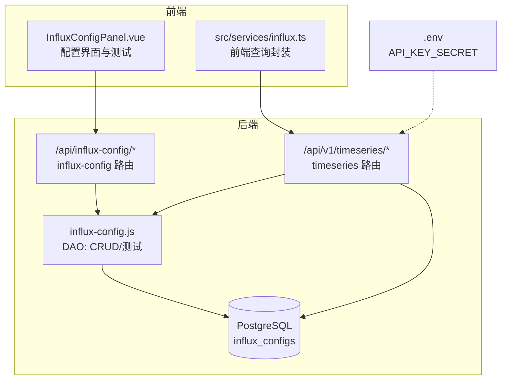
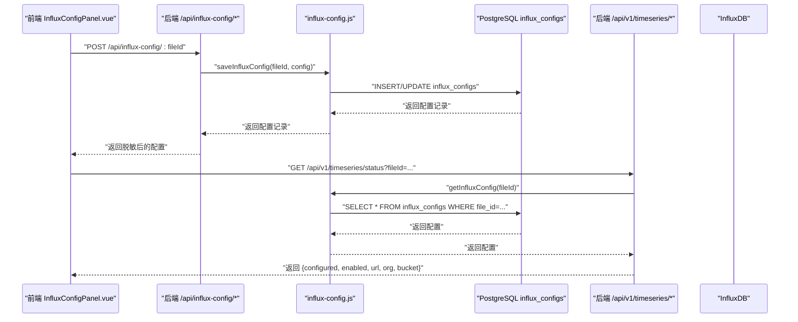
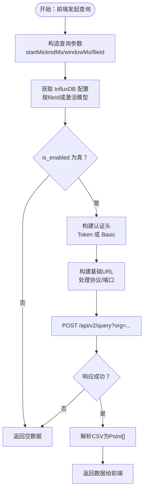
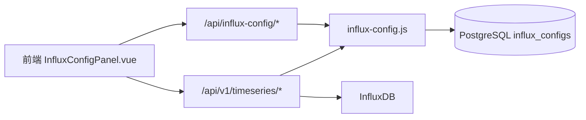

# InfluxDB配置模型

<cite>
**本文引用的文件**
- [schema.sql](file://server/db/schema.sql)
- [influx-config.js](file://server/models/influx-config.js)
- [influx-config路由.js](file://server/routes/influx-config.js)
- [timeseries.js](file://server/routes/timeseries.js)
- [influx.ts](file://src/services/influx.ts)
- [InfluxConfigPanel.vue](file://src/components/InfluxConfigPanel.vue)
- [.env](file://server/.env)
- [add-file-id.sql](file://server/db/migrations/add-file-id.sql)
</cite>

## 目录
1. [简介](#简介)
2. [项目结构](#项目结构)
3. [核心组件](#核心组件)
4. [架构总览](#架构总览)
5. [详细组件分析](#详细组件分析)
6. [依赖分析](#依赖分析)
7. [性能考量](#性能考量)
8. [故障排查指南](#故障排查指南)
9. [结论](#结论)
10. [附录](#附录)

## 简介
本文件围绕数据库表 influx_configs 及其管理逻辑展开，系统性说明该表的结构设计、约束关系、认证模式选择、前后端集成流程，以及如何支撑前端时序查询服务（timeseries.js）连接 InfluxDB 获取设备监控数据。同时提供生产与测试环境的配置示例思路与安全性建议（如敏感信息的加密存储策略）。

## 项目结构
- 数据库层：influx_configs 表定义于 schema.sql，包含与 model_files 的一对一关联（file_id 唯一约束）。
- 后端模型与路由：influx-config.js 提供 CRUD 与连接测试；influx-config 路由负责鉴权与参数校验；timeseries.js 提供查询与写入代理。
- 前端：InfluxConfigPanel.vue 提供配置界面与连接测试；src/services/influx.ts 提供前端查询封装。
- 环境：.env 中包含 API_KEY_SECRET（用于生成 Stream URL 的 HMAC 密钥），InfluxDB 配置存储于数据库。

图表来源
- [influx-config.js](file://server/models/influx-config.js#L1-L184)
- [influx-config路由.js](file://server/routes/influx-config.js#L1-L168)
- [timeseries.js](file://server/routes/timeseries.js#L1-L563)
- [schema.sql](file://server/db/schema.sql#L103-L123)
- [.env](file://server/.env#L1-L24)

章节来源
- [schema.sql](file://server/db/schema.sql#L103-L123)
- [influx-config.js](file://server/models/influx-config.js#L1-L184)
- [influx-config路由.js](file://server/routes/influx-config.js#L1-L168)
- [timeseries.js](file://server/routes/timeseries.js#L1-L563)
- [influx.ts](file://src/services/influx.ts#L1-L164)
- [InfluxConfigPanel.vue](file://src/components/InfluxConfigPanel.vue#L1-L558)
- [.env](file://server/.env#L1-L24)

## 核心组件
- influx_configs 表：存储每个模型文件对应的 InfluxDB 连接配置，通过 file_id 与 model_files 建立一对一关系。
- 后端 DAO：提供查询、保存、删除、连接测试能力。
- 后端路由：鉴权、参数校验、占位符替换、返回脱敏后的敏感信息。
- 前端服务：封装查询接口，统一通过后端代理访问 InfluxDB。
- 前端配置面板：提供 Token/Basic 两种认证模式切换、连接测试、保存等。

章节来源
- [schema.sql](file://server/db/schema.sql#L103-L123)
- [influx-config.js](file://server/models/influx-config.js#L1-L184)
- [influx-config路由.js](file://server/routes/influx-config.js#L1-L168)
- [timeseries.js](file://server/routes/timeseries.js#L1-L563)
- [influx.ts](file://src/services/influx.ts#L1-L164)
- [InfluxConfigPanel.vue](file://src/components/InfluxConfigPanel.vue#L1-L558)

## 架构总览
InfluxDB 配置模型采用“数据库集中存储 + 后端代理”的架构：
- 配置存储：influx_configs 表按 file_id 与 model_files 一对一绑定，file_id 的唯一性确保每个模型仅有一套 InfluxDB 连接配置。
- 认证模式：优先使用 Token 认证（推荐），也可选择 Basic 认证（用户名/密码）。
- 前端查询：前端通过 src/services/influx.ts 发起请求，后端 timeseries 路由根据当前激活模型或指定 file_id 获取配置并代理 InfluxDB 查询。
- 配置管理：前端 InfluxConfigPanel.vue 通过 /api/influx-config/* 路由完成配置的增删改查与连接测试。

图表来源
- [influx-config路由.js](file://server/routes/influx-config.js#L1-L168)
- [influx-config.js](file://server/models/influx-config.js#L1-L184)
- [timeseries.js](file://server/routes/timeseries.js#L440-L510)
- [schema.sql](file://server/db/schema.sql#L103-L123)

## 详细组件分析

### 表结构与约束：influx_configs
- 字段说明
  - id：主键
  - file_id：与 model_files(id) 的一对一关联，且具有唯一性约束，确保每个模型仅配置一套 InfluxDB 连接
  - influx_url：InfluxDB 地址
  - influx_port：端口，默认 8086
  - influx_org：组织
  - influx_bucket：存储桶
  - influx_token：API Token（用于 Token 认证）
  - influx_user / influx_password：Basic 认证所需凭据
  - use_basic_auth：是否使用 Basic 认证（默认 false，即优先 Token）
  - is_enabled：是否启用（默认 true）
  - created_at / updated_at：自动维护的时间戳
- 索引
  - 对 file_id 建有索引，加速按模型文件查询配置
- 注释
  - 表与列均配有注释，便于理解用途

章节来源
- [schema.sql](file://server/db/schema.sql#L103-L123)
- [schema.sql](file://server/db/schema.sql#L121-L123)
- [schema.sql](file://server/db/schema.sql#L194-L202)

### 认证模式：Token 认证与 Basic 认证
- Token 认证（推荐）
  - 适用：InfluxDB 2.x Token 方案
  - 字段：influx_token 必填；use_basic_auth=false
  - 后端构建请求头：Authorization: Token <token>
- Basic 认证
  - 适用：兼容旧版或特定部署
  - 字段：influx_user、influx_password 必填；use_basic_auth=true
  - 后端构建请求头：Authorization: Basic base64(user:password)
- 连接测试
  - 支持两种认证方式的健康检查端点探测
  - 自动处理 URL 协议与端口拼接

章节来源
- [influx-config.js](file://server/models/influx-config.js#L108-L176)
- [timeseries.js](file://server/routes/timeseries.js#L76-L112)
- [timeseries.js](file://server/routes/timeseries.js#L114-L133)

### 前后端集成：配置管理与查询代理
- 配置管理
  - 前端 InfluxConfigPanel.vue：提供表单、认证模式切换、连接测试、保存
  - 后端 influx-config 路由：鉴权、参数校验、占位符替换（对已有 token/password 的保护）、返回脱敏数据
  - DAO 层：统一处理插入/更新、删除、连接测试
- 查询代理
  - 前端 src/services/influx.ts：封装平均值、房间、最新值查询，统一携带 Bearer Token
  - 后端 timeseries 路由：按当前激活模型或指定 file_id 获取配置，构建请求头与基础 URL，代理 InfluxDB 查询并解析 CSV

图表来源
- [timeseries.js](file://server/routes/timeseries.js#L337-L472)
- [timeseries.js](file://server/routes/timeseries.js#L182-L212)
- [timeseries.js](file://server/routes/timeseries.js#L213-L258)
- [influx.ts](file://src/services/influx.ts#L55-L117)

章节来源
- [InfluxConfigPanel.vue](file://src/components/InfluxConfigPanel.vue#L1-L558)
- [influx-config路由.js](file://server/routes/influx-config.js#L1-L168)
- [influx-config.js](file://server/models/influx-config.js#L1-L184)
- [timeseries.js](file://server/routes/timeseries.js#L1-L563)
- [influx.ts](file://src/services/influx.ts#L1-L164)

### 文件级隔离与唯一性约束
- file_id 的唯一性约束确保每个模型文件仅能配置一次 InfluxDB 连接，避免重复或遗漏
- 迁移脚本 add-file-id.sql 为多张表添加了 file_id 并重建唯一性约束，体现“按文件隔离”的设计思想
- timeseries 路由支持按 file_id 查询配置，也支持默认使用激活模型配置

章节来源
- [schema.sql](file://server/db/schema.sql#L103-L123)
- [add-file-id.sql](file://server/db/migrations/add-file-id.sql#L1-L51)
- [timeseries.js](file://server/routes/timeseries.js#L44-L74)

### 安全性与敏感信息处理
- 敏感信息脱敏
  - 返回配置时，influx_token 与 influx_password 以占位符形式返回，has_token / has_password 标识是否存在
- 连接测试
  - 支持占位符回填：当用户提交占位符时，后端会从数据库读取真实值再进行测试
- API Key 生成
  - 用于 Stream URL 的 HMAC 密钥来自环境变量 API_KEY_SECRET
- 建议的安全实践（通用指导）
  - 将敏感字段（token、password）存储在受控的密钥管理系统中，后端以环境变量或安全存储挂载方式读取
  - 传输链路使用 HTTPS，限制最小权限的 InfluxDB Token
  - 定期轮换 token，审计配置变更

章节来源
- [influx-config路由.js](file://server/routes/influx-config.js#L20-L42)
- [influx-config路由.js](file://server/routes/influx-config.js#L81-L107)
- [influx-config.js](file://server/models/influx-config.js#L108-L176)
- [.env](file://server/.env#L1-L24)

## 依赖分析
- 组件耦合
  - timeseries 路由依赖 influx-config DAO 获取配置
  - 前端查询服务依赖后端 timeseries 路由
  - 配置面板依赖 influx-config 路由进行保存与测试
- 外部依赖
  - InfluxDB：通过 /api/v2/write 与 /api/v2/query 接口交互
  - PostgreSQL：存储 influx_configs 与时间序列查询结果由后端代理获取

图表来源
- [influx-config.js](file://server/models/influx-config.js#L1-L184)
- [influx-config路由.js](file://server/routes/influx-config.js#L1-L168)
- [timeseries.js](file://server/routes/timeseries.js#L1-L563)
- [schema.sql](file://server/db/schema.sql#L103-L123)

章节来源
- [influx-config.js](file://server/models/influx-config.js#L1-L184)
- [influx-config路由.js](file://server/routes/influx-config.js#L1-L168)
- [timeseries.js](file://server/routes/timeseries.js#L1-L563)
- [schema.sql](file://server/db/schema.sql#L103-L123)

## 性能考量
- 查询性能
  - influx_configs 上对 file_id 建有索引，按模型查询配置具备良好性能
- 连接测试
  - 连接测试包含超时控制，避免阻塞
- 数据解析
  - CSV 解析在后端完成，前端仅接收结构化数据，减少前端解析开销

章节来源
- [schema.sql](file://server/db/schema.sql#L121-L123)
- [influx-config.js](file://server/models/influx-config.js#L108-L176)
- [timeseries.js](file://server/routes/timeseries.js#L213-L258)

## 故障排查指南
- 常见问题定位
  - 配置未启用：is_enabled=false 时，查询将返回空数据
  - 认证缺失：未配置 use_basic_auth 或 token/user/password，将无法构建 Authorization 头
  - URL/端口错误：influx_url 未包含协议或端口，后端会尝试智能拼接
  - 连接测试失败：查看后端返回的 HTTP 状态与错误文本
- 前端辅助
  - 使用 InfluxConfigPanel.vue 的“测试连接”按钮快速验证配置
  - 使用 src/services/influx.ts 的 isInfluxConfigured/getInfluxStatus 辅助判断配置状态

章节来源
- [timeseries.js](file://server/routes/timeseries.js#L337-L472)
- [influx-config.js](file://server/models/influx-config.js#L108-L176)
- [influx.ts](file://src/services/influx.ts#L23-L42)
- [influx.ts](file://src/services/influx.ts#L146-L164)

## 结论
influx_configs 表通过 file_id 唯一性约束实现了“每模型一套 InfluxDB 配置”的强约束，配合后端 DAO 与路由的参数校验、认证头构建、连接测试与 CSV 解析，形成了从前端配置到后端代理查询的完整闭环。推荐优先使用 Token 认证，并结合环境变量与密钥管理加强安全性。

## 附录

### 配置示例：生产环境 vs 测试环境
- 生产环境
  - influx_url：https://influx.example.com
  - influx_port：443（若使用 HTTPS 且默认端口）
  - influx_org：prod-org
  - influx_bucket：prod-bucket
  - use_basic_auth：false
  - influx_token：使用最小权限的生产 Token
  - is_enabled：true
- 测试环境
  - influx_url：http://influx-test:8086
  - influx_port：8086
  - influx_org：test-org
  - influx_bucket：test-bucket
  - use_basic_auth：false 或 true（按需）
  - influx_token 或 influx_user/password：按实际部署填写
  - is_enabled：true（调试阶段）

说明：以上为示例思路，具体参数请依据实际部署调整。

### 安全性建议（通用指导）
- 将 token、password 等敏感字段纳入密钥管理，后端以环境变量或安全挂载读取
- 传输链路强制使用 HTTPS
- 最小权限原则：为不同环境生成独立的 InfluxDB Token
- 定期轮换与审计：定期轮换 token 并审计配置变更