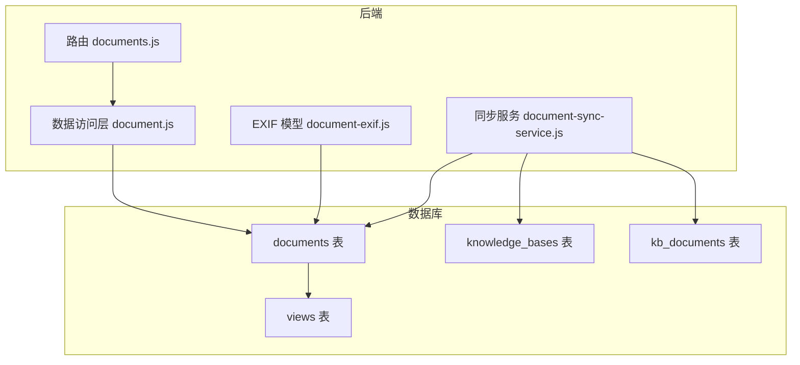
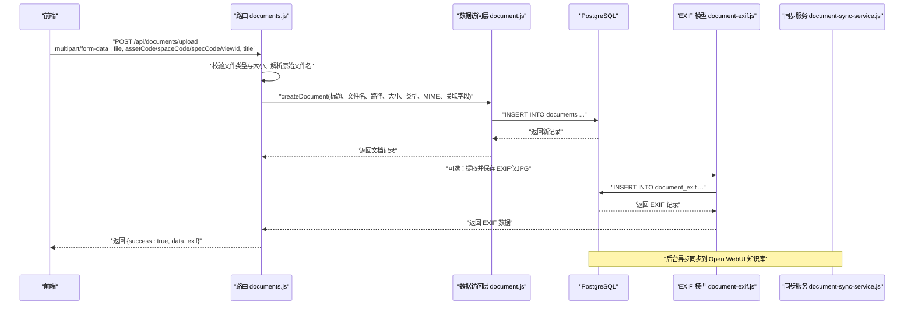
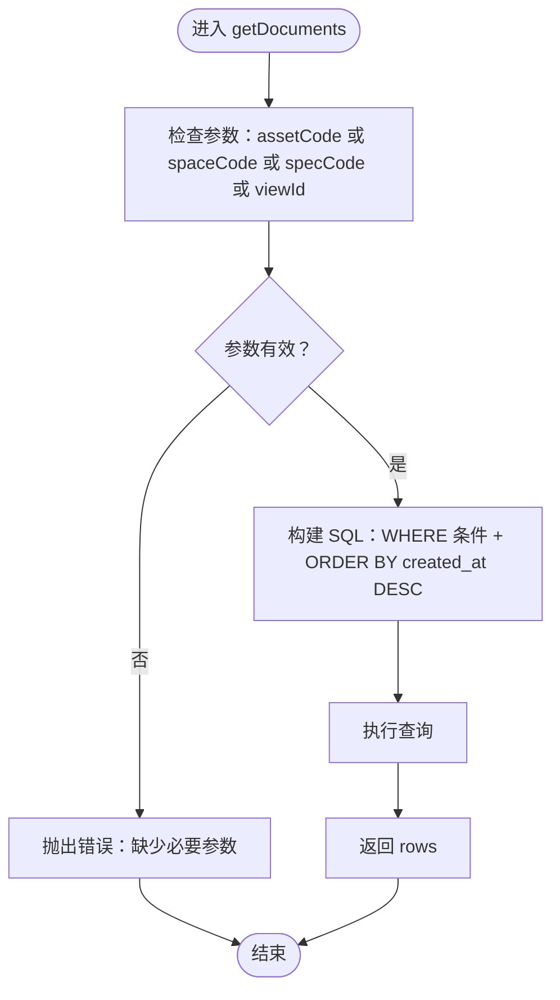
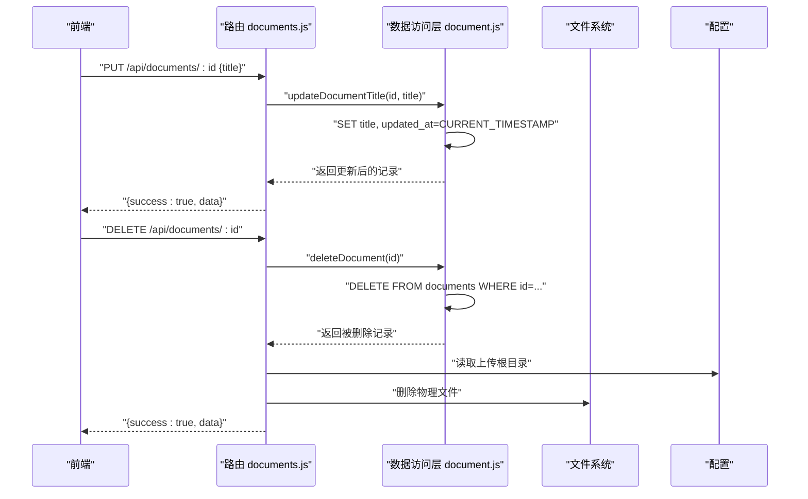
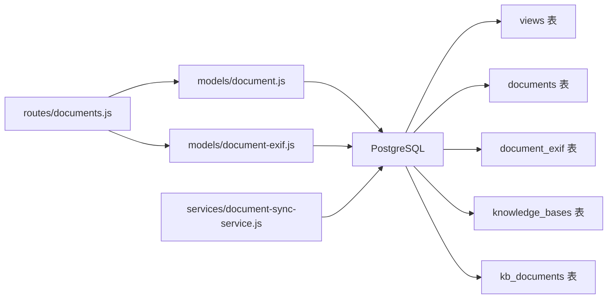

# 文档模型

<cite>
**本文引用的文件**
- [server/db/init-all.sql](file://server/db/init-all.sql)
- [server/db/create_documents_table.sql](file://server/db/create_documents_table.sql)
- [server/db/add_view_id_to_documents.sql](file://server/db/add_view_id_to_documents.sql)
- [server/models/document.js](file://server/models/document.js)
- [server/models/document-exif.js](file://server/models/document-exif.js)
- [server/routes/documents.js](file://server/routes/documents.js)
- [server/routes/v1/documents.js](file://server/routes/v1/documents.js)
- [server/services/document-sync-service.js](file://server/services/document-sync-service.js)
</cite>

## 目录
1. [简介](#简介)
2. [项目结构](#项目结构)
3. [核心组件](#核心组件)
4. [架构总览](#架构总览)
5. [组件详解](#组件详解)
6. [依赖关系分析](#依赖关系分析)
7. [性能考量](#性能考量)
8. [故障排查指南](#故障排查指南)
9. [结论](#结论)
10. [附录](#附录)

## 简介
本文件围绕“文档模型”展开，聚焦于数据库表 documents 的结构设计与数据访问层实现。目标是帮助读者理解：
- documents 表的字段定义与设计理念（支持灵活关联资产、空间、规格或视图）
- 外键约束与一致性保障策略
- 数据访问层 CRUD 操作（创建、查询、更新、删除）
- 统计聚合能力（文档数量、总大小、文件类型数）
- 安全性考虑（文件路径与实际文件系统的分离）
- 前端调用示例（上传文件后持久化元数据）

## 项目结构
与文档模型直接相关的文件分布如下：
- 数据库初始化与表结构：init-all.sql、create_documents_table.sql、add_view_id_to_documents.sql
- 数据访问层：models/document.js
- EXIF 扩展模型：models/document-exif.js
- 路由与 API：routes/documents.js、routes/v1/documents.js
- 后台同步服务：services/document-sync-service.js

**图表来源**
- [server/db/init-all.sql](file://server/db/init-all.sql#L186-L209)
- [server/db/add_view_id_to_documents.sql](file://server/db/add_view_id_to_documents.sql#L1-L3)
- [server/routes/documents.js](file://server/routes/documents.js#L145-L211)
- [server/models/document.js](file://server/models/document.js#L1-L167)
- [server/models/document-exif.js](file://server/models/document-exif.js#L1-L169)
- [server/services/document-sync-service.js](file://server/services/document-sync-service.js#L1-L250)

**章节来源**
- [server/db/init-all.sql](file://server/db/init-all.sql#L186-L209)
- [server/models/document.js](file://server/models/document.js#L1-L167)
- [server/routes/documents.js](file://server/routes/documents.js#L145-L211)

## 核心组件
- documents 表：存储文档元数据，支持与资产、空间、规格或视图关联；包含时间戳字段 created_at、updated_at。
- 数据访问层 document.js：提供 getDocuments、getDocumentById、createDocument、updateDocumentTitle、deleteDocument、getDocumentStats 等方法。
- EXIF 扩展：document-exif.js 提供 EXIF 信息的读写与格式化。
- 路由层：routes/documents.js 实现上传、查询、更新、删除、下载、预览等 API；v1 路由提供兼容接口。
- 同步服务：document-sync-service.js 将文档同步至 Open WebUI 知识库。

**章节来源**
- [server/db/init-all.sql](file://server/db/init-all.sql#L186-L209)
- [server/models/document.js](file://server/models/document.js#L1-L167)
- [server/models/document-exif.js](file://server/models/document-exif.js#L1-L169)
- [server/routes/documents.js](file://server/routes/documents.js#L145-L211)
- [server/services/document-sync-service.js](file://server/services/document-sync-service.js#L1-L250)

## 架构总览
文档模型采用“表驱动 + 数据访问层 + 路由 + 同步服务”的分层架构：
- 表层：documents、views、knowledge_bases、kb_documents、document_exif
- 数据访问层：document.js、document-exif.js
- 接口层：routes/documents.js、routes/v1/documents.js
- 后台服务：document-sync-service.js

**图表来源**
- [server/routes/documents.js](file://server/routes/documents.js#L145-L211)
- [server/models/document.js](file://server/models/document.js#L58-L82)
- [server/models/document-exif.js](file://server/models/document-exif.js#L12-L69)
- [server/services/document-sync-service.js](file://server/services/document-sync-service.js#L1-L250)

## 组件详解

### 数据表结构与字段定义
- 表名：documents
- 字段要点（与业务相关）：
  - id：自增主键
  - title：文档标题（可编辑）
  - file_name：原始文件名
  - file_path：服务器存储路径（与实际文件系统分离）
  - file_size：文件大小（字节）
  - file_type：文件扩展名（如 pdf、jpg）
  - mime_type：MIME 类型
  - asset_code、space_code、spec_code：三选一的关联字段，分别指向资产、空间、规格编码
  - view_id：可选，指向 views 表 id（新增列）
  - created_at、updated_at：时间戳
- 约束与索引：
  - 单对象关联约束：确保仅设置 asset_code 或 space_code 或 spec_code 之一
  - 索引：对 asset_code、space_code、spec_code、created_at 进行索引优化
  - 外键：documents.view_id 引用 views(id)，删除时设为 NULL

上述结构在以下文件中定义：
- 初始化脚本：init-all.sql（含 documents 表与索引、外键）
- 独立建表脚本：create_documents_table.sql（含单对象关联约束）
- 新增列脚本：add_view_id_to_documents.sql（添加 view_id 并建立外键）

**章节来源**
- [server/db/init-all.sql](file://server/db/init-all.sql#L186-L209)
- [server/db/create_documents_table.sql](file://server/db/create_documents_table.sql#L1-L49)
- [server/db/add_view_id_to_documents.sql](file://server/db/add_view_id_to_documents.sql#L1-L3)

### 外键约束与一致性保障
- documents.asset_code、space_code、spec_code 为应用层逻辑约束（CHECK），非数据库外键，避免对非主键字段施加外键带来的复杂性。
- documents.view_id 为数据库外键，引用 views(id)，删除时设置为 NULL，避免级联删除影响业务。
- 通过应用层校验（如上传接口要求至少提供一个关联字段）与数据库约束共同保障数据一致性。

**章节来源**
- [server/db/create_documents_table.sql](file://server/db/create_documents_table.sql#L18-L30)
- [server/db/init-all.sql](file://server/db/init-all.sql#L355-L362)
- [server/routes/documents.js](file://server/routes/documents.js#L156-L166)

### 数据访问层（CRUD 与统计）
- createDocument：接收标题、文件名、路径、大小、类型、MIME、关联字段（assetCode、spaceCode、specCode、viewId），插入 documents 并返回新记录。
- getDocuments：支持按 assetCode、spaceCode、specCode 或 viewId 查询，返回文档列表（按创建时间倒序）。
- getDocumentById：按 id 查询单条记录。
- updateDocumentTitle：按 id 更新标题与 updated_at。
- deleteDocument：按 id 删除记录并返回被删除记录。
- getDocumentStats：按 assetCode、spaceCode 或 specCode 聚合统计总数、总大小、不同文件类型数。

**图表来源**
- [server/models/document.js](file://server/models/document.js#L12-L38)
- [server/models/document.js](file://server/models/document.js#L116-L148)

**章节来源**
- [server/models/document.js](file://server/models/document.js#L12-L167)

### EXIF 扩展与统计
- EXIF 写入：上传 JPG/JPEG 时，从文件中解析 EXIF 并写入 document_exif 表，支持 ON CONFLICT 更新。
- EXIF 查询：提供按文档 ID 查询与格式化分组输出。
- 统计聚合：getDocumentStats 对关联对象（资产/空间/规格）进行文档数量、总大小、文件类型数的聚合。

**章节来源**
- [server/models/document-exif.js](file://server/models/document-exif.js#L1-L169)
- [server/models/document.js](file://server/models/document.js#L116-L148)

### 路由与 API 行为
- 上传接口（/api/documents/upload）：
  - 支持 multipart/form-data，文件类型与大小限制
  - 必须提供 assetCode、spaceCode、specCode 或 viewId 之一
  - 解析原始文件名（处理编码问题）、构造 file_path、调用 createDocument
  - 可选提取并保存 EXIF（仅 JPG/JPEG）
- 查询接口：
  - GET /api/documents：支持按 assetCode、spaceCode、specCode 查询
  - GET /api/documents/view/:viewId：按视图查询
- 更新与删除：
  - PUT /api/documents/:id：更新标题
  - DELETE /api/documents/:id：删除记录并清理物理文件
- 下载与预览：
  - GET /api/documents/:id/download：下载文件
  - GET /api/documents/:id/preview：内联预览（设置 Content-Type 与 Content-Disposition）

**图表来源**
- [server/routes/documents.js](file://server/routes/documents.js#L302-L361)
- [server/models/document.js](file://server/models/document.js#L84-L114)

**章节来源**
- [server/routes/documents.js](file://server/routes/documents.js#L145-L211)
- [server/routes/documents.js](file://server/routes/documents.js#L302-L361)

### 视图关联与多维查询
- 视图关联：通过 documents.view_id 与 views 表关联，支持按 viewId 查询文档列表。
- 多维查询：getDocuments 支持按资产、空间、规格或视图查询，满足不同场景的检索需求。

**章节来源**
- [server/db/init-all.sql](file://server/db/init-all.sql#L355-L362)
- [server/models/document.js](file://server/models/document.js#L12-L38)
- [server/routes/documents.js](file://server/routes/documents.js#L434-L448)

### 安全性考虑
- 文件路径与实际文件系统分离：file_path 仅存储相对路径，真实文件位于配置的上传根目录，避免路径穿越风险。
- 文件类型与大小限制：路由层对上传类型与大小进行严格限制，减少恶意文件注入风险。
- 删除流程：先删除数据库记录，再删除物理文件，确保一致性。
- 权限控制：路由层使用鉴权中间件与权限常量，限制文档 CRUD 操作。

**章节来源**
- [server/routes/documents.js](file://server/routes/documents.js#L145-L211)
- [server/routes/documents.js](file://server/routes/documents.js#L330-L361)

### 实际调用示例（前端上传后持久化元数据）
- 步骤：
  1) 前端通过 multipart/form-data 上传文件，携带 assetCode、spaceCode、specCode 或 viewId 任一字段。
  2) 后端路由解析文件、校验参数、调用 createDocument 写入文档元数据。
  3) 若为 JPG/JPEG，可选提取并保存 EXIF。
  4) 返回成功响应，前端显示文档列表或继续后续操作。

**章节来源**
- [server/routes/documents.js](file://server/routes/documents.js#L145-L211)
- [server/models/document.js](file://server/models/document.js#L58-L82)

## 依赖关系分析
- 路由依赖数据访问层：routes/documents.js 依赖 models/document.js 与 models/document-exif.js。
- 数据访问层依赖数据库：document.js 与 document-exif.js 通过统一查询入口访问数据库。
- 同步服务依赖知识库与文档表：document-sync-service.js 通过 kb_documents 与 knowledge_bases 建立文档与知识库的映射。
- 外键关系：documents.view_id -> views(id)；document_exif.document_id -> documents(id)（级联删除）。

**图表来源**
- [server/routes/documents.js](file://server/routes/documents.js#L1-L211)
- [server/models/document.js](file://server/models/document.js#L1-L167)
- [server/models/document-exif.js](file://server/models/document-exif.js#L1-L169)
- [server/services/document-sync-service.js](file://server/services/document-sync-service.js#L1-L250)
- [server/db/init-all.sql](file://server/db/init-all.sql#L186-L209)

**章节来源**
- [server/db/init-all.sql](file://server/db/init-all.sql#L335-L383)
- [server/services/document-sync-service.js](file://server/services/document-sync-service.js#L1-L250)

## 性能考量
- 索引优化：对关联字段与创建时间建立索引，提升查询性能。
- 聚合统计：getDocumentStats 使用 COUNT/SUM/COUNT DISTINCT 在数据库侧完成聚合，减少网络传输。
- 同步批处理：document-sync-service.js 限制每次同步数量与频率，避免对 Open WebUI 造成过大压力。
- 文件读写：EXIF 提取与文件下载/预览均在服务端进行，注意磁盘 IO 与内存占用。

[本节为通用建议，无需特定文件来源]

## 故障排查指南
- 上传失败：
  - 检查文件类型与大小限制是否满足
  - 确认必填关联字段（assetCode/spaceCode/specCode/viewId）是否提供
  - 查看路由层错误处理与日志
- 删除失败：
  - 确认文档是否存在
  - 检查物理文件是否被删除（若未删除，需手动清理）
- 同步失败：
  - 检查 Open WebUI 服务健康状态
  - 查看 kb_documents 中的 sync_error 字段
  - 确认知识库与模型文件的映射关系

**章节来源**
- [server/routes/documents.js](file://server/routes/documents.js#L145-L211)
- [server/routes/documents.js](file://server/routes/documents.js#L330-L361)
- [server/services/document-sync-service.js](file://server/services/document-sync-service.js#L157-L217)

## 结论
文档模型通过 documents 表实现了对资产、空间、规格与视图的灵活关联，配合数据访问层的 CRUD 与统计能力，满足多维检索与聚合分析需求。通过文件路径与实际文件系统的分离、严格的路由校验与权限控制，提升了安全性与可靠性。后台同步服务进一步将文档接入知识库生态，形成从上传到检索的完整闭环。

[本节为总结性内容，无需特定文件来源]

## 附录

### 字段定义与用途对照
- id：文档主键
- title：文档标题（可编辑）
- file_name：原始文件名
- file_path：服务器存储路径（与实际文件系统分离）
- file_size：文件大小（字节）
- file_type：文件扩展名（如 pdf、jpg）
- mime_type：MIME 类型
- asset_code：关联资产编码
- space_code：关联空间编码
- spec_code：关联规格编码
- view_id：关联视图 id
- created_at、updated_at：时间戳

**章节来源**
- [server/db/init-all.sql](file://server/db/init-all.sql#L186-L203)
- [server/db/create_documents_table.sql](file://server/db/create_documents_table.sql#L4-L30)