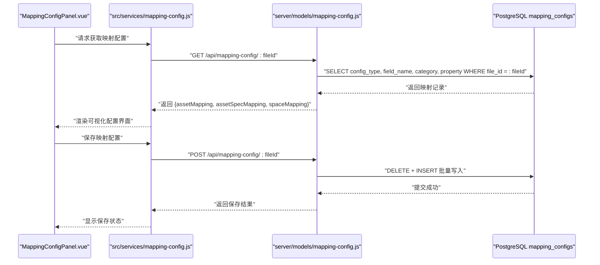
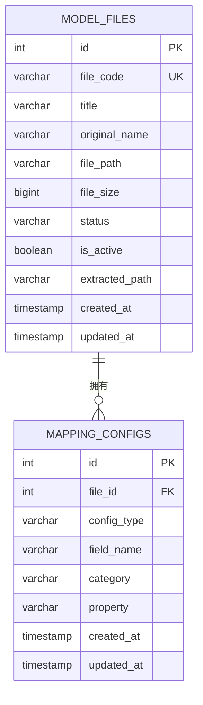
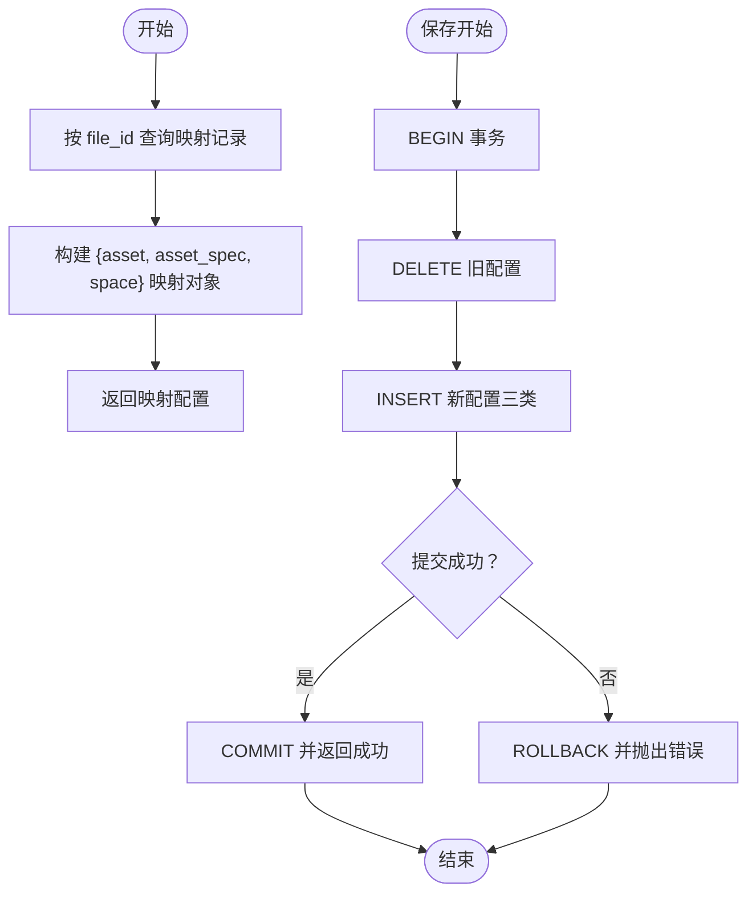
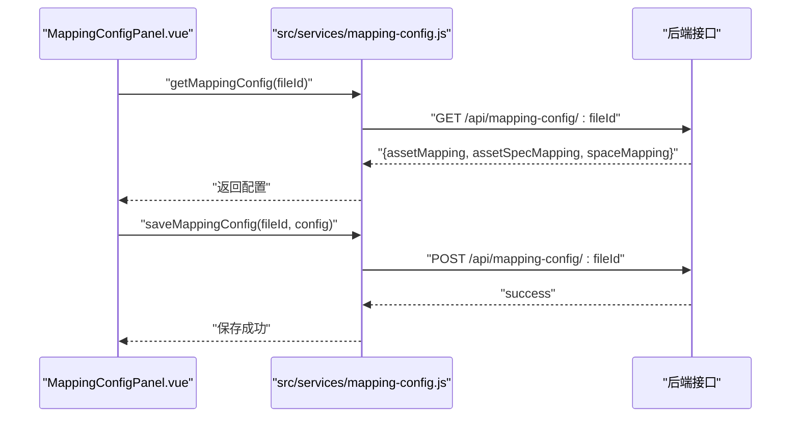
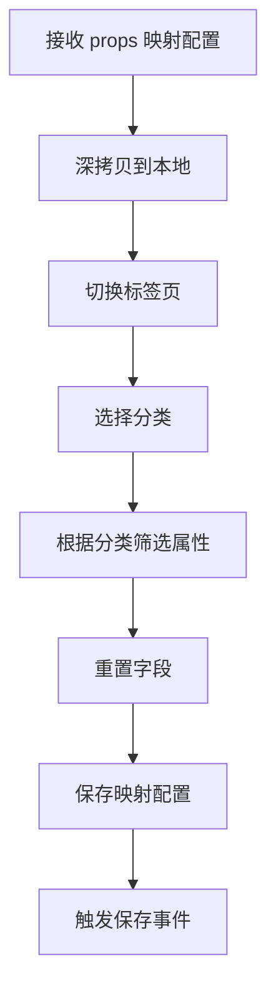
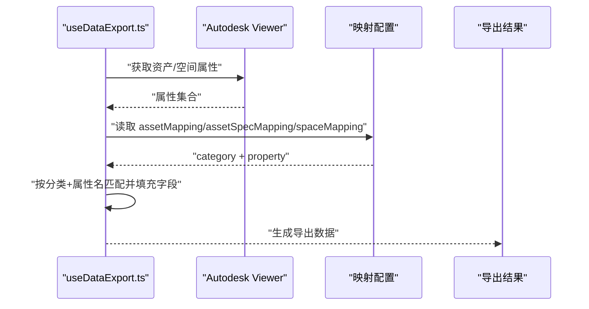

# 映射配置模型

<cite>
**本文引用的文件**
- [server/db/init-all.sql](file://server/db/init-all.sql)
- [server/db/migrations/create_mapping_config.sql](file://server/db/migrations/create_mapping_config.sql)
- [server/models/mapping-config.js](file://server/models/mapping-config.js)
- [src/services/mapping-config.js](file://src/services/mapping-config.js)
- [src/components/MappingConfigPanel.vue](file://src/components/MappingConfigPanel.vue)
- [src/composables/useDataExport.ts](file://src/composables/useDataExport.ts)
- [archive/continue-asset-export-refactor.md](file://archive/continue-asset-export-refactor.md)
</cite>

## 目录
1. [简介](#简介)
2. [项目结构](#项目结构)
3. [核心组件](#核心组件)
4. [架构总览](#架构总览)
5. [详细组件分析](#详细组件分析)
6. [依赖分析](#依赖分析)
7. [性能考虑](#性能考虑)
8. [故障排查指南](#故障排查指南)
9. [结论](#结论)
10. [附录](#附录)

## 简介
本文件围绕 mapping_config 表及其在数据导出中的作用进行系统化说明。基于数据库初始化脚本与模型层实现，定义该表的核心字段与用途，并解释其如何将资产、空间等内部模型属性映射到导出模板（如 Excel 报表）的列名，从而支持用户自定义导出模板。同时给出索引策略建议与导出脚本如何读取并应用映射配置的流程说明。

## 项目结构
mapping_config 表位于数据库初始化脚本中，作为模型文件级别的字段映射配置载体；模型层提供按文件读取与保存映射配置的能力；前端通过服务层与组件层实现配置的获取、编辑与持久化；导出流程由前端组合式函数负责从 Viewer 提取数据并依据映射配置进行字段抽取与输出。

```mermaid
graph TB
subgraph "数据库"
MC["mapping_configs 表<br/>file_id, config_type, field_name, category, property"]
end
subgraph "后端"
Model["server/models/mapping-config.js<br/>getMappingConfig/saveMappingConfig"]
end
subgraph "前端"
Service["src/services/mapping-config.js<br/>getMappingConfig/saveMappingConfig"]
Panel["src/components/MappingConfigPanel.vue<br/>可视化配置界面"]
Export["src/composables/useDataExport.ts<br/>数据提取与映射应用"]
end
MC <- --> Model
Model <- --> Service
Service --> Panel
Panel --> Service
Service --> Export
Export --> Panel
```

**图表来源**
- [server/db/init-all.sql](file://server/db/init-all.sql#L235-L251)
- [server/models/mapping-config.js](file://server/models/mapping-config.js#L1-L106)
- [src/services/mapping-config.js](file://src/services/mapping-config.js#L1-L116)
- [src/components/MappingConfigPanel.vue](file://src/components/MappingConfigPanel.vue#L1-L228)
- [src/composables/useDataExport.ts](file://src/composables/useDataExport.ts#L1-L682)

**章节来源**
- [server/db/init-all.sql](file://server/db/init-all.sql#L235-L251)
- [server/models/mapping-config.js](file://server/models/mapping-config.js#L1-L106)
- [src/services/mapping-config.js](file://src/services/mapping-config.js#L1-L116)
- [src/components/MappingConfigPanel.vue](file://src/components/MappingConfigPanel.vue#L1-L228)
- [src/composables/useDataExport.ts](file://src/composables/useDataExport.ts#L1-L682)

## 核心组件
- mapping_configs 表：存储文件级字段映射配置，核心字段包括：
  - file_id：关联 model_files 的文件标识
  - config_type：映射类型，支持 asset、asset_spec、space
  - field_name：导出模板中的目标字段名（例如资产导出列名）
  - category：模型属性分类（如“标识数据”、“约束”、“尺寸”等）
  - property：模型属性名称（如“MC编码”、“类型注释”等）
- 模型层方法：
  - getMappingConfig(fileId)：按文件查询映射配置，返回 assetMapping、assetSpecMapping、spaceMapping 三类映射对象
  - saveMappingConfig(fileId, config)：删除旧配置并批量插入新配置，事务保证一致性
- 前端服务层：
  - getMappingConfig(fileId)：调用后端接口获取映射配置
  - saveMappingConfig(fileId, config)：提交映射配置到后端
  - getDefaultMapping()：提供默认映射配置，便于首次使用或回退
- 前端组件 MappingConfigPanel.vue：提供可视化的映射配置界面，支持分类与属性联动选择、重置与保存
- 导出组合式函数 useDataExport.ts：从 Viewer 提取资产/空间数据，依据映射配置进行字段抽取与输出

**章节来源**
- [server/db/init-all.sql](file://server/db/init-all.sql#L235-L251)
- [server/models/mapping-config.js](file://server/models/mapping-config.js#L1-L106)
- [src/services/mapping-config.js](file://src/services/mapping-config.js#L1-L116)
- [src/components/MappingConfigPanel.vue](file://src/components/MappingConfigPanel.vue#L1-L228)
- [src/composables/useDataExport.ts](file://src/composables/useDataExport.ts#L1-L682)

## 架构总览
mapping_config 在整体导出流程中的职责：
- 作为“字段映射规则”的数据源，指导前端如何从模型属性中抽取目标字段值
- 通过后端模型层与前端服务层形成“读取/保存”闭环
- 与导出组合式函数协作，将抽取后的数据转换为导出模板所需的列



**图表来源**
- [src/components/MappingConfigPanel.vue](file://src/components/MappingConfigPanel.vue#L1-L228)
- [src/services/mapping-config.js](file://src/services/mapping-config.js#L1-L116)
- [server/models/mapping-config.js](file://server/models/mapping-config.js#L1-L106)
- [server/db/init-all.sql](file://server/db/init-all.sql#L235-L251)

## 详细组件分析

### 数据库表 mapping_configs 结构与索引
- 字段说明
  - file_id：文件级映射配置的归属标识，与 model_files 关联
  - config_type：映射类型，限定为 asset、asset_spec、space
  - field_name：导出模板的目标字段名（例如“资产编码”、“规格名称”、“房间编号”等）
  - category：模型属性分类（如“标识数据”、“约束”、“尺寸”、“数据”、“其他”等）
  - property：模型属性名称（如“MC编码”、“类型注释”、“名称”、“标高”、“面积”等）
- 约束与索引
  - 唯一键：(file_id, config_type, field_name)，确保同一文件、同一类型下目标字段不重复
  - 索引：idx_mapping_configs_file_id、idx_mapping_configs_type，优化按文件与类型查询
- 外键约束
  - mapping_configs.file_id 引用 model_files(id)，删除级联保证数据一致性



**图表来源**
- [server/db/init-all.sql](file://server/db/init-all.sql#L235-L251)
- [server/db/init-all.sql](file://server/db/init-all.sql#L336-L383)

**章节来源**
- [server/db/init-all.sql](file://server/db/init-all.sql#L235-L251)
- [server/db/init-all.sql](file://server/db/init-all.sql#L336-L383)

### 模型层：映射配置的读取与保存
- getMappingConfig(fileId)
  - 查询条件：按 file_id 过滤
  - 返回结构：包含 assetMapping、assetSpecMapping、spaceMapping 三个映射对象
  - 数据转换：将数据库记录按 config_type 归类到对应映射对象
- saveMappingConfig(fileId, config)
  - 事务：BEGIN/COMMIT/ROLLBACK 保证一致性
  - 清理：先删除旧配置，再批量插入新配置
  - 插入：分别处理 asset、asset_spec、space 三类映射



**图表来源**
- [server/models/mapping-config.js](file://server/models/mapping-config.js#L1-L106)

**章节来源**
- [server/models/mapping-config.js](file://server/models/mapping-config.js#L1-L106)

### 前端服务层：映射配置 API
- getMappingConfig(fileId)
  - 发起 HTTP 请求至后端接口
  - 成功返回 data.data，失败返回空配置对象
- saveMappingConfig(fileId, config)
  - POST 提交映射配置
  - 错误时抛出异常
- getDefaultMapping()
  - 提供默认映射配置，覆盖资产、资产规格、空间三类常用字段



**图表来源**
- [src/services/mapping-config.js](file://src/services/mapping-config.js#L1-L116)
- [src/components/MappingConfigPanel.vue](file://src/components/MappingConfigPanel.vue#L1-L228)

**章节来源**
- [src/services/mapping-config.js](file://src/services/mapping-config.js#L1-L116)
- [src/components/MappingConfigPanel.vue](file://src/components/MappingConfigPanel.vue#L1-L228)

### 前端组件：映射配置面板
- 功能要点
  - 三类标签页：资产、资产规格、空间
  - 每行包含：字段名、分类选择、属性选择、重置按钮
  - 合并分类：自动汇总已选分类与可用分类
  - 保存：将本地映射对象通过事件回传给父组件
- 交互流程
  - 初始化：监听 props 中的映射配置，深拷贝到本地
  - 选择：分类与属性联动，动态过滤属性选项
  - 重置：清空指定字段的分类与属性
  - 保存：序列化本地映射并触发保存事件



**图表来源**
- [src/components/MappingConfigPanel.vue](file://src/components/MappingConfigPanel.vue#L1-L228)

**章节来源**
- [src/components/MappingConfigPanel.vue](file://src/components/MappingConfigPanel.vue#L1-L228)

### 导出流程：映射配置的应用
- 数据提取
  - 资产：从 Viewer 获取构件属性，合并资产与资产规格映射，按分类与属性名进行匹配
  - 空间：从 Viewer 获取房间属性，按空间映射进行匹配
- 字段映射
  - 依据 mapping_configs 的 category 与 property，将模型属性值写入目标字段名（field_name）
  - 支持 displayName 与 attributeName 双匹配，兼容点号分隔的属性路径
- 输出
  - 导出为 CSV/Excel 等格式（具体导出实现可由上层调用方决定）



**图表来源**
- [src/composables/useDataExport.ts](file://src/composables/useDataExport.ts#L272-L535)
- [server/db/init-all.sql](file://server/db/init-all.sql#L235-L251)

**章节来源**
- [src/composables/useDataExport.ts](file://src/composables/useDataExport.ts#L272-L535)

## 依赖分析
- 表级依赖
  - mapping_configs.file_id → model_files(id)（外键约束）
- 模块级依赖
  - server/models/mapping-config.js 依赖数据库客户端封装
  - src/services/mapping-config.js 依赖鉴权头与后端 API
  - src/components/MappingConfigPanel.vue 依赖前端 i18n 与可搜索选择组件
  - src/composables/useDataExport.ts 依赖 Autodesk Viewer API
- 可能的循环依赖
  - 当前模块职责清晰，未见直接循环依赖迹象


**图表来源**
- [server/db/init-all.sql](file://server/db/init-all.sql#L336-L383)
- [server/models/mapping-config.js](file://server/models/mapping-config.js#L1-L106)
- [src/services/mapping-config.js](file://src/services/mapping-config.js#L1-L116)
- [src/components/MappingConfigPanel.vue](file://src/components/MappingConfigPanel.vue#L1-L228)
- [src/composables/useDataExport.ts](file://src/composables/useDataExport.ts#L1-L682)

**章节来源**
- [server/db/init-all.sql](file://server/db/init-all.sql#L336-L383)
- [server/models/mapping-config.js](file://server/models/mapping-config.js#L1-L106)
- [src/services/mapping-config.js](file://src/services/mapping-config.js#L1-L116)
- [src/components/MappingConfigPanel.vue](file://src/components/MappingConfigPanel.vue#L1-L228)
- [src/composables/useDataExport.ts](file://src/composables/useDataExport.ts#L1-L682)

## 性能考虑
- 索引策略
  - 按文件查询：idx_mapping_configs_file_id（已存在）
  - 按类型查询：idx_mapping_configs_type（已存在）
  - 唯一键：(file_id, config_type, field_name)（已存在），避免重复映射
- 事务与批量写入
  - 保存映射配置采用事务与批量插入，减少往返与锁竞争
- 前端查询优化
  - 仅在需要时请求映射配置，避免重复请求
  - 本地缓存最近一次映射配置，减少网络开销
- 导出性能
  - 使用 getBulkProperties 批量获取属性，降低网络与解析成本
  - 分类与属性名匹配时尽量缩小候选集，减少遍历次数

[本节为通用性能建议，无需特定文件引用]

## 故障排查指南
- 无法获取映射配置
  - 检查后端接口是否可达，确认鉴权头是否正确设置
  - 确认 file_id 是否有效且存在映射记录
- 保存映射配置失败
  - 查看后端日志，确认事务是否回滚
  - 检查唯一键冲突（同一文件、类型、字段名重复）
- 导出字段为空
  - 检查映射配置的 category 与 property 是否与模型属性一致
  - 确认属性名大小写与显示名/属性名是否匹配
  - 若使用点号分隔属性路径，确认属性名包含点号
- 默认映射不可用
  - 使用 getDefaultMapping() 作为兜底，确认前端服务层返回默认配置

**章节来源**
- [src/services/mapping-config.js](file://src/services/mapping-config.js#L1-L116)
- [server/models/mapping-config.js](file://server/models/mapping-config.js#L1-L106)
- [src/composables/useDataExport.ts](file://src/composables/useDataExport.ts#L272-L535)

## 结论
mapping_config 表为资产、空间等模型数据到导出模板的字段映射提供了统一、可配置的规则载体。通过后端模型层与前端服务层的配合，用户可在可视化界面中灵活配置映射规则，并在导出流程中自动应用这些规则，从而实现高度定制化的数据导出体验。合理的索引与事务策略进一步保障了查询与写入的性能与一致性。

[本节为总结性内容，无需特定文件引用]

## 附录
- 相关重构文档与进展
  - [continue-asset-export-refactor.md](file://archive/continue-asset-export-refactor.md#L1-L91)

**章节来源**
- [archive/continue-asset-export-refactor.md](file://archive/continue-asset-export-refactor.md#L1-L91)