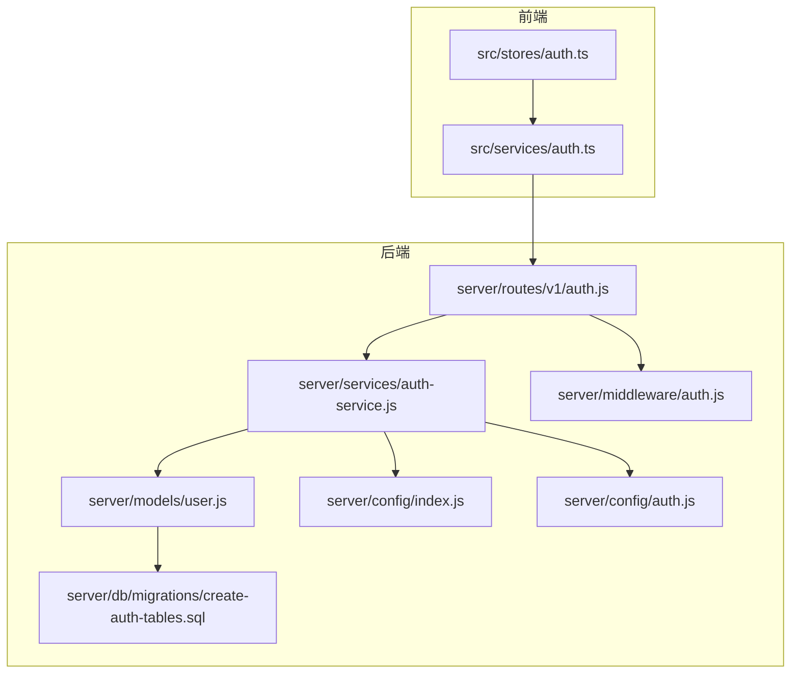
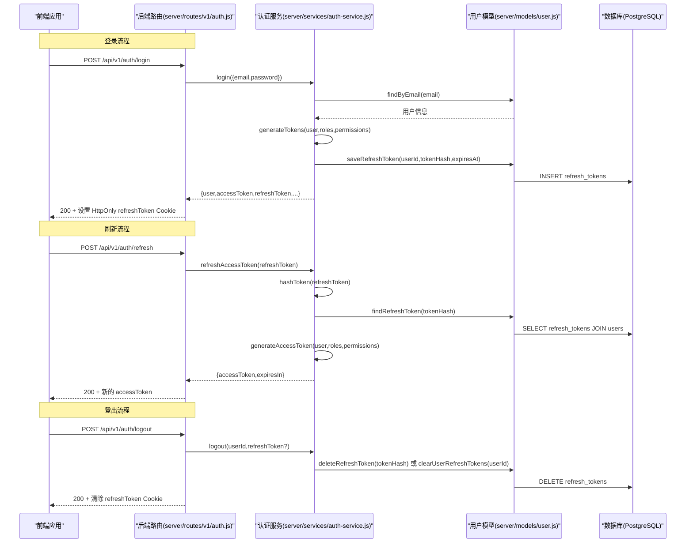
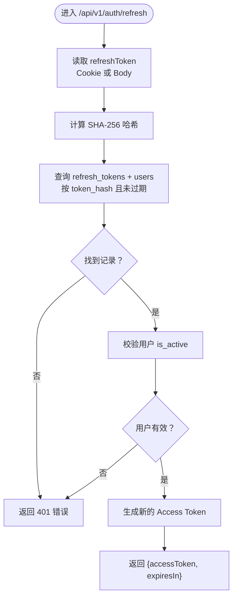
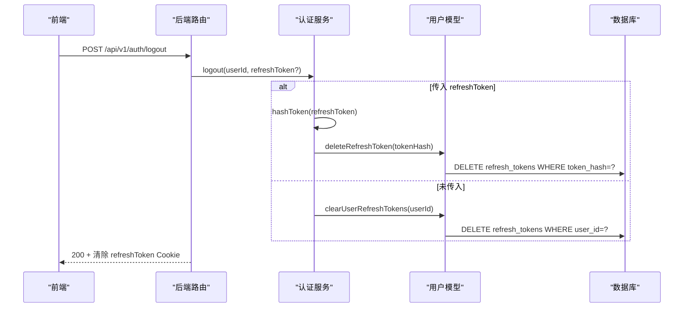
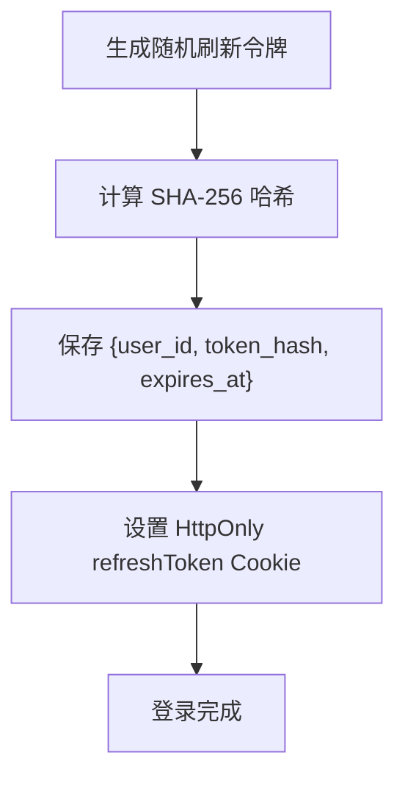
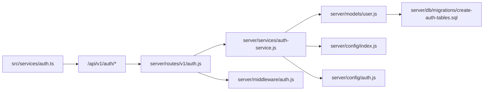

# 会话管理

<cite>
**本文引用的文件**
- [server/models/user.js](file://server/models/user.js)
- [server/services/auth-service.js](file://server/services/auth-service.js)
- [server/routes/v1/auth.js](file://server/routes/v1/auth.js)
- [server/db/migrations/create-auth-tables.sql](file://server/db/migrations/create-auth-tables.sql)
- [server/config/index.js](file://server/config/index.js)
- [server/config/auth.js](file://server/config/auth.js)
- [server/middleware/auth.js](file://server/middleware/auth.js)
- [src/services/auth.ts](file://src/services/auth.ts)
- [src/stores/auth.ts](file://src/stores/auth.ts)
</cite>

## 目录
1. [简介](#简介)
2. [项目结构](#项目结构)
3. [核心组件](#核心组件)
4. [架构总览](#架构总览)
5. [详细组件分析](#详细组件分析)
6. [依赖分析](#依赖分析)
7. [性能考虑](#性能考虑)
8. [故障排查指南](#故障排查指南)
9. [结论](#结论)
10. [附录](#附录)

## 简介
本文件围绕“基于JWT与刷新令牌”的会话机制进行系统化说明，重点覆盖以下方面：
- 令牌生命周期：Access Token（24小时，内存存储）与 Refresh Token（7天，HttpOnly Cookie）
- POST /api/v1/auth/refresh 如何通过哈希比对验证刷新令牌、生成新令牌对并更新数据库记录
- logout 如何清除Cookie并从数据库移除刷新令牌
- cleanExpiredRefreshTokens 定时任务（或登录时触发）如何清理过期令牌以维护数据库健康
- 结合 auth-service.js 的 generateTokens 函数，阐述令牌生成、哈希存储（SHA-256）与安全防护（防重放攻击）

## 项目结构
后端采用模块化设计，围绕“路由 -> 服务 -> 模型 -> 数据库迁移”的层次组织；前端通过独立的服务层与Pinia状态管理对接后端API。

图表来源
- [server/routes/v1/auth.js](file://server/routes/v1/auth.js#L1-L363)
- [server/services/auth-service.js](file://server/services/auth-service.js#L1-L328)
- [server/models/user.js](file://server/models/user.js#L1-L252)
- [server/db/migrations/create-auth-tables.sql](file://server/db/migrations/create-auth-tables.sql#L1-L78)
- [server/config/index.js](file://server/config/index.js#L1-L93)
- [server/config/auth.js](file://server/config/auth.js#L1-L142)
- [server/middleware/auth.js](file://server/middleware/auth.js#L1-L120)
- [src/services/auth.ts](file://src/services/auth.ts#L1-L191)
- [src/stores/auth.ts](file://src/stores/auth.ts#L1-L115)

章节来源
- [server/routes/v1/auth.js](file://server/routes/v1/auth.js#L1-L363)
- [server/services/auth-service.js](file://server/services/auth-service.js#L1-L328)
- [server/models/user.js](file://server/models/user.js#L1-L252)
- [server/db/migrations/create-auth-tables.sql](file://server/db/migrations/create-auth-tables.sql#L1-L78)
- [server/config/index.js](file://server/config/index.js#L1-L93)
- [server/config/auth.js](file://server/config/auth.js#L1-L142)
- [server/middleware/auth.js](file://server/middleware/auth.js#L1-L120)
- [src/services/auth.ts](file://src/services/auth.ts#L1-L191)
- [src/stores/auth.ts](file://src/stores/auth.ts#L1-L115)

## 核心组件
- 路由层（server/routes/v1/auth.js）
  - 提供 /api/v1/auth/login、/api/v1/auth/refresh、/api/v1/auth/logout 等接口
  - 登录成功后设置 HttpOnly Cookie 存储 Refresh Token
  - 刷新令牌支持从 Cookie 或请求体读取
- 服务层（server/services/auth-service.js）
  - 生成 Access Token（24小时）与 Refresh Token（7天）
  - 基于 SHA-256 对原始 Refresh Token 进行哈希存储
  - 刷新流程：计算哈希 -> 查询数据库 -> 校验用户状态 -> 生成新 Access Token
  - 登出：按传入令牌或用户维度删除刷新令牌
- 模型层（server/models/user.js）
  - 提供保存、查询、删除、清理刷新令牌的数据库操作
  - 包含清理过期刷新令牌的专用方法
- 配置层（server/config/index.js、server/config/auth.js）
  - JWT 密钥、Access Token 过期时间、Refresh Token 过期时间
  - 权限与角色常量及映射
- 中间件（server/middleware/auth.js）
  - Bearer Token 校验与权限检查
- 前端（src/services/auth.ts、src/stores/auth.ts）
  - 通过 withCredentials 保持 Cookie 会话
  - 本地持久化 Access Token，配合后端刷新接口恢复会话

章节来源
- [server/routes/v1/auth.js](file://server/routes/v1/auth.js#L80-L175)
- [server/services/auth-service.js](file://server/services/auth-service.js#L163-L206)
- [server/models/user.js](file://server/models/user.js#L187-L230)
- [server/config/index.js](file://server/config/index.js#L51-L56)
- [server/config/auth.js](file://server/config/auth.js#L1-L142)
- [server/middleware/auth.js](file://server/middleware/auth.js#L12-L54)
- [src/services/auth.ts](file://src/services/auth.ts#L41-L106)
- [src/stores/auth.ts](file://src/stores/auth.ts#L46-L104)

## 架构总览
下面的序列图展示了登录、刷新与登出的关键交互流程。

图表来源
- [server/routes/v1/auth.js](file://server/routes/v1/auth.js#L80-L175)
- [server/services/auth-service.js](file://server/services/auth-service.js#L163-L206)
- [server/models/user.js](file://server/models/user.js#L187-L230)

## 详细组件分析

### 令牌生命周期与存储策略
- Access Token
  - 有效期：由配置决定，默认24小时
  - 存储位置：前端本地存储（localStorage），用于后续请求携带 Bearer Token
  - 生成逻辑：在登录与刷新时生成，不写入数据库
- Refresh Token
  - 有效期：默认7天
  - 存储位置：HttpOnly Cookie，防止XSS读取
  - 存储内容：原始令牌值（用于哈希比对），数据库中仅保存 SHA-256 哈希
- 数据库表结构
  - users：用户基本信息
  - refresh_tokens：存储 user_id、token_hash、expires_at
  - 索引：对 token_hash 建有索引，加速查找

章节来源
- [server/config/index.js](file://server/config/index.js#L51-L56)
- [server/routes/v1/auth.js](file://server/routes/v1/auth.js#L95-L101)
- [server/services/auth-service.js](file://server/services/auth-service.js#L288-L311)
- [server/models/user.js](file://server/models/user.js#L187-L230)
- [server/db/migrations/create-auth-tables.sql](file://server/db/migrations/create-auth-tables.sql#L38-L54)

### POST /api/v1/auth/refresh 刷新流程
- 输入来源：优先从 Cookie 读取 refreshToken，其次从请求体读取
- 核心步骤：
  1) 计算传入令牌的 SHA-256 哈希
  2) 在数据库中按哈希查找并校验过期时间
  3) 校验用户状态（is_active）
  4) 重新生成 Access Token（24小时）
  5) 返回新 Access Token 与过期时间
- 安全要点：
  - 仅比较哈希，不存储明文刷新令牌
  - 过滤掉过期记录，避免重放
  - 用户被禁用时拒绝刷新

图表来源
- [server/routes/v1/auth.js](file://server/routes/v1/auth.js#L121-L150)
- [server/services/auth-service.js](file://server/services/auth-service.js#L163-L193)
- [server/models/user.js](file://server/models/user.js#L200-L208)

章节来源
- [server/routes/v1/auth.js](file://server/routes/v1/auth.js#L121-L150)
- [server/services/auth-service.js](file://server/services/auth-service.js#L163-L193)
- [server/models/user.js](file://server/models/user.js#L200-L208)

### 登出（logout）流程
- 支持两种场景：
  - 传入 refreshToken：计算哈希并删除对应记录
  - 不传入：清空该用户的所有刷新令牌
- 同步清除 HttpOnly Cookie
- 作用：使旧刷新令牌失效，防止继续刷新

图表来源
- [server/routes/v1/auth.js](file://server/routes/v1/auth.js#L152-L175)
- [server/services/auth-service.js](file://server/services/auth-service.js#L195-L206)
- [server/models/user.js](file://server/models/user.js#L217-L229)

章节来源
- [server/routes/v1/auth.js](file://server/routes/v1/auth.js#L152-L175)
- [server/services/auth-service.js](file://server/services/auth-service.js#L195-L206)
- [server/models/user.js](file://server/models/user.js#L217-L229)

### 清理过期刷新令牌（定时任务/登录触发）
- 数据库层面：定期执行清理过期记录，保持 refresh_tokens 表规模可控
- 登录流程：每次登录都会生成新的刷新令牌并写入数据库，旧的过期记录会被清理或自然过期
- 建议实践：
  - 后台定时任务（如每小时）调用清理方法
  - 或在登录成功后触发清理，确保数据库健康

章节来源
- [server/models/user.js](file://server/models/user.js#L224-L230)

### 令牌生成与安全防护（SHA-256 哈希存储）
- 生成流程：
  - Access Token：使用配置的密钥与过期时间生成
  - Refresh Token：随机生成原始令牌，同时计算 SHA-256 哈希
  - 写入数据库：保存 user_id、token_hash、expires_at
- 安全防护：
  - 明文不入库：仅存储哈希，降低泄露风险
  - 防重放：每次刷新都要求提供原始令牌，服务端再做哈希比对
  - HttpOnly Cookie：避免前端脚本读取刷新令牌
  - 过期控制：数据库与服务端双重过期校验

图表来源
- [server/services/auth-service.js](file://server/services/auth-service.js#L288-L311)
- [server/routes/v1/auth.js](file://server/routes/v1/auth.js#L95-L101)
- [server/models/user.js](file://server/models/user.js#L187-L195)

章节来源
- [server/services/auth-service.js](file://server/services/auth-service.js#L288-L311)
- [server/routes/v1/auth.js](file://server/routes/v1/auth.js#L95-L101)
- [server/models/user.js](file://server/models/user.js#L187-L195)

### 前端集成要点
- 登录：开启 withCredentials，接收并存储 Access Token；后端设置 HttpOnly Refresh Token Cookie
- 刷新：调用刷新接口，自动携带 Cookie；后端返回新的 Access Token
- 登出：调用登出接口，清除 Cookie 并删除数据库中的刷新令牌
- 权限：中间件根据 JWT 中的权限数组进行授权检查

章节来源
- [src/services/auth.ts](file://src/services/auth.ts#L41-L106)
- [src/stores/auth.ts](file://src/stores/auth.ts#L46-L104)
- [server/middleware/auth.js](file://server/middleware/auth.js#L12-L54)

## 依赖分析
- 路由依赖服务层，服务层依赖模型层与配置层
- 模型层依赖数据库迁移脚本定义的表结构
- 前端服务层依赖后端路由，状态管理依赖前端服务层

图表来源
- [src/services/auth.ts](file://src/services/auth.ts#L1-L191)
- [server/routes/v1/auth.js](file://server/routes/v1/auth.js#L1-L363)
- [server/services/auth-service.js](file://server/services/auth-service.js#L1-L328)
- [server/models/user.js](file://server/models/user.js#L1-L252)
- [server/config/index.js](file://server/config/index.js#L1-L93)
- [server/config/auth.js](file://server/config/auth.js#L1-L142)
- [server/db/migrations/create-auth-tables.sql](file://server/db/migrations/create-auth-tables.sql#L1-L78)
- [server/middleware/auth.js](file://server/middleware/auth.js#L1-L120)

章节来源
- [src/services/auth.ts](file://src/services/auth.ts#L1-L191)
- [server/routes/v1/auth.js](file://server/routes/v1/auth.js#L1-L363)
- [server/services/auth-service.js](file://server/services/auth-service.js#L1-L328)
- [server/models/user.js](file://server/models/user.js#L1-L252)
- [server/config/index.js](file://server/config/index.js#L1-L93)
- [server/config/auth.js](file://server/config/auth.js#L1-L142)
- [server/db/migrations/create-auth-tables.sql](file://server/db/migrations/create-auth-tables.sql#L1-L78)
- [server/middleware/auth.js](file://server/middleware/auth.js#L1-L120)

## 性能考虑
- 数据库索引：refresh_tokens 的 token_hash 已建立索引，建议保持该索引以优化查找性能
- 刷新频率：频繁刷新会增加数据库写入压力，建议客户端在 Access Token 有效期内复用，减少刷新次数
- 清理策略：定期清理过期刷新令牌，避免表膨胀影响查询性能
- Cookie 传输：HttpOnly Cookie 仅在同站请求中自动携带，避免额外的跨域开销

## 故障排查指南
- 刷新失败（401）
  - 检查是否正确携带 refreshToken（Cookie 或 Body）
  - 确认刷新令牌未过期
  - 确认用户状态正常（is_active）
- 登录后无法刷新
  - 确认浏览器已接受并保存 HttpOnly Cookie
  - 检查跨域与 SameSite 设置
- 登出后仍可刷新
  - 确认后端已删除对应 token_hash 记录
  - 确认前端已清除 Cookie
- Access Token 401
  - 确认 Bearer Token 正确传递
  - 检查 JWT 密钥与过期时间配置

章节来源
- [server/routes/v1/auth.js](file://server/routes/v1/auth.js#L121-L175)
- [server/services/auth-service.js](file://server/services/auth-service.js#L163-L206)
- [server/middleware/auth.js](file://server/middleware/auth.js#L12-L54)

## 结论
本会话管理方案通过“Access Token + Refresh Token”的双令牌模型实现了安全、可控的认证体验：
- Access Token（24小时）用于短期请求，本地存储
- Refresh Token（7天）用于长期续期，HttpOnly Cookie 存储
- 服务端仅存储 SHA-256 哈希，降低泄露风险
- 登录、刷新、登出流程清晰，数据库清理策略有助于长期健康运行

## 附录
- 配置项参考
  - JWT 密钥、Access Token 过期时间、Refresh Token 过期时间均来自配置
- 表结构参考
  - users、user_roles、user_identities、refresh_tokens 及其索引

章节来源
- [server/config/index.js](file://server/config/index.js#L51-L56)
- [server/db/migrations/create-auth-tables.sql](file://server/db/migrations/create-auth-tables.sql#L38-L54)