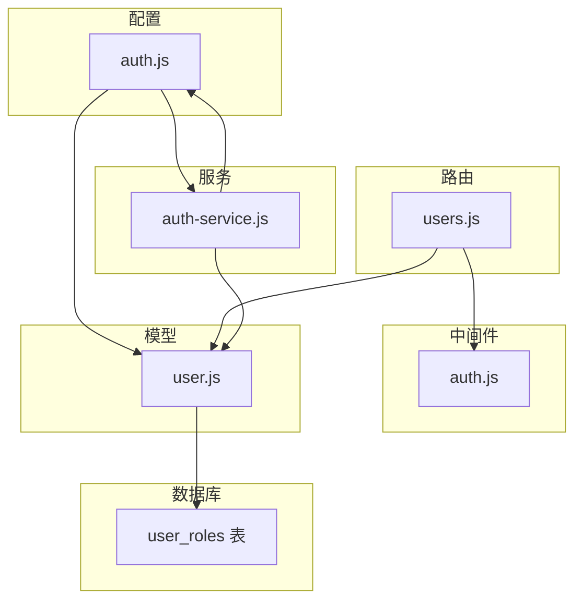
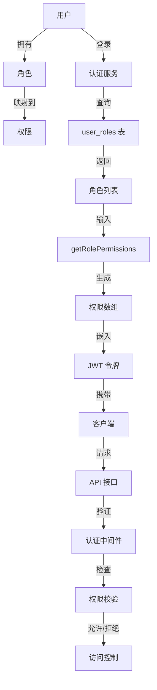
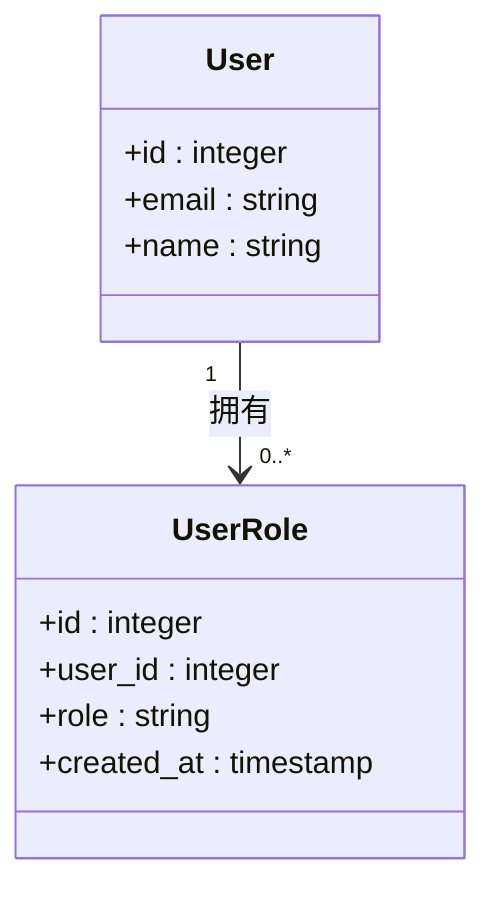
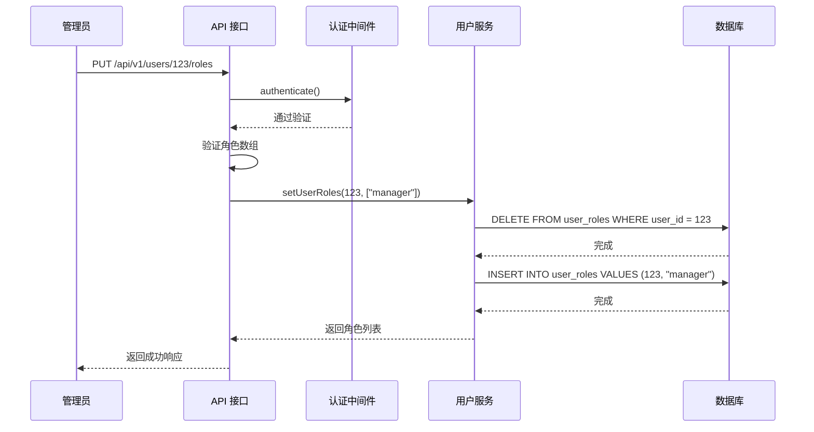
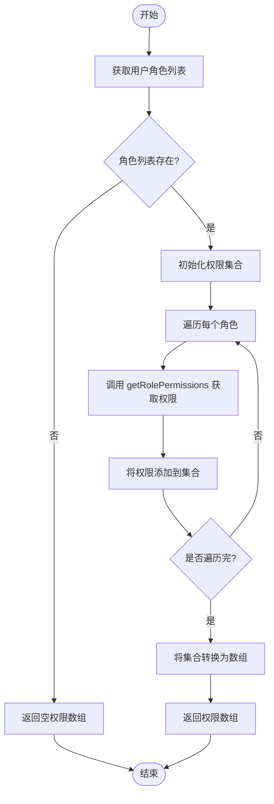
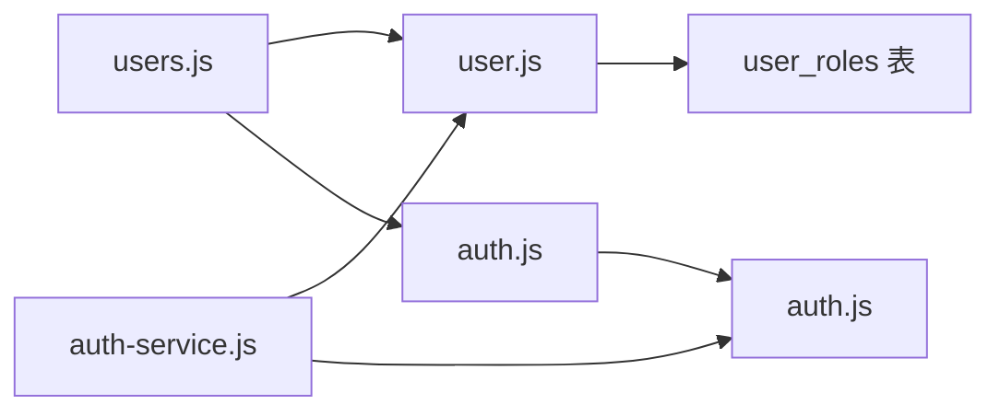

# 权限角色

<cite>
**本文档引用的文件**
- [user.js](file://server/models/user.js)
- [auth.js](file://server/config/auth.js)
- [users.js](file://server/routes/v1/users.js)
- [create-auth-tables.sql](file://server/db/migrations/create-auth-tables.sql)
- [auth-service.js](file://server/services/auth-service.js)
- [middleware/auth.js](file://server/middleware/auth.js)
</cite>

## 目录
1. [简介](#简介)
2. [项目结构](#项目结构)
3. [核心组件](#核心组件)
4. [架构概述](#架构概述)
5. [详细组件分析](#详细组件分析)
6. [依赖分析](#依赖分析)
7. [性能考虑](#性能考虑)
8. [故障排除指南](#故障排除指南)
9. [结论](#结论)

## 简介
本文档详细阐述了基于 `user_roles` 表结构和 `user.js` 中的 `getUserRoles`、`setUserRoles`、`addUserRole` 方法的权限角色管理系统。文档解释了 RBAC 模型的设计，包括预定义角色（ADMIN, MANAGER, EDITOR, VIEWER, GUEST）及其权限映射（参考 `auth.js` 中的 ROLE_PERMISSIONS）。详细说明了 `PUT /api/v1/users/:id/roles` API 如何验证角色有效性、执行批量角色设置，并触发权限更新。阐述了角色与权限的分离设计：JWT payload 中包含 roles 和扁平化的 permissions 数组，由 `getRolePermissions` 函数动态生成。提供了管理员分配角色的使用示例，并说明了权限校验中间件（authorize）如何基于 PERMISSIONS 常量进行访问控制。强调了数据完整性约束（user_id 与 role 的唯一索引）和级联删除行为。

## 项目结构
项目结构遵循典型的分层架构，将配置、数据库、中间件、模型、路由和服务分离。权限角色管理功能主要分布在 `server` 目录下，核心文件包括 `config/auth.js`（权限和角色定义）、`models/user.js`（用户和角色数据操作）、`routes/v1/users.js`（用户管理路由）和 `services/auth-service.js`（认证和权限服务）。

**图表来源**
- [auth.js](file://server/config/auth.js#L8-L141)
- [user.js](file://server/models/user.js#L57-L89)
- [users.js](file://server/routes/v1/users.js#L108-L137)
- [create-auth-tables.sql](file://server/db/migrations/create-auth-tables.sql#L19-L25)

**章节来源**
- [auth.js](file://server/config/auth.js#L8-L141)
- [user.js](file://server/models/user.js#L57-L89)
- [users.js](file://server/routes/v1/users.js#L108-L137)
- [create-auth-tables.sql](file://server/db/migrations/create-auth-tables.sql#L19-L25)

## 核心组件
核心组件包括 `user_roles` 数据库表，用于存储用户与角色的多对多关系；`user.js` 中的 `getUserRoles`、`setUserRoles` 和 `addUserRole` 方法，用于操作用户角色；`auth.js` 中的 `ROLE_PERMISSIONS` 映射，定义了角色到权限的映射关系；以及 `users.js` 中的 `PUT /api/v1/users/:id/roles` 路由，用于管理员设置用户角色。

**章节来源**
- [user.js](file://server/models/user.js#L57-L89)
- [auth.js](file://server/config/auth.js#L64-L117)
- [users.js](file://server/routes/v1/users.js#L108-L137)

## 架构概述
系统采用基于角色的访问控制（RBAC）模型，将用户与权限通过角色进行间接关联。当用户登录时，系统根据其角色动态生成权限列表，并将其嵌入 JWT 令牌中。后续请求通过验证 JWT 令牌和检查权限中间件来实现访问控制。

**图表来源**
- [user.js](file://server/models/user.js#L57-L89)
- [auth.js](file://server/config/auth.js#L122-L124)
- [auth-service.js](file://server/services/auth-service.js#L261-L268)
- [middleware/auth.js](file://server/middleware/auth.js#L60-L85)

## 详细组件分析
### 用户角色管理分析
用户角色管理通过 `user_roles` 表实现多对多关系。该表通过 `user_id` 外键关联 `users` 表，并在 `user_id` 和 `role` 上建立唯一索引以保证数据完整性。`ON DELETE CASCADE` 约束确保当用户被删除时，其所有角色记录也会被自动清除。

#### 类图

**图表来源**
- [create-auth-tables.sql](file://server/db/migrations/create-auth-tables.sql#L19-L25)

**章节来源**
- [create-auth-tables.sql](file://server/db/migrations/create-auth-tables.sql#L19-L25)

### API 流程分析
`PUT /api/v1/users/:id/roles` API 的执行流程包括：管理员发起请求，认证中间件验证管理员身份，API 验证角色数组的有效性，调用 `setUserRoles` 方法批量更新用户角色，最后返回成功响应。

#### 序列图

**图表来源**
- [users.js](file://server/routes/v1/users.js#L108-L137)
- [user.js](file://server/models/user.js#L67-L79)

**章节来源**
- [users.js](file://server/routes/v1/users.js#L108-L137)
- [user.js](file://server/models/user.js#L67-L79)

### 权限生成逻辑分析
权限生成逻辑通过 `getRolePermissions` 函数实现，该函数根据角色名称从 `ROLE_PERMISSIONS` 映射中查找对应的权限列表。`getPermissionsFromRoles` 函数则用于处理用户拥有的多个角色，合并所有角色的权限并去重。

#### 流程图

**图表来源**
- [auth.js](file://server/config/auth.js#L122-L124)
- [auth-service.js](file://server/services/auth-service.js#L261-L268)

**章节来源**
- [auth.js](file://server/config/auth.js#L122-L124)
- [auth-service.js](file://server/services/auth-service.js#L261-L268)

## 依赖分析
权限角色管理系统依赖于多个组件的协同工作。`users.js` 路由依赖于 `user.js` 模型进行数据操作和 `auth.js` 中间件进行权限校验。`auth-service.js` 服务依赖于 `user.js` 模型获取用户角色，并依赖于 `auth.js` 配置获取权限映射。整个系统依赖于数据库的 `user_roles` 表来持久化角色分配。

**图表来源**
- [users.js](file://server/routes/v1/users.js#L5-L8)
- [auth-service.js](file://server/services/auth-service.js#L10-L11)
- [user.js](file://server/models/user.js#L5)
- [middleware/auth.js](file://server/middleware/auth.js#L7)

**章节来源**
- [users.js](file://server/routes/v1/users.js#L5-L8)
- [auth-service.js](file://server/services/auth-service.js#L10-L11)
- [user.js](file://server/models/user.js#L5)
- [middleware/auth.js](file://server/middleware/auth.js#L7)

## 性能考虑
在性能方面，`user_roles` 表在 `user_id` 上建立了索引，确保了根据用户 ID 查询角色的高效性。`setUserRoles` 方法通过先删除后插入的方式实现批量更新，虽然简单直接，但在高并发场景下可能产生锁竞争。建议在必要时考虑使用更高效的批量操作方式。

## 故障排除指南
常见问题包括角色设置失败、权限校验不通过等。排查时应首先检查请求的角色是否在预定义角色列表中，其次检查管理员是否具有 `SYSTEM_ADMIN` 权限，最后检查数据库连接和 `user_roles` 表的完整性。

**章节来源**
- [users.js](file://server/routes/v1/users.js#L120-L127)
- [middleware/auth.js](file://server/middleware/auth.js#L60-L85)

## 结论
本文档详细介绍了权限角色管理系统的实现细节，包括 RBAC 模型设计、API 流程、权限生成逻辑和数据完整性约束。系统通过清晰的分层架构和组件协作，实现了灵活且安全的权限控制机制，为系统的可扩展性和安全性提供了坚实基础。