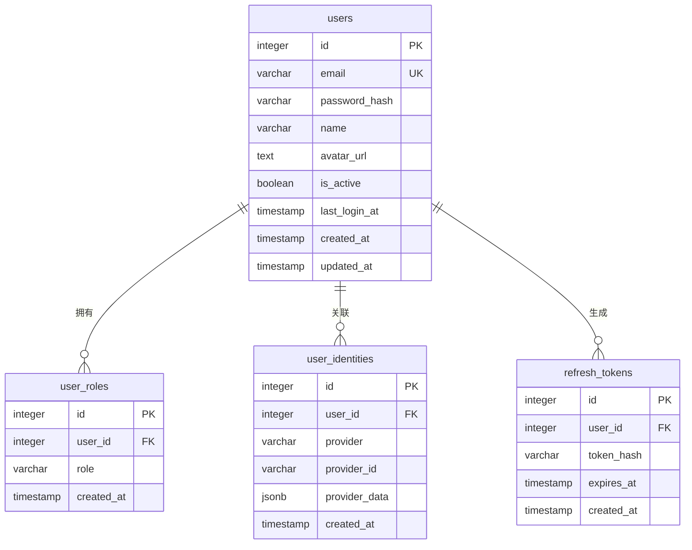
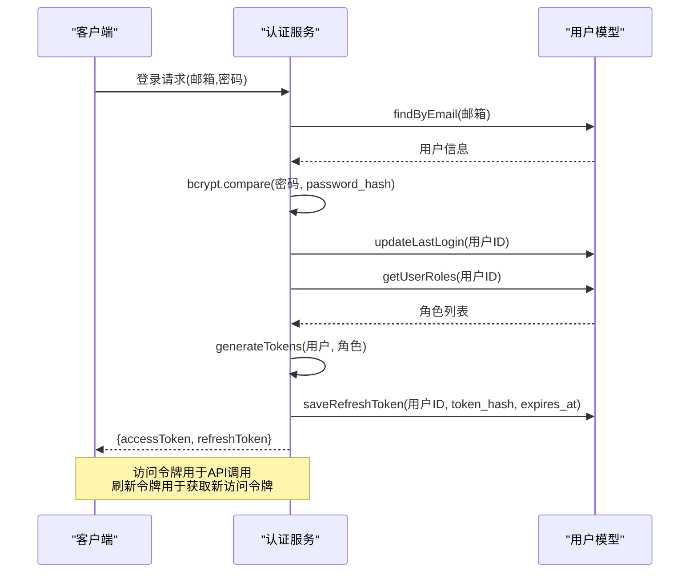

# 用户模型

<cite>
**本文档引用的文件**
- [users表结构](file://server/db/migrations/create-auth-tables.sql#L5-L16)
- [user_roles表结构](file://server/db/migrations/create-auth-tables.sql#L18-L25)
- [user_identities表结构](file://server/db/migrations/create-auth-tables.sql#L27-L36)
- [refresh_tokens表结构](file://server/db/migrations/create-auth-tables.sql#L38-L45)
- [用户模型实现](file://server/models/user.js)
- [认证服务实现](file://server/services/auth-service.js)
- [认证配置](file://server/config/auth.js)
- [JWT配置](file://server/config/index.js#L52-L56)
</cite>

## 目录
1. [核心用户表结构](#核心用户表结构)
2. [身份关联管理](#身份关联管理)
3. [角色与权限控制](#角色与权限控制)
4. [用户操作方法](#用户操作方法)
5. [JWT刷新令牌机制](#jwt刷新令牌机制)
6. [安全实践](#安全实践)

## 核心用户表结构

`users`表是用户系统的核心，存储用户的基本信息和状态。该表包含以下字段：

- **id**: 主键，自增序列
- **email**: 用户邮箱，唯一约束，用于登录和身份识别
- **password_hash**: 密码哈希值，使用bcrypt算法加密存储
- **name**: 用户姓名
- **avatar_url**: 头像URL
- **is_active**: 用户状态，布尔值，默认为true，用于启用/禁用账户
- **last_login_at**: 最后登录时间，记录用户最近一次登录的时间戳
- **created_at**: 创建时间，自动设置为记录创建时的时间
- **updated_at**: 更新时间，通过触发器在记录更新时自动更新

该表通过`idx_users_email`索引优化邮箱查询性能，并使用`update_users_updated_at`触发器确保`updated_at`字段在每次更新时自动更新。

**Section sources**
- [users表结构](file://server/db/migrations/create-auth-tables.sql#L5-L16)

## 身份关联管理

`user_identities`表支持多种登录方式的身份关联，实现统一账户体系下的多源身份管理。该表包含以下字段：

- **id**: 主键，自增序列
- **user_id**: 外键，关联到`users`表的id字段，级联删除
- **provider**: 提供商，如'email'、'google'、'wechat'等
- **provider_id**: 在提供商系统中的用户ID
- **provider_data**: JSONB格式，存储从第三方获取的用户资料
- **created_at**: 创建时间

该表通过唯一约束`UNIQUE(provider, provider_id)`确保同一提供商的同一用户ID只能关联一个账户，防止重复绑定。同时，通过`idx_user_identities_user_id`和`idx_user_identities_provider`索引优化查询性能。

`linkIdentity`方法实现了第三方账号绑定功能，使用`ON CONFLICT`语句处理冲突，当发现已存在的身份关联时，会更新`provider_data`字段而非创建新记录，确保数据一致性。

**Section sources**
- [user_identities表结构](file://server/db/migrations/create-auth-tables.sql#L27-L36)
- [用户模型实现](file://server/models/user.js#L95-L104)

## 角色与权限控制

系统采用基于角色的访问控制（RBAC）模型，通过`user_roles`表实现用户与角色的多对多关联。

`user_roles`表包含以下字段：
- **id**: 主键，自增序列
- **user_id**: 外键，关联到`users`表的id字段，级联删除
- **role**: 角色名称，如'admin'、'manager'、'editor'等
- **created_at**: 创建时间
- **UNIQUE(user_id, role)**: 唯一约束，防止同一用户重复分配同一角色

系统定义了五种预设角色：`ADMIN`（管理员）、`MANAGER`（管理）、`EDITOR`（编辑）、`VIEWER`（查看）和`GUEST`（访客）。每个角色关联一组权限，权限系统定义了细粒度的操作权限，如`asset:read`、`model:upload`等。

`getUserRoles`和`setUserRoles`方法提供了角色管理功能。`setUserRoles`方法采用"先删除后插入"的策略，确保角色分配的原子性，避免出现中间状态。

**Diagram sources**
- [users表结构](file://server/db/migrations/create-auth-tables.sql#L5-L16)
- [user_roles表结构](file://server/db/migrations/create-auth-tables.sql#L18-L25)
- [user_identities表结构](file://server/db/migrations/create-auth-tables.sql#L27-L36)
- [refresh_tokens表结构](file://server/db/migrations/create-auth-tables.sql#L38-L45)

**Section sources**
- [user_roles表结构](file://server/db/migrations/create-auth-tables.sql#L18-L25)
- [认证配置](file://server/config/auth.js)

## 用户操作方法

`user.js`文件提供了用户管理的核心方法：

- **createUser**: 创建新用户，接收邮箱、密码哈希、姓名和头像URL作为参数，返回创建的用户信息
- **findByEmail**: 根据邮箱查找用户，用于登录验证
- **findById**: 根据ID查找用户，用于用户详情获取
- **updateUser**: 更新用户信息，支持部分字段更新
- **updateLastLogin**: 更新最后登录时间
- **updatePassword**: 更新密码哈希
- **setUserActive**: 启用或禁用用户账户
- **getAllUsers**: 获取所有用户列表，支持分页
- **deleteUser**: 删除用户

这些方法通过参数化查询防止SQL注入，并返回适当的数据结构以满足上层业务需求。

**Section sources**
- [用户模型实现](file://server/models/user.js)

## JWT刷新令牌机制

系统采用JWT（JSON Web Token）进行身份验证，并通过`refresh_tokens`表实现安全的令牌刷新机制。

`refresh_tokens`表包含以下字段：
- **id**: 主键，自增序列
- **user_id**: 外键，关联到`users`表的id字段，级联删除
- **token_hash**: 刷新令牌的哈希值，使用SHA-256算法加密存储
- **expires_at**: 过期时间，明确设置令牌有效期
- **created_at**: 创建时间

相关方法包括：
- **saveRefreshToken**: 保存刷新令牌，存储令牌哈希而非明文
- **findRefreshToken**: 验证刷新令牌，检查哈希值和过期时间
- **clearUserRefreshTokens**: 清理用户的全部刷新令牌，用于登出操作
- **cleanExpiredRefreshTokens**: 清理过期的刷新令牌，用于定期维护

认证服务中的`generateTokens`方法生成令牌对，其中访问令牌（Access Token）短期有效（默认24小时），刷新令牌（Refresh Token）长期有效（默认7天）。刷新令牌使用`crypto.randomBytes`生成高强度随机值，并通过`hashToken`方法计算SHA-256哈希后存储，即使数据库泄露也无法反向推导出原始令牌。

**Diagram sources**
- [refresh_tokens表结构](file://server/db/migrations/create-auth-tables.sql#L38-L45)
- [用户模型实现](file://server/models/user.js)
- [认证服务实现](file://server/services/auth-service.js)

**Section sources**
- [用户模型实现](file://server/models/user.js#L187-L229)
- [认证服务实现](file://server/services/auth-service.js#L288-L304)

## 安全实践

系统实施了多项安全措施保障用户数据和系统安全：

1. **密码安全**: 使用bcrypt算法对密码进行哈希存储，配置10轮加密强度，有效抵御彩虹表攻击
2. **令牌安全**: 刷新令牌以哈希形式存储，使用SHA-256算法加密，防止令牌泄露
3. **输入验证**: 注册时验证密码强度，要求至少8位且包含字母和数字
4. **状态管理**: 通过`is_active`字段控制用户账户状态，禁用账户无法登录
5. **会话管理**: 修改密码时自动清除所有刷新令牌，强制用户重新登录
6. **定期清理**: 提供`cleanExpiredRefreshTokens`方法清理过期令牌，减少数据库负担和安全风险
7. **环境安全**: JWT密钥通过环境变量配置，避免硬编码在代码中

这些安全实践共同构建了一个安全可靠的用户认证系统，既保护了用户隐私，又防止了常见的安全威胁。

**Section sources**
- [认证服务实现](file://server/services/auth-service.js#L246-L256)
- [用户模型实现](file://server/models/user.js#L227-L229)
- [JWT配置](file://server/config/index.js#L52-L56)