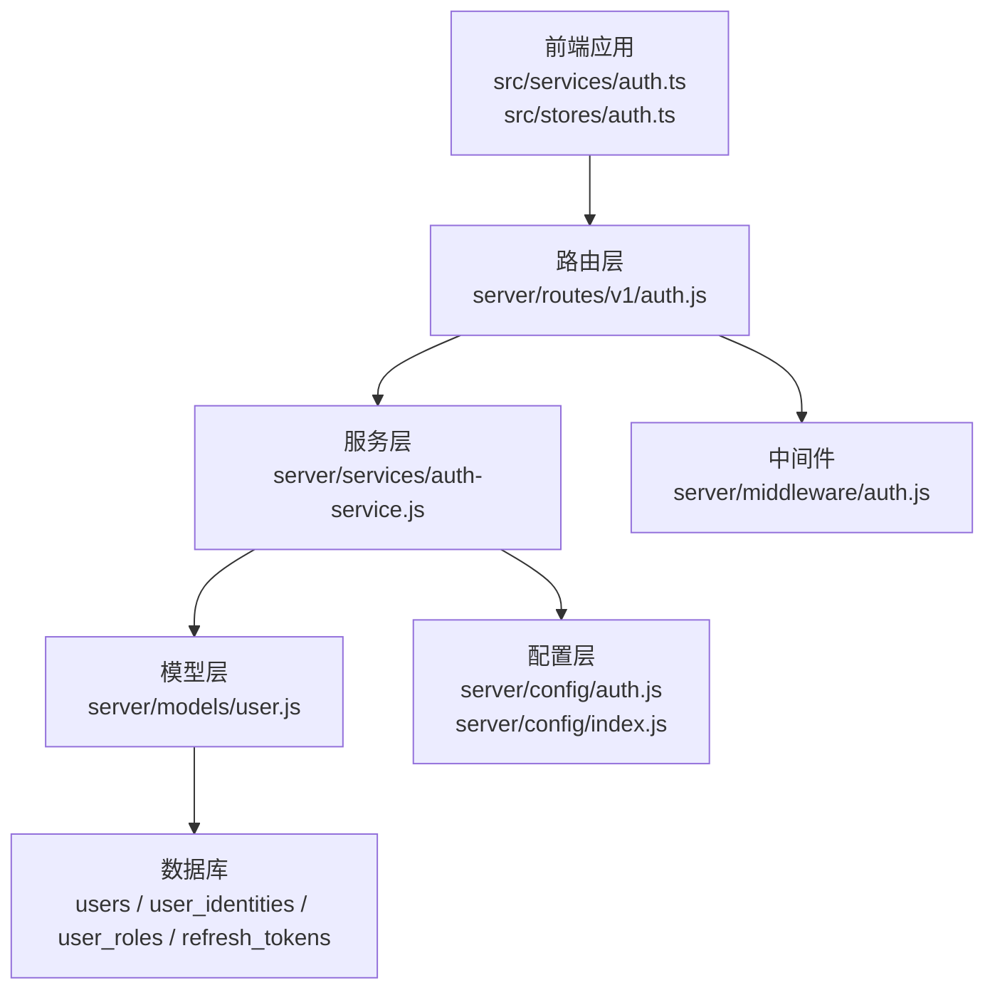
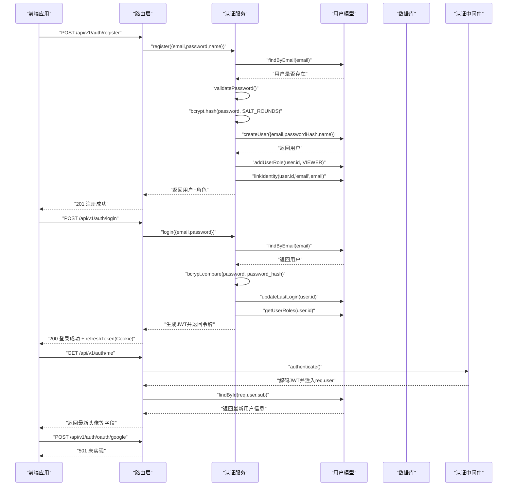
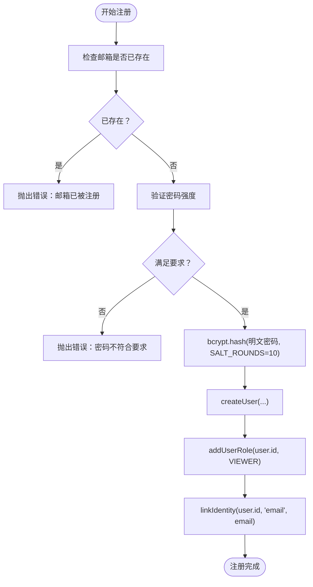
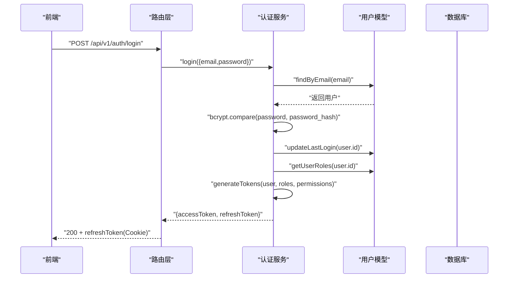
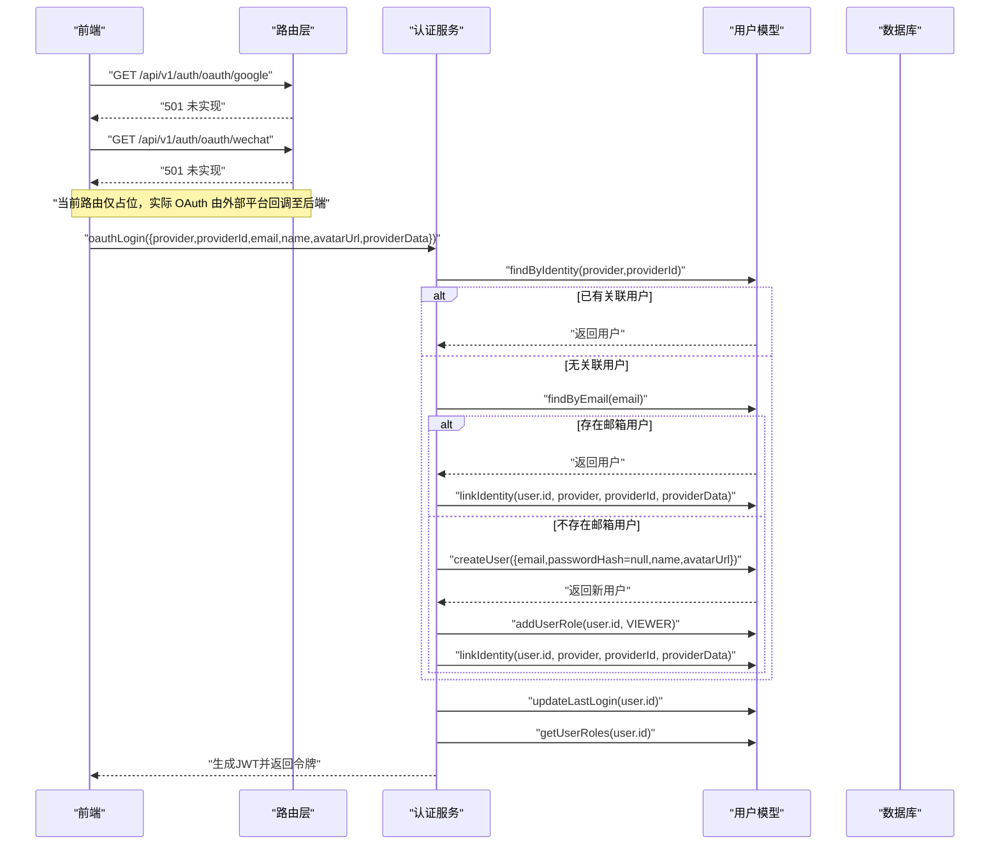
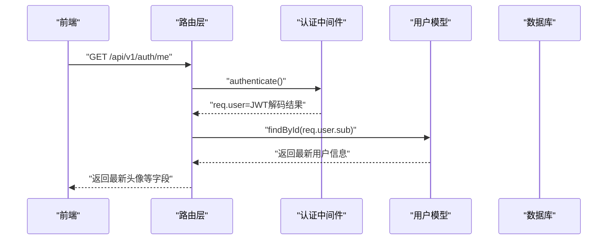
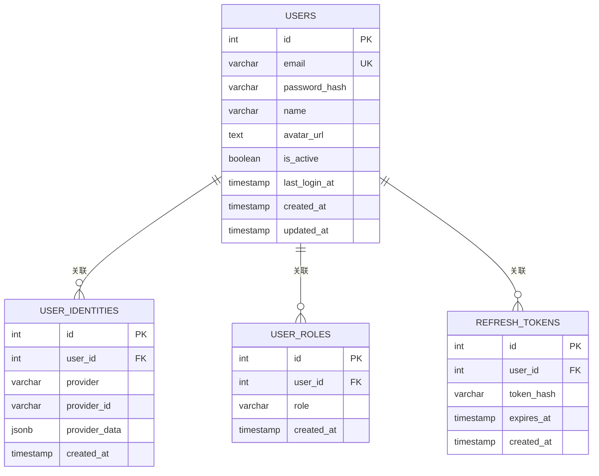
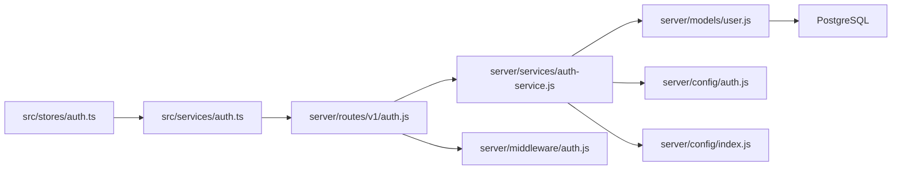

# 身份认证

<cite>
**本文引用的文件**
- [server/models/user.js](file://server/models/user.js)
- [server/services/auth-service.js](file://server/services/auth-service.js)
- [server/routes/v1/auth.js](file://server/routes/v1/auth.js)
- [server/db/migrations/create-auth-tables.sql](file://server/db/migrations/create-auth-tables.sql)
- [server/config/auth.js](file://server/config/auth.js)
- [server/middleware/auth.js](file://server/middleware/auth.js)
- [server/config/index.js](file://server/config/index.js)
- [src/services/auth.ts](file://src/services/auth.ts)
- [src/stores/auth.ts](file://src/stores/auth.ts)
</cite>

## 目录
1. [简介](#简介)
2. [项目结构](#项目结构)
3. [核心组件](#核心组件)
4. [架构总览](#架构总览)
5. [详细组件分析](#详细组件分析)
6. [依赖关系分析](#依赖关系分析)
7. [性能考量](#性能考量)
8. [故障排查指南](#故障排查指南)
9. [结论](#结论)
10. [附录](#附录)

## 简介
本文件围绕用户注册、登录与第三方身份关联机制，基于后端 user.js 中的 createUser、findByEmail、linkIdentity 等方法，以及 auth-service.js 中的 register、login、oauthLogin 等函数，系统梳理邮箱密码注册流程（邮箱唯一性检查、密码强度验证、bcrypt 哈希加密存储、默认角色分配、邮箱身份绑定），并解释 user_identities 表如何支持多提供商（'email'、'google'、'wechat'）的身份关联，结合 auth-service.js 的 oauthLogin 实现第三方登录流程。同时说明 GET /api/v1/auth/me 接口为何需要从数据库而非 JWT 中获取最新用户信息以解决头像不持久问题，并提供实际代码示例路径与最佳实践建议。

## 项目结构
后端采用分层设计：
- 路由层：处理 HTTP 请求与响应，负责参数校验与调用服务层。
- 服务层：封装业务逻辑（注册、登录、令牌管理、OAuth 登录）。
- 模型层：封装数据库访问（用户、角色、身份、刷新令牌）。
- 配置层：JWT、权限、数据库、上传等配置。
- 中间件：认证与权限校验。
- 前端：Axios 封装的认证 API 与 Pinia 状态管理。

图表来源
- [server/routes/v1/auth.js](file://server/routes/v1/auth.js#L1-L363)
- [server/services/auth-service.js](file://server/services/auth-service.js#L1-L328)
- [server/models/user.js](file://server/models/user.js#L1-L252)
- [server/config/auth.js](file://server/config/auth.js#L1-L142)
- [server/config/index.js](file://server/config/index.js#L1-L93)
- [server/middleware/auth.js](file://server/middleware/auth.js#L1-L120)
- [src/services/auth.ts](file://src/services/auth.ts#L1-L191)
- [src/stores/auth.ts](file://src/stores/auth.ts#L1-L115)

章节来源
- [server/routes/v1/auth.js](file://server/routes/v1/auth.js#L1-L363)
- [server/services/auth-service.js](file://server/services/auth-service.js#L1-L328)
- [server/models/user.js](file://server/models/user.js#L1-L252)
- [server/config/auth.js](file://server/config/auth.js#L1-L142)
- [server/config/index.js](file://server/config/index.js#L1-L93)
- [server/middleware/auth.js](file://server/middleware/auth.js#L1-L120)
- [src/services/auth.ts](file://src/services/auth.ts#L1-L191)
- [src/stores/auth.ts](file://src/stores/auth.ts#L1-L115)

## 核心组件
- 用户模型（user.js）
  - 提供用户创建、按邮箱/ID 查询、角色管理、身份关联、头像更新、最后登录时间更新、密码更新、账户启停、刷新令牌管理等能力。
- 认证服务（auth-service.js）
  - 实现邮箱密码注册、登录、OAuth 登录、令牌生成与刷新、登出、改密等。
- 路由（routes/v1/auth.js）
  - 定义 /api/v1/auth/* 接口，处理注册、登录、刷新、登出、获取当前用户、更新资料、修改密码、上传头像等。
- 数据库迁移（create-auth-tables.sql）
  - 定义 users、user_identities、user_roles、refresh_tokens 表及索引。
- 配置（auth.js、index.js）
  - 权限与角色定义、JWT 秘钥与过期时间配置。
- 中间件（auth.js）
  - JWT 校验与权限检查。
- 前端（auth.ts、auth store）
  - Axios 封装与 Pinia 状态管理。

章节来源
- [server/models/user.js](file://server/models/user.js#L1-L252)
- [server/services/auth-service.js](file://server/services/auth-service.js#L1-L328)
- [server/routes/v1/auth.js](file://server/routes/v1/auth.js#L1-L363)
- [server/db/migrations/create-auth-tables.sql](file://server/db/migrations/create-auth-tables.sql#L1-L78)
- [server/config/auth.js](file://server/config/auth.js#L1-L142)
- [server/config/index.js](file://server/config/index.js#L1-L93)
- [server/middleware/auth.js](file://server/middleware/auth.js#L1-L120)
- [src/services/auth.ts](file://src/services/auth.ts#L1-L191)
- [src/stores/auth.ts](file://src/stores/auth.ts#L1-L115)

## 架构总览
下图展示从浏览器到数据库的认证全流程，包括邮箱密码注册、登录、OAuth 登录、令牌刷新与登出，以及 /me 接口从数据库读取最新用户信息的原因。

图表来源
- [server/routes/v1/auth.js](file://server/routes/v1/auth.js#L1-L363)
- [server/services/auth-service.js](file://server/services/auth-service.js#L1-L328)
- [server/models/user.js](file://server/models/user.js#L1-L252)
- [server/middleware/auth.js](file://server/middleware/auth.js#L1-L120)

## 详细组件分析

### 邮箱密码注册流程
- 邮箱唯一性检查：在注册前查询用户是否存在，若存在则抛错。
- 密码强度验证：要求长度≥8且包含字母与数字。
- bcrypt 哈希加密：使用 SALT_ROUNDS=10 对明文密码进行哈希。
- 默认角色分配：注册后为用户添加默认角色 VIEWER。
- 邮箱身份绑定：为用户在 user_identities 表中插入一条 provider='email' 的记录，provider_id=email，确保后续可通过邮箱登录。

图表来源
- [server/services/auth-service.js](file://server/services/auth-service.js#L19-L51)
- [server/models/user.js](file://server/models/user.js#L10-L17)
- [server/models/user.js](file://server/models/user.js#L64-L90)
- [server/models/user.js](file://server/models/user.js#L92-L104)

章节来源
- [server/services/auth-service.js](file://server/services/auth-service.js#L19-L51)
- [server/models/user.js](file://server/models/user.js#L10-L17)
- [server/models/user.js](file://server/models/user.js#L64-L90)
- [server/models/user.js](file://server/models/user.js#L92-L104)

### 邮箱密码登录流程
- 用户凭邮箱与密码登录，先按邮箱查询用户。
- 校验账户状态 is_active，若禁用则拒绝登录。
- 使用 bcrypt.compare 验证密码。
- 登录成功后更新 last_login_at。
- 从 user_roles 表读取用户角色，计算权限集合。
- 生成 JWT 令牌对（Access + Refresh），并将 RefreshToken 写入 refresh_tokens 表，同时设置 HttpOnly Cookie。

图表来源
- [server/routes/v1/auth.js](file://server/routes/v1/auth.js#L82-L119)
- [server/services/auth-service.js](file://server/services/auth-service.js#L56-L100)
- [server/models/user.js](file://server/models/user.js#L121-L129)
- [server/models/user.js](file://server/models/user.js#L187-L223)

章节来源
- [server/routes/v1/auth.js](file://server/routes/v1/auth.js#L82-L119)
- [server/services/auth-service.js](file://server/services/auth-service.js#L56-L100)
- [server/models/user.js](file://server/models/user.js#L121-L129)
- [server/models/user.js](file://server/models/user.js#L187-L223)

### 第三方身份关联与 OAuth 登录
- user_identities 表支持多提供商（'email'、'google'、'wechat'），通过 provider 与 provider_id 唯一标识一个身份。
- oauthLogin 流程：
  - 先按 provider+provider_id 查找用户；若不存在，尝试按邮箱查找用户并为其关联新身份；
  - 若仍不存在，则创建新用户，分配默认角色并建立身份关联；
  - 校验账户状态，更新最后登录时间，生成令牌对。

图表来源
- [server/routes/v1/auth.js](file://server/routes/v1/auth.js#L316-L361)
- [server/services/auth-service.js](file://server/services/auth-service.js#L102-L161)
- [server/models/user.js](file://server/models/user.js#L41-L52)
- [server/models/user.js](file://server/models/user.js#L92-L104)
- [server/models/user.js](file://server/models/user.js#L121-L129)

章节来源
- [server/routes/v1/auth.js](file://server/routes/v1/auth.js#L316-L361)
- [server/services/auth-service.js](file://server/services/auth-service.js#L102-L161)
- [server/models/user.js](file://server/models/user.js#L41-L52)
- [server/models/user.js](file://server/models/user.js#L92-L104)
- [server/models/user.js](file://server/models/user.js#L121-L129)

### GET /api/v1/auth/me 为何从数据库读取最新用户信息
- 当前中间件 authenticate 解码 JWT 后，将权限数组注入 req.permissions，但前端在恢复会话时直接使用 /me 接口返回的头像字段，而非 JWT 中的头像。
- 路由 /me 在开发模式下会从数据库重新读取用户信息，确保头像等字段是最新的，从而解决头像不持久问题。
- 建议：即使在生产环境，也应从数据库读取最新用户信息，避免缓存旧数据导致头像不更新。

图表来源
- [server/routes/v1/auth.js](file://server/routes/v1/auth.js#L177-L210)
- [server/middleware/auth.js](file://server/middleware/auth.js#L12-L54)
- [server/models/user.js](file://server/models/user.js#L30-L39)

章节来源
- [server/routes/v1/auth.js](file://server/routes/v1/auth.js#L177-L210)
- [server/middleware/auth.js](file://server/middleware/auth.js#L12-L54)
- [server/models/user.js](file://server/models/user.js#L30-L39)

### 数据模型与索引
- users：存储邮箱、密码哈希、姓名、头像 URL、账户状态、最后登录时间、创建/更新时间。
- user_identities：存储用户与第三方提供商的关联，唯一约束 (provider, provider_id)，支持 'email'、'google'、'wechat'。
- user_roles：用户与角色的多对多关联，唯一约束 (user_id, role)。
- refresh_tokens：存储刷新令牌哈希、过期时间与用户关联。

图表来源
- [server/db/migrations/create-auth-tables.sql](file://server/db/migrations/create-auth-tables.sql#L1-L78)

章节来源
- [server/db/migrations/create-auth-tables.sql](file://server/db/migrations/create-auth-tables.sql#L1-L78)

### 安全实践
- 密码哈希：使用 bcrypt，SALT_ROUNDS=10，避免明文存储。
- 敏感信息过滤：注册/登录返回体中不包含 password_hash 字段，防止泄露。
- 账户状态检查：登录与刷新前均检查 is_active，禁用账户不可登录。
- 令牌安全：Access Token 有效期短，Refresh Token 写入数据库并设置 HttpOnly Cookie；登出时清理刷新令牌。
- 权限控制：角色到权限映射集中管理，中间件可按权限进行授权。

章节来源
- [server/services/auth-service.js](file://server/services/auth-service.js#L13-L15)
- [server/services/auth-service.js](file://server/services/auth-service.js#L243-L256)
- [server/services/auth-service.js](file://server/services/auth-service.js#L56-L100)
- [server/services/auth-service.js](file://server/services/auth-service.js#L166-L206)
- [server/config/auth.js](file://server/config/auth.js#L1-L142)
- [server/middleware/auth.js](file://server/middleware/auth.js#L12-L54)

## 依赖关系分析
- 路由层依赖服务层；服务层依赖模型层；模型层依赖数据库；服务层与中间件共同依赖配置层。
- 前端通过 Axios 调用后端接口，Pinia 管理认证状态与权限。

图表来源
- [src/services/auth.ts](file://src/services/auth.ts#L1-L191)
- [src/stores/auth.ts](file://src/stores/auth.ts#L1-L115)
- [server/routes/v1/auth.js](file://server/routes/v1/auth.js#L1-L363)
- [server/services/auth-service.js](file://server/services/auth-service.js#L1-L328)
- [server/models/user.js](file://server/models/user.js#L1-L252)
- [server/config/auth.js](file://server/config/auth.js#L1-L142)
- [server/config/index.js](file://server/config/index.js#L1-L93)
- [server/middleware/auth.js](file://server/middleware/auth.js#L1-L120)

章节来源
- [src/services/auth.ts](file://src/services/auth.ts#L1-L191)
- [src/stores/auth.ts](file://src/stores/auth.ts#L1-L115)
- [server/routes/v1/auth.js](file://server/routes/v1/auth.js#L1-L363)
- [server/services/auth-service.js](file://server/services/auth-service.js#L1-L328)
- [server/models/user.js](file://server/models/user.js#L1-L252)
- [server/config/auth.js](file://server/config/auth.js#L1-L142)
- [server/config/index.js](file://server/config/index.js#L1-L93)
- [server/middleware/auth.js](file://server/middleware/auth.js#L1-L120)

## 性能考量
- 索引优化：users(email)、user_identities(provider, provider_id)、refresh_tokens(token_hash) 等索引有助于高频查询。
- 角色与权限：角色到权限映射使用集合去重，避免重复权限导致的计算开销。
- 令牌刷新：刷新令牌存储在数据库，避免内存缓存带来的一致性问题。
- 建议：对频繁更新的字段（如 last_login_at）使用批量更新策略，减少写放大。

章节来源
- [server/db/migrations/create-auth-tables.sql](file://server/db/migrations/create-auth-tables.sql#L47-L54)
- [server/services/auth-service.js](file://server/services/auth-service.js#L258-L268)

## 故障排查指南
- 注册失败：邮箱已被注册
  - 现象：返回“该邮箱已被注册”。
  - 处理：更换邮箱或执行登录。
  - 参考路径：[server/services/auth-service.js](file://server/services/auth-service.js#L20-L24)
- 登录失败：邮箱或密码错误
  - 现象：返回“邮箱或密码错误”。
  - 处理：确认邮箱大小写与密码输入；检查 is_active。
  - 参考路径：[server/services/auth-service.js](file://server/services/auth-service.js#L58-L72)
- 账户被禁用
  - 现象：登录/刷新时报“账户已被禁用”。
  - 处理：联系管理员启用账户。
  - 参考路径：[server/services/auth-service.js](file://server/services/auth-service.js#L63-L66)
- 刷新令牌无效
  - 现象：刷新接口报“无效的刷新令牌”。
  - 处理：检查 Cookie 是否携带 refreshToken；确认未过期。
  - 参考路径：[server/services/auth-service.js](file://server/services/auth-service.js#L166-L179)
- 头像不更新
  - 现象：上传头像后 /me 返回的 avatarUrl 未变化。
  - 处理：确保调用 /api/v1/auth/avatar 并从 /api/v1/auth/me 重新拉取最新用户信息。
  - 参考路径：[server/routes/v1/auth.js](file://server/routes/v1/auth.js#L276-L310), [server/routes/v1/auth.js](file://server/routes/v1/auth.js#L177-L210)

章节来源
- [server/services/auth-service.js](file://server/services/auth-service.js#L19-L72)
- [server/services/auth-service.js](file://server/services/auth-service.js#L166-L179)
- [server/routes/v1/auth.js](file://server/routes/v1/auth.js#L276-L310)
- [server/routes/v1/auth.js](file://server/routes/v1/auth.js#L177-L210)

## 结论
本方案通过 bcrypt 哈希、严格的密码强度校验、角色权限映射与刷新令牌机制，构建了安全可靠的认证体系。user_identities 表为多提供商身份关联提供了扩展基础。GET /api/v1/auth/me 从数据库读取最新用户信息，是解决头像不持久的关键措施。建议在生产环境中严格遵循安全实践，定期轮换 JWT 秘钥，强化日志审计与异常监控。

## 附录
- 实际代码示例路径（不直接粘贴代码内容）
  - 邮箱密码注册：[server/services/auth-service.js](file://server/services/auth-service.js#L19-L51)
  - 邮箱密码登录：[server/services/auth-service.js](file://server/services/auth-service.js#L56-L100), [server/routes/v1/auth.js](file://server/routes/v1/auth.js#L82-L119)
  - OAuth 登录：[server/services/auth-service.js](file://server/services/auth-service.js#L102-L161), [server/routes/v1/auth.js](file://server/routes/v1/auth.js#L316-L361)
  - /me 接口实现：[server/routes/v1/auth.js](file://server/routes/v1/auth.js#L177-L210)
  - 数据模型定义：[server/db/migrations/create-auth-tables.sql](file://server/db/migrations/create-auth-tables.sql#L1-L78)
  - JWT 配置：[server/config/index.js](file://server/config/index.js#L51-L56)
  - 权限与角色：[server/config/auth.js](file://server/config/auth.js#L1-L142)
  - 前端认证 API：[src/services/auth.ts](file://src/services/auth.ts#L1-L191)
  - 前端状态管理：[src/stores/auth.ts](file://src/stores/auth.ts#L1-L115)