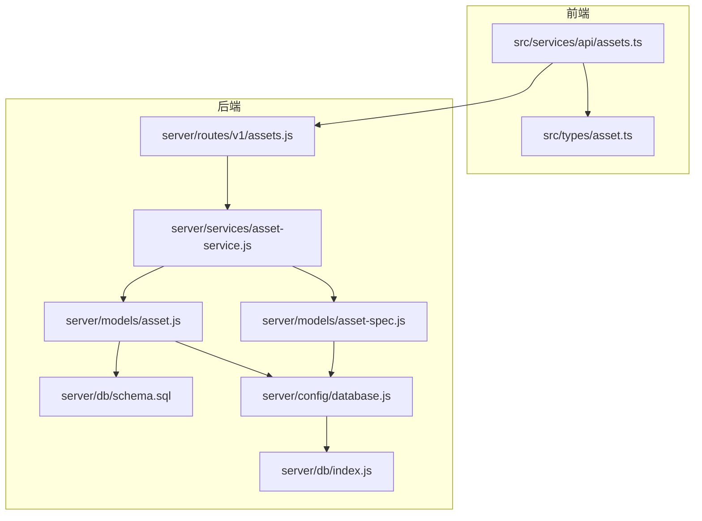
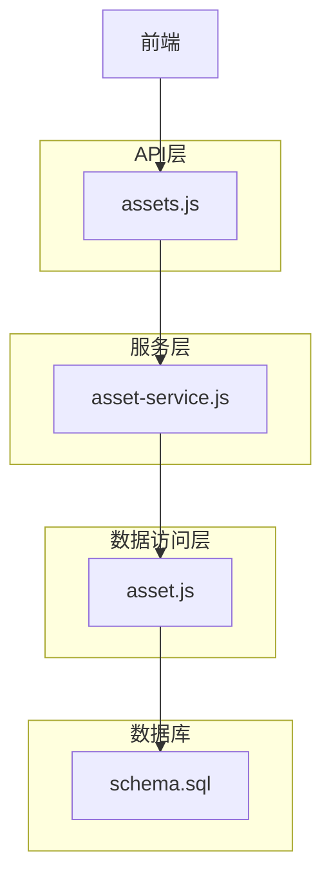
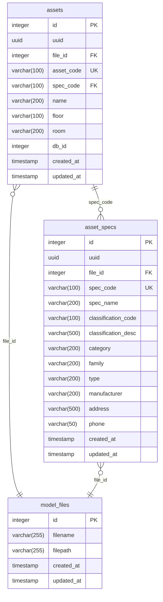
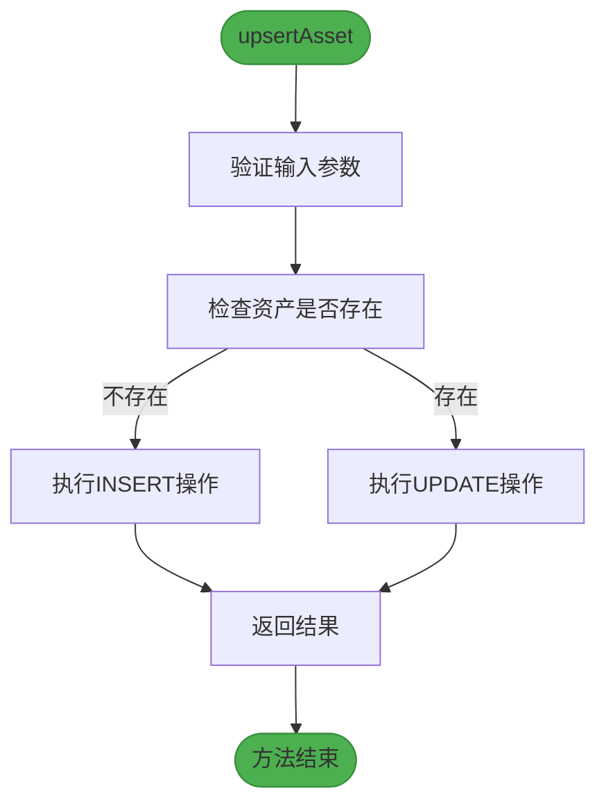
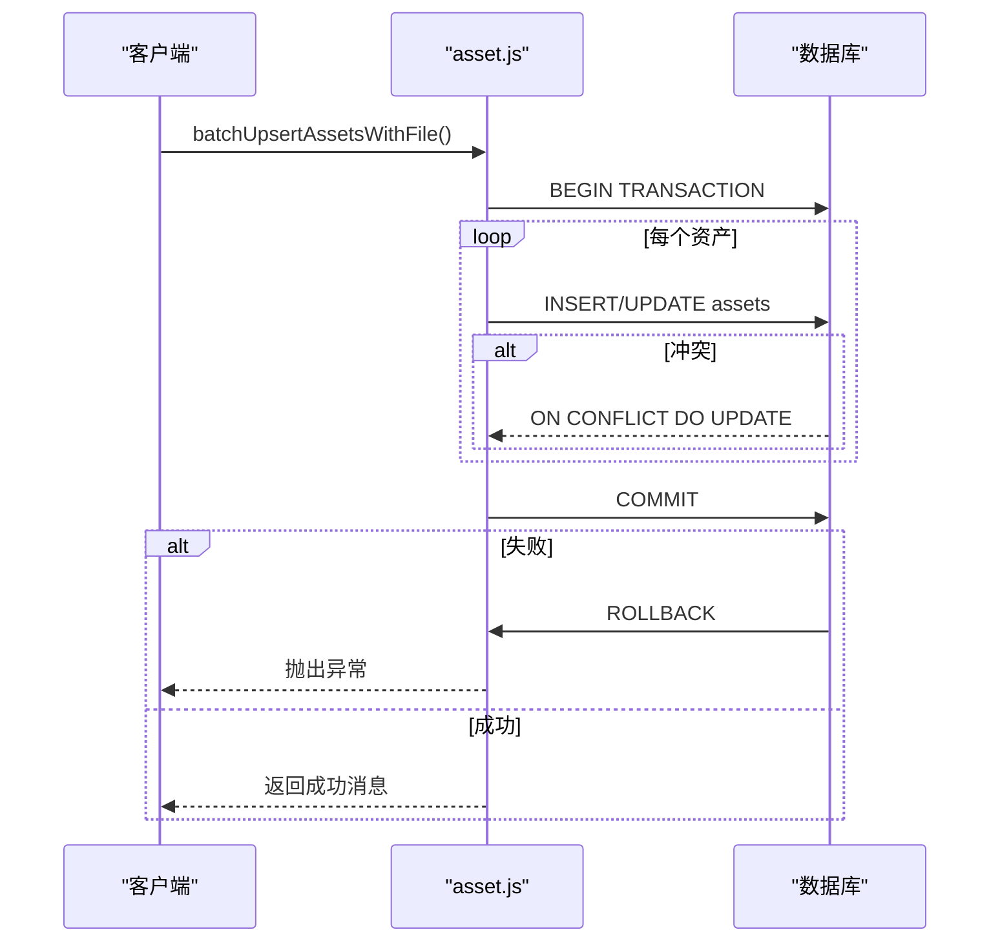
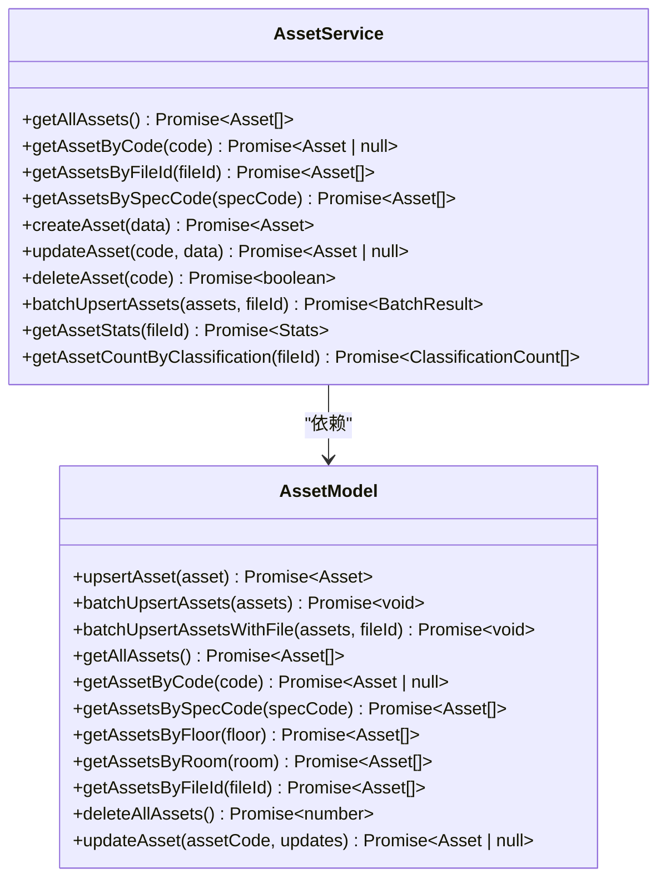
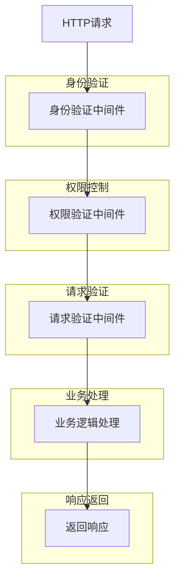
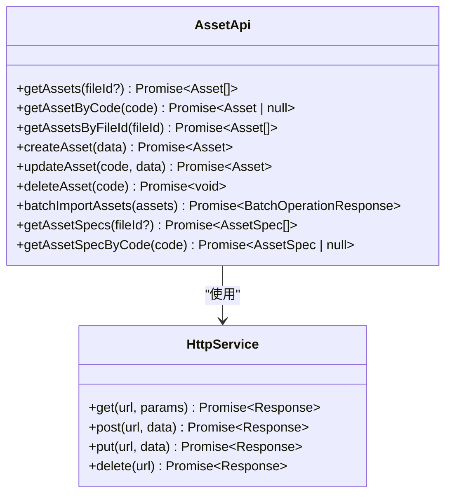
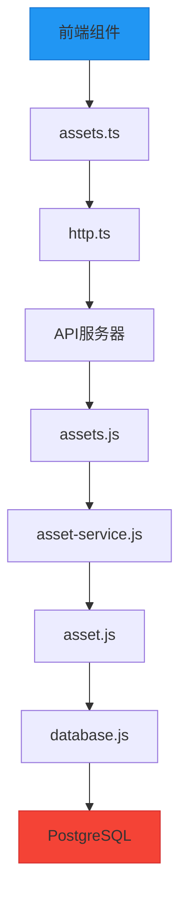

# 资产模型

<cite>
**本文档引用的文件**
- [schema.sql](file://server/db/schema.sql)
- [asset.js](file://server/models/asset.js)
- [asset-spec.js](file://server/models/asset-spec.js)
- [asset-service.js](file://server/services/asset-service.js)
- [assets.js](file://server/routes/v1/assets.js)
- [assets.ts](file://src/services/api/assets.ts)
- [asset.ts](file://src/types/asset.ts)
- [database.js](file://server/config/database.js)
- [index.js](file://server/db/index.js)
</cite>

## 目录
1. [引言](#引言)
2. [项目结构](#项目结构)
3. [核心组件](#核心组件)
4. [架构概述](#架构概述)
5. [详细组件分析](#详细组件分析)
6. [依赖分析](#依赖分析)
7. [性能考虑](#性能考虑)
8. [故障排除指南](#故障排除指南)
9. [结论](#结论)

## 引言
本文档全面描述了TwinSight平台中的资产模型，重点关注`assets`表及其对应的Sequelize模型实现。文档详细阐述了资产表的字段定义、业务含义、约束条件以及数据访问方法，包括资产的插入、更新、查询和批量操作。通过分析数据库表结构、数据访问层、服务层和API路由，展示了资产模型的完整实现逻辑。

## 项目结构
TwinSight平台的资产模型实现分布在多个目录中，形成了清晰的分层架构。核心实现位于`server`目录下，包括数据库模式定义、模型层、服务层和路由层。前端API调用位于`src`目录下，通过类型定义确保前后端数据一致性。

**图源**
- [assets.ts](file://src/services/api/assets.ts)
- [assets.js](file://server/routes/v1/assets.js)
- [asset-service.js](file://server/services/asset-service.js)
- [asset.js](file://server/models/asset.js)
- [asset-spec.js](file://server/models/asset-spec.js)
- [schema.sql](file://server/db/schema.sql)
- [database.js](file://server/config/database.js)
- [index.js](file://server/db/index.js)

**本节来源**
- [server/db/schema.sql](file://server/db/schema.sql)
- [server/models/asset.js](file://server/models/asset.js)
- [server/services/asset-service.js](file://server/services/asset-service.js)
- [server/routes/v1/assets.js](file://server/routes/v1/assets.js)
- [src/services/api/assets.ts](file://src/services/api/assets.ts)

## 核心组件
资产模型的核心组件包括数据库表`assets`、数据访问对象`asset.js`、服务层`asset-service.js`和API路由`assets.js`。这些组件共同实现了资产数据的持久化、业务逻辑处理和外部接口提供。

**本节来源**
- [schema.sql](file://server/db/schema.sql#L41-L54)
- [asset.js](file://server/models/asset.js#L1-L257)
- [asset-service.js](file://server/services/asset-service.js#L1-L216)
- [assets.js](file://server/routes/v1/assets.js#L1-L254)

## 架构概述
TwinSight平台的资产模型采用典型的分层架构，包括数据访问层、服务层和API层。这种分层设计实现了关注点分离，提高了代码的可维护性和可测试性。

**图源**
- [assets.js](file://server/routes/v1/assets.js)
- [asset-service.js](file://server/services/asset-service.js)
- [asset.js](file://server/models/asset.js)
- [schema.sql](file://server/db/schema.sql)

## 详细组件分析

### 资产表结构分析
资产表`assets`是TwinSight平台的核心数据表之一，用于存储资产构件的基本信息。表结构设计遵循规范化原则，通过外键关联实现数据完整性。

**图源**
- [schema.sql](file://server/db/schema.sql#L41-L54)

**本节来源**
- [schema.sql](file://server/db/schema.sql#L41-L54)

### 资产模型方法分析
资产模型`asset.js`提供了丰富的数据访问方法，支持资产的增删改查和批量操作。这些方法通过参数化查询防止SQL注入，确保数据安全。

#### 数据访问方法流程

**图源**
- [asset.js](file://server/models/asset.js#L11-L26)

#### 批量操作事务流程

**图源**
- [asset.js](file://server/models/asset.js#L163-L204)

**本节来源**
- [asset.js](file://server/models/asset.js#L11-L257)

### 资产服务层分析
资产服务层`asset-service.js`封装了资产相关的业务逻辑，提供了更高层次的API供控制器调用。服务层负责协调多个数据访问对象，实现复杂的业务操作。

**图源**
- [asset-service.js](file://server/services/asset-service.js#L1-L216)
- [asset.js](file://server/models/asset.js#L1-L257)

**本节来源**
- [asset-service.js](file://server/services/asset-service.js#L1-L216)

### API路由分析
API路由`assets.js`定义了资产相关的RESTful接口，通过中间件实现身份验证和权限控制。路由层将HTTP请求映射到服务层方法，实现了前后端的解耦。

**图源**
- [assets.js](file://server/routes/v1/assets.js#L1-L254)

**本节来源**
- [assets.js](file://server/routes/v1/assets.js#L1-L254)

### 前端API分析
前端API`assets.ts`提供了类型安全的资产操作接口，通过HTTP客户端与后端API通信。类型定义确保了前后端数据结构的一致性。

**图源**
- [assets.ts](file://src/services/api/assets.ts#L1-L108)
- [http.js](file://src/services/http.ts)

**本节来源**
- [assets.ts](file://src/services/api/assets.ts#L1-L108)
- [asset.ts](file://src/types/asset.ts#L1-L65)

## 依赖分析
资产模型的实现依赖于多个核心组件，包括数据库连接池、数据访问层、服务层和API层。这些组件之间存在明确的依赖关系，形成了清晰的调用链。

**图源**
- [assets.ts](file://src/services/api/assets.ts)
- [assets.js](file://server/routes/v1/assets.js)
- [asset-service.js](file://server/services/asset-service.js)
- [asset.js](file://server/models/asset.js)
- [database.js](file://server/config/database.js)

**本节来源**
- [assets.ts](file://src/services/api/assets.ts)
- [assets.js](file://server/routes/v1/assets.js)
- [asset-service.js](file://server/services/asset-service.js)
- [asset.js](file://server/models/asset.js)
- [database.js](file://server/config/database.js)

## 性能考虑
资产模型的性能优化主要体现在数据库索引设计、批量操作事务处理和查询优化三个方面。

### 数据库索引
数据库为资产表创建了多个索引，以提高查询性能：
- `idx_assets_spec_code`：基于`spec_code`字段的索引，优化按规格编码查询的性能
- `idx_assets_floor`：基于`floor`字段的索引，优化按楼层查询的性能
- `idx_assets_room`：基于`room`字段的索引，优化按房间查询的性能
- `idx_assets_db_id`：基于`db_id`字段的索引，优化在Viewer中通过dbId关联的性能
- `idx_assets_uuid`：基于`uuid`字段的唯一索引，确保UUID的唯一性

### 批量操作优化
批量操作通过事务处理机制确保数据一致性，同时通过单个事务包含多个操作来减少数据库连接开销。`batchUpsertAssetsWithFile`方法使用`ON CONFLICT`子句实现upsert操作，避免了先查询后插入/更新的额外开销。

### 查询优化
查询操作通过LEFT JOIN关联资产规格表，一次性获取资产及其规格信息，减少了多次查询的开销。同时，查询结果按`asset_code`排序，提高了数据展示的一致性。

**本节来源**
- [schema.sql](file://server/db/schema.sql#L91-L96)
- [asset.js](file://server/models/asset.js#L163-L204)
- [asset-service.js](file://server/services/asset-service.js#L10-L21)

## 故障排除指南
### 常见问题
1. **资产插入失败**：检查`file_id`是否有效，确保关联的模型文件存在
2. **批量操作超时**：减少批量操作的数据量，或优化数据库性能
3. **查询结果为空**：检查查询条件是否正确，特别是`file_id`和`spec_code`的值
4. **权限错误**：确保用户具有相应的资产操作权限

### 调试建议
1. 启用数据库查询日志，检查生成的SQL语句是否正确
2. 使用PostgreSQL的`EXPLAIN`命令分析查询执行计划
3. 检查数据库连接池配置，确保连接数足够
4. 验证前端传递的参数是否符合预期格式

**本节来源**
- [asset.js](file://server/models/asset.js)
- [asset-service.js](file://server/services/asset-service.js)
- [assets.js](file://server/routes/v1/assets.js)

## 结论
TwinSight平台的资产模型通过清晰的分层架构和规范的实现方式，提供了可靠的资产数据管理功能。从数据库表结构到前端API调用，每个层次都经过精心设计，确保了系统的可维护性和扩展性。通过合理的索引设计和批量操作优化，模型在处理大量资产数据时仍能保持良好的性能。未来可以考虑引入缓存机制进一步提升查询性能，或扩展资产属性的动态配置能力以支持更复杂的业务场景。