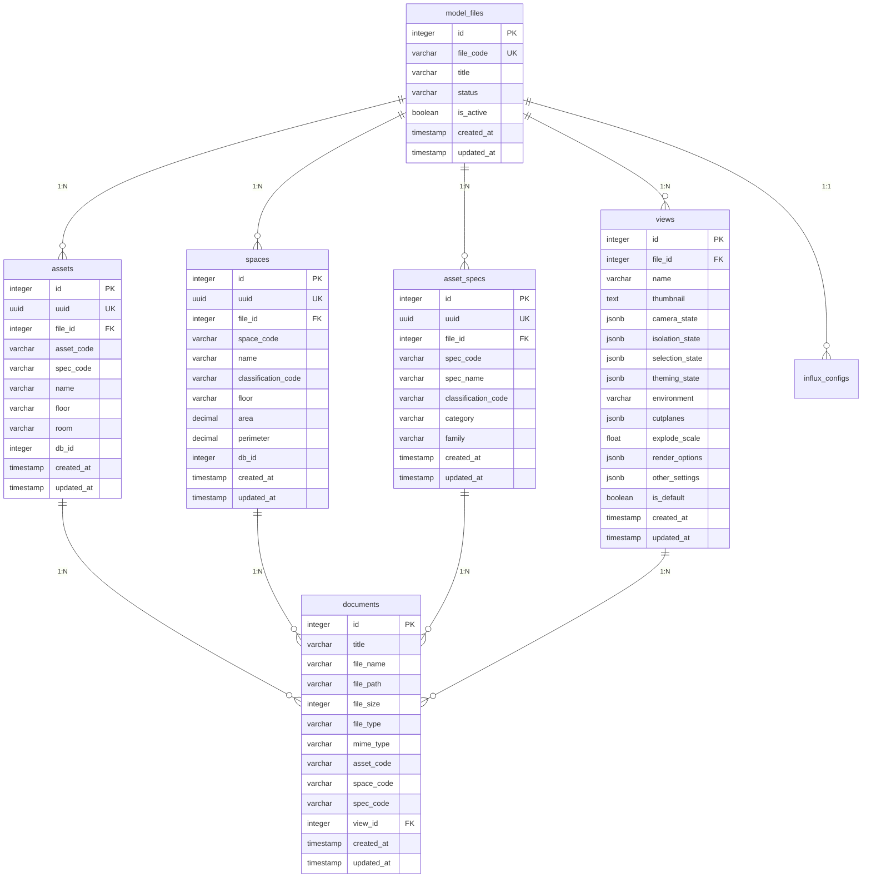

# 索引与性能优化

<cite>
**本文档引用的文件**
- [schema.sql](file://server/db/schema.sql)
- [schema-v2.sql](file://server/db/schema-v2.sql)
- [create_documents_table.sql](file://server/db/create_documents_table.sql)
- [create_views_table.sql](file://server/db/create_views_table.sql)
- [init-all.sql](file://server/db/init-all.sql)
- [asset.js](file://server/models/asset.js)
- [document.js](file://server/models/document.js)
- [space.js](file://server/models/space.js)
- [index.js](file://server/db/index.js)
- [database.js](file://server/config/database.js)
</cite>

## 目录
1. [引言](#引言)
2. [数据库索引概览](#数据库索引概览)
3. [核心表索引分析](#核心表索引分析)
4. [复合索引与查询优化](#复合索引与查询优化)
5. [高并发场景下的性能考量](#高并发场景下的性能考量)
6. [性能监控与调优建议](#性能监控与调优建议)
7. [实际业务场景优化案例](#实际业务场景优化案例)
8. [结论](#结论)

## 引言
TwinSight系统是一个集成BIM模型、资产管理和时序数据的数字孪生平台。随着数据量的增长，数据库查询性能成为系统稳定性的关键因素。本文档基于`schema.sql`和`schema-v2.sql`等数据库定义文件，全面分析系统中的索引设计策略，探讨其对查询性能的影响，并提供在高并发IoT数据写入与查询场景下的性能优化建议。

**Section sources**
- [schema.sql](file://server/db/schema.sql#L1-L202)
- [schema-v2.sql](file://server/db/schema-v2.sql#L1-L70)

## 数据库索引概览
TwinSight系统的数据库索引设计遵循了以查询模式为导向的原则，旨在加速高频查询路径。索引主要分为单列索引和复合索引两大类，覆盖了资产、空间、文档等核心实体的常用查询字段。

通过对`schema.sql`、`schema-v2.sql`和`init-all.sql`文件的分析，我们识别出系统中定义的所有索引。这些索引不仅提升了数据检索速度，还通过唯一性约束保证了数据完整性。

**Diagram sources**
- [schema-v2.sql](file://server/db/schema-v2.sql#L6-L70)
- [create_documents_table.sql](file://server/db/create_documents_table.sql#L4-L30)
- [create_views_table.sql](file://server/db/create_views_table.sql#L4-L26)

**Section sources**
- [schema.sql](file://server/db/schema.sql#L75-L102)
- [schema-v2.sql](file://server/db/schema-v2.sql#L22-L70)
- [init-all.sql](file://server/db/init-all.sql#L34-L383)

## 核心表索引分析
本节详细分析TwinSight系统中核心数据表的索引设计，解释每个索引的设计理由及其对查询性能的影响。

### 资产表 (assets) 索引
资产表是系统中最核心的实体之一，存储了所有设备和构件的信息。其索引设计直接关系到资产列表、筛选和详情查询的性能。

- **idx_assets_spec_code**: 在`spec_code`字段上创建的单列索引。设计理由是支持根据资产规格（类型）进行快速过滤，例如“查找所有风机盘管”。该索引显著提升了`getAssetsBySpecCode`方法的性能。
- **idx_assets_floor** 和 **idx_assets_room**: 分别在`floor`和`room`字段上创建的单列索引。设计理由是支持基于物理位置的查询，如“查找三楼的所有资产”。这些索引对于空间导航和区域管理功能至关重要。
- **idx_assets_db_id**: 在`db_id`字段上创建的索引。设计理由是支持与Forge Viewer的双向关联，通过`db_id`快速定位到模型中的具体构件。
- **idx_assets_uuid**: 在`uuid`字段上创建的唯一索引。设计理由是提供一个全局唯一的、不可变的标识符，用于API暴露和外部系统集成，避免使用易变的业务编码。

**Section sources**
- [schema.sql](file://server/db/schema.sql#L91-L95)
- [asset.js](file://server/models/asset.js#L94-L134)

### 空间表 (spaces) 索引
空间表存储了建筑中所有房间和区域的信息，其索引设计支持基于分类和位置的查询。

- **idx_spaces_classification**: 在`classification_code`字段上创建的索引。设计理由是支持根据OmniClass等分类标准进行资产和空间的聚合查询，例如“统计所有办公室的面积”。
- **idx_spaces_floor**: 在`floor`字段上创建的索引。设计理由与资产表类似，支持按楼层进行空间筛选和导航。
- **idx_spaces_db_id**: 在`db_id`字段上创建的索引。设计理由是支持与3D模型的关联，实现空间在Viewer中的高亮和定位。
- **idx_spaces_uuid**: 在`uuid`字段上创建的唯一索引。设计理由是提供全局唯一标识，用于稳定的数据引用。

**Section sources**
- [schema.sql](file://server/db/schema.sql#L98-L101)
- [space.js](file://server/models/space.js#L103-L107)

### 文档表 (documents) 索引
文档表实现了与资产、空间、规格等实体的关联，其索引设计是实现高效文档检索的关键。

- **idx_documents_asset**, **idx_documents_space**, **idx_documents_spec**: 这三个索引分别在`asset_code`、`space_code`和`spec_code`字段上创建。设计理由是支持根据关联对象快速检索文档。例如，当用户在资产详情页查看相关文档时，系统通过`idx_documents_asset`索引能迅速返回结果。这是典型的“多对一”关系查询优化。
- **idx_documents_created**: 在`created_at`字段上创建的降序索引。设计理由是优化“最新文档”列表的查询性能。由于新文档通常排在前面，降序索引可以避免额外的排序操作。

**Section sources**
- [create_documents_table.sql](file://server/db/create_documents_table.sql#L32-L36)
- [document.js](file://server/models/document.js#L12-L37)

### 模型文件表 (model_files) 索引
在`schema-v2.sql`中引入的`model_files`表是多模型管理的基础，其索引支持文件状态和激活状态的快速查询。

- **idx_model_files_status**: 在`status`字段上创建的索引。设计理由是支持后台任务快速筛选出处于特定状态（如"extracting"或"error"）的文件，以便进行状态更新或错误处理。
- **idx_model_files_active**: 在`is_active`字段上创建的索引。设计理由是支持快速查找当前系统激活的模型文件，这是系统启动和上下文切换的核心查询。

**Section sources**
- [schema-v2.sql](file://server/db/schema-v2.sql#L23-L24)

## 复合索引与查询优化
TwinSight系统虽然目前主要使用单列索引，但其表结构设计为复合索引的应用奠定了基础。复合索引能更高效地支持多条件联合查询。

### 潜在的复合索引场景
尽管在现有SQL文件中未显式创建复合索引，但根据业务逻辑和查询模式，以下场景是复合索引的理想候选：

- **`assets(spec_code, floor)`**: 用于“查找三楼的所有风机盘管”这类联合查询。相比使用两个单列索引再进行位图合并，复合索引能提供更优的性能。
- **`assets(floor, room)`**: 用于精确的物理位置定位，例如“查找A座3楼301室的所有资产”。

### 索引选择性分析
索引选择性（Cardinality）是衡量索引效率的关键指标。高选择性的字段（如`uuid`）创建的索引效率最高，而低选择性的字段（如`is_active`，通常只有true/false）则效率较低。

在TwinSight系统中：
- `uuid`字段具有最高的选择性，因此`idx_assets_uuid`等唯一索引是最高效的。
- `spec_code`和`classification_code`字段具有中等选择性，是良好的索引候选。
- `is_active`字段选择性极低，`idx_model_files_active`索引的效率可能不高。在数据量极大时，可能需要评估其维护开销是否值得。

## 高并发场景下的性能考量
TwinSight系统需要处理实时IoT数据的写入与查询，这对数据库性能提出了严峻挑战。索引设计必须在查询性能和写入开销之间取得平衡。

### 索引维护开销
每个索引都会增加INSERT、UPDATE和DELETE操作的开销，因为数据库必须同时更新索引结构。在高频率的IoT数据写入场景下，过多的索引会成为性能瓶颈。

**优化建议**:
- **避免过度索引**: 仅为核心查询路径创建索引。例如，如果`idx_assets_room`查询很少使用，应考虑删除以降低写入开销。
- **选择性优先**: 优先为高选择性的字段创建索引，确保每个索引都能带来显著的查询收益。
- **监控写入延迟**: 在生产环境中监控`assets`和`spaces`表的写入延迟，如果延迟过高，应审查索引策略。

### 写入优化策略
- **批量写入**: 如`asset.js`中的`batchUpsertAssetsWithFile`方法所示，使用批量插入（Batch Insert）而非逐条插入，可以显著减少事务开销和索引维护次数。
- **连接池配置**: 数据库连接池（`database.js`）配置了20个最大连接，这对于高并发场景是必要的，但需根据实际负载进行调优。

**Section sources**
- [asset.js](file://server/models/asset.js#L32-L61)
- [database.js](file://server/config/database.js#L11-L20)

## 性能监控与调优建议
持续的性能监控是确保数据库高效运行的关键。TwinSight系统应建立完善的性能调优流程。

### 使用`EXPLAIN ANALYZE`分析慢查询
`EXPLAIN ANALYZE`是PostgreSQL中最强大的性能分析工具。当发现某个API响应缓慢时，应立即使用此命令。

**操作步骤**:
1.  在数据库客户端执行 `EXPLAIN ANALYZE` + 慢查询的SQL语句。
2.  分析输出，重点关注：
    - **Seq Scan**: 表示全表扫描，通常意味着缺少合适的索引。
    - **Index Scan**: 表示使用了索引，是期望的结果。
    - **Execution Time**: 实际执行时间，用于量化性能提升。
3.  根据分析结果，创建缺失的索引或重构查询。

### 建立慢查询日志
建议在生产环境中开启PostgreSQL的慢查询日志（`log_min_duration_statement`），自动捕获执行时间超过阈值（如100ms）的查询，以便进行主动优化。

### 定期索引维护
- **监控索引使用率**: 使用`pg_stat_user_indexes`视图检查索引的`idx_scan`（索引扫描次数）。长期为0的索引是“死索引”，应被删除。
- **重建索引**: 对于频繁更新的表，索引可能会碎片化。定期使用`REINDEX`命令可以恢复性能。

## 实际业务场景优化案例
本节结合具体业务场景，展示如何应用索引优化策略。

### 场景一：大规模文档检索
**问题**: 当用户打开一个大型资产（如整栋楼）的文档列表时，加载缓慢。

**分析**: 查询`SELECT * FROM documents WHERE asset_code = $1 ORDER BY created_at DESC`可能涉及大量数据。

**优化方案**:
1.  确认`idx_documents_asset`和`idx_documents_created`索引存在且被使用。
2.  实现分页查询，避免一次性加载所有文档。例如，`LIMIT 20 OFFSET 0`。
3.  考虑创建一个覆盖索引（Covering Index）`CREATE INDEX idx_documents_asset_created ON documents(asset_code, created_at DESC) INCLUDE (title, file_name)`，使查询完全在索引中完成，无需回表。

### 场景二：资产列表分页
**问题**: 资产列表页面在应用多条件筛选后（如按规格和楼层），分页查询性能下降。

**分析**: `LIMIT`和`OFFSET`在大数据集上效率低下，因为数据库仍需扫描`OFFSET`之前的行。

**优化方案**:
1.  使用**游标分页**（Cursor-based Pagination）替代`OFFSET`分页。利用`created_at`或`id`作为游标，例如 `WHERE created_at < last_seen_created_at ORDER BY created_at DESC LIMIT 20`。
2.  确保有支持该查询的复合索引，如`CREATE INDEX idx_assets_created ON assets(created_at DESC)`。

## 结论
TwinSight系统的数据库索引设计整体合理，覆盖了主要的查询路径。通过`schema.sql`和`schema-v2.sql`文件，我们识别出了一系列单列索引，它们在提升资产、空间和文档的检索性能方面发挥了关键作用。

在高并发的IoT场景下，必须警惕索引带来的写入开销，避免过度索引。建议建立以`EXPLAIN ANALYZE`为核心的性能监控和调优流程，定期审查索引的使用情况。对于复杂的查询场景，应考虑引入复合索引和更高效的分页策略，以确保系统在数据量增长时仍能保持卓越的性能。