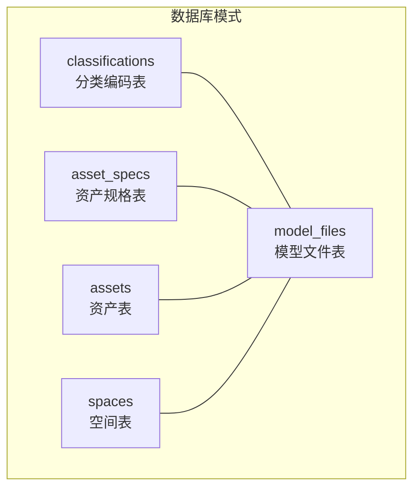
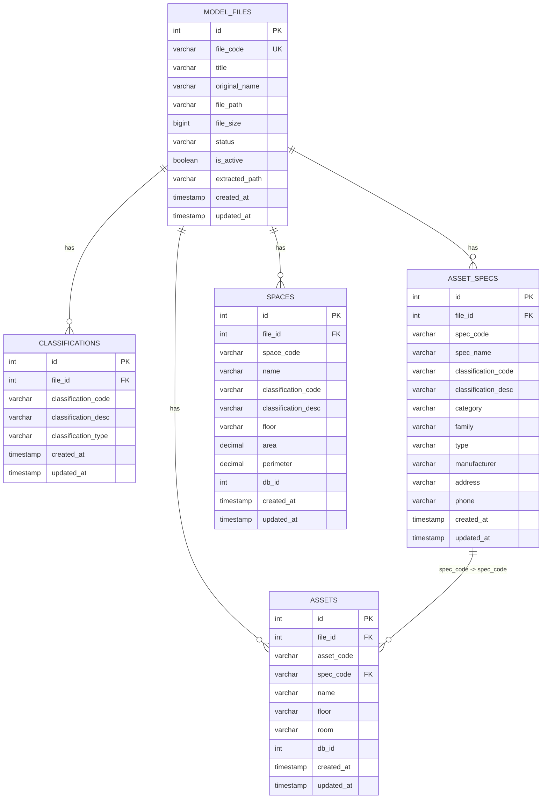
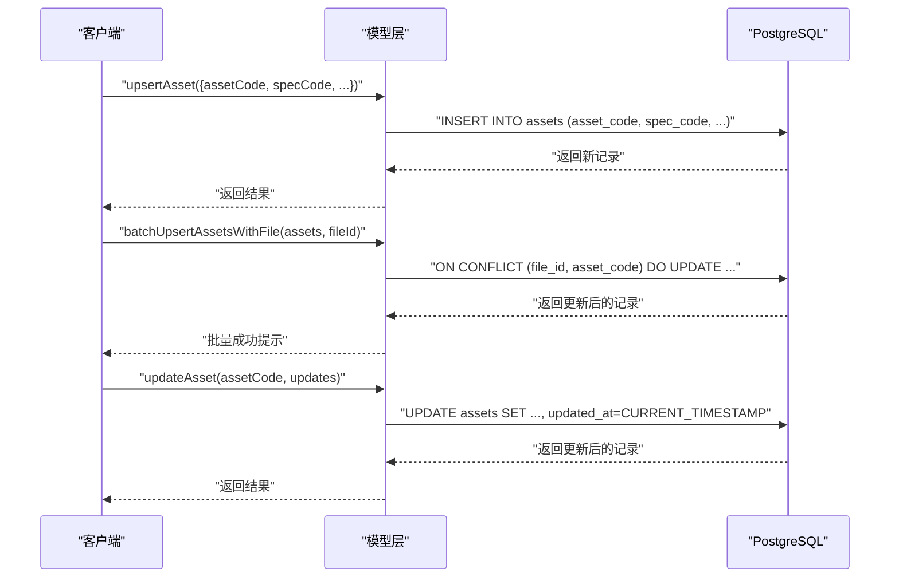
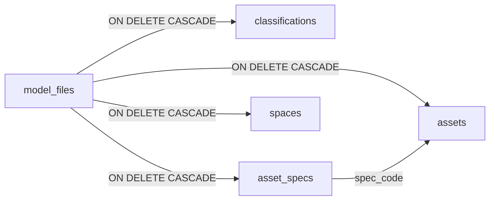

# 表结构

<cite>
**本文引用的文件**
- [server/db/schema.sql](file://server/db/schema.sql)
- [server/db/schema-v2.sql](file://server/db/schema-v2.sql)
- [server/db/migrations/add-file-id.sql](file://server/db/migrations/add-file-id.sql)
- [server/db/migrations/add-spec-name.sql](file://server/db/migrations/add-spec-name.sql)
- [server/db/fix-constraints.sql](file://server/db/fix-constraints.sql)
- [server/db/fix-file-constraints.sql](file://server/db/fix-file-constraints.sql)
- [server/db/create_documents_table.sql](file://server/db/create_documents_table.sql)
- [server/models/classification.js](file://server/models/classification.js)
- [server/models/asset-spec.js](file://server/models/asset-spec.js)
- [server/models/asset.js](file://server/models/asset.js)
- [server/models/space.js](file://server/models/space.js)
</cite>

## 目录
1. [简介](#简介)
2. [项目结构](#项目结构)
3. [核心组件](#核心组件)
4. [架构总览](#架构总览)
5. [详细组件分析](#详细组件分析)
6. [依赖关系分析](#依赖关系分析)
7. [性能考量](#性能考量)
8. [故障排查指南](#故障排查指南)
9. [结论](#结论)
10. [附录](#附录)

## 简介
本文件面向后端开发者，提供 PostgreSQL 数据库中四张核心表（classifications、asset_specs、assets、spaces）的权威数据字典。内容涵盖字段定义、数据类型、业务含义、默认值与约束（主键、外键、唯一性），并结合 schema.sql 与相关迁移脚本，解释：
- classification_code 与 classification_type 的联合唯一索引设计及其演进；
- file_id 外键级联删除机制；
- created_at 与 updated_at 时间戳的自动化管理策略；
- 各表之间的关联关系与查询优化建议。

## 项目结构
围绕“模型文件-构件数据”的数据模型，核心表结构由 schema.sql 定义，随后通过 schema-v2.sql 与多份迁移脚本引入 file_id 外键关联与唯一约束调整，最终形成以“文件维度隔离”的数据组织方式。

图表来源
- [server/db/schema.sql](file://server/db/schema.sql#L1-L160)
- [server/db/schema-v2.sql](file://server/db/schema-v2.sql#L1-L70)

章节来源
- [server/db/schema.sql](file://server/db/schema.sql#L1-L160)
- [server/db/schema-v2.sql](file://server/db/schema-v2.sql#L1-L70)

## 核心组件
本节给出四张核心表的字段清单、数据类型、业务含义、默认值与约束要点，并标注关键索引与触发器。

- classifications（分类编码表）
  - 字段与约束
    - id：整型，主键（SERIAL）
    - classification_code：字符串，非空；在 schema.sql 中与 classification_type 组成联合唯一索引
    - classification_desc：字符串，可空
    - classification_type：字符串，非空；取值范围为 'asset' 或 'space'
    - created_at：时间戳，默认当前时间
    - updated_at：时间戳，默认当前时间
    - 约束
      - 主键：id
      - 唯一性：(classification_code, classification_type)
      - 索引：idx_classifications_code、idx_classifications_type
      - 触发器：update_classifications_updated_at（自动更新 updated_at）
  - 业务含义
    - 记录资产与空间的 OmniClass 分类信息，支持按类型区分资产分类与空间分类。

- asset_specs（资产规格表）
  - 字段与约束
    - id：整型，主键（SERIAL）
    - file_id：整型，外键引用 model_files(id)，ON DELETE CASCADE；在 schema-v2.sql 与 add-file-id.sql 中新增
    - spec_code：字符串，非空；规格编码（类型注释）
    - spec_name：字符串，可空；规格名称（类型名称）
    - classification_code：字符串，可空；OmniClass 21 编号
    - classification_desc：字符串，可空；OmniClass 21 描述
    - category：字符串，可空
    - family：字符串，可空
    - type：字符串，可空
    - manufacturer：字符串，可空
    - address：字符串，可空
    - phone：字符串，可空
    - created_at：时间戳，默认当前时间
    - updated_at：时间戳，默认当前时间
    - 约束
      - 主键：id
      - 唯一性：(file_id, spec_code)（schema-v2.sql 与 add-file-id.sql）
      - 索引：idx_asset_specs_name、idx_asset_specs_classification、idx_asset_specs_category、idx_asset_specs_family、idx_asset_specs_file_id
      - 触发器：update_asset_specs_updated_at
  - 业务含义
    - 存储构件类型规格信息，支持按文件维度隔离；规格本身可跨文件共享，但入库时以 (file_id, spec_code) 唯一。

- assets（资产表）
  - 字段与约束
    - id：整型，主键（SERIAL）
    - file_id：整型，外键引用 model_files(id)，ON DELETE CASCADE；在 schema-v2.sql 与 add-file-id.sql 中新增
    - asset_code：字符串，非空；资产编码（MC 编码），在 schema-v2.sql 与 add-file-id.sql 中与 file_id 组成唯一索引
    - spec_code：字符串，可空；外键引用 asset_specs(spec_code)
    - name：字符串，可空；资产名称（标识分组下）
    - floor：字符串，可空；楼层
    - room：字符串，可空；房间（房间分组下）
    - db_id：整型，可空；Viewer 中的 dbId，用于关联
    - created_at：时间戳，默认当前时间
    - updated_at：时间戳，默认当前时间
    - 约束
      - 主键：id
      - 唯一性：(file_id, asset_code)（schema-v2.sql 与 add-file-id.sql）
      - 索引：idx_assets_spec_code、idx_assets_floor、idx_assets_room、idx_assets_db_id、idx_assets_file_id
      - 触发器：update_assets_updated_at
  - 业务含义
    - 存储资产构件的基本信息，支持按文件维度隔离；与资产规格表通过 spec_code 关联。

- spaces（空间表）
  - 字段与约束
    - id：整型，主键（SERIAL）
    - file_id：整型，外键引用 model_files(id)，ON DELETE CASCADE；在 schema-v2.sql 与 add-file-id.sql 中新增
    - space_code：字符串，非空；空间编码（编号），在 schema-v2.sql 与 add-file-id.sql 中与 file_id 组成唯一索引
    - name：字符串，可空；空间名称
    - classification_code：字符串，可空；Classification.Space.Number
    - classification_desc：字符串，可空；Classification.Space.Description
    - floor：字符串，可空；楼层（标高）
    - area：数值，可空；面积
    - perimeter：数值，可空；周长
    - db_id：整型，可空；Viewer 中的 dbId，用于关联
    - created_at：时间戳，默认当前时间
    - updated_at：时间戳，默认当前时间
    - 约束
      - 主键：id
      - 唯一性：(file_id, space_code)（schema-v2.sql 与 add-file-id.sql）
      - 索引：idx_spaces_classification、idx_spaces_floor、idx_spaces_db_id、idx_spaces_file_id
      - 触发器：update_spaces_updated_at
  - 业务含义
    - 存储房间构件的基本信息，支持按文件维度隔离；与分类表通过 classification_code 关联。

章节来源
- [server/db/schema.sql](file://server/db/schema.sql#L1-L160)
- [server/db/schema-v2.sql](file://server/db/schema-v2.sql#L1-L70)
- [server/db/migrations/add-file-id.sql](file://server/db/migrations/add-file-id.sql#L1-L51)
- [server/db/migrations/add-spec-name.sql](file://server/db/migrations/add-spec-name.sql#L1-L12)

## 架构总览
下图展示核心表之间的关系与外键约束，以及 file_id 引入后按文件维度隔离的设计思路。

图表来源
- [server/db/schema.sql](file://server/db/schema.sql#L1-L160)
- [server/db/schema-v2.sql](file://server/db/schema-v2.sql#L1-L70)
- [server/db/migrations/add-file-id.sql](file://server/db/migrations/add-file-id.sql#L1-L51)

## 详细组件分析

### classifications 表
- 字段与约束
  - 主键：id
  - 唯一性：(classification_code, classification_type)（schema.sql）
  - 索引：idx_classifications_code、idx_classifications_type
  - 触发器：update_classifications_updated_at（自动更新 updated_at）
- 业务含义
  - 记录资产与空间的 OmniClass 分类信息，支持按类型区分资产分类与空间分类。
- 设计要点
  - 联合唯一索引用于确保同一分类类型下编码唯一，避免重复定义。
  - 通过触发器统一维护 updated_at，保证审计一致性。

章节来源
- [server/db/schema.sql](file://server/db/schema.sql#L1-L160)

### asset_specs 表
- 字段与约束
  - 主键：id
  - 唯一性：(file_id, spec_code)（schema-v2.sql 与 add-file-id.sql）
  - 索引：idx_asset_specs_name、idx_asset_specs_classification、idx_asset_specs_category、idx_asset_specs_family、idx_asset_specs_file_id
  - 触发器：update_asset_specs_updated_at
- 业务含义
  - 存储构件类型规格信息，支持按文件维度隔离；规格本身可跨文件共享，但入库时以 (file_id, spec_code) 唯一。
- 设计要点
  - 新增 file_id 外键与组合唯一索引，实现“文件内规格唯一”。
  - 保留 spec_name 字段与索引，便于按类型名称检索。

章节来源
- [server/db/schema-v2.sql](file://server/db/schema-v2.sql#L1-L70)
- [server/db/migrations/add-file-id.sql](file://server/db/migrations/add-file-id.sql#L1-L51)
- [server/db/migrations/add-spec-name.sql](file://server/db/migrations/add-spec-name.sql#L1-L12)

### assets 表
- 字段与约束
  - 主键：id
  - 唯一性：(file_id, asset_code)（schema-v2.sql 与 add-file-id.sql）
  - 索引：idx_assets_spec_code、idx_assets_floor、idx_assets_room、idx_assets_db_id、idx_assets_file_id
  - 触发器：update_assets_updated_at
- 业务含义
  - 存储资产构件的基本信息，支持按文件维度隔离；与资产规格表通过 spec_code 关联。
- 设计要点
  - 新增 file_id 外键与组合唯一索引，实现“文件内资产编码唯一”。
  - 与资产规格表通过 spec_code 建立弱外键关系（应用层保证一致性）。

章节来源
- [server/db/schema-v2.sql](file://server/db/schema-v2.sql#L1-L70)
- [server/db/migrations/add-file-id.sql](file://server/db/migrations/add-file-id.sql#L1-L51)

### spaces 表
- 字段与约束
  - 主键：id
  - 唯一性：(file_id, space_code)（schema-v2.sql 与 add-file-id.sql）
  - 索引：idx_spaces_classification、idx_spaces_floor、idx_spaces_db_id、idx_spaces_file_id
  - 触发器：update_spaces_updated_at
- 业务含义
  - 存储房间构件的基本信息，支持按文件维度隔离；与分类表通过 classification_code 关联。
- 设计要点
  - 新增 file_id 外键与组合唯一索引，实现“文件内空间编码唯一”。

章节来源
- [server/db/schema-v2.sql](file://server/db/schema-v2.sql#L1-L70)
- [server/db/migrations/add-file-id.sql](file://server/db/migrations/add-file-id.sql#L1-L51)

### 时间戳自动化与级联删除机制
- 自动化时间戳
  - 通过 update_updated_at_column 函数与各表的触发器，实现 updated_at 的自动更新。
- file_id 外键级联删除
  - classifications、asset_specs、assets、spaces 四表均新增 file_id 外键，引用 model_files(id)，ON DELETE CASCADE。
  - 删除模型文件会级联删除其关联的所有分类、规格、资产与空间记录，保障数据一致性。

章节来源
- [server/db/schema.sql](file://server/db/schema.sql#L98-L133)
- [server/db/schema-v2.sql](file://server/db/schema-v2.sql#L44-L54)
- [server/db/migrations/add-file-id.sql](file://server/db/migrations/add-file-id.sql#L1-L15)

### 唯一索引设计演进与兼容性
- 历史版本
  - schema.sql 定义了 (classification_code, classification_type) 的联合唯一索引。
- 迁移后版本
  - schema-v2.sql 与 add-file-id.sql 将唯一性从“全局唯一”调整为“文件内唯一”，即 (file_id, code) 组合唯一。
  - 通过 fix-constraints.sql 与 fix-file-constraints.sql 提供回退与修复脚本，确保约束的一致性与可重复执行。

章节来源
- [server/db/schema.sql](file://server/db/schema.sql#L1-L160)
- [server/db/schema-v2.sql](file://server/db/schema-v2.sql#L56-L70)
- [server/db/migrations/add-file-id.sql](file://server/db/migrations/add-file-id.sql#L16-L39)
- [server/db/fix-constraints.sql](file://server/db/fix-constraints.sql#L1-L33)
- [server/db/fix-file-constraints.sql](file://server/db/fix-file-constraints.sql#L1-L67)

### 查询与更新流程（示例）
以下序列图展示后端模型层如何与数据库交互，体现唯一索引与触发器的作用。

图表来源
- [server/models/asset.js](file://server/models/asset.js#L160-L200)
- [server/db/schema.sql](file://server/db/schema.sql#L98-L133)

章节来源
- [server/models/asset.js](file://server/models/asset.js#L160-L200)
- [server/db/schema.sql](file://server/db/schema.sql#L98-L133)

## 依赖关系分析
- 外键依赖
  - assets.spec_code → asset_specs.spec_code（弱外键，应用层保证一致性）
  - assets.file_id → model_files.id（ON DELETE CASCADE）
  - spaces.file_id → model_files.id（ON DELETE CASCADE）
  - asset_specs.file_id → model_files.id（ON DELETE CASCADE）
  - classifications.file_id → model_files.id（ON DELETE CASCADE）
- 约束与索引
  - (file_id, asset_code)、(file_id, space_code)、(file_id, spec_code)、(file_id, classification_code) 为组合唯一键
  - 各表均建立常用查询字段索引，提升检索效率
- 触发器
  - update_updated_at_column 在各表更新前自动设置 updated_at

图表来源
- [server/db/schema-v2.sql](file://server/db/schema-v2.sql#L44-L54)
- [server/db/migrations/add-file-id.sql](file://server/db/migrations/add-file-id.sql#L1-L15)

章节来源
- [server/db/schema-v2.sql](file://server/db/schema-v2.sql#L44-L54)
- [server/db/migrations/add-file-id.sql](file://server/db/migrations/add-file-id.sql#L1-L15)

## 性能考量
- 索引策略
  - 分类表：按 classification_code 与 classification_type 建立索引，加速分类查询。
  - 资产规格表：按 spec_name、classification_code、category、family 建立索引，满足多维检索。
  - 资产表：按 spec_code、floor、room、db_id 建立索引，覆盖常见筛选场景。
  - 空间表：按 classification_code、floor、db_id 建立索引，提升空间检索效率。
- file_id 维度隔离
  - 通过 (file_id, code) 组合唯一索引，避免跨文件重复编码导致的冲突，同时利于按文件快速清理与迁移。
- 触发器开销
  - 每次更新都会触发触发器设置 updated_at，属于轻量操作，建议在批量导入时考虑事务包裹以减少锁竞争。

[本节为通用性能建议，不直接分析具体文件]

## 故障排查指南
- 唯一约束冲突
  - 现象：插入或更新时报唯一约束冲突。
  - 排查：确认是否在同一 file_id 下重复提交相同的 asset_code/space_code/spec_code；或是否误用历史版本的全局唯一约束。
  - 参考脚本：fix-constraints.sql、fix-file-constraints.sql
- 外键引用问题
  - 现象：删除 model_files 记录时报外键约束错误。
  - 排查：确认是否正确添加 file_id 外键与 ON DELETE CASCADE；检查迁移脚本是否执行成功。
  - 参考脚本：add-file-id.sql、add_mapping_config_fk.sql（映射配置表外键）
- 时间戳未更新
  - 现象：更新记录后 updated_at 未变化。
  - 排查：确认触发器 update_updated_at_column 是否存在且已绑定到各表；检查权限与函数定义。
- 文档关联一致性
  - 现象：documents 表无法通过外键约束保证一致性。
  - 说明：documents 采用“三选一”关联字段，不使用外键约束，需在应用层保证数据一致性。
  - 参考表：create_documents_table.sql

章节来源
- [server/db/fix-constraints.sql](file://server/db/fix-constraints.sql#L1-L33)
- [server/db/fix-file-constraints.sql](file://server/db/fix-file-constraints.sql#L1-L67)
- [server/db/migrations/add-file-id.sql](file://server/db/migrations/add-file-id.sql#L1-L15)
- [server/db/migrations/add_mapping_config_fk.sql](file://server/db/migrations/add_mapping_config_fk.sql#L1-L26)
- [server/db/create_documents_table.sql](file://server/db/create_documents_table.sql#L1-L49)

## 结论
- 通过引入 file_id 与组合唯一索引，实现了“文件维度隔离”的数据模型，既保证了跨文件重复编码的安全性，又简化了数据清理与迁移。
- classification_code 与 classification_type 的联合唯一索引在 schema.sql 中定义，后续迁移将其演进为 (file_id, classification_code)，以适配多文件场景。
- updated_at 的自动化管理通过触发器实现，确保审计字段的一致性。
- 建议在批量导入与更新时使用事务包裹，配合索引与触发器，获得更好的性能与可靠性。

[本节为总结性内容，不直接分析具体文件]

## 附录
- 关键 SQL 定义与迁移脚本路径
  - 核心模式：server/db/schema.sql
  - 模型文件与外键迁移：server/db/schema-v2.sql、server/db/migrations/add-file-id.sql
  - 规格名称字段迁移：server/db/migrations/add-spec-name.sql
  - 约束修复脚本：server/db/fix-constraints.sql、server/db/fix-file-constraints.sql
  - 文档表定义：server/db/create_documents_table.sql
- 关键模型方法（路径）
  - 分类：server/models/classification.js
  - 资产规格：server/models/asset-spec.js
  - 资产：server/models/asset.js
  - 空间：server/models/space.js

[本节为参考清单，不直接分析具体文件]