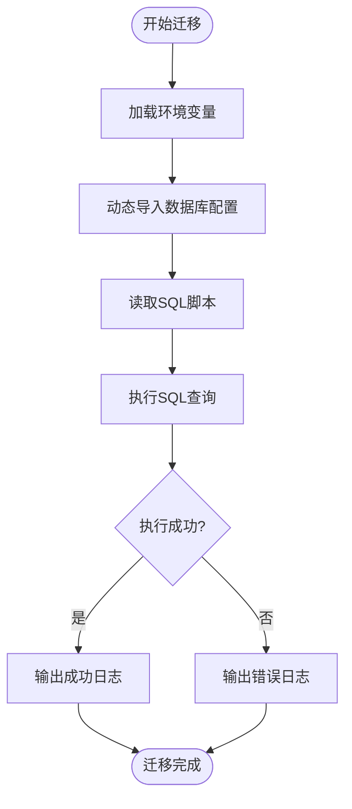
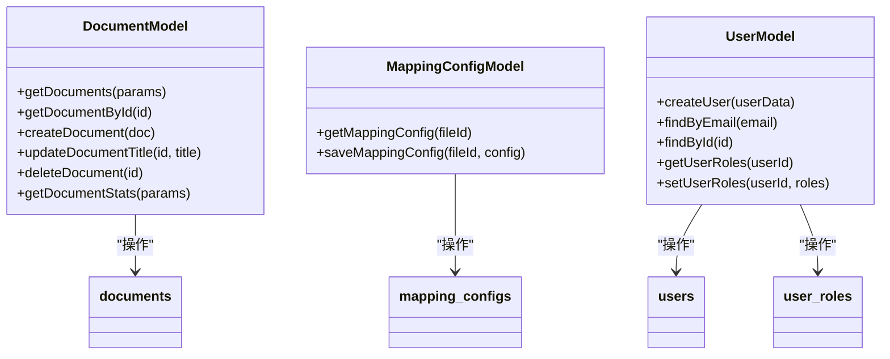

# 模式迁移

<cite>
**本文档引用的文件**   
- [add-file-id.sql](file://server/db/migrations/add-file-id.sql)
- [add-spec-name.sql](file://server/db/migrations/add-spec-name.sql)
- [create_mapping_config.sql](file://server/db/migrations/create_mapping_config.sql)
- [add_mapping_config_fk.sql](file://server/db/migrations/add_mapping_config_fk.sql)
- [extend_field_lengths.sql](file://server/db/migrations/extend_field_lengths.sql)
- [create-auth-tables.sql](file://server/db/migrations/create-auth-tables.sql)
- [run-migration.js](file://server/run-migration.js)
- [database.js](file://server/config/database.js)
- [document.js](file://server/models/document.js)
- [mapping-config.js](file://server/models/mapping-config.js)
- [user.js](file://server/models/user.js)
- [init-all.sql](file://server/db/init-all.sql)
</cite>

## 目录
1. [引言](#引言)
2. [核心迁移脚本分析](#核心迁移脚本分析)
3. [迁移执行机制](#迁移执行机制)
4. [模式版本控制策略](#模式版本控制策略)
5. [ORM层与迁移协同](#orm层与迁移协同)
6. [常见问题与解决方案](#常见问题与解决方案)
7. [结论](#结论)

## 引言
TwinSight项目通过一系列SQL迁移脚本实现了数据库模式的演进，支持云存储文件关联、资产规格命名、数据导出结构化、权限系统等核心功能。这些迁移脚本确保了数据库结构的持续演进与数据完整性。

## 核心迁移脚本分析

### add-file-id.sql：支持云存储文件关联
该脚本为`asset_specs`、`assets`、`spaces`、`classifications`等核心数据表添加`file_id`字段，建立与`model_files`表的外键关联，实现按文件区分数据。同时调整了唯一约束，将`asset_code`等字段的唯一性约束改为与`file_id`组合唯一，确保跨文件数据隔离。

**Section sources**
- [add-file-id.sql](file://server/db/migrations/add-file-id.sql)

### add-spec-name.sql：支持资产规格命名
为`asset_specs`表添加`spec_name`字段，用于存储构件的类型名称属性。该字段扩展了资产规格的描述能力，支持更丰富的资产信息管理。同时创建了索引以提高基于规格名称的查询性能。

**Section sources**
- [add-spec-name.sql](file://server/db/migrations/add-spec-name.sql)

### create_mapping_config.sql：支持数据导出结构化
创建`mapping_configs`表，用于存储模型文件的字段映射配置。该表支持`asset`、`asset_spec`、`space`三种配置类型，通过`field_name`、`category`、`property`等字段定义数据导出的结构化映射关系，为数据集成提供灵活性。

**Section sources**
- [create_mapping_config.sql](file://server/db/migrations/create_mapping_config.sql)

### add_mapping_config_fk.sql：确保数据完整性
为`mapping_configs`表添加外键约束，关联到`model_files`表。通过`ON DELETE CASCADE`级联删除策略，确保当模型文件被删除时，其相关的映射配置也被自动清理，维护数据一致性。

**Section sources**
- [add_mapping_config_fk.sql](file://server/db/migrations/add_mapping_config_fk.sql)

### extend_field_lengths.sql：适应更长描述内容
扩展多个文本字段的长度，包括`asset_code`、`spec_code`、`name`等字段从200-500字符不等。这一变更适应了实际业务中更长的编码和描述需求，避免了数据截断问题。

**Section sources**
- [extend_field_lengths.sql](file://server/db/migrations/extend_field_lengths.sql)

### create-auth-tables.sql：支撑RBAC权限系统
创建用户认证相关表，包括`users`（用户主表）、`user_roles`（用户角色关联表）、`user_identities`（第三方身份关联表）和`refresh_tokens`（刷新令牌表）。通过角色多对多关联实现基于角色的访问控制（RBAC），并预置管理员账户。

**Section sources**
- [create-auth-tables.sql](file://server/db/migrations/create-auth-tables.sql)

## 迁移执行机制

### run-migration.js：统一执行与事务性
`run-migration.js`脚本负责统一执行数据库迁移。它首先加载环境变量，然后动态导入数据库配置，执行指定的SQL脚本。通过`query`函数执行SQL，并在成功时输出"✅ 数据库迁移成功！"，失败时捕获错误并退出。该机制确保了迁移的原子性和可追溯性。

**Diagram sources**
- [run-migration.js](file://server/run-migration.js#L1-L39)

**Section sources**
- [run-migration.js](file://server/run-migration.js#L1-L39)
- [database.js](file://server/config/database.js#L1-L74)

## 模式版本控制策略

### 命名规范与依赖顺序
迁移脚本采用语义化命名，如`add-file-id.sql`、`create-auth-tables.sql`，清晰表达变更意图。脚本按依赖顺序执行：先创建基础表，再添加外键约束。例如，`create_mapping_config.sql`先创建表，`add_mapping_config_fk.sql`后添加外键，确保依赖完整性。

### 防冲突机制
脚本中广泛使用`IF NOT EXISTS`和`IF EXISTS`条件判断，如`ALTER TABLE ... ADD COLUMN IF NOT EXISTS`和`DO $$ BEGIN IF EXISTS ...`，确保脚本可重复执行而不引发冲突。外键约束添加前先检查并删除已存在的约束，避免重复定义错误。

**Section sources**
- [add-file-id.sql](file://server/db/migrations/add-file-id.sql)
- [add_mapping_config_fk.sql](file://server/db/migrations/add_mapping_config_fk.sql)
- [init-all.sql](file://server/db/init-all.sql)

## ORM层与迁移协同

### 模型定义与数据库同步
服务器端的模型文件（如`document.js`、`mapping-config.js`、`user.js`）定义了数据访问逻辑，与数据库迁移保持同步。例如，`document.js`中的`createDocument`函数与`documents`表结构对应，`mapping-config.js`中的`getMappingConfig`函数查询`mapping_configs`表。

**Diagram sources**
- [document.js](file://server/models/document.js#L1-L167)
- [mapping-config.js](file://server/models/mapping-config.js#L1-L106)
- [user.js](file://server/models/user.js#L1-L252)

**Section sources**
- [document.js](file://server/models/document.js#L1-L167)
- [mapping-config.js](file://server/models/mapping-config.js#L1-L106)
- [user.js](file://server/models/user.js#L1-L252)

## 常见问题与解决方案

### 迁移失败后的恢复流程
当迁移失败时，系统通过`process.exit(1)`终止执行，保留数据库到迁移前状态。由于使用了`IF NOT EXISTS`等安全操作，可重新修复问题后再次执行迁移脚本。对于破坏性操作，建议先备份数据库。

### 开发与生产环境的迁移同步
通过`run-migration.js`脚本统一执行迁移，确保环境一致性。环境变量通过`.env`文件管理，不同环境使用不同配置。建议在部署流程中集成迁移执行，实现自动化同步。

### 验证模式变更的正确性
通过`init-all.sql`完整初始化脚本验证模式结构。该脚本包含所有表的创建语句和约束定义，可作为模式的权威参考。此外，`check-schema.js`等脚本可用于验证实际数据库结构与预期的一致性。

**Section sources**
- [run-migration.js](file://server/run-migration.js#L1-L39)
- [init-all.sql](file://server/db/init-all.sql#L1-L389)

## 结论
TwinSight项目的数据库迁移体系通过精心设计的SQL脚本和统一的执行机制，实现了模式的平滑演进。从字段添加到表结构创建，从长度扩展到权限系统，每项变更都经过周密考虑，确保了数据完整性与系统可维护性。ORM层与数据库迁移的紧密协同，为应用提供了稳定可靠的数据访问基础。