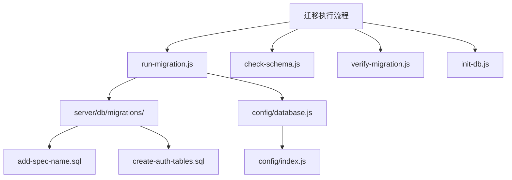
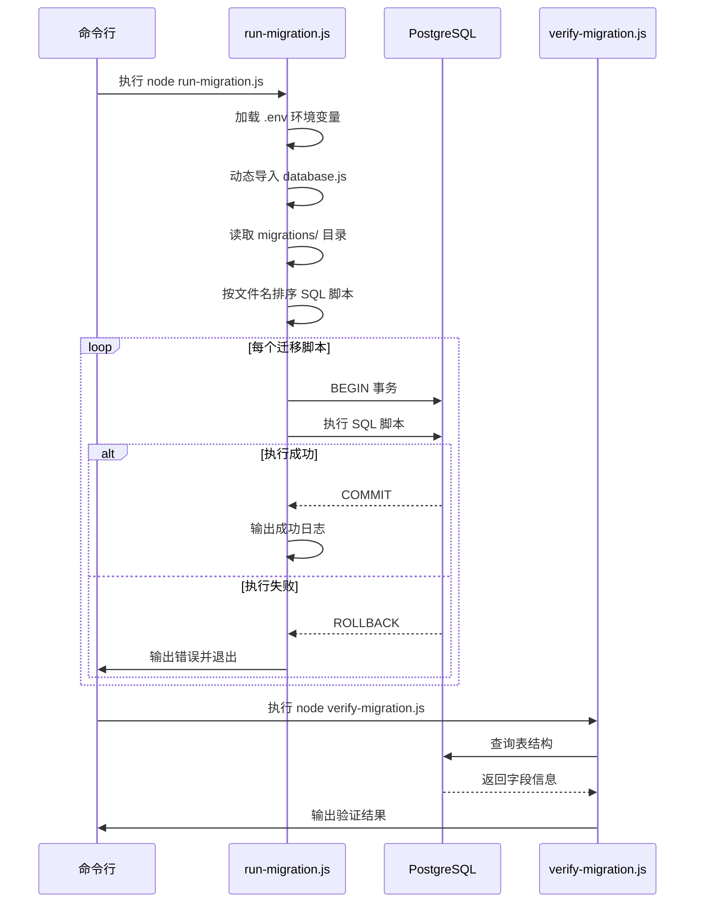
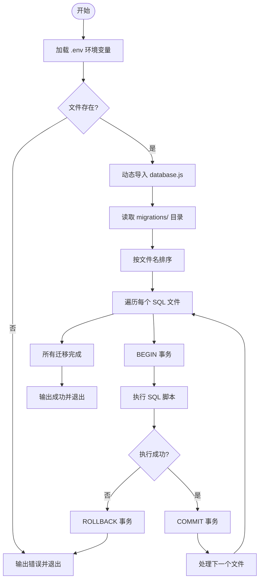
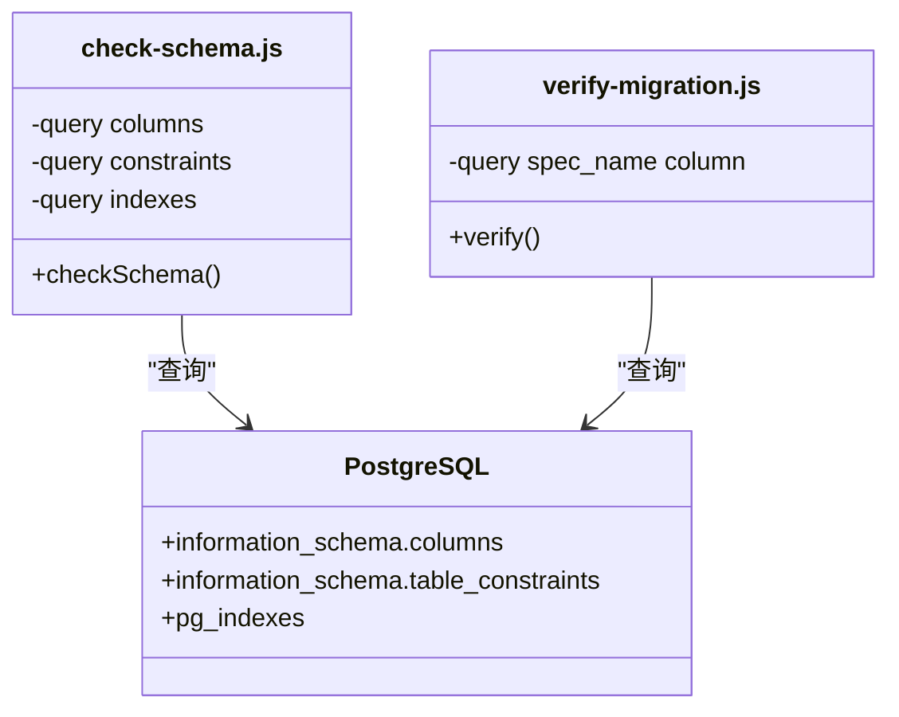
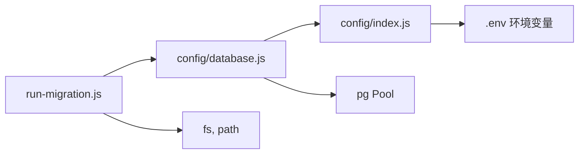

# 迁移执行流程

<cite>
**本文档引用的文件**  
- [run-migration.js](file://server/run-migration.js)
- [check-schema.js](file://server/scripts/check-schema.js)
- [verify-migration.js](file://server/scripts/verify-migration.js)
- [database.js](file://server/config/database.js)
- [index.js](file://server/config/index.js)
- [db/index.js](file://server/db/index.js)
- [init-db.js](file://server/scripts/init-db.js)
- [add-spec-name.sql](file://server/db/migrations/add-spec-name.sql)
- [create-auth-tables.sql](file://server/db/migrations/create-auth-tables.sql)
- [add_view_id_to_documents.sql](file://server/db/add_view_id_to_documents.sql)
</cite>

## 目录
1. [简介](#简介)
2. [项目结构](#项目结构)
3. [核心组件](#核心组件)
4. [架构概述](#架构概述)
5. [详细组件分析](#详细组件分析)
6. [依赖分析](#依赖分析)
7. [性能考虑](#性能考虑)
8. [故障排除指南](#故障排除指南)
9. [结论](#结论)

## 简介
本文档系统性地介绍 TwinSight 项目中数据库迁移的自动化执行流程。以 `run-migration.js` 脚本为核心，解析其如何加载 `server/db/migrations/` 目录下的 SQL 脚本、按版本排序并逐个执行，确保每个迁移操作的原子性与一致性。文档涵盖迁移前后的环境检查、结果验证、错误处理机制及安全操作规范，并提供本地开发、CI/CD 与生产环境中的执行示例。

## 项目结构
TwinSight 项目的数据库迁移相关文件主要集中在 `server/db/migrations/` 和 `server/scripts/` 目录中。迁移脚本为纯 SQL 文件，按功能命名，集中管理。执行逻辑由 Node.js 脚本控制，通过环境变量动态配置数据库连接。

**Diagram sources**
- [run-migration.js](file://server/run-migration.js)
- [check-schema.js](file://server/scripts/check-schema.js)
- [verify-migration.js](file://server/scripts/verify-migration.js)
- [init-db.js](file://server/scripts/init-db.js)

**Section sources**
- [server/db/migrations/](file://server/db/migrations/)
- [server/scripts/](file://server/scripts/)

## 核心组件
`run-migration.js` 是数据库迁移的主执行脚本，负责加载并执行 `server/db/migrations/` 目录下的所有 SQL 文件。它通过 `config/database.js` 获取数据库连接，并使用事务确保每个迁移脚本的原子性。迁移完成后，系统通过 `verify-migration.js` 验证结果，确保字段、表结构和数据完整性符合预期。

**Section sources**
- [run-migration.js](file://server/run-migration.js#L20-L39)
- [verify-migration.js](file://server/scripts/verify-migration.js#L13-L37)

## 架构概述
TwinSight 的数据库迁移流程采用“执行-验证”双阶段模式。首先，`run-migration.js` 脚本读取迁移目录中的 SQL 文件，按文件名排序后依次在事务中执行。每个迁移操作被包裹在事务中，若任一语句失败，则回滚整个脚本，保证数据库状态一致。执行完成后，可通过 `check-schema.js` 和 `verify-migration.js` 等工具验证表结构和数据。

**Diagram sources**
- [run-migration.js](file://server/run-migration.js#L20-L39)
- [database.js](file://server/config/database.js#L58-L70)
- [verify-migration.js](file://server/scripts/verify-migration.js#L13-L37)

## 详细组件分析

### run-migration.js 分析
该脚本是迁移流程的核心，负责协调所有迁移操作。它首先加载 `.env` 文件中的环境变量，然后动态导入数据库配置模块，确保连接信息的实时性。脚本读取 `server/db/migrations/` 目录下的所有 `.sql` 文件，按文件名排序后逐个执行。每个脚本在独立事务中运行，确保原子性。

**Diagram sources**
- [run-migration.js](file://server/run-migration.js#L11-L39)

**Section sources**
- [run-migration.js](file://server/run-migration.js#L1-L39)

### check-schema.js 与 verify-migration.js 分析
这两个脚本用于迁移前后的数据库状态验证。`check-schema.js` 查询 `asset_specs` 表的列结构、约束和索引，全面展示表的元数据。`verify-migration.js` 则针对性地检查特定字段（如 `spec_name`）是否存在，用于确认迁移是否成功应用。

**Diagram sources**
- [check-schema.js](file://server/scripts/check-schema.js#L13-L54)
- [verify-migration.js](file://server/scripts/verify-migration.js#L13-L37)

**Section sources**
- [check-schema.js](file://server/scripts/check-schema.js#L1-L54)
- [verify-migration.js](file://server/scripts/verify-migration.js#L1-L37)

## 依赖分析
迁移脚本依赖于项目配置模块和数据库连接池。`run-migration.js` 依赖 `config/database.js` 提供的 `query` 和 `transaction` 方法，而 `database.js` 又依赖 `config/index.js` 中的动态配置获取数据库连接参数。这种分层设计确保了配置的灵活性和连接的安全性。

**Diagram sources**
- [run-migration.js](file://server/run-migration.js#L23)
- [database.js](file://server/config/database.js#L6-L7)
- [index.js](file://server/config/index.js#L13)

**Section sources**
- [run-migration.js](file://server/run-migration.js)
- [config/database.js](file://server/config/database.js)
- [config/index.js](file://server/config/index.js)

## 性能考虑
迁移脚本在执行时会输出详细的日志信息，便于追踪执行进度。数据库连接池配置了最大 20 个连接和超时机制，确保在高并发或网络不稳定情况下的稳定性。建议在低峰期执行大型迁移，避免影响线上服务性能。

## 故障排除指南
当迁移失败时，脚本会捕获异常并输出错误信息，同时事务自动回滚。可通过以下步骤排查：
1. 检查 `.env` 文件是否存在且配置正确。
2. 验证数据库服务是否正常运行。
3. 检查 SQL 脚本语法是否正确。
4. 使用 `check-schema.js` 查看当前表结构，定位问题。

**Section sources**
- [run-migration.js](file://server/run-migration.js#L32-L34)
- [check-schema.js](file://server/scripts/check-schema.js#L47-L49)

## 结论
TwinSight 项目的数据库迁移流程设计合理，通过 `run-migration.js` 实现了迁移脚本的自动化执行与事务保护，并结合 `check-schema.js` 和 `verify-migration.js` 提供了完整的验证机制。该流程适用于本地开发、CI/CD 流水线及生产环境，具备良好的可维护性和安全性。