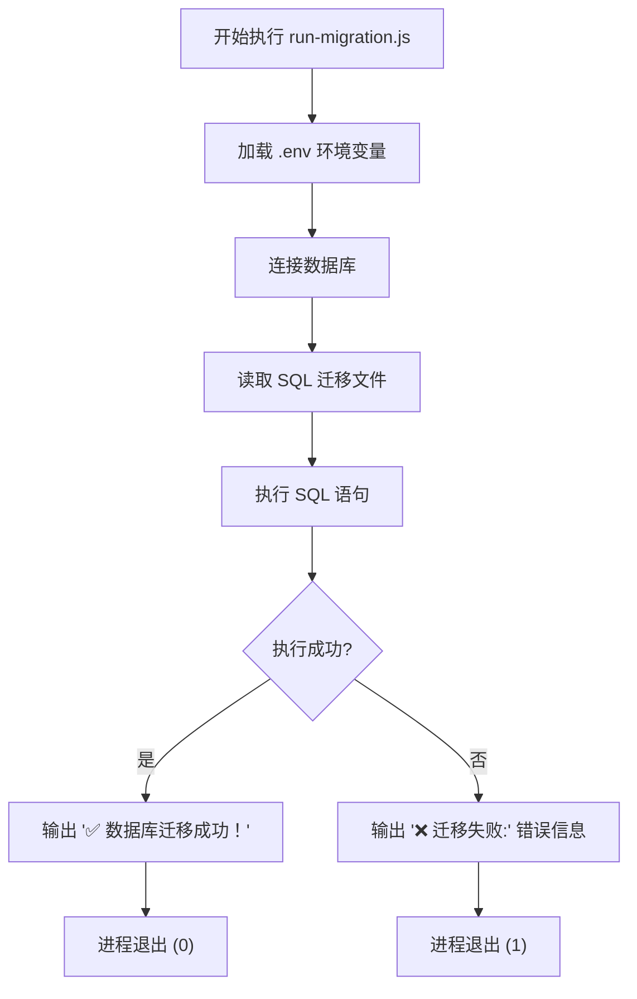
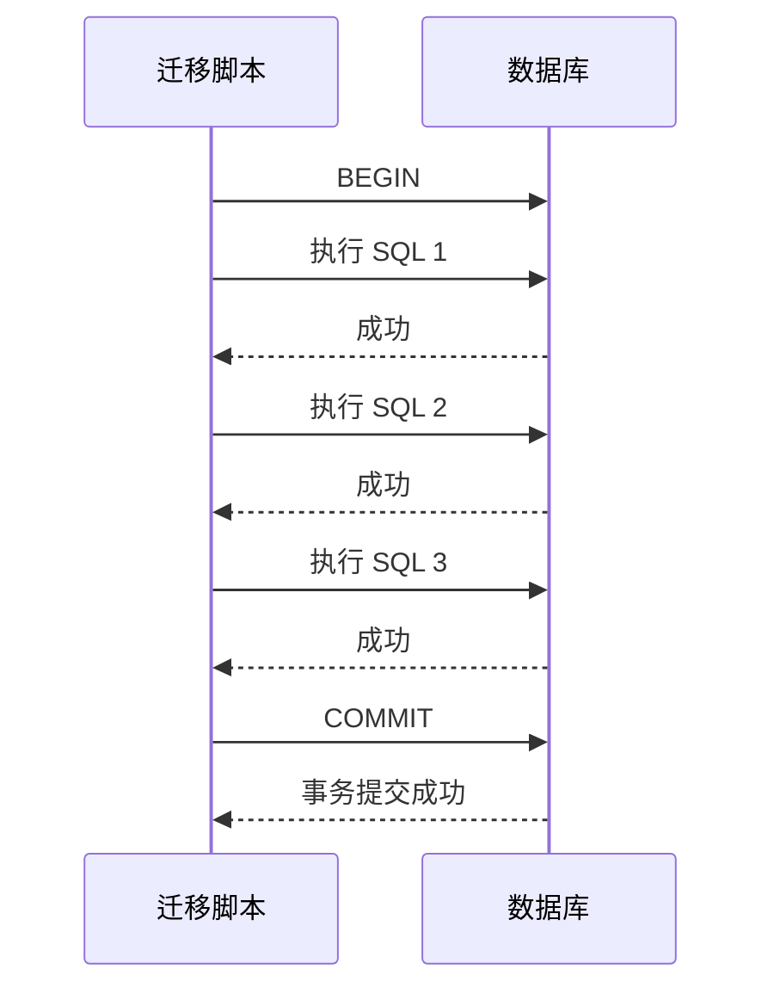
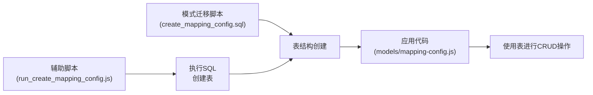

# 迁移管理

<cite>
**本文档中引用的文件**  
- [add-file-id.sql](file://server/db/migrations/add-file-id.sql)
- [create-auth-tables.sql](file://server/db/migrations/create-auth-tables.sql)
- [create_mapping_config.sql](file://server/db/migrations/create_mapping_config.sql)
- [add_mapping_config_fk.sql](file://server/db/migrations/add_mapping_config_fk.sql)
- [extend_field_lengths.sql](file://server/db/migrations/extend_field_lengths.sql)
- [add-spec-name.sql](file://server/db/migrations/add-spec-name.sql)
- [add_file_id_to_classifications.sql](file://server/db/migrations/add_file_id_to_classifications.sql)
- [reset_railway_db.sql](file://server/db/migrations/reset_railway_db.sql)
- [run-migration.js](file://server/run-migration.js)
- [run_create_mapping_config.js](file://server/scripts/run_create_mapping_config.js)
- [run_file_id_migration.js](file://server/scripts/run_file_id_migration.js)
- [database.js](file://server/config/database.js)
- [init-all.sql](file://server/db/init-all.sql)
- [add_view_id_to_documents.sql](file://server/db/add_view_id_to_documents.sql)
</cite>

## 目录
1. [引言](#引言)
2. [迁移脚本分析](#迁移脚本分析)
3. [迁移执行流程](#迁移执行流程)
4. [迁移脚本编写规范](#迁移脚本编写规范)
5. [数据与模式迁移协同](#数据与模式迁移协同)
6. [常见问题解决方案](#常见问题解决方案)
7. [结论](#结论)

## 引言
TwinSight项目采用基于SQL脚本的数据库迁移管理机制，通过版本化、可重复执行的SQL脚本来实现数据库模式的演进与版本控制。该机制确保了数据库结构变更的可追溯性、一致性和安全性，支持从开发环境到生产环境的平滑部署。本文档详细阐述了迁移系统的实现方式、核心脚本功能、执行流程、编写规范以及常见问题的解决方案。

## 迁移脚本分析

### 添加文件ID字段迁移
`add-file-id.sql` 脚本为多个核心数据表（`asset_specs`、`assets`、`spaces`、`classifications`）添加 `file_id` 字段，以支持云存储集成和多文件数据隔离。该字段作为外键引用 `model_files` 表，实现数据按模型文件进行逻辑分组。同时，脚本重构了各表的唯一约束，将原有的单字段唯一性（如 `asset_code`）升级为 `(file_id, asset_code)` 组合唯一，确保跨文件的数据唯一性。此外，脚本还创建了相应的索引以优化查询性能，并添加了字段注释以增强可维护性。

**Section sources**
- [add-file-id.sql](file://server/db/migrations/add-file-id.sql)

### 创建认证表迁移
`create-auth-tables.sql` 脚本创建了支持RBAC（基于角色的访问控制）权限系统的用户认证相关表。主要包括：
- `users` 表：存储用户基本信息，如邮箱、密码哈希、姓名等。
- `user_roles` 表：实现用户与角色的多对多关联，支持灵活的权限分配。
- `user_identities` 表：存储用户与第三方身份提供商（如Google、GitHub）的关联信息，支持单点登录。
- `refresh_tokens` 表：用于管理JWT（JSON Web Token）的刷新令牌，保障会话安全。

脚本不仅创建了表结构和索引，还定义了更新时间戳的触发器，并预置了一个默认管理员账户，简化了初始部署流程。

**Section sources**
- [create-auth-tables.sql](file://server/db/migrations/create-auth-tables.sql)

### 创建映射配置表迁移
`create_mapping_config.sql` 脚本创建了 `mapping_configs` 表，用于存储模型文件的字段映射配置。该表记录了文件中的原始字段（如 `assetCode`）如何映射到系统内部的属性（如 `asset_code`）。脚本设计考虑了可扩展性，通过 `config_type` 字段区分资产、资产规格、空间等不同类型的映射。值得注意的是，该脚本在注释中明确指出，外键约束的添加被推迟到后续脚本中执行，以解决表依赖顺序问题。

**Section sources**
- [create_mapping_config.sql](file://server/db/migrations/create_mapping_config.sql)

### 添加外键约束迁移
`add_mapping_config_fk.sql` 脚本解决了 `create_mapping_config.sql` 中提到的外键问题。它使用PL/pgSQL的匿名代码块（DO block）来安全地添加外键约束。该脚本首先检查名为 `fk_mapping_configs_model_file` 的约束是否已存在，如果存在则先删除，然后再创建新的外键约束。这种设计确保了脚本的幂等性，可以安全地重复执行而不会引发错误。

**Section sources**
- [add_mapping_config_fk.sql](file://server/db/migrations/add_mapping_config_fk.sql)

### 扩展字段长度迁移
`extend_field_lengths.sql` 脚本通过 `ALTER TABLE ... ALTER COLUMN ... TYPE` 语句，将多个表中的关键字段（如 `asset_code`、`spec_name`、`space_code`）的长度从较短的VARCHAR扩展到VARCHAR(500)或更长。这一变更旨在支持更长的值，满足实际业务需求。脚本覆盖了资产、资产规格、空间和分类编码等核心表，确保了数据模型的灵活性。

**Section sources**
- [extend_field_lengths.sql](file://server/db/migrations/extend_field_lengths.sql)

### 添加规格名称字段迁移
`add-spec-name.sql` 脚本为 `asset_specs` 表添加了 `spec_name` 字段，用于存储构件的类型名称属性。该字段的引入丰富了资产规格的元数据，支持更精确的分类和查询。脚本同时为该字段创建了索引，以保证查询性能。

**Section sources**
- [add-spec-name.sql](file://server/db/migrations/add-spec-name.sql)

### 重置铁路数据库迁移
`reset_railway_db.sql` 是一个高风险的维护脚本，用于修复在Railway平台上错误创建的数据库结构。该脚本会按依赖顺序反向删除所有表和函数，然后提示用户运行 `init-all.sql` 来重新初始化整个数据库。脚本开头明确警告“此脚本会删除现有数据，请先备份！”，体现了对数据安全的重视。

**Section sources**
- [reset_railway_db.sql](file://server/db/migrations/reset_railway_db.sql)

## 迁移执行流程

### 通过 run-migration.js 脚本执行
TwinSight项目提供了 `run-migration.js` 脚本作为标准的迁移执行入口。该脚本的执行流程如下：
1.  **加载环境变量**：从 `server/.env` 文件中加载数据库连接配置。
2.  **建立数据库连接**：动态导入 `database.js` 模块，获取数据库查询接口。
3.  **读取并执行SQL**：读取指定的SQL迁移文件（如 `add_view_id_to_documents.sql`），并通过 `query` 函数执行。
4.  **结果处理**：根据执行结果输出成功或失败的提示信息，并以相应的退出码结束进程。

此脚本提供了一种标准化、可编程的迁移方式，易于集成到CI/CD流程中。

**Diagram sources**
- [run-migration.js](file://server/run-migration.js#L1-L39)

**Section sources**
- [run-migration.js](file://server/run-migration.js#L1-L39)

### 手动执行迁移
除了使用脚本，也可以通过数据库客户端工具（如psql、pgAdmin）手动执行迁移。操作步骤为：
1.  连接到目标PostgreSQL数据库。
2.  将SQL迁移文件的内容复制到查询编辑器中。
3.  执行SQL语句。

手动执行方式灵活，适用于紧急修复或调试场景，但缺乏自动化和审计能力。

## 迁移脚本编写规范

### 命名约定
迁移脚本采用描述性命名，清晰地表达其变更目的。例如：
- `add-file-id.sql`：表明是添加 `file_id` 字段的操作。
- `create-auth-tables.sql`：表明是创建认证相关表的操作。
- `extend_field_lengths.sql`：表明是扩展字段长度的操作。

这种命名方式使得迁移历史一目了然，便于团队成员理解和维护。

### 事务处理
关键的迁移脚本（如 `run_file_id_migration.js`）实现了显式的事务控制。脚本在执行前调用 `BEGIN` 开启事务，在所有SQL执行成功后调用 `COMMIT` 提交变更。如果在执行过程中发生任何错误，则通过 `ROLLBACK` 回滚整个事务，确保数据库状态的一致性，避免出现部分更新的中间状态。

**Diagram sources**
- [run_file_id_migration.js](file://server/scripts/run_file_id_migration.js#L36-L38)

### 回滚策略
TwinSight的迁移系统主要依赖于幂等性而非逆向回滚脚本。大多数 `ALTER TABLE` 和 `CREATE TABLE IF NOT EXISTS` 语句本身具有幂等性，可以安全地重复执行。对于可能产生冲突的操作（如添加约束），脚本会先使用 `DROP CONSTRAINT IF EXISTS` 删除旧约束，再添加新约束。这种设计简化了迁移管理，但要求开发者在设计变更时充分考虑幂等性。对于无法幂等执行的变更，应通过备份和 `reset_railway_db.sql` 这类脚本进行恢复。

## 数据与模式迁移协同

### run_create_mapping_config.js 脚本分析
`run_create_mapping_config.js` 是一个典型的辅助脚本，它与 `create_mapping_config.sql` 和 `add_mapping_config_fk.sql` 等模式迁移脚本协同工作。该脚本的职责是：
1.  **独立执行**：作为一个独立的Node.js程序，可以被单独调用。
2.  **连接数据库**：使用 `pg.Client` 直接连接数据库，不依赖于应用的主配置。
3.  **执行数据迁移**：读取并执行 `create_mapping_config.sql`，完成表的创建。

这种设计将数据迁移（如初始化数据、数据转换）与模式迁移（修改表结构）分离，使得数据操作更加灵活和可控。

**Diagram sources**
- [run_create_mapping_config.js](file://server/scripts/run_create_mapping_config.js#L1-L36)
- [create_mapping_config.sql](file://server/db/migrations/create_mapping_config.sql#L1-L29)

**Section sources**
- [run_create_mapping_config.js](file://server/scripts/run_create_mapping_config.js#L1-L36)
- [create_mapping_config.sql](file://server/db/migrations/create_mapping_config.sql#L1-L29)

## 常见问题解决方案

### 迁移冲突处理
当多个开发者并行开发并创建了同名或冲突的迁移脚本时，可能导致部署失败。解决方案是：
1.  **建立沟通机制**：在团队内共享迁移计划。
2.  **使用唯一命名**：在脚本名中加入开发者姓名或功能模块，如 `add-file-id-john.sql`。
3.  **合并脚本**：在发现冲突后，将多个小脚本合并为一个逻辑完整的脚本。

### 生产环境迁移前的备份策略
在生产环境执行任何迁移前，必须进行完整备份。推荐流程：
1.  使用 `pg_dump` 命令导出数据库。
2.  将备份文件存储在安全的、独立于数据库服务器的位置。
3.  验证备份文件的完整性。
4.  执行迁移。
5.  迁移成功后，保留备份一段时间以备不时之需。

### 验证迁移结果的完整性
迁移执行后，应通过以下方式验证结果：
1.  **检查日志**：确认迁移脚本输出了“✅ 迁移成功！”等成功信息。
2.  **查询数据库**：使用 `\d table_name` 或 `SELECT * FROM information_schema.columns` 等命令，检查表结构是否符合预期。
3.  **运行验证脚本**：项目中的 `check-schema.js`、`verify-migration.js` 等脚本可用于自动化验证。
4.  **应用测试**：启动应用，进行基本的功能测试，确保新结构被正确使用。

## 结论
TwinSight项目通过一套清晰、规范的SQL脚本和辅助工具，实现了有效的数据库迁移管理。该系统强调幂等性、事务安全和清晰的变更记录，支持从简单的字段添加到复杂的表结构重构。通过遵循本文档所述的规范和流程，开发团队可以安全、高效地演进数据库模式，为应用的持续发展奠定坚实的基础。