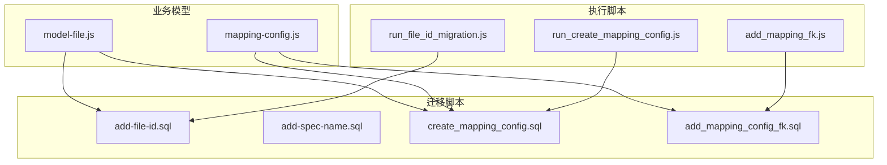
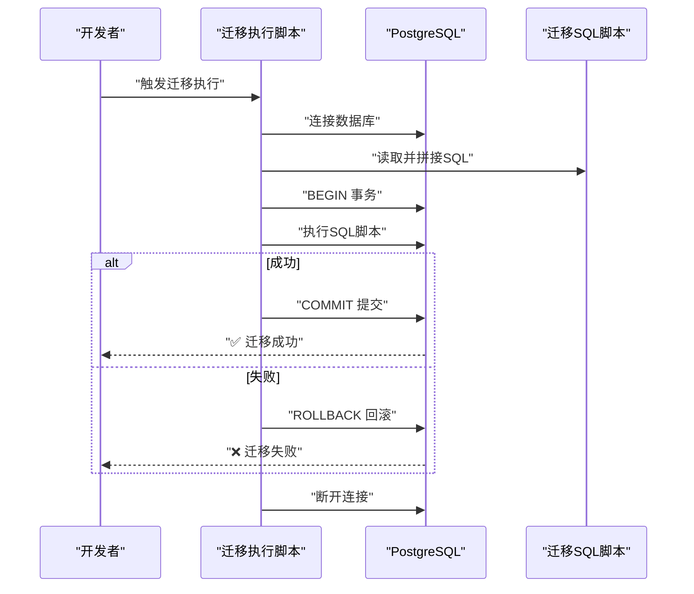
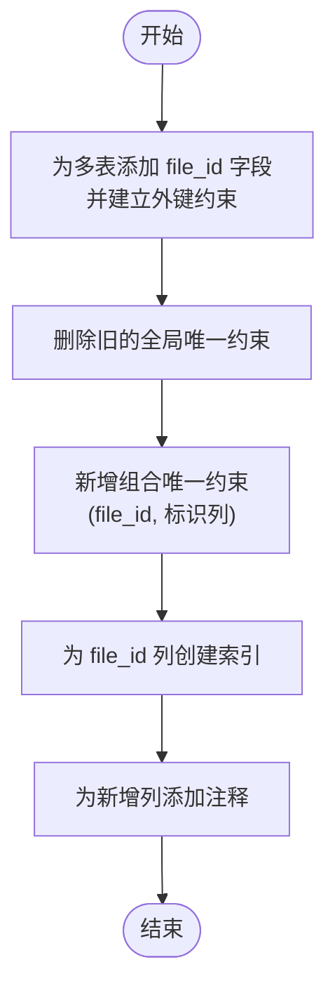
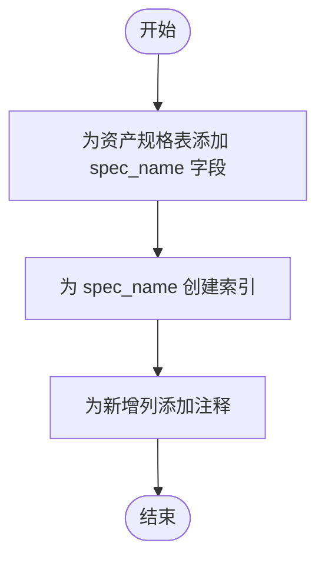
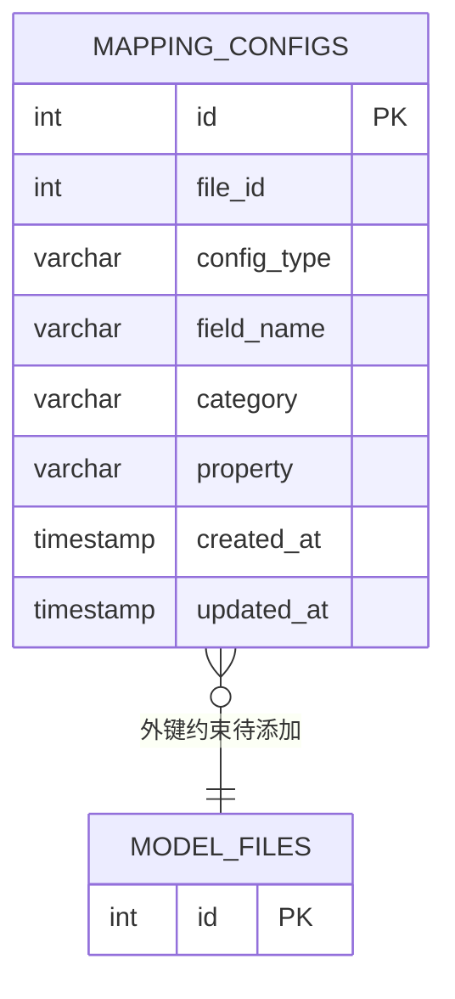
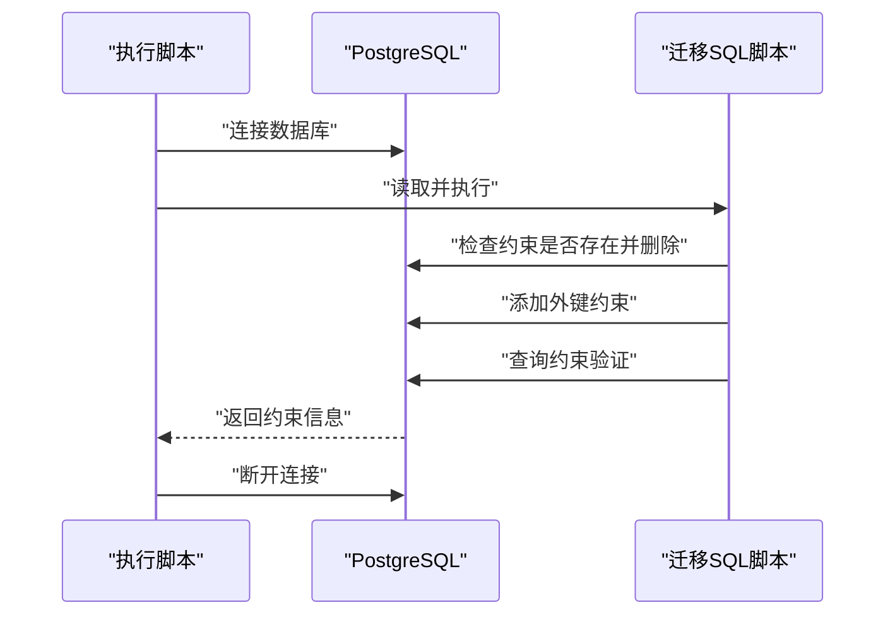
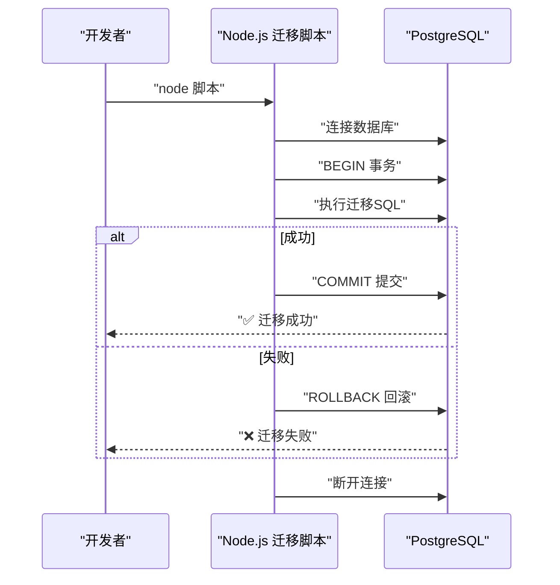
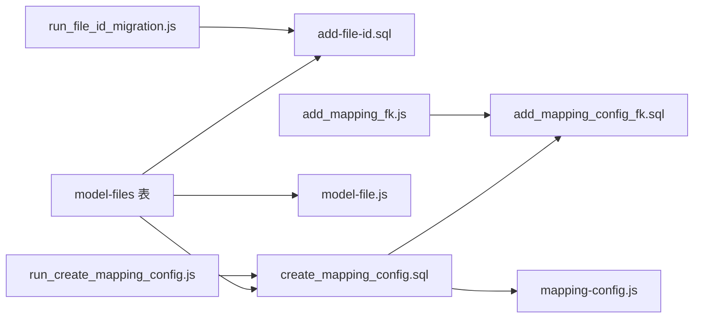

# 迁移脚本

<cite>
**本文引用的文件**
- [add-file-id.sql](file://server/db/migrations/add-file-id.sql)
- [add-spec-name.sql](file://server/db/migrations/add-spec-name.sql)
- [add_mapping_config_fk.sql](file://server/db/migrations/add_mapping_config_fk.sql)
- [create_mapping_config.sql](file://server/db/migrations/create_mapping_config.sql)
- [run_create_mapping_config.js](file://server/scripts/run_create_mapping_config.js)
- [run_file_id_migration.js](file://server/scripts/run_file_id_migration.js)
- [add_mapping_fk.js](file://server/scripts/add_mapping_fk.js)
- [mapping-config.js](file://server/models/mapping-config.js)
- [model-file.js](file://server/models/model-file.js)
- [DATABASE_MIGRATION.md](file://DATABASE_MIGRATION.md)
</cite>

## 目录
1. [简介](#简介)
2. [项目结构](#项目结构)
3. [核心组件](#核心组件)
4. [架构总览](#架构总览)
5. [详细组件分析](#详细组件分析)
6. [依赖关系分析](#依赖关系分析)
7. [性能考量](#性能考量)
8. [故障排查指南](#故障排查指南)
9. [结论](#结论)
10. [附录](#附录)

## 简介
本文件系统性解析 server/db/migrations 目录下的四份 SQL 迁移脚本，阐明它们在数据库模式演进中的作用与执行顺序。通过对每份脚本的逐条变更说明，解释如何通过增量式脚本安全地添加字段、创建新表以及建立外键约束；并结合配套的 Node.js 执行脚本，说明迁移机制如何保障多环境（开发、测试、生产）数据库的一致性。最后提供团队成员编写与执行迁移脚本的最佳实践建议。

## 项目结构
迁移脚本位于 server/db/migrations，配套的执行脚本位于 server/scripts。迁移脚本与业务模型文件相互配合，支撑映射配置功能与文件维度的数据隔离。

图表来源
- [add-file-id.sql](file://server/db/migrations/add-file-id.sql#L1-L51)
- [add-spec-name.sql](file://server/db/migrations/add-spec-name.sql#L1-L12)
- [create_mapping_config.sql](file://server/db/migrations/create_mapping_config.sql#L1-L29)
- [add_mapping_config_fk.sql](file://server/db/migrations/add_mapping_config_fk.sql#L1-L26)
- [run_file_id_migration.js](file://server/scripts/run_file_id_migration.js#L1-L53)
- [run_create_mapping_config.js](file://server/scripts/run_create_mapping_config.js#L1-L36)
- [add_mapping_fk.js](file://server/scripts/add_mapping_fk.js#L1-L36)
- [mapping-config.js](file://server/models/mapping-config.js#L1-L115)
- [model-file.js](file://server/models/model-file.js#L1-L179)

章节来源
- [add-file-id.sql](file://server/db/migrations/add-file-id.sql#L1-L51)
- [add-spec-name.sql](file://server/db/migrations/add-spec-name.sql#L1-L12)
- [create_mapping_config.sql](file://server/db/migrations/create_mapping_config.sql#L1-L29)
- [add_mapping_config_fk.sql](file://server/db/migrations/add_mapping_config_fk.sql#L1-L26)
- [run_file_id_migration.js](file://server/scripts/run_file_id_migration.js#L1-L53)
- [run_create_mapping_config.js](file://server/scripts/run_create_mapping_config.js#L1-L36)
- [add_mapping_fk.js](file://server/scripts/add_mapping_fk.js#L1-L36)
- [mapping-config.js](file://server/models/mapping-config.js#L1-L115)
- [model-file.js](file://server/models/model-file.js#L1-L179)

## 核心组件
- 增量式字段添加：为多个核心表增加 file_id 字段，实现“按文件区分数据”的能力。
- 新表创建：创建 mapping_configs 表，用于存储文件级字段映射配置。
- 外键约束：为 mapping_configs 表添加指向 model_files 的外键约束，保证数据一致性。
- 验证与索引：为新增列创建索引，提升查询性能；为关键组合唯一约束提供索引支持。
- 执行脚本：提供可重复执行的 Node.js 脚本，封装事务、回滚与错误处理，确保迁移在多环境下稳定落地。

章节来源
- [add-file-id.sql](file://server/db/migrations/add-file-id.sql#L1-L51)
- [create_mapping_config.sql](file://server/db/migrations/create_mapping_config.sql#L1-L29)
- [add_mapping_config_fk.sql](file://server/db/migrations/add_mapping_config_fk.sql#L1-L26)
- [run_file_id_migration.js](file://server/scripts/run_file_id_migration.js#L1-L53)
- [run_create_mapping_config.js](file://server/scripts/run_create_mapping_config.js#L1-L36)
- [add_mapping_fk.js](file://server/scripts/add_mapping_fk.js#L1-L36)

## 架构总览
迁移脚本与执行脚本共同构成“声明式模式演进 + 可重复执行的事务化部署”体系。执行脚本负责：
- 连接数据库并读取对应 SQL 文件
- 在单次事务中执行迁移，失败时回滚
- 输出明确的成功/失败日志
- 通过注释与索引增强可维护性与性能

图表来源
- [run_file_id_migration.js](file://server/scripts/run_file_id_migration.js#L1-L53)
- [run_create_mapping_config.js](file://server/scripts/run_create_mapping_config.js#L1-L36)
- [add_mapping_fk.js](file://server/scripts/add_mapping_fk.js#L1-L36)

## 详细组件分析

### 组件一：add-file-id.sql（为多表添加 file_id 并重建唯一约束）
该脚本的目标是为资产、空间、规格与分类等表增加 file_id 字段，使数据具备“文件维度”的归属关系；同时对关键表的唯一约束进行调整，确保同一文件内的标识符唯一。

- 字段添加
  - 对资产、空间、规格、分类表分别添加 file_id 字段，并设置外键指向 model_files.id，删除策略为级联删除。
- 唯一约束重建
  - 删除旧的全局唯一约束，新增基于 (file_id, 标识列) 的组合唯一约束，避免跨文件冲突。
- 索引创建
  - 为各表的 file_id 列创建索引，提升按文件过滤与连接查询性能。
- 注释补充
  - 为新增列添加列级注释，便于后续维护与文档生成。

图表来源
- [add-file-id.sql](file://server/db/migrations/add-file-id.sql#L1-L51)

章节来源
- [add-file-id.sql](file://server/db/migrations/add-file-id.sql#L1-L51)

### 组件二：add-spec-name.sql（为资产规格表添加 spec_name 字段）
该脚本为资产规格表增加 spec_name 字段，用于存储构件的类型名称属性，并为其创建索引以优化查询性能。

- 字段添加：向资产规格表添加 spec_name 字段。
- 索引创建：为 spec_name 创建索引，提升按名称检索效率。
- 注释补充：为新增列添加列级注释。

图表来源
- [add-spec-name.sql](file://server/db/migrations/add-spec-name.sql#L1-L12)

章节来源
- [add-spec-name.sql](file://server/db/migrations/add-spec-name.sql#L1-L12)

### 组件三：create_mapping_config.sql（创建映射配置表）
该脚本创建 mapping_configs 表，用于存储文件级字段映射配置，包含配置类型、字段名、分类与属性等信息，并定义必要的索引与注释。

- 表结构：主键、必填字段、时间戳、组合唯一约束（file_id, config_type, field_name）。
- 索引：为 file_id 与 config_type 创建索引，提升查询与分组性能。
- 注释：为表与列添加注释，增强可读性与可维护性。
- 外键提示：脚本末尾提供外键约束添加的注释说明，指导后续完善。

图表来源
- [create_mapping_config.sql](file://server/db/migrations/create_mapping_config.sql#L1-L29)

章节来源
- [create_mapping_config.sql](file://server/db/migrations/create_mapping_config.sql#L1-L29)

### 组件四：add_mapping_config_fk.sql（为映射配置表添加外键约束）
该脚本为 mapping_configs 表添加外键约束，使其 file_id 指向 model_files.id，并在执行前检查约束是否存在，避免重复执行导致的错误。

- 前置检查：若存在同名约束则先删除，确保脚本幂等。
- 外键添加：为 mapping_configs.file_id 添加外键约束，删除策略为级联删除。
- 约束验证：查询 pg_constraint 以确认约束已正确创建。

图表来源
- [add_mapping_config_fk.sql](file://server/db/migrations/add_mapping_config_fk.sql#L1-L26)
- [add_mapping_fk.js](file://server/scripts/add_mapping_fk.js#L1-L36)

章节来源
- [add_mapping_config_fk.sql](file://server/db/migrations/add_mapping_config_fk.sql#L1-L26)
- [add_mapping_fk.js](file://server/scripts/add_mapping_fk.js#L1-L36)

### 组件五：配套执行脚本（run_file_id_migration.js、run_create_mapping_config.js、add_mapping_fk.js）
这些脚本负责：
- 连接数据库并读取对应 SQL 文件
- 在单次事务中执行迁移，失败时回滚
- 输出明确的日志，便于排障
- 通过注释与索引增强可维护性与性能

图表来源
- [run_file_id_migration.js](file://server/scripts/run_file_id_migration.js#L1-L53)
- [run_create_mapping_config.js](file://server/scripts/run_create_mapping_config.js#L1-L36)
- [add_mapping_fk.js](file://server/scripts/add_mapping_fk.js#L1-L36)

章节来源
- [run_file_id_migration.js](file://server/scripts/run_file_id_migration.js#L1-L53)
- [run_create_mapping_config.js](file://server/scripts/run_create_mapping_config.js#L1-L36)
- [add_mapping_fk.js](file://server/scripts/add_mapping_fk.js#L1-L36)

## 依赖关系分析
- 数据模型依赖
  - mapping-config.js 依赖 mapping_configs 表，读取与写入配置数据。
  - model-file.js 依赖 model_files 表，管理模型文件生命周期。
- 迁移脚本依赖
  - add-file-id.sql 依赖 model_files 表的存在，为多表提供 file_id 外键。
  - create_mapping_config.sql 依赖 model_files 表的存在，用于后续外键约束。
  - add_mapping_config_fk.sql 依赖 create_mapping_config.sql 的执行结果，为 mapping_configs 添加外键约束。
- 执行脚本依赖
  - run_file_id_migration.js 依赖 add-file-id.sql。
  - run_create_mapping_config.js 依赖 create_mapping_config.sql。
  - add_mapping_fk.js 依赖 add_mapping_config_fk.sql。

图表来源
- [add-file-id.sql](file://server/db/migrations/add-file-id.sql#L1-L51)
- [create_mapping_config.sql](file://server/db/migrations/create_mapping_config.sql#L1-L29)
- [add_mapping_config_fk.sql](file://server/db/migrations/add_mapping_config_fk.sql#L1-L26)
- [mapping-config.js](file://server/models/mapping-config.js#L1-L115)
- [model-file.js](file://server/models/model-file.js#L1-L179)
- [run_file_id_migration.js](file://server/scripts/run_file_id_migration.js#L1-L53)
- [run_create_mapping_config.js](file://server/scripts/run_create_mapping_config.js#L1-L36)
- [add_mapping_fk.js](file://server/scripts/add_mapping_fk.js#L1-L36)

章节来源
- [mapping-config.js](file://server/models/mapping-config.js#L1-L115)
- [model-file.js](file://server/models/model-file.js#L1-L179)
- [add-file-id.sql](file://server/db/migrations/add-file-id.sql#L1-L51)
- [create_mapping_config.sql](file://server/db/migrations/create_mapping_config.sql#L1-L29)
- [add_mapping_config_fk.sql](file://server/db/migrations/add_mapping_config_fk.sql#L1-L26)
- [run_file_id_migration.js](file://server/scripts/run_file_id_migration.js#L1-L53)
- [run_create_mapping_config.js](file://server/scripts/run_create_mapping_config.js#L1-L36)
- [add_mapping_fk.js](file://server/scripts/add_mapping_fk.js#L1-L36)

## 性能考量
- 索引策略
  - 为 file_id 列创建索引，有助于按文件维度过滤与连接查询。
  - 为 mapping_configs.config_type 创建索引，提升按配置类型检索的性能。
  - 为 asset_specs.spec_name 创建索引，优化按规格名称查询。
- 唯一约束
  - 将唯一约束从全局改为 (file_id, 标识列)，避免跨文件冲突，同时保持查询效率。
- 事务与幂等
  - 使用 BEGIN/COMMIT/ROLLBACK 包裹迁移，失败自动回滚，保障一致性。
  - 在脚本中加入 IF NOT EXISTS 与约束前置删除逻辑，确保重复执行的安全性。

章节来源
- [add-file-id.sql](file://server/db/migrations/add-file-id.sql#L1-L51)
- [create_mapping_config.sql](file://server/db/migrations/create_mapping_config.sql#L1-L29)
- [add-spec-name.sql](file://server/db/migrations/add-spec-name.sql#L1-L12)
- [run_file_id_migration.js](file://server/scripts/run_file_id_migration.js#L1-L53)

## 故障排查指南
- 认证失败
  - 若自动迁移脚本因数据库密码认证失败无法执行，可参考迁移文档提供的三种手动执行方案。
- 验证字段存在
  - 可通过查询 information_schema.columns 验证字段是否成功添加。
- 外键约束问题
  - 使用 pg_constraint 查询确认约束是否已创建；若不存在，可单独执行 add_mapping_config_fk.sql。
- 事务回滚
  - 执行脚本在发生异常时会自动回滚，确保数据库处于一致状态。

章节来源
- [DATABASE_MIGRATION.md](file://DATABASE_MIGRATION.md#L1-L87)
- [add_mapping_config_fk.sql](file://server/db/migrations/add_mapping_config_fk.sql#L1-L26)
- [run_file_id_migration.js](file://server/scripts/run_file_id_migration.js#L1-L53)

## 结论
这四份迁移脚本构成了一个清晰、可重复、可回滚的数据库模式演进流程：先为多表添加 file_id 并重建唯一约束，再创建映射配置表，最后为映射配置表添加外键约束。配套的 Node.js 执行脚本通过事务化与幂等设计，显著降低了在多环境部署中的风险，提升了团队协作效率与数据一致性保障。

## 附录

### 执行顺序与最佳实践
- 推荐执行顺序
  1) add-file-id.sql（为多表添加 file_id 并重建唯一约束）
  2) create_mapping_config.sql（创建映射配置表）
  3) add_mapping_config_fk.sql（为映射配置表添加外键约束）
- 最佳实践
  - 幂等性：始终使用 IF NOT EXISTS 与前置约束删除逻辑，确保重复执行安全。
  - 事务化：在执行脚本中使用 BEGIN/COMMIT/ROLLBACK，失败自动回滚。
  - 索引先行：为新增列创建必要索引，避免后续查询性能问题。
  - 注释规范：为新增列与表添加注释，提升可维护性。
  - 环境隔离：不同环境（开发、测试、生产）应使用独立的 .env 配置，避免误连。
  - 版本控制：将迁移脚本纳入版本管理，每次变更均保留历史记录与说明。

章节来源
- [add-file-id.sql](file://server/db/migrations/add-file-id.sql#L1-L51)
- [create_mapping_config.sql](file://server/db/migrations/create_mapping_config.sql#L1-L29)
- [add_mapping_config_fk.sql](file://server/db/migrations/add_mapping_config_fk.sql#L1-L26)
- [run_file_id_migration.js](file://server/scripts/run_file_id_migration.js#L1-L53)
- [run_create_mapping_config.js](file://server/scripts/run_create_mapping_config.js#L1-L36)
- [add_mapping_fk.js](file://server/scripts/add_mapping_fk.js#L1-L36)
- [DATABASE_MIGRATION.md](file://DATABASE_MIGRATION.md#L1-L87)