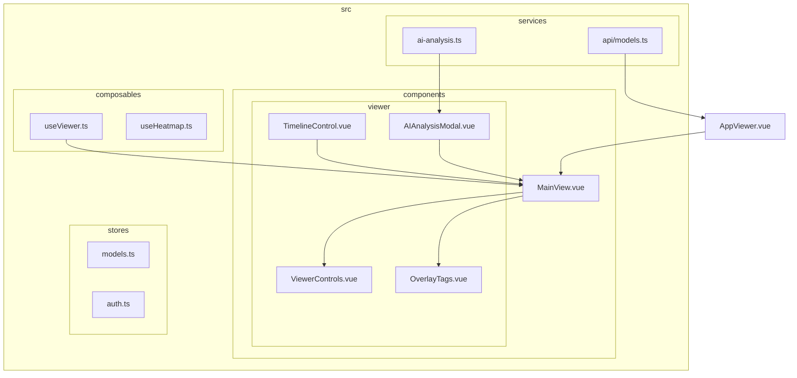
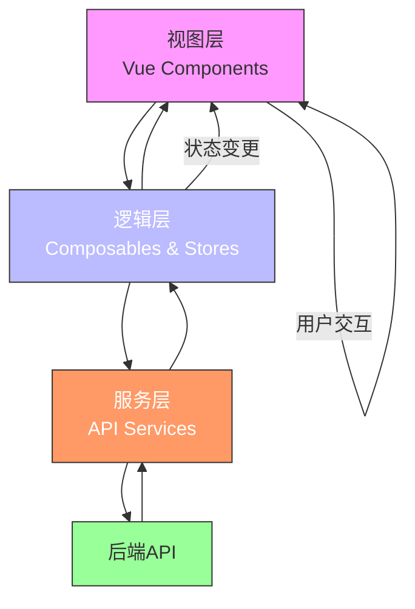
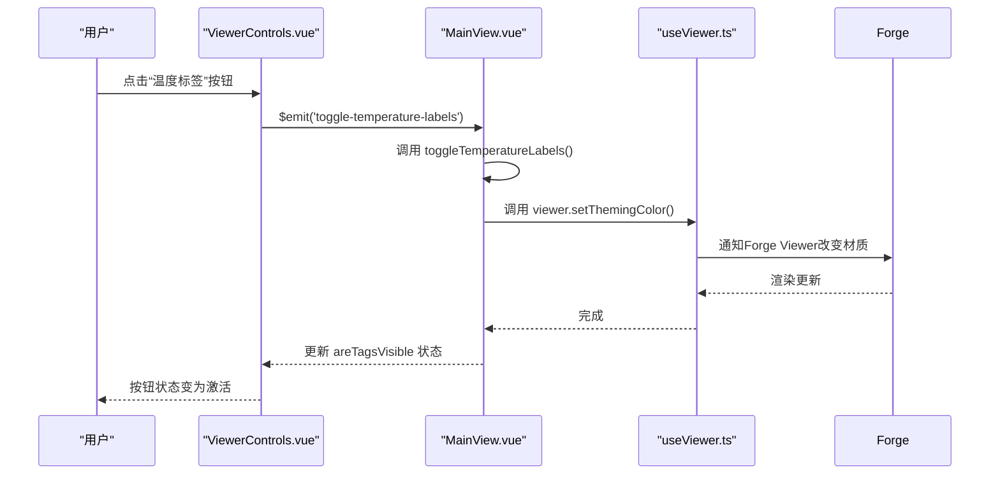
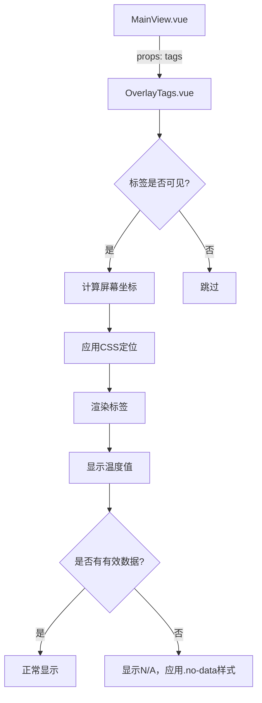
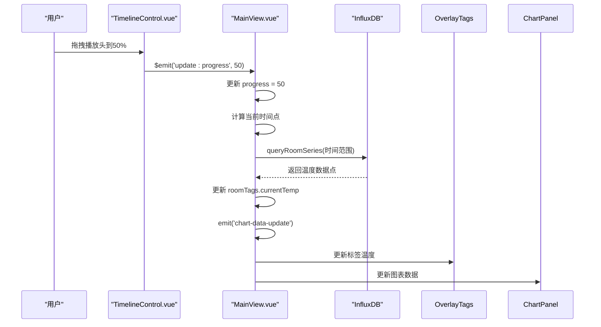
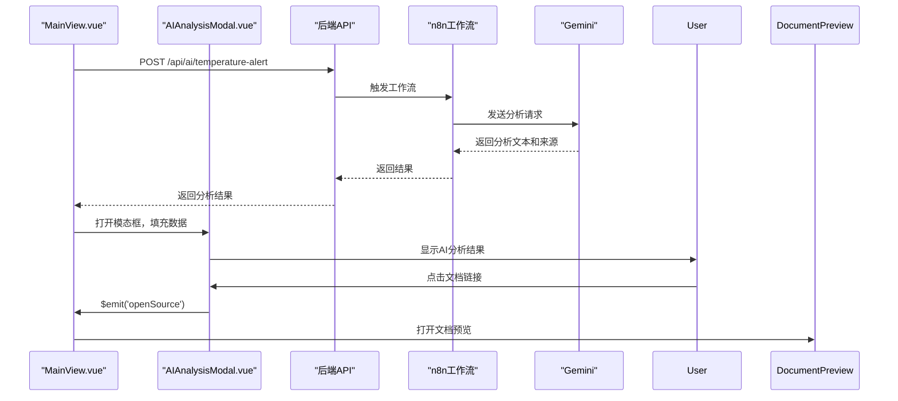
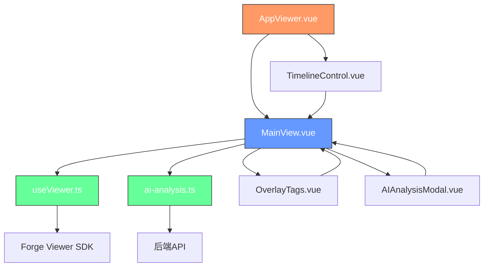

# 3D模型查看器

<cite>
**本文档引用的文件**   
- [AppViewer.vue](file://src/AppViewer.vue)
- [MainView.vue](file://src/components/MainView.vue)
- [ViewerControls.vue](file://src/components/viewer/ViewerControls.vue)
- [OverlayTags.vue](file://src/components/viewer/OverlayTags.vue)
- [TimelineControl.vue](file://src/components/viewer/TimelineControl.vue)
- [AIAnalysisModal.vue](file://src/components/viewer/AIAnalysisModal.vue)
- [useViewer.ts](file://src/composables/useViewer.ts)
- [ai-analysis.ts](file://src/services/ai-analysis.ts)
- [models.ts](file://src/stores/models.ts)
- [models.ts](file://src/services/api/models.ts)
</cite>

## 目录
1. [简介](#简介)
2. [项目结构](#项目结构)
3. [核心组件](#核心组件)
4. [架构概述](#架构概述)
5. [详细组件分析](#详细组件分析)
6. [依赖分析](#依赖分析)
7. [性能考虑](#性能考虑)
8. [故障排除指南](#故障排除指南)
9. [结论](#结论)

## 简介
TwinSight 3D模型查看器是一个基于Vue.js框架构建的现代化三维可视化应用，专为建筑、设施和资产管理设计。该查看器集成了先进的3D渲染技术、物联网（IoT）数据可视化、时间轴控制以及AI智能分析功能，为用户提供了一个全面、交互性强的数字孪生体验。查看器的核心是Autodesk Forge Viewer，它支持SVF、RVT、IFC等多种BIM模型格式的加载与渲染。通过模块化的Vue组件设计，查看器实现了功能的高内聚与低耦合，使得温度标签、热力图、时间轴控制等复杂功能能够独立开发、测试和维护。查看器还通过Pinia进行状态管理，并与后端API进行通信，实现了模型数据、时序数据和AI分析结果的无缝集成。

## 项目结构
TwinSight 3D模型查看器的项目结构清晰地体现了其功能模块化的设计理念。核心的3D查看器功能被封装在`src/components/viewer`目录下，包含`ViewerControls.vue`、`OverlayTags.vue`、`TimelineControl.vue`和`AIAnalysisModal.vue`等独立组件。`AppViewer.vue`作为查看器的主入口，负责协调各个组件和状态管理。`MainView.vue`是3D画布的核心组件，直接与Autodesk Forge Viewer SDK交互。业务逻辑和状态管理通过`composables`（组合式函数）和`stores`（Pinia Store）进行组织，如`useViewer.ts`封装了Viewer的API，`models.ts`管理模型文件状态。服务层`services`则负责与后端API的通信。

**Diagram sources**
- [AppViewer.vue](file://src/AppViewer.vue)
- [MainView.vue](file://src/components/MainView.vue)
- [ViewerControls.vue](file://src/components/viewer/ViewerControls.vue)
- [OverlayTags.vue](file://src/components/viewer/OverlayTags.vue)
- [TimelineControl.vue](file://src/components/viewer/TimelineControl.vue)
- [AIAnalysisModal.vue](file://src/components/viewer/AIAnalysisModal.vue)
- [useViewer.ts](file://src/composables/useViewer.ts)
- [ai-analysis.ts](file://src/services/ai-analysis.ts)
- [models.ts](file://src/stores/models.ts)
- [models.ts](file://src/services/api/models.ts)

## 核心组件
TwinSight 3D模型查看器的核心功能由一系列精心设计的Vue组件构成。`AppViewer.vue`是整个查看器的容器，它负责初始化应用、管理全局状态（如面板宽度、视图模式）并协调`MainView.vue`、`TimelineControl.vue`等子组件的通信。`MainView.vue`是3D渲染的核心，它直接嵌入Autodesk Forge Viewer，并处理模型加载、几何体解析、用户交互（如选择、隔离）等底层操作。`ViewerControls.vue`和`OverlayTags.vue`则专注于用户界面的交互，分别提供温度标签和热力图的开关控制，以及在3D模型上叠加显示实时温度数据。`TimelineControl.vue`实现了复杂的时间轴控件，支持时间范围选择、播放、缩放和拖拽，用于联动时序数据。`AIAnalysisModal.vue`是一个弹出式对话框，用于展示AI分析的结果和相关文档来源。

**Section sources**
- [AppViewer.vue](file://src/AppViewer.vue)
- [MainView.vue](file://src/components/MainView.vue)
- [ViewerControls.vue](file://src/components/viewer/ViewerControls.vue)
- [OverlayTags.vue](file://src/components/viewer/OverlayTags.vue)
- [TimelineControl.vue](file://src/components/viewer/TimelineControl.vue)
- [AIAnalysisModal.vue](file://src/components/viewer/AIAnalysisModal.vue)

## 架构概述
TwinSight 3D模型查看器采用分层架构设计，清晰地分离了关注点。最上层是**视图层（View Layer）**，由Vue组件构成，负责用户界面的渲染和用户交互的捕获。`AppViewer.vue`作为根组件，通过`props`向下传递数据，通过`$emit`事件向上通信。中间是**逻辑层（Logic Layer）**，由组合式函数（Composables）和状态管理（Stores）组成。`useViewer.ts`封装了与Forge Viewer SDK的所有交互，提供了`getSelection`、`isolate`、`fitToView`等高级API，使得`MainView.vue`的代码更加简洁。`models.ts`（Pinia Store）则管理着模型文件的列表、激活状态和加载错误等全局状态。最底层是**服务层（Service Layer）**，`ai-analysis.ts`和`models.ts`（API服务）负责与后端RESTful API进行通信，获取数据并处理响应。

**Diagram sources**
- [AppViewer.vue](file://src/AppViewer.vue)
- [MainView.vue](file://src/components/MainView.vue)
- [useViewer.ts](file://src/composables/useViewer.ts)
- [models.ts](file://src/stores/models.ts)
- [ai-analysis.ts](file://src/services/ai-analysis.ts)
- [models.ts](file://src/services/api/models.ts)

## 详细组件分析

### ViewerControls.vue 分析
`ViewerControls.vue`组件实现了查看器的交互式控制功能，具体为温度标签和热力图的开关按钮。该组件通过`props`接收`temperatureLabelsVisible`和`heatmapEnabled`来控制按钮的激活状态，并通过`$emit`事件（`toggle-temperature-labels`和`toggle-heatmap`）将用户的点击操作通知给父组件`MainView.vue`。父组件监听这些事件，进而调用`useViewer.ts`中的`toggleTemperatureLabels`和`toggleHeatmap`方法，最终改变3D场景的渲染状态。这种设计模式实现了UI与逻辑的完全解耦。

**Diagram sources**
- [ViewerControls.vue](file://src/components/viewer/ViewerControls.vue)
- [MainView.vue](file://src/components/MainView.vue)
- [useViewer.ts](file://src/composables/useViewer.ts)

### OverlayTags.vue 分析
`OverlayTags.vue`组件负责在3D模型上方叠加显示温度标签。它接收一个包含房间信息和温度数据的`tags`数组作为`props`。组件通过`computed`属性`visibleTags`过滤出可见的标签，并利用`position: absolute`和`transform: translate(-50%, -50%)`将每个标签的`div`精确地定位在3D模型中对应房间的投影位置上。标签的温度值通过`formatTemperature`函数格式化，并根据是否有有效数据应用不同的CSS类（`.no-data`）。该组件与`MainView.vue`的`roomTags`状态紧密绑定，当时间轴的进度条移动时，`MainView.vue`会更新`roomTags`中的`currentTemp`，从而触发`OverlayTags.vue`的重新渲染。

**Diagram sources**
- [OverlayTags.vue](file://src/components/viewer/OverlayTags.vue)
- [MainView.vue](file://src/components/MainView.vue)

### TimelineControl.vue 分析
`TimelineControl.vue`组件实现了一个功能丰富的时间轴控件，支持时序数据的联动。它采用“收起”和“展开”两种状态，通过`isOpen` `prop`控制。在展开状态下，它显示一个包含时间范围选择、缩放、播放控制和速度调节的工具栏，以及一个带有迷你图表和刻度的轨道。用户可以通过点击“播放”按钮或拖拽播放头来控制时间进度。该组件通过`$emit`事件（如`toggle-play`、`update:progress`）与`MainView.vue`通信。`MainView.vue`监听这些事件，更新其内部的`progress`状态，并根据新的时间点从InfluxDB查询数据，最终驱动`OverlayTags.vue`和下方的图表组件更新。

**Diagram sources**
- [TimelineControl.vue](file://src/components/viewer/TimelineControl.vue)
- [MainView.vue](file://src/components/MainView.vue)

### AIAnalysisModal.vue 分析
`AIAnalysisModal.vue`组件实现了AI分析结果的展示和集成。当`MainView.vue`检测到温度异常时，会调用`triggerTemperatureAlert` API服务，并将返回的分析结果填充到`aiAnalysisData`中，然后通过`$emit('open')`事件打开此模态框。该组件通过`v-html`指令渲染AI返回的、包含Markdown格式的分析文本，并使用`handleTextClick`方法捕获对文档链接的点击，从而打开`DocumentPreview`组件。这种设计将AI分析的触发（在`MainView.vue`）与结果的展示（在`AIAnalysisModal.vue`）分离，保持了组件的单一职责。

**Diagram sources**
- [AIAnalysisModal.vue](file://src/components/viewer/AIAnalysisModal.vue)
- [MainView.vue](file://src/components/MainView.vue)
- [ai-analysis.ts](file://src/services/ai-analysis.ts)

## 依赖分析
TwinSight 3D模型查看器的组件间依赖关系清晰且合理。`AppViewer.vue`是顶层容器，它直接依赖`MainView.vue`、`TimelineControl.vue`等所有核心组件。`MainView.vue`是中心枢纽，它依赖`useViewer.ts`来操作3D引擎，依赖`ai-analysis.ts`来触发AI分析，并通过`props`将数据传递给`OverlayTags.vue`和`AIAnalysisModal.vue`。`ViewerControls.vue`和`TimelineControl.vue`作为独立的UI控件，仅通过事件与`MainView.vue`通信，不直接依赖其他服务。这种依赖结构避免了循环依赖，使得组件易于测试和复用。

**Diagram sources**
- [AppViewer.vue](file://src/AppViewer.vue)
- [MainView.vue](file://src/components/MainView.vue)
- [useViewer.ts](file://src/composables/useViewer.ts)
- [ai-analysis.ts](file://src/services/ai-analysis.ts)

## 性能考虑
为了确保3D模型查看器的流畅运行，系统在多个层面进行了性能优化。首先，**LOD（Level of Detail）控制**由Autodesk Forge Viewer SDK自动管理，它会根据模型与摄像机的距离动态加载不同细节层次的几何体，显著减少了渲染负担。其次，**渲染帧率监控**通过`requestAnimationFrame`循环实现，虽然当前代码未直接暴露帧率数据，但其动画和交互逻辑都基于此循环，保证了流畅的用户体验。对于**数据处理**，`MainView.vue`使用了`debounce`和`cache`机制来优化热力图的更新和时序数据的查询，避免了在用户快速拖拽时间轴时产生过多的计算和网络请求。此外，`useViewer.ts`使用`shallowRef`来存储Viewer实例，避免了对大型Viewer对象进行深度响应式追踪，提升了性能。

## 故障排除指南
当3D模型查看器出现问题时，可以按照以下步骤进行排查：

1.  **模型无法加载**:
    *   **检查**：确认模型文件已成功上传并处于“就绪”状态。
    *   **检查**：查看浏览器开发者工具的“网络”标签页，确认`/api/files`和`/api/files/{id}/activate`等API调用是否成功。
    *   **检查**：在“控制台”标签页中查找与Forge Viewer初始化相关的错误，如`Autodesk is not defined`，这通常意味着Forge Viewer的JavaScript库未正确加载。

2.  **温度标签不显示或数据不更新**:
    *   **检查**：确认InfluxDB已正确配置，并且`isInfluxConfigured()`返回`true`。
    *   **检查**：在`MainView.vue`中，`props.rooms`是否包含正确的`code`和`dbId`映射。
    *   **检查**：在`MainView.vue`的`loadChartData`函数中，`queryAverageSeries`和`queryRoomSeries`的API调用是否返回了有效数据。

3.  **AI分析未触发**:
    *   **检查**：确认`isAIEnabled` prop已正确传递给`MainView.vue`。
    *   **检查**：在`MainView.vue`中，`triggerTemperatureAlert`函数的调用条件（如`HIGH_THRESHOLD`）是否被满足。
    *   **检查**：在“网络”标签页中，确认`POST /api/ai/temperature-alert`请求已发出，并检查其响应内容。

4.  **时间轴控件无响应**:
    *   **检查**：确认`TimelineControl.vue`的`@update:progress`事件是否被`MainView.vue`正确监听。
    *   **检查**：`MainView.vue`中的`progress`状态是否在事件触发后被正确更新。

**Section sources**
- [AppViewer.vue](file://src/AppViewer.vue)
- [MainView.vue](file://src/components/MainView.vue)
- [useViewer.ts](file://src/composables/useViewer.ts)
- [ai-analysis.ts](file://src/services/ai-analysis.ts)

## 结论
TwinSight 3D模型查看器是一个架构优良、功能强大的数字孪生应用。它通过基于Vue组件的模块化设计，实现了高内聚、低耦合的代码结构，使得`ViewerControls.vue`、`OverlayTags.vue`、`TimelineControl.vue`和`AIAnalysisModal.vue`等复杂功能能够独立开发和维护。查看器通过`AppViewer.vue`和`MainView.vue`的协同工作，实现了模型的初始化、状态管理和与后端API的通信。其与Autodesk Forge Viewer的集成稳定可靠，支持多种BIM格式的加载。通过`useViewer.ts`等组合式函数，将复杂的Viewer API进行了优雅的封装。整个系统在性能、可维护性和用户体验方面都表现出色，为后续功能的扩展（如更多AI分析场景、更复杂的时序数据联动）奠定了坚实的基础。