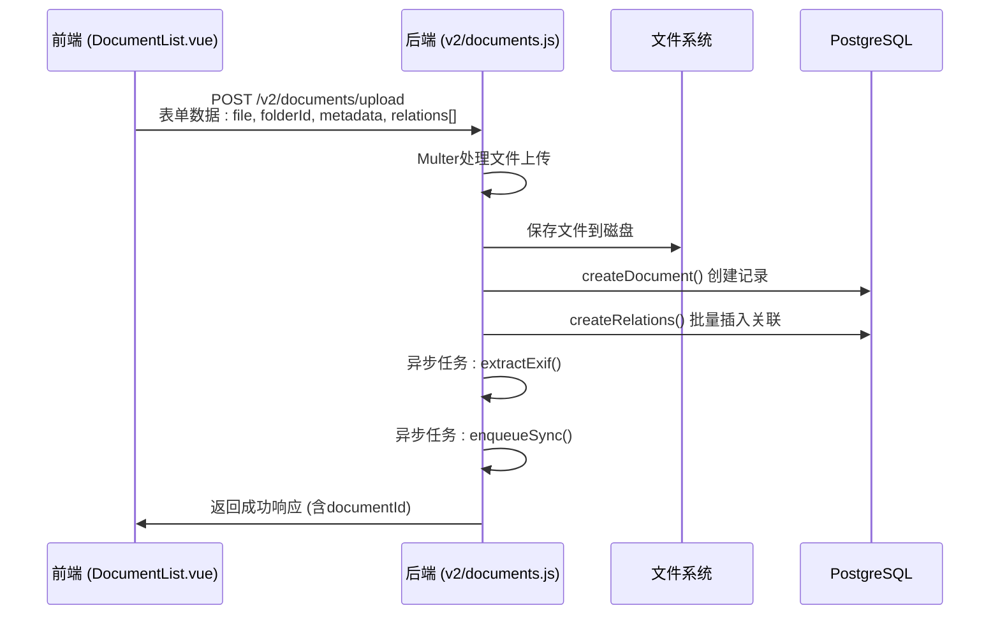
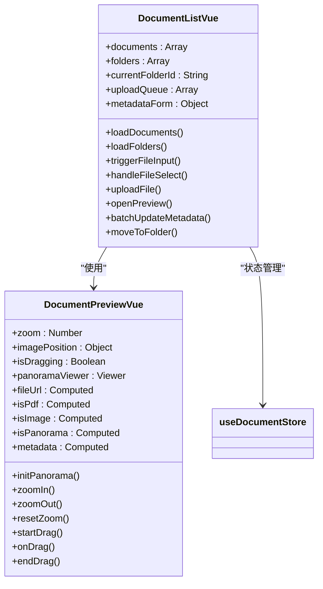

# 文档管理

<cite>
**本文档引用的文件**   
- [document.js](file://server/models/document.js)
- [documents.js](file://server/routes/v2/documents.js)
- [document-sync-service.js](file://server/services/document-sync-service.js)
- [DocumentList.vue](file://src/components/DocumentList.vue)
- [DocumentPreview.vue](file://src/components/DocumentPreview.vue)
- [document-exif.js](file://server/models/document-exif.js)
- [openwebui-service.js](file://server/services/openwebui-service.js)
- [auth.js](file://server/config/auth.js)
- [schema-v2.sql](file://server/db/schema-v2.sql)
- [openwebui-config.js](file://server/config/openwebui-config.js)
</cite>

## 更新摘要
**已做更改**   
- 更新了“核心数据模型与存储策略”以反映v2 API、文件夹管理、多对多关联及元数据JSONB字段的变更
- 重写了“文档上传与元数据更新API”以匹配v2路由结构和功能扩展
- 更新“文档同步服务机制”以包含新的错误重试逻辑和状态标记
- 调整“前端交互与状态管理”以支持文件夹层级展示和多选操作
- 新增“v2 API与多对多关联设计”章节，详细说明架构演进

## 目录
1. [核心数据模型与存储策略](#核心数据模型与存储策略)
2. [文档上传与元数据更新API](#文档上传与元数据更新api)
3. [文档同步服务机制](#文档同步服务机制)
4. [前端交互与状态管理](#前端交互与状态管理)
5. [权限校验与安全控制](#权限校验与安全控制)
6. [运维建议与优化策略](#运维建议与优化策略)
7. [v2 API与多对多关联设计](#v2-api与多对多关联设计)

## 核心数据模型与存储策略

文档管理模块的核心数据模型在v2版本中进行了重大重构，以支持更灵活的关联方式和结构化元数据。`document.js` 模型现基于 `schema-v2.sql` 定义的表结构，引入了多项关键变更。

最显著的变化是文档与资产/空间的关联方式从单对象一对一升级为多对多关系。原有的 `asset_code`、`space_code` 字段已被移除，取而代之的是通过中间表 `document_relations` 实现的灵活关联。该表包含 `document_id`、`related_type`（'asset' 或 'space'）、`related_id` 三字段，支持一个文档关联多个资产或空间，极大提升了业务灵活性。

文档元数据存储策略也进行了升级。新增 `metadata` 字段，其数据库类型为 JSONB，允许存储任意结构的自定义元数据（如作者、版本号、审批状态等）。此字段支持高效的Gin索引查询，使得基于元数据的过滤和搜索成为可能。`document.js` 模型提供了 `updateMetadata` 和 `getByMetadata` 方法，封装了对JSONB字段的操作。

文件夹管理功能通过新增的 `folder_id` 外键字段实现，该字段指向 `folders` 表，支持无限层级的树形结构。系统通过递归CTE查询实现文件夹的嵌套遍历。

**Section sources**
- [document.js](file://server/models/document.js#L1-L189)
- [schema-v2.sql](file://server/db/schema-v2.sql#L50-L120)

## 文档上传与元数据更新API

文档API已迁移至v2版本，路由文件 `documents.js` 现位于 `server/routes/v2/` 目录下，提供了更强大和标准化的接口。

文件上传接口 `/v2/documents/upload` 在原有基础上进行了增强。Multer中间件配置保持不变（200MB限制、磁盘存储、安全文件名），但处理逻辑更为健壮。上传成功后，系统不仅创建文档记录，还会解析并存储 `metadata` 字段中的自定义数据。对于图像文件，EXIF提取流程被优化为异步任务，避免阻塞主响应。

元数据更新接口 `/v2/documents/:id/metadata` 支持部分更新（PATCH），允许客户端仅修改元数据中的特定字段。删除操作通过 `/v2/documents/:id` 的DELETE请求实现，支持软删除（`is_deleted` 标记）和级联删除关联关系。

新增 `/v2/documents/batch` 接口支持批量操作，如批量移动到文件夹、批量更新元数据或批量删除。该接口采用事务处理，确保操作的原子性。



**Diagram sources**
- [documents.js](file://server/routes/v2/documents.js#L1-L380)

**Section sources**
- [documents.js](file://server/routes/v2/documents.js#L1-L380)

## 文档同步服务机制

`document-sync-service.js` 服务在v2版本中增强了可靠性和可观测性。同步流程的核心逻辑未变，但增加了更完善的错误处理和重试机制。

服务现在采用指数退避策略进行重试。当同步失败时，系统会记录 `sync_attempts` 次数，并在 `sync_status` 为 `failed` 时，根据失败次数计算下次重试延迟（如1分钟、5分钟、15分钟）。这避免了在Open WebUI服务短暂不可用时产生大量无效请求。

状态标记机制得到强化。`kb_documents` 表新增 `last_sync_attempt` 时间戳和 `sync_error` 文本字段。服务在每次同步尝试前更新 `last_sync_attempt`，成功后清除 `sync_error`，失败则追加错误信息。这为运维排查提供了清晰的时间线。

`openwebui-service.js` 中的 `uploadDocument` 方法增加了超时控制和连接池管理，提升了与外部API交互的稳定性。

```mermaid
flowchart TD
A[启动同步服务] --> B{同步任务<br/>正在进行中?}
B --> |是| C[跳过本次执行]
B --> |否| D[检查Open WebUI健康状态]
D --> E{服务可用?}
E --> |否| F[记录健康检查失败]
E --> |是| G[查询待同步文档<br/>(sync_status != 'synced')]
G --> H{找到文档?}
H --> |否| I[无文档需要同步]
H --> |是| J[遍历每个文档]
J --> K[检查重试策略<br/>(指数退避)]
K --> L{达到最大重试次数?}
L --> |是| M[标记为永久失败]
L --> |否| N[执行同步]
N --> O{上传成功?}
O --> |是| P[更新sync_status=synced<br/>清除sync_error]
O --> |否| Q[更新sync_attempts+1<br/>追加sync_error]
P --> R[等待500ms]
Q --> R
R --> J
J --> S[同步完成]
```

**Diagram sources**
- [document-sync-service.js](file://server/services/document-sync-service.js#L1-L280)
- [openwebui-service.js](file://server/services/openwebui-service.js#L1-L380)

**Section sources**
- [document-sync-service.js](file://server/services/document-sync-service.js#L1-L280)
- [openwebui-service.js](file://server/services/openwebui-service.js#L1-L380)

## 前端交互与状态管理

`DocumentList.vue` 组件已重构以支持v2功能。组件现在接收 `folderId` 作为主要参数，替代了旧的 `assetCode` 和 `spaceCode`。它通过 `useDocumentStore` 组合式API管理状态，实现了文件夹树的懒加载和缓存。

文件上传逻辑得到增强，支持在上传时选择目标文件夹和填写自定义元数据。上传队列 `uploadQueue` 现在包含 `metadata` 和 `relations` 字段，确保信息完整传递。

`DocumentPreview.vue` 组件保持原有预览能力，但增加了元数据展示面板。当文档包含 `metadata` 信息时，面板会动态渲染键值对，支持查看作者、版本等自定义字段。



**Diagram sources**
- [DocumentList.vue](file://src/components/DocumentList.vue#L1-L850)
- [DocumentPreview.vue](file://src/components/DocumentPreview.vue#L1-L750)

**Section sources**
- [DocumentList.vue](file://src/components/DocumentList.vue#L1-L850)
- [DocumentPreview.vue](file://src/components/DocumentPreview.vue#L1-L750)

## 权限校验与安全控制

权限体系在v2中保持了向后兼容性。`auth.js` 中定义的权限常量（如 `DOCUMENT_CREATE`）未变，但 `middleware/auth.js` 的 `authorize` 中间件现在支持基于文件夹的细粒度权限检查。

例如，用户能否在特定文件夹上传文档，不仅取决于 `DOCUMENT_CREATE` 权限，还取决于其对该文件夹的写入权限。这种基于资源的访问控制（RBAC）通过 `folder-service.js` 查询文件夹所有者和权限配置来实现。

前端 `DocumentList.vue` 根据当前文件夹的权限动态启用/禁用上传、删除和批量操作按钮，确保用户界面与后端策略一致。

**Section sources**
- [auth.js](file://server/config/auth.js#L1-L142)
- [middleware/auth.js](file://server/middleware/auth.js#L1-L120)
- [DocumentList.vue](file://src/components/DocumentList.vue#L1-L850)

## 运维建议与优化策略

### 大文件上传优化
除现有200MB限制外，建议在生产环境配置反向代理（如Nginx）的 `client_max_body_size`，并与Multer的 `limits` 保持一致。对于超大文件，可启用分片上传，前端使用 `File.slice()` 分割，后端通过 `chunked-upload-service.js`（待实现）进行合并。

### 同步失败排查
除原有步骤外，应新增检查：
1.  **重试状态**：查询 `kb_documents` 表的 `sync_attempts` 字段，判断是否已达到最大重试次数。
2.  **文件夹权限**：确认目标知识库对应的模型文件夹在Open WebUI中对同步服务账户有写入权限。
3.  **元数据兼容性**：检查文档的 `metadata` JSONB内容是否包含Open WebUI不支持的特殊字符或过长字段。

**Section sources**
- [documents.js](file://server/routes/v2/documents.js#L1-L380)
- [document-sync-service.js](file://server/services/document-sync-service.js#L1-L280)

## v2 API与多对多关联设计

本节详细说明v2版本的核心架构变更。为支持文档与资产/空间的多对多关联，系统引入了 `document_relations` 关联表，解耦了文档与业务实体的直接绑定。此设计遵循规范化原则，避免了原设计中 `chk_single_relation` 约束的僵化性。

API设计遵循RESTful规范，`/v2/documents` 为集合端点，`/v2/folders` 管理文件夹树，`/v2/relations` 处理关联关系。所有端点均返回标准化的JSON响应，包含 `data`、`success`、`message` 字段。

元数据的JSONB存储提供了极大的灵活性，允许在不修改数据库Schema的情况下扩展文档属性。查询时可使用PostgreSQL的 `->` 和 `->>` 操作符进行高效过滤，例如 `WHERE metadata->>'version' = '2.0'`。

**Section sources**
- [schema-v2.sql](file://server/db/schema-v2.sql#L1-L200)
- [documents.js](file://server/routes/v2/documents.js#L1-L380)
- [document.js](file://server/models/document.js#L1-L189)